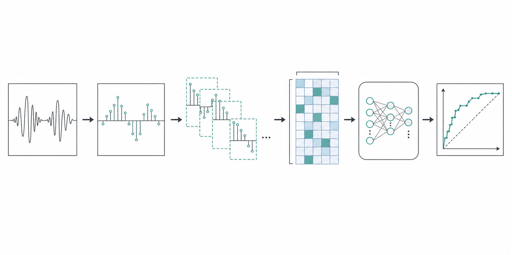
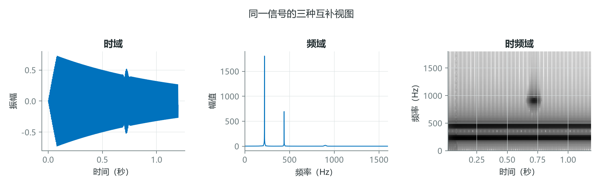
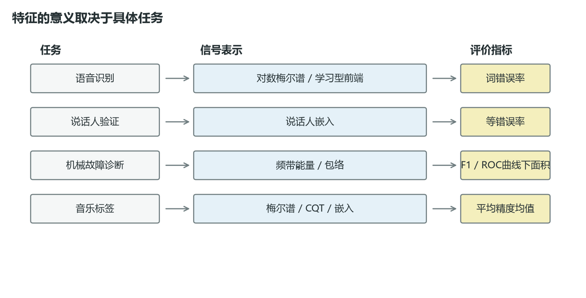
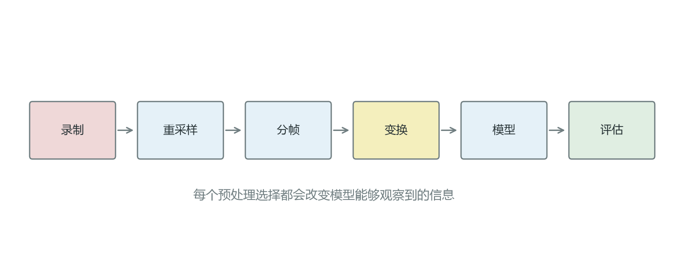

# 先别急着换模型：音频机器学习真正难在如何表示声音

一套音频模型表现不佳，最容易想到的办法是增加网络深度、换优化器或延长训练时间。但很多项目真正的瓶颈更早出现：录音以什么采样率进入系统，如何切帧，保留波形还是转换成频谱，以及这些选择是否与任务相符。

音频并非不能直接输入神经网络。WaveNet、wav2vec 2.0 一类方法已经证明端到端学习可行。更准确的说法是：原始波形维度高、局部变化快，而且需要模型自行学习大量声学不变性。数据量和算力有限时，合理的信号表示仍然能显著降低学习难度。



*图 1：从连续波形、采样点、帧级特征到模型输出。图形采用工程流程图语言，强调数据进入模型之前的连续变换。*

## 1. 同一段声音，可以有三种互补视图

波形回答“某一时刻的振幅是多少”，频谱回答“这段信号含有哪些频率”，时频图回答“这些频率在什么时候出现”。三者不是互相替代，而是观察同一信号的不同坐标系。



*图 2：同一信号在时域、频域和时频域中的表现。时域保留瞬态位置，频域突出成分，时频域同时保留二者。*

以 10 秒、16 kHz 的单声道录音为例，原始波形包含

$$
N=T f_s=10\times 16000=160000
$$

个采样点。若用 25 ms 帧长、10 ms 帧移做短时分析，则每帧分别含有

$$
L=0.025\times16000=400,\qquad H=0.010\times16000=160
$$

个采样点，帧数约为

$$
1+\left\lfloor\frac{160000-400}{160}\right\rfloor=998。
$$

这一步没有创造新信息，却把“一条很长的序列”重组为“近千个局部观察”。模型因此更容易学习音素、瞬态或局部纹理。

## 2. 特征没有普遍的优劣，只有是否回答了任务

频谱质心可以描述声音整体偏亮还是偏暗，却不能可靠地区分两个声纹相似的说话人；振幅包络适合检测打击起音，却会丢失音高和谐波结构。评价特征时，必须把任务、表示和指标一起讨论。



*图 3：语音识别、说话人验证、机械故障诊断和音乐标签任务，需要观察的证据不同。*

一个实用判断框架是：

| 问题 | 优先观察的线索 | 常见表示 |
|---|---|---|
| 说了什么 | 音素随时间的变化 | Log-Mel、学习型前端 |
| 谁在说 | 声道与发声习惯 | 说话人嵌入 |
| 机器何时异常 | 窄带能量、冲击与周期 | 包络谱、频带能量 |
| 音乐包含什么 | 音高、节奏、音色 | CQT、色度、Mel 频谱 |

这里最反直觉的一点是：更“通用”的表示不一定在小数据集上更好。手工特征加入了先验，降低了样本需求；学习型表示减少了人工假设，却需要更多数据覆盖真实变化。

## 3. 预处理不是清洁工作，而是实验的一部分

重采样、声道合并、响度归一化、静音裁切、切帧和变换都会改变模型能观察到的证据。因此，预处理参数必须像模型超参数一样被记录、验证和复现。



*图 4：录制、重采样、分帧、变换、建模与评估构成一条完整实验链。*

下面的最小检查比立即训练模型更值得先做：

```python
import librosa
import numpy as np

y, sr = librosa.load("example.wav", sr=None, mono=True)

assert np.isfinite(y).all(), "音频含 NaN 或 Inf"
duration = len(y) / sr
peak = np.max(np.abs(y))
rms = np.sqrt(np.mean(y ** 2))

print({
    "sample_rate": sr,
    "duration_s": duration,
    "peak": float(peak),
    "rms": float(rms),
})
```

如果训练集和测试集的采样率、声道、静音比例或录音增益不同，模型可能学到设备和采集流程，而不是目标声音。一个漂亮的验证集分数，也可能只是数据泄漏造成的假象。

## 结语

音频机器学习的第一原则不是“使用哪种网络”，而是先回答：目标现象在信号中留下了什么可测证据，当前表示是否保留了它。模型能力决定如何组合证据，信号处理决定证据是否存在。

下一次模型停滞时，不妨先检查一件事：它看到的，真的是你希望它学习的声音吗？

## 课程来源与复现材料

- [原课程视频](https://www.youtube.com/watch?v=iCwMQJnKk2c)
- [PDF 课件](<../source_course/01 - Overview/Audio Signal Processing for Machine Learning.pdf>)
- 叙事底稿：`ダウンロード (10).md`，仅作为内容来源，文中的表达、公式和技术判断已重新核对。
