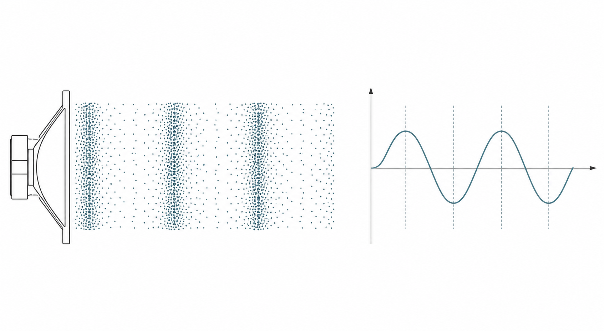
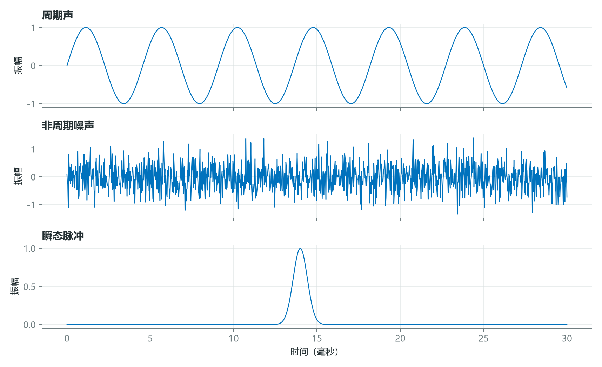
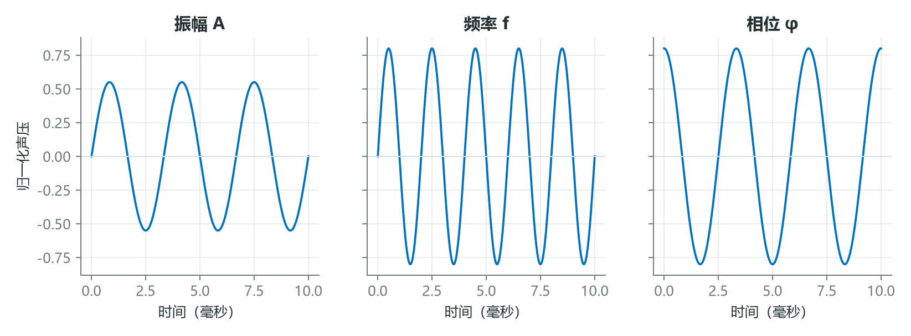
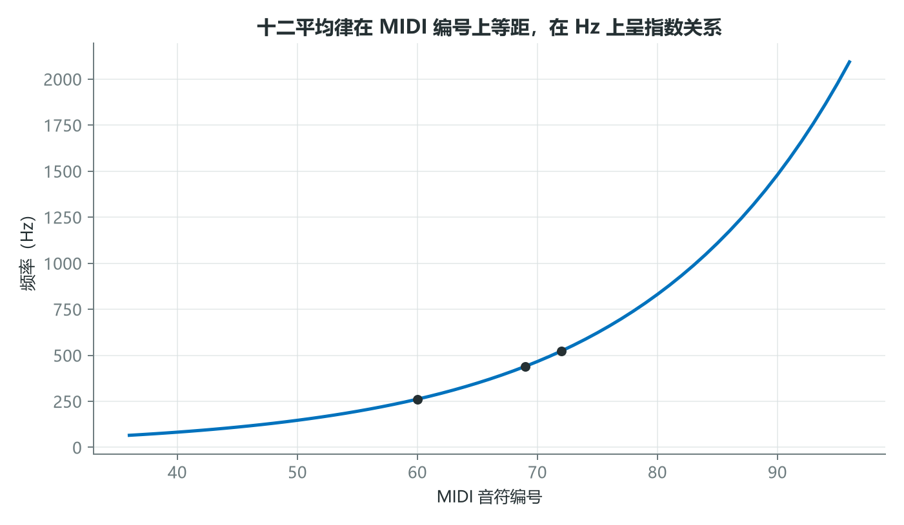

# 声音不只是一条曲线：从空气压力到音高体系

波形图很容易让人误以为声音就是屏幕上的一条曲线。实际上，曲线只是传感器在某个位置记录到的压力随时间变化。真正传播的是介质中的压缩与稀疏，数字波形是这一物理过程的测量结果。



*图 1：扬声器振膜推动空气，形成疏密交替的纵波；麦克风把局部压力变化转换为随时间排列的信号。*

## 1. 周期、噪声和瞬态，是三种不同的结构

规则振动会产生近似周期信号，随机扰动表现为非周期噪声，碰撞或敲击则常形成短暂的瞬态。现实声音通常是三者的组合，而不是非此即彼。



*图 2：周期信号有稳定重复结构；噪声缺乏明显周期；瞬态能量集中在很短的时间内。*

这一区分会直接影响算法选择。稳定音高适合频率分析；瞬态定位更依赖时间分辨率；噪声估计则通常需要统计量。比如同一台电机可能同时包含转动谐波、摩擦噪声和轴承撞击脉冲，只用一个平均频谱很容易把瞬态故障“抹平”。

## 2. 正弦波的三个参数，对应三种可观察属性

理想正弦信号可写为

$$
x(t)=A\sin(2\pi ft+\varphi),
$$

其中 $A$ 是振幅，$f$ 是频率，$\varphi$ 是初相位。



*图 3：增大振幅改变纵向尺度；增大频率让单位时间内出现更多周期；相位改变波形的时间对齐。*

若 $A=0.5$、$f=200\ \text{Hz}$、$\varphi=\pi/2$，则在 $t=1\ \text{ms}$ 时

$$
x(0.001)=0.5\sin(2\pi\times200\times0.001+\pi/2)
\approx0.155。
$$

计算机生成该信号只需要把连续时间换成离散采样点：

```python
import numpy as np

sr = 16000
duration = 0.5
t = np.arange(int(sr * duration)) / sr
x = 0.5 * np.sin(2 * np.pi * 200 * t + np.pi / 2)
```

单个正弦波没有音色的全部复杂性，但它是频率分析的基本坐标。复杂声音可以看成许多不同频率、振幅和相位的振荡叠加。

## 3. 音高是对数关系，MIDI 只是把它编号化

人的音高知觉更接近“比值”而不是“差值”。频率翻倍通常对应一个八度，因此相邻八度在赫兹上越隔越远，在音乐关系上却被视为等距。



*图 4：等十二平均律在 MIDI 编号上等距，在赫兹坐标上呈指数增长。标记点对应中央 C、A4 和高八度 C。*

MIDI 音符编号 $m$ 与频率的常用换算为

$$
f(m)=440\times2^{(m-69)/12}。
$$

代入 $m=72$，可得

$$
f(72)=440\times2^{3/12}\approx523.25\ \text{Hz},
$$

即 C5。若要描述更细的音高差，可以使用音分：

$$
c=1200\log_2\frac{f_2}{f_1}。
$$

例如 $f_1=440$ Hz、$f_2=445$ Hz，两者相差约 $19.56$ 音分。这个对数公式比简单相减更符合音乐中的相对音程。

## 结语

数字音频的起点不是文件格式，而是“物理振动如何留下可测量结构”。周期、瞬态、噪声、振幅、频率和相位共同决定波形；人类听觉又把赫兹尺度重新组织成更接近对数的音高空间。

当我们说“识别一个声音”时，真正要问的是：算法应当追踪哪种结构，是重复、突变，还是频率之间的比例？

## 课程来源与复现材料

- [原课程视频](https://www.youtube.com/watch?v=bnHHVo3j124)
- [PDF 课件](<../source_course/02 - Sound and waveforms/Sound and waveforms.pdf>)
- 叙事底稿：`ダウンロード (6).md`。
