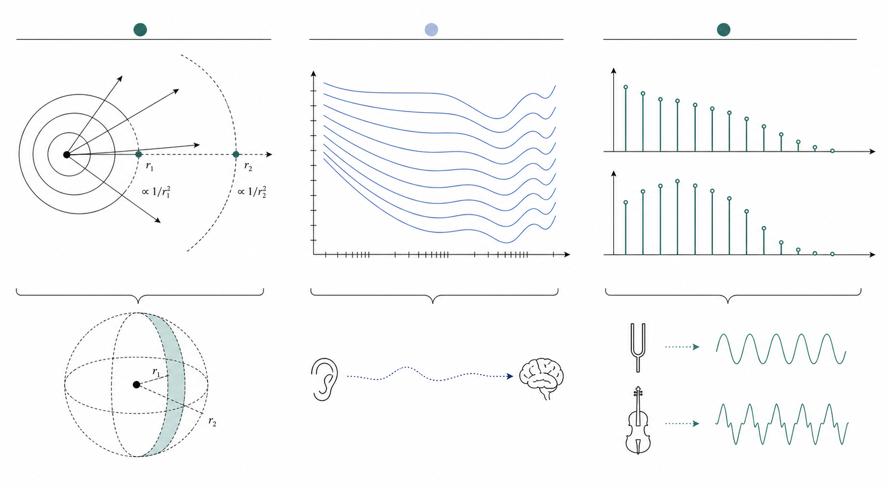
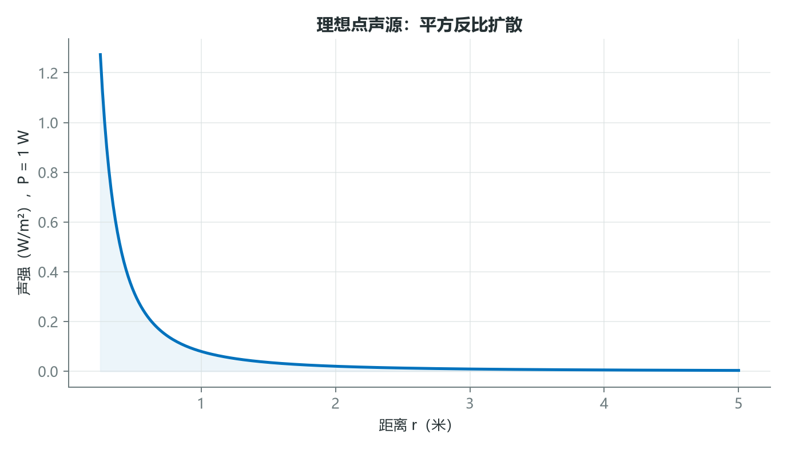
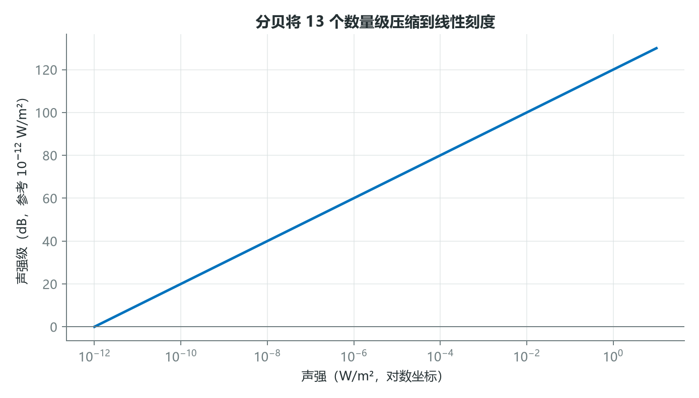
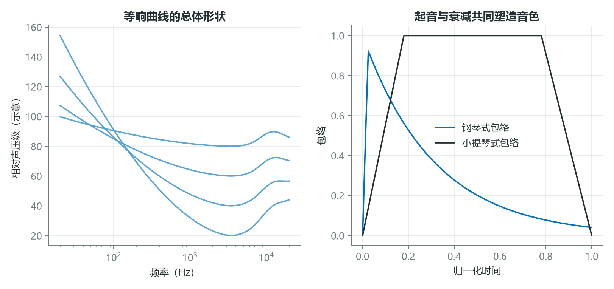

# 同样的能量为何听起来不同：声强、响度与音色

两段录音可以拥有相近的物理能量，却让人产生完全不同的听感：一段低频声可能显得偏弱，一次尖锐瞬态却十分醒目；钢琴和小提琴演奏同一个音高，也不会被听成同一种声音。

原因在于三个概念不能混用。声强是物理量，响度是听觉判断，音色则来自频谱、包络和调制等多种结构的共同作用。



*图 1：左侧描述能量在空间传播，中间表示听觉系统的频率选择性，右侧对比不同的谐波与包络结构。*

## 1. 声强会随传播面积增大而衰减

声功率 $P$ 表示声源单位时间辐射的能量，单位是瓦特；声强 $I$ 表示单位面积上的功率，单位是 $\text{W}/\text{m}^2$。对自由场中的理想点声源，能量均匀分布在球面上：

$$
I(r)=\frac{P}{4\pi r^2}。
$$



*图 2：在理想自由场中，距离翻倍，球面面积变为四倍，单位面积声强降为四分之一。真实房间还会受到反射和吸收影响。*

若 $P=1$ W，则 $r=1$ m 时

$$
I(1)=\frac{1}{4\pi}\approx0.0796\ \text{W}/\text{m}^2。
$$

距离增至 $2$ m 后，声强变为约 $0.0199\ \text{W}/\text{m}^2$。这个规律解释了自由场中“距离每翻倍，声压级约下降 6 dB”的工程经验，但近场、室内混响和方向性声源不一定严格满足它。

## 2. 分贝把巨大的物理范围压缩成可管理尺度

人耳可处理的声强跨度非常大，因此工程上使用对数标度。以参考声强 $I_0=10^{-12}\ \text{W}/\text{m}^2$ 为例：

$$
L_I=10\log_{10}\left(\frac{I}{I_0}\right)\ \text{dB}。
$$



*图 3：横轴跨越多个数量级，分贝把乘法比值转化为加法差值。*

若声强从 $10^{-6}$ 增至 $10^{-4}\ \text{W}/\text{m}^2$，比值为 100，因此声强级增加

$$
\Delta L=10\log_{10}(100)=20\ \text{dB}。
$$

需要注意，功率或声强比使用 $10\log_{10}$；声压或振幅比在阻抗不变的条件下使用 $20\log_{10}$。二者混写，是音频工程中非常常见的错误。

## 3. 响度与音色说明：耳朵不是线性测量仪

响度不仅取决于能量，还受到频率、持续时间、声场和个体差异影响。人耳对中频通常更敏感，对很低或很高的频率则需要更高声压才能获得相近听感。



*图 4：左图仅示意等响曲线的总体趋势，不是 ISO 226 标准数据；右图说明相同稳态频率也可因起音和衰减不同而产生不同音色。*

音色常由以下线索共同决定：

- 频谱包络：能量在基频、谐波和噪声成分间如何分配。
- 振幅包络：起音、衰减、保持与释放的时间形状。
- 调制：振幅或频率是否随时间周期变化。
- 非谐波性和瞬态：成分是否严格位于基频整数倍，起音是否包含噪声冲击。

一个简洁的分析框架如下：

```python
import librosa
import numpy as np

y, sr = librosa.load("instrument.wav", sr=None)

rms = librosa.feature.rms(y=y)[0]
centroid = librosa.feature.spectral_centroid(y=y, sr=sr)[0]
flatness = librosa.feature.spectral_flatness(y=y)[0]

print("平均 RMS:", rms.mean())
print("平均频谱质心 Hz:", centroid.mean())
print("平均频谱平坦度:", flatness.mean())
```

这里的 RMS 是幅度能量统计量，不等于完整的感知响度。若任务关注人类主观听感，还应考虑频率加权、时间积分以及响度标准模型。

## 结语

声强回答“单位面积有多少物理功率”，分贝回答“这个比值如何压缩表达”，响度回答“人听起来有多强”，音色回答“为什么同样音高和强度仍然不同”。把这四层分开，才不会把一个方便计算的指标误当成听觉本身。

如果模型只看总能量，它会错过多少真正决定听感的结构？

## 课程来源与复现材料

- [原课程视频](https://www.youtube.com/watch?v=Jkoysm1fHUw)
- [PDF 课件](<../source_course/03 - Intensity, loudness, and timbre/Intensity, loudness, and timbre.pdf>)
- [课程 Notebook](<../source_course/03 - Intensity, loudness, and timbre/intensity_and_timbre.ipynb>)
- 叙事底稿：`ダウンロード (8).md`。
