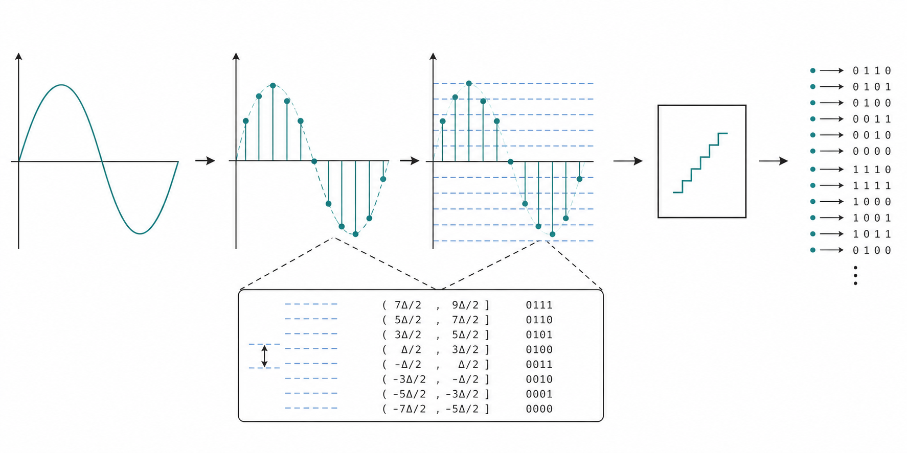
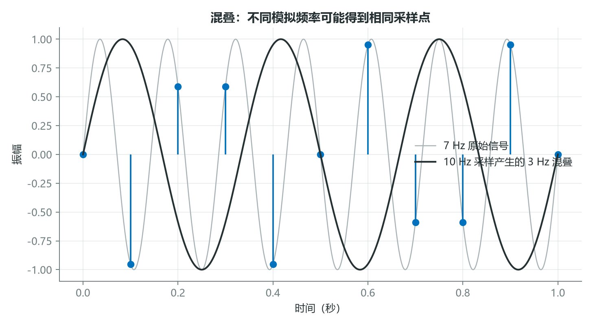
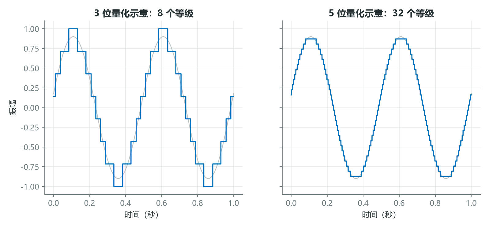
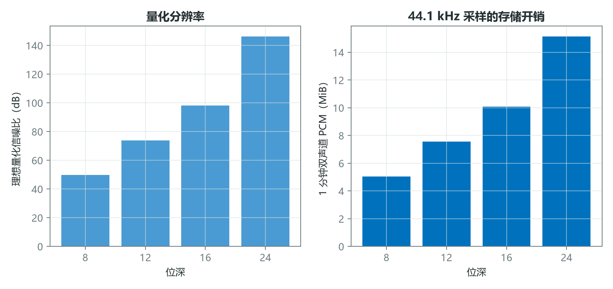

# 声音如何变成数字：采样、量化与混叠

麦克风输出的是连续变化的电压，计算机保存的却是一串有限精度的数字。两者之间并不是一次简单的“格式转换”，而是两个离散化过程：采样把连续时间变成离散时刻，量化把连续幅度变成有限等级。

理解这两步，才能知道音频什么时候仍可重建，什么时候已经发生不可逆失真。



*图 1：连续信号先在时间轴上取样，再把每个样本映射到有限幅度等级，最终编码为比特。*

## 1. 采样率决定可无歧义表示的最高频率

设连续信号为 $x(t)$，采样周期为 $T_s$，采样率 $f_s=1/T_s$，离散序列为

$$
x[n]=x(nT_s)。
$$

对最高频率不超过 $f_{\max}$ 的带限信号，理想重建要求

$$
f_s>2f_{\max}。
$$

$f_s/2$ 称为 Nyquist 频率。工程系统通常不会把目标频带贴着这个极限设计，还要在 ADC 前使用抗混叠低通滤波器，为滤波器过渡带留出空间。



*图 2：10 Hz 采样下，7 Hz 正弦在采样点上与 3 Hz 正弦一致，数字系统无法仅凭这些样本区分二者。*

混叠频率可通过寻找整数 $k$，把原频率折叠到 $[0,f_s/2]$：

$$
f_{\text{alias}}=|f-kf_s|。
$$

例如 $f=7$ Hz、$f_s=10$ Hz，取 $k=1$，得到 $f_{\text{alias}}=|7-10|=3$ Hz。混叠一旦写入数据，后续再升采样也不能恢复原来的 7 Hz 成分。

## 2. 位深决定幅度网格有多细

$B$ 位量化器可表示 $2^B$ 个等级。若把首尾两个等级放在归一化幅度的 $-1$ 与 $1$ 上，均匀网格步长为

$$
\Delta=\frac{2}{2^B-1}。
$$



*图 3：位深增加后，阶梯更细，量化后的波形更接近原信号。图中仅用于解释原理。*

以 3 bit 为例，共有 8 个等级，$\Delta=2/7\approx0.2857$。若某个样本为 $x=0.37$，用“四舍五入到最近网格”的简化规则：

$$
q=-1+\Delta\cdot\operatorname{round}\left(\frac{x+1}{\Delta}\right)
=-1+\frac{2}{7}\operatorname{round}(4.795)
\approx0.4286。
$$

量化误差为 $e=x-q\approx-0.0586$。理想均匀量化、满幅正弦输入时，信号与量化噪声比常用近似为

$$
\mathrm{SQNR}\approx6.02B+1.76\ \text{dB}。
$$

因此 16 bit 的理想 SQNR 约为 $98.08$ dB。它不是任何录音设备都能达到的实际动态范围，因为模拟前端噪声、时钟抖动和电路失真也会限制性能。

## 3. 采样率和位深共同决定成本，不代表越大越好

未压缩 PCM 的理论码率为

$$
R=f_s\times B\times C,
$$

其中 $C$ 是声道数。



*图 4：更高位深提高理想量化分辨率，也线性增加未压缩 PCM 存储量。*

44.1 kHz、16 bit、双声道的码率为

$$
44100\times16\times2=1{,}411{,}200\ \text{bit/s}。
$$

10 分钟约占

$$
\frac{1{,}411{,}200\times600}{8}\approx105.84\ \text{MB}
$$

的十进制存储空间。若任务只分析 4 kHz 以下的机械声，96 kHz 采样很可能只会放大存储和计算成本；若任务要研究超声或高频瞬态，16 kHz 又明显不足。参数必须由目标带宽和动态范围决定。

下面用代码演示一个对称均匀量化器：

```python
import numpy as np

def quantize(x, bits):
    levels = 2 ** bits
    x = np.clip(x, -1.0, 1.0)
    step = 2.0 / (levels - 1)
    code = np.round((x + 1.0) / step)
    return code * step - 1.0

t = np.linspace(0, 1, 1000, endpoint=False)
x = 0.9 * np.sin(2 * np.pi * 5 * t)
x_3bit = quantize(x, 3)
```

## 结语

采样率约束时间离散化后的可表示带宽，位深约束幅度离散化的精度。混叠与量化不是抽象名词，而是数据进入模型前已经发生的物理信息取舍。

真正值得问的不是“最高参数是多少”，而是“任务需要保留到什么频率、什么动态范围，以及为此愿意付出多少计算成本”。

## 课程来源与复现材料

- [原课程视频](https://www.youtube.com/watch?v=daB9naGBVv4)
- [PDF 课件](<../source_course/04 - Understanding audio signals/Understanding audio signals.pdf>)
- 叙事底稿：`ダウンロード (7).md`。
