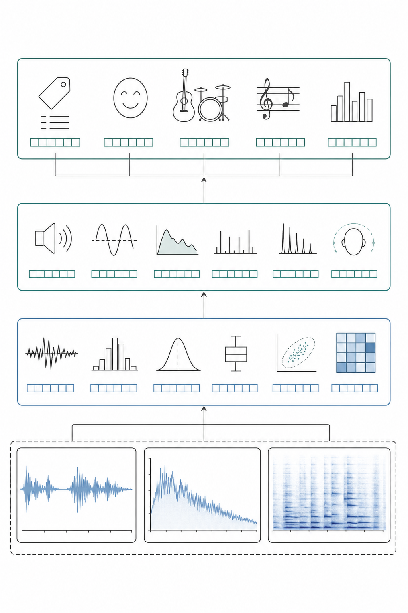
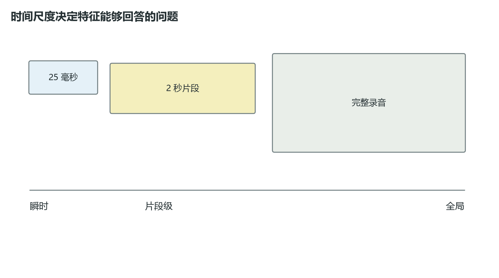
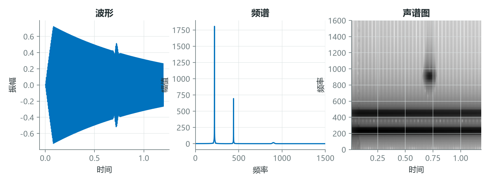
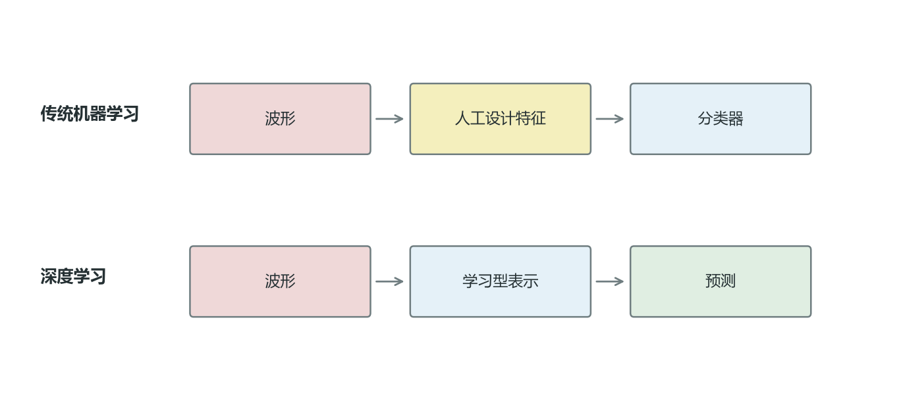

# 一段音频不止一种答案：音频特征的四层地图

“应该提取什么音频特征”不是一个孤立问题。特征是否有效，取决于模型要回答什么、需要观察多长时间、在哪个信号域工作，以及特征由人设计还是由网络学习。

把这些维度混在一起，很容易得到一张漫长的特征清单，却不知道每个数值究竟代表什么。更好的方法是建立一张分层地图。



*图 1：特征可以按抽象程度、时间范围、信号域和学习方式组织，而不是按库函数名称堆叠。*

## 1. 时间尺度改变了特征能够回答的问题

一个采样点只能描述瞬时幅度；20 至 40 ms 的短帧可近似观察局部声学结构；数秒片段能覆盖音节、事件或节奏；整段录音则可以描述总体风格和统计分布。



*图 2：时间范围越大，语义可能越丰富，但短暂细节也更容易被平均。尺度不是越长越好。*

设帧级特征为 $z_m$，把整段音频压缩为均值和标准差：

$$
\mu=\frac{1}{M}\sum_{m=1}^{M}z_m,\qquad
\sigma=\sqrt{\frac{1}{M}\sum_{m=1}^{M}(z_m-\mu)^2}。
$$

若六帧能量为 $[0.1,0.2,0.9,0.4,0.8,0.1]$，均值约为 $0.417$。这个值可以代表整体能量，却无法说明高能量发生在第 3 帧还是第 5 帧。因此事件检测通常保留帧序列，整段分类则可以使用统计聚合。

## 2. 时域、频域与时频域保留的是不同证据

时域适合定位冲击、静音和能量轮廓；频域适合观察音高、谐波和频带能量；时频域适合描述频率结构如何随时间变化。MFCC、Mel 频谱、CQT 和色度图都属于进一步组织声学证据的方法。



*图 3：同一信号在三个域中的信息组织方式不同。选择信号域，就是选择模型最容易观察的关系。*

音乐任务还经常引入专用坐标：

- CQT 使用近似对数分布的频率箱，更贴近音乐音高间隔。
- 色度把不同八度的同名音折叠到 12 个音级，适合和弦与调性分析。
- 节拍同步特征把时间轴对齐到音乐拍点，减少速度差异的影响。

这些变换都加入了结构假设。假设与任务一致时，它们能显著节省学习成本；假设不成立时，也可能删除关键信息。

## 3. 手工特征与表征学习不是二选一

传统流程由工程师设计前端，再把固定维度特征交给分类器；深度学习则可以从波形或频谱中共同学习表示和决策边界。现实系统经常采用混合方案，例如使用 Log-Mel 频谱作为稳定前端，再由神经网络学习更高层表示。



*图 4：两种范式的主要差异，在于“中间表示由谁决定”，而不是是否使用机器学习。*

```python
import librosa
import numpy as np

y, sr = librosa.load("example.wav", sr=16000)

mel = librosa.feature.melspectrogram(
    y=y, sr=sr, n_fft=1024, hop_length=160,
    n_mels=64, power=2.0
)
log_mel = librosa.power_to_db(mel, ref=np.max)

# 两种接口：保留帧序列，或聚合为固定长度向量
frame_sequence = log_mel.T
global_vector = np.r_[log_mel.mean(axis=1), log_mel.std(axis=1)]
```

`frame_sequence` 适合序列模型和事件定位，`global_vector` 适合需要固定长度输入的简单分类器。相同的底层特征，通过不同聚合方式就能服务不同问题。

## 结语

音频特征不是越多越好，而是要在四个层面保持一致：抽象程度、时间尺度、信号域和学习方式。真正有价值的特征，必须能对应一个明确的声学机制或任务假设。

当一个模型输出错误时，你能否沿着这张地图反推：是尺度选错了、信号域不合适，还是表示删除了关键证据？

## 课程来源与复现材料

- [原课程视频](https://www.youtube.com/watch?v=ZZ9u1vUtcIA)
- [PDF 课件](<../source_course/05 - Types of audio features for ML/Types of Audio Features for ML.pdf>)
- 叙事底稿：`ダウンロード (9).md`。
