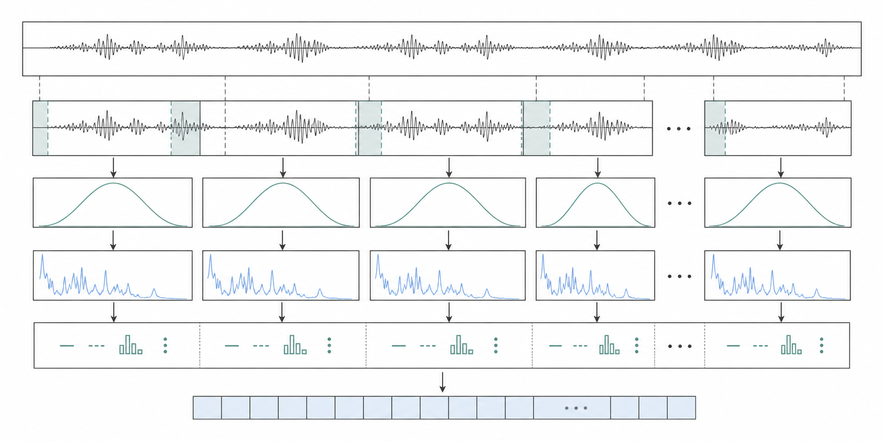
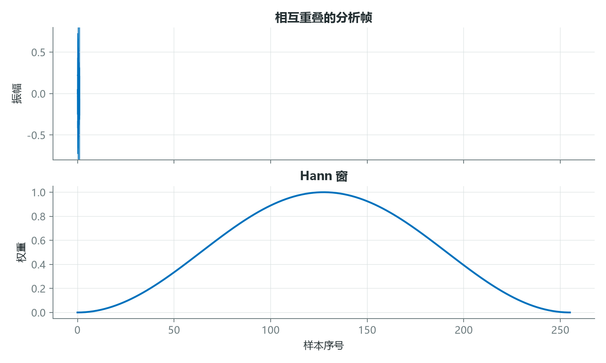
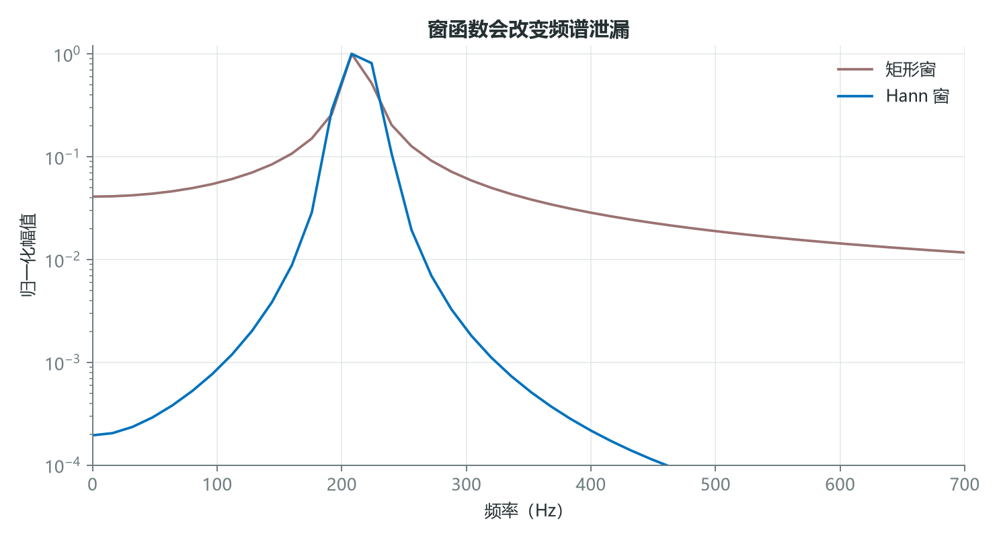
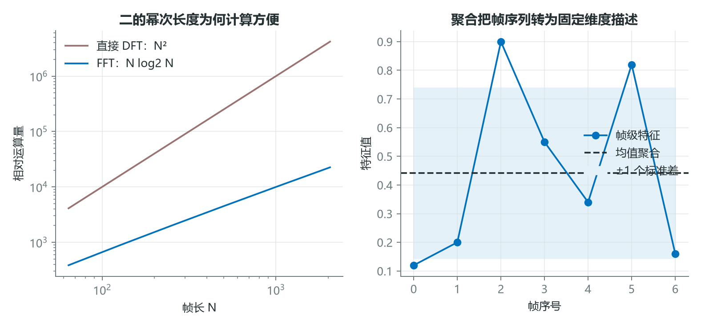

# 把连续声音切成模型可用的证据：分帧、加窗与聚合

音频会持续变化，而许多声学特征只在一个有限时间窗口内才有清晰含义。对整段录音直接计算一次频谱，会把不同时间发生的事件叠在一起；把窗口切得过短，又会失去频率分辨率。

分帧、加窗、重叠和聚合并非固定模板，而是一组围绕任务尺度进行的工程选择。



*图 1：连续波形经过重叠分帧、加窗和帧级特征提取，最后形成序列或固定长度描述。*

## 1. 帧长决定你把声音看得多“局部”

若信号长度为 $N$，帧长为 $L$，帧移为 $H$，不补零时帧数为

$$
M=1+\left\lfloor\frac{N-L}{H}\right\rfloor。
$$



*图 2：上图显示相邻帧的重叠关系，下图为 Hann 窗。窗函数让帧边界平滑衰减。*

以 1 秒、16 kHz 音频为例，取 $L=400$ 个样本、$H=160$ 个样本，可得

$$
M=1+\left\lfloor\frac{16000-400}{160}\right\rfloor=98。
$$

这对应 25 ms 帧长和 10 ms 帧移。语音常在约 20 至 40 ms 内被近似视为局部平稳，但这不是适用于所有声音的硬阈值。打击音定位可能需要更短窗口，低频机械谐波分析则可能需要更长窗口。

## 2. 时间分辨率与频率分辨率必须交换

对长度为 $N_{\text{FFT}}$ 的离散傅里叶变换，频率箱间隔为

$$
\Delta f=\frac{f_s}{N_{\text{FFT}}}。
$$

若 $f_s=16000$ Hz、$N_{\text{FFT}}=512$，则 $\Delta f=31.25$ Hz；增至 2048 点后变为 $7.8125$ Hz。频率网格更细，但窗口覆盖的时间更长，快速变化会被平均。



*图 3：截断等价于乘窗。矩形窗主瓣较窄但旁瓣高，Hann 窗降低远处泄漏，同时使主瓣变宽。*

Hann 窗常写为

$$
w[n]=\frac{1}{2}\left(1-\cos\frac{2\pi n}{L-1}\right),
\quad 0\le n<L。
$$

加窗并没有“消灭”泄漏，而是在主瓣宽度、旁瓣高度和幅度校正之间重新权衡。重叠则让窗边缘衰减的样本在相邻帧中心再次被充分观察。

## 3. FFT 提高效率，聚合决定输出形态

直接计算 DFT 约需 $O(N^2)$ 次运算，FFT 可降为 $O(N\log N)$。二的幂次长度对许多 FFT 实现很方便，但并非数学硬性要求，现代库也支持其他长度。



*图 4：左图比较运算量增长趋势；右图说明均值聚合会把帧序列压缩为固定长度，但同时删除时间位置。*

```python
import librosa
import numpy as np

y, sr = librosa.load("example.wav", sr=16000)

stft = librosa.stft(
    y,
    n_fft=1024,
    win_length=400,
    hop_length=160,
    window="hann",
    center=False,
)
power = np.abs(stft) ** 2
log_power = librosa.power_to_db(power, ref=np.max)

# 序列任务保留时间轴；整段分类可加入统计聚合
sequence = log_power.T
summary = np.r_[log_power.mean(axis=1), log_power.std(axis=1)]
```

这里 `n_fft` 控制 FFT 网格，`win_length` 控制实际观察长度，两者可以不同。若 `n_fft > win_length`，库会对窗内数据补零。补零让频谱曲线采样更密，但不会凭空提高区分相近频率的物理能力。

## 结语

分帧把持续声音改写为局部证据，窗函数控制边界效应，重叠保持时间覆盖，FFT 提供高效频率分析，聚合决定最终是否保留事件顺序。它们共同定义了模型能观察到的时间和频率尺度。

最合理的参数不是某个通用默认值，而是能分开目标现象、同时不过度增加噪声与计算量的那组尺度。

## 课程来源与复现材料

- [原课程视频](https://www.youtube.com/watch?v=8A-W1xk7qs8)
- [PDF 课件](<../source_course/06 - How to extract audio features/How to extract audio features.pdf>)
- 叙事底稿：`ダウンロード (1).md`。
