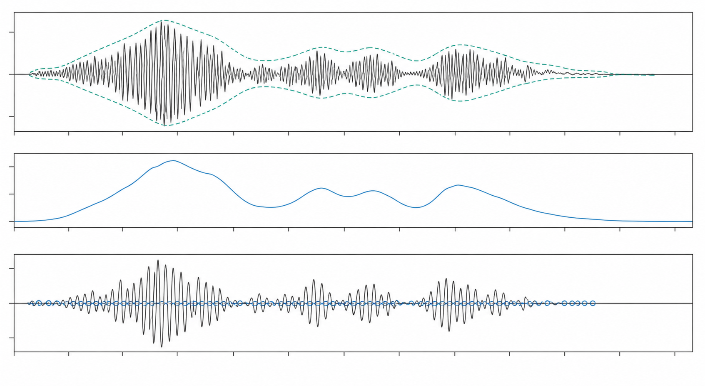
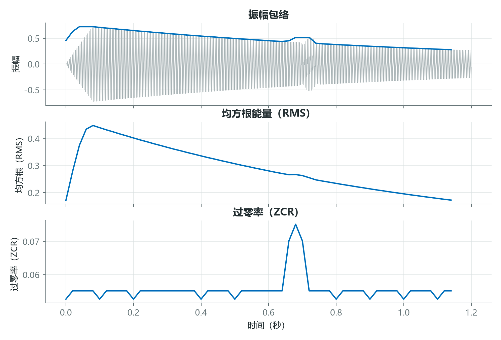
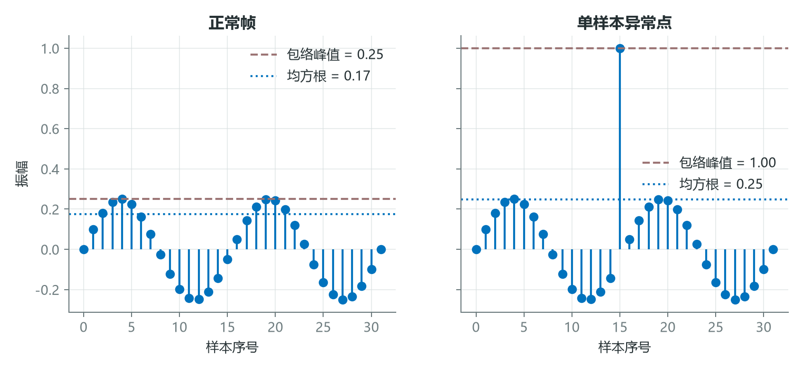
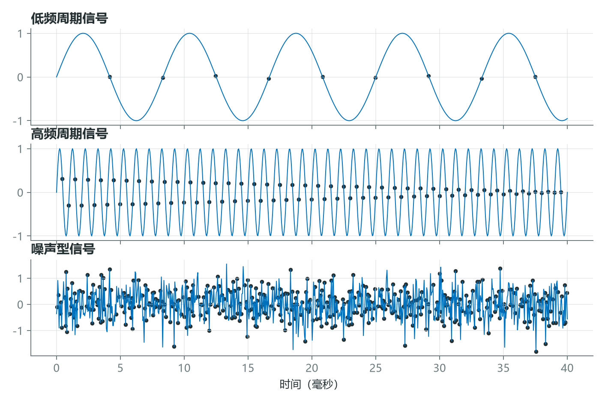

# 不做频谱也能认识声音：三种时域特征

频谱不是理解音频的唯一路径。许多任务首先关心的是声音何时出现、能量怎样起伏、波形变化有多快。这些问题直接在时域中就能回答，而且计算量通常很低。

振幅包络、均方根能量和过零率，是三种常用的帧级时域特征。它们分别观察峰值、平均能量和符号变化，彼此互补，也各有盲区。



*图 1：同一段信号可以从峰值轮廓、平均能量和符号变化三个角度观察。*

## 1. 振幅包络追踪峰值，RMS 追踪平均能量

对第 $m$ 帧信号 $x_m[n]$，振幅包络定义为

$$
AE[m]=\max_n |x_m[n]|,
$$

均方根能量定义为

$$
RMS[m]=\sqrt{\frac{1}{N}\sum_{n=0}^{N-1}x_m[n]^2}。
$$



*图 2：AE 紧贴局部峰值，RMS 更平滑，ZCR 在符号变化密集处升高。三条曲线的量纲和数值范围不同，不宜直接比较高低。*

取一帧 $x=[-1,0.5,-0.5,0]$，则

$$
AE=1,
$$

$$
RMS=\sqrt{\frac{1+0.25+0.25+0}{4}}
=\sqrt{0.375}\approx0.612。
$$

AE 对点击、爆音和瞬态非常敏感；RMS 反映整帧的平均平方幅度，对单个异常点相对不那么敏感。两者都不是完整的感知响度，但可作为能量结构的低成本代理。

## 2. 一个异常样本，足以改变你对特征的判断

如果一帧大部分样本都很小，只有一个样本突然达到满幅，AE 会立刻变成 1；RMS 的变化则被帧内平均稀释。这个差异决定了二者适合发现不同现象。



*图 3：左侧为干净帧，右侧加入一个满幅异常点。AE 直接跳到 1，RMS 只出现有限增加。*

若 100 个样本原本都为 0，仅一个样本变为 1，则

$$
AE=1,\qquad RMS=\sqrt{1/100}=0.1。
$$

因此，检测数字削波、脉冲噪声时 AE 很直接；描述持续能量时 RMS 通常更稳健。稳健不等于不受异常影响，帧长越短，单个样本对 RMS 的影响也越大。

## 3. 过零率统计符号变化，不等于直接测量频率

过零率 ZCR 是相邻样本跨过零轴的比例。常见定义为

$$
ZCR[m]=\frac{1}{2(N-1)}
\sum_{n=1}^{N-1}
\left|\operatorname{sgn}(x_m[n])-\operatorname{sgn}(x_m[n-1])\right|。
$$



*图 4：在相同采样率下，高频周期信号通常比低频信号有更多过零；噪声的符号变化往往更密集且不规则。*

对 $x=[-1,0.5,-0.2,0.4]$，三个相邻位置都发生符号翻转，因此 ZCR 为 $3/(4-1)=1$。对理想正弦波，在采样充分且无直流偏置时，ZCR 与频率大致相关；但噪声、谐波、相位、直流偏移和阈值都会破坏这种简单关系。它更适合看作“符号变化密度”，而不是精确频率计。

三种特征可以用几行代码实现：

```python
import numpy as np

def frame_features(frame):
    frame = np.asarray(frame, dtype=float)
    ae = np.max(np.abs(frame))
    rms = np.sqrt(np.mean(frame ** 2))
    signs = np.signbit(frame)
    zcr = np.mean(signs[1:] != signs[:-1])
    return ae, rms, zcr
```

实际数据在零点附近可能因微弱噪声频繁翻转，工程上可先去除直流分量，或设置一个小阈值，把 $|x|<\varepsilon$ 的样本视为零。

## 结语

AE 回答“最高峰有多高”，RMS 回答“平均能量有多大”，ZCR 回答“符号变化有多密”。它们便宜、可解释，适合作为数据检查、基线模型和更复杂频域特征的补充。

一条特征曲线从来不是声音本身。真正可靠的判断，往往来自多条相互制约的证据。

## 课程来源与复现材料

- [原课程视频](https://www.youtube.com/watch?v=SRrQ_v-OOSg)
- [PDF 课件](<../source_course/07 - Time-domain audio features/Time-domain audio features.pdf>)
- 叙事底稿：`ダウンロード (5).md`。
