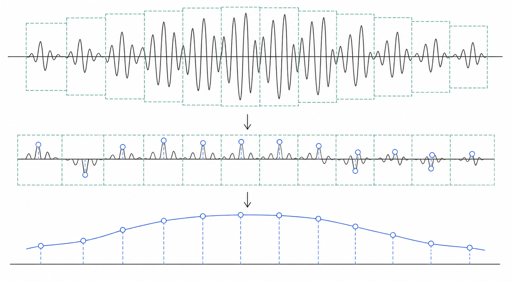
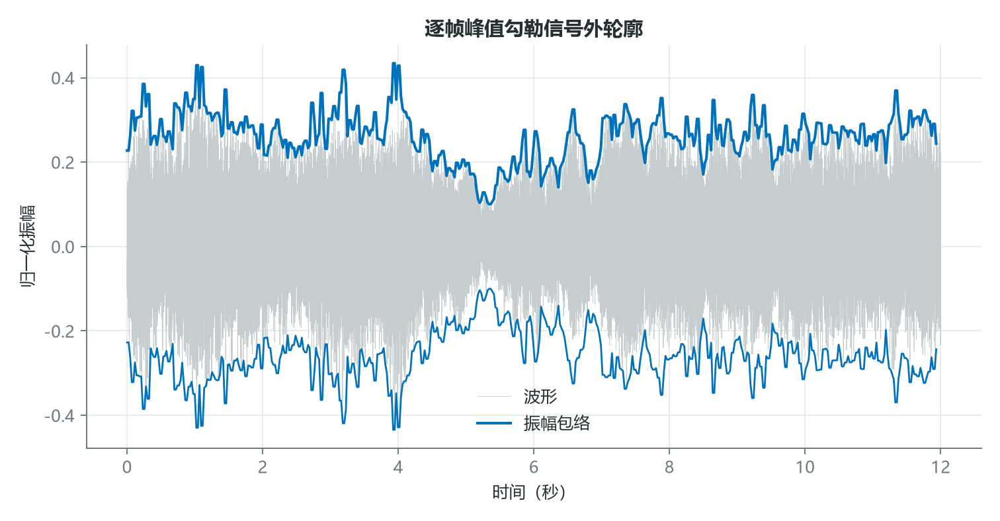
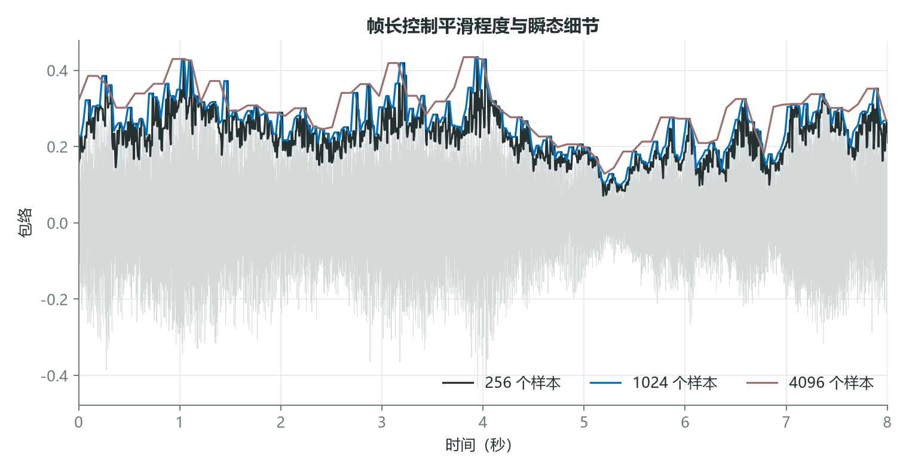
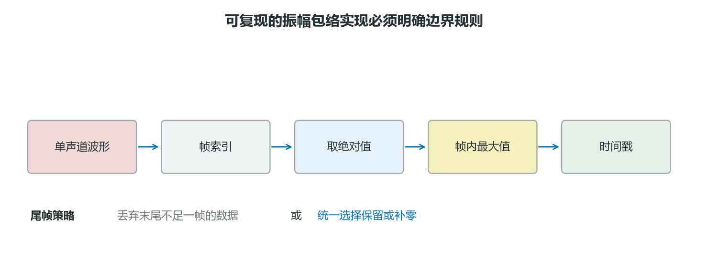
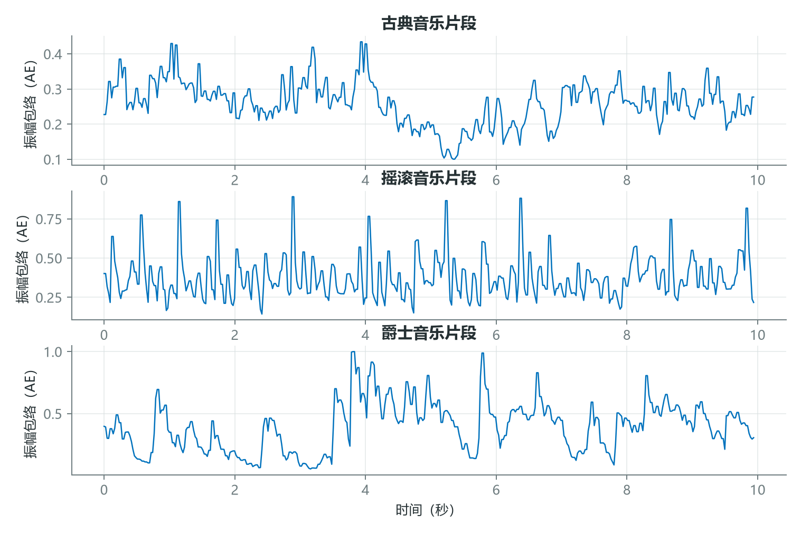

# 用振幅包络读懂声音骨架：从公式到稳健实现

波形振荡得太快，直接观察时很难看出一段声音的整体结构。振幅包络把每一小帧中的最大绝对振幅连接起来，得到一条更慢、更容易解释的外轮廓。

它可以显示起音、停顿、衰减和强弱段落，因此常用于起音检测、静音分割、动态分析和音频质量检查。不过，它对异常峰值非常敏感，帧长选择也会直接改变结果。



*图 1：局部帧中的峰值被抽取并连接，形成描述宏观振幅变化的包络。*

## 1. 包络不是一条神秘曲线，而是逐帧最大值

设信号为 $x[n]$，第 $m$ 帧起点为 $mH$，帧长为 $L$，则

$$
AE[m]=\max_{0\le n<L}|x[mH+n]|。
$$



*图 2：灰色为真实音频波形，青色上下边界为逐帧峰值。包络保留了宏观强弱，删除了帧内快速振荡。*

例如一帧为 $[-0.2,0.7,-0.9,0.4]$，则

$$
AE=\max(0.2,0.7,0.9,0.4)=0.9。
$$

最容易犯的错误是忘记绝对值。如果直接取最大值，那么一个幅度很大的负峰可能完全被忽略。

## 2. 帧长控制平滑度，帧移控制采样密度

短帧能更准确地定位瞬态，但曲线更抖，也更容易追随单个异常点；长帧更平滑，却会把相邻事件合并。帧移决定相邻估计之间的时间间隔，重叠帧可以提高曲线的时间采样密度。



*图 3：256、1024 与 4096 个样本的窗口产生不同平滑程度。更长窗口不会增加信息，只会改变观察尺度。*

在 22.05 kHz 采样率下：

$$
256/22050\approx11.6\ \text{ms},
$$

$$
1024/22050\approx46.4\ \text{ms},
$$

$$
4096/22050\approx185.8\ \text{ms}。
$$

如果目标是定位十几毫秒的打击起音，4096 点窗口通常过长；如果目标是观察数秒尺度的乐句动态，过短窗口又会保留太多细碎振荡。

## 3. 稳健实现必须处理尾帧、声道和时间轴



*图 4：从单声道波形到时间戳的实现路径。尾帧可以丢弃、保留或补零，但策略必须在训练与部署间一致。*

下面的实现保留最后一个不足整帧的片段，并返回与特征对齐的时间轴：

```python
import numpy as np
import librosa

def amplitude_envelope(y, frame_length=1024, hop_length=512):
    y = np.asarray(y, dtype=float)
    starts = np.arange(0, len(y), hop_length)
    envelope = np.empty(len(starts), dtype=float)

    for i, start in enumerate(starts):
        frame = y[start:start + frame_length]
        envelope[i] = np.max(np.abs(frame)) if len(frame) else 0.0

    return envelope, starts

y, sr = librosa.load("music.wav", sr=None, mono=True)
ae, sample_positions = amplitude_envelope(y)
times = sample_positions / sr
```

若为了与某个库保持一致，也可以选择丢弃尾帧或补零。关键不是哪种策略绝对正确，而是训练、验证和部署始终使用同一种边界规则。

## 4. 包络能区分动态结构，不能单独识别音乐风格

不同录音的包络可能表现出明显差异：强压缩音乐的峰值更密集，古典录音常有较长的渐强渐弱，爵士片段可能呈现不规则的强弱交替。但这些是统计倾向，不能仅凭一条包络就给音乐贴标签。



*图 5：从课程音频资源中截取的三类片段具有不同动态轮廓。差异同时受到作品、演奏、混音和响度标准化影响。*

一个更稳健的分类系统通常会把包络与频谱、节奏、音高和录音条件共同建模。也可以从包络继续提取统计量，例如动态范围、峰值密度、上升时间和调制频谱。

## 结语

振幅包络的价值来自极简：它用每帧一个数字压缩了快速振荡，让声音的宏观动态结构变得可见。它的风险也来自极简：一个异常峰值就可能主导整帧，很多频率和音色信息也被删除。

好的特征不是“看起来最平滑”的那一条，而是以合适的时间尺度保留目标事件的那一条。

## 课程来源与复现材料

- [原课程视频](https://www.youtube.com/watch?v=rlypsap6Wow)
- [课程 Notebook](<../source_course/08 - Implementing the amplitude envelope/Implementing the amplitude envelope.ipynb>)
- 叙事底稿：`ダウンロード (2).md`。
