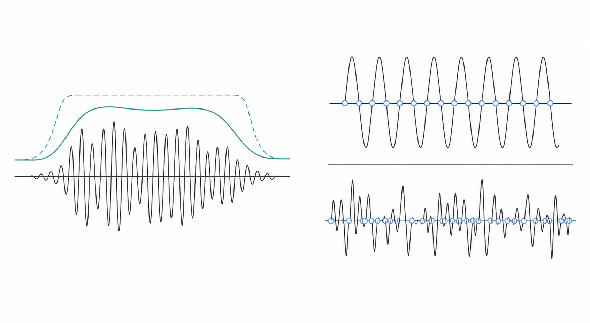
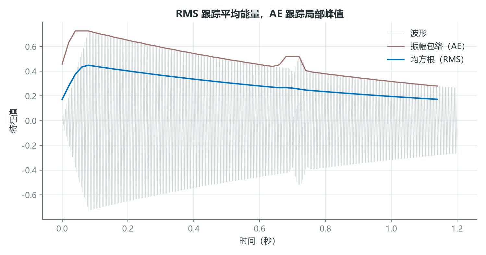
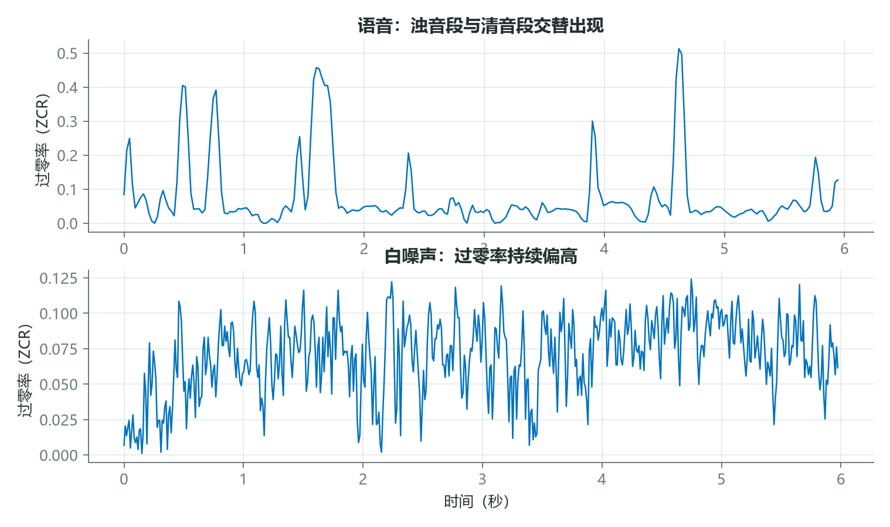
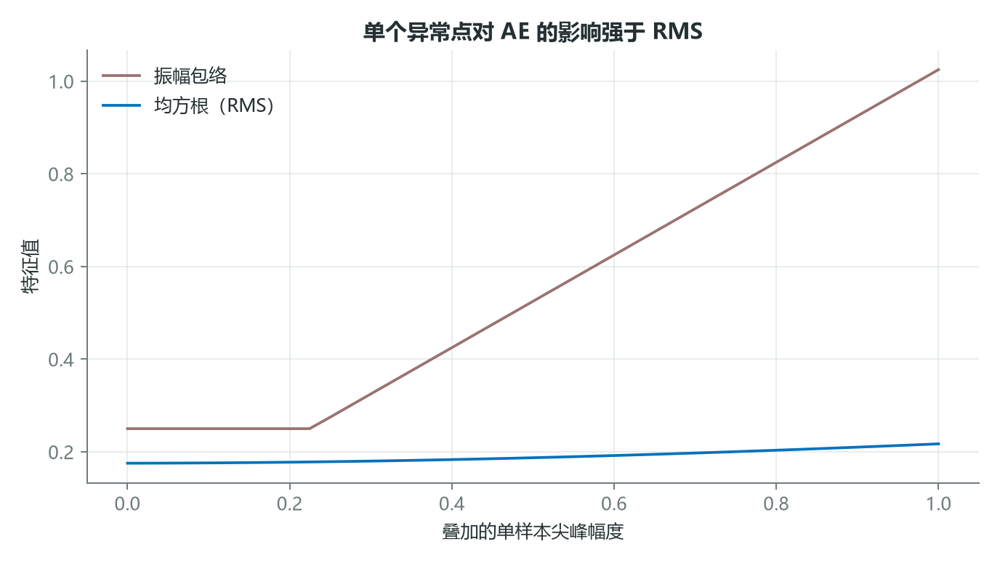
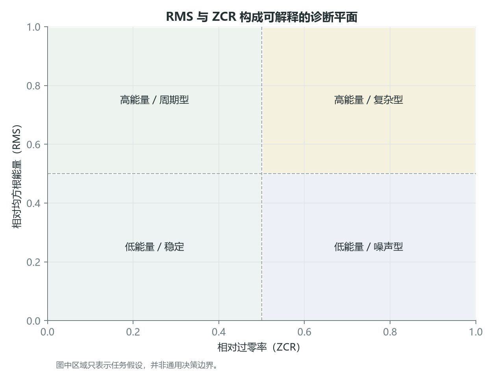

# RMS 与过零率：用两条曲线定位能量和噪声

只看振幅包络，很容易把一个孤立点击误认为整帧都很强；只看过零率，又可能把低幅噪声误认为重要事件。RMS 与 ZCR 的意义，恰好在于从两个不同方向约束判断：前者观察平均能量，后者观察符号变化密度。

它们都很简单，但只有理解帧长、归一化和噪声条件，简单特征才不会变成简单误判。



*图 1：左侧表示 RMS 对局部振荡的平均，右侧用零轴交点表示过零率。*

## 1. RMS 比峰值更平滑，但不等于感知响度

第 $m$ 帧的 RMS 为

$$
RMS[m]=\sqrt{\frac{1}{N}\sum_{n=0}^{N-1}x_m[n]^2}。
$$



*图 2：AE 追随局部峰值，RMS 追随平均平方幅度，因此曲线更平滑。两者都来自波形幅度，不包含完整的听觉频率加权。*

对 $x=[1,-1,1,-1]$，RMS 为 1；对 $x=[1,0,0,0]$，两帧 AE 都为 1，但后一帧

$$
RMS=\sqrt{\frac{1}{4}}=0.5。
$$

这说明相同峰值并不代表相同持续能量。RMS 常用于检测静音、分段和比较动态，但跨设备或跨数据集比较前，需要确认幅度标定和响度归一化策略。

## 2. ZCR 适合发现噪声样变化和清音段

过零率可写为

$$
ZCR[m]=\frac{1}{N-1}\sum_{n=1}^{N-1}
\mathbf{1}\big[x_m[n]x_m[n-1]<0\big]。
$$



*图 3：真实语音的 ZCR 随浊音、清音和停顿变化；白噪声的符号变化通常更持续。图中数值还会受到帧长和零点阈值影响。*

在理想条件下，频率越高，单位时间过零次数通常越多。但 ZCR 也会被直流偏移、噪声和多个频率叠加影响。因此它可以帮助区分浊音与清音、周期声与噪声样信号，却不应被当作精确基频估计器。

对零点附近的微小噪声，可设置阈值 $\varepsilon$：先把 $|x|<\varepsilon$ 的样本置零，再计算符号变化。阈值必须相对于数据幅度范围确定。

## 3. 异常点揭示了两种能量描述的根本差异

当单个样本逐渐变大时，AE 会线性追随这个峰值；RMS 的响应受帧长稀释。帧内若有 $N$ 个样本，只有一个幅值为 $a$，其余为零，则

$$
AE=|a|,\qquad RMS=\frac{|a|}{\sqrt{N}}。
$$



*图 4：孤立尖峰增大时，AE 上升更快，RMS 更缓慢。这个差异可用于选择瞬态检测或持续能量描述。*

课程代码可以用 Librosa 简洁复现：

```python
import librosa
import numpy as np

y, sr = librosa.load("example.wav", sr=None, mono=True)
frame_length = 1024
hop_length = 512

rms = librosa.feature.rms(
    y=y,
    frame_length=frame_length,
    hop_length=hop_length,
    center=False,
)[0]

zcr = librosa.feature.zero_crossing_rate(
    y,
    frame_length=frame_length,
    hop_length=hop_length,
    center=False,
)[0]

times = np.arange(len(rms)) * hop_length / sr
```

`center=False` 避免库在两端自动补帧，便于与手动实现对齐。若改为默认居中策略，特征时间戳和边界帧数量会变化，绘图时应使用与实现一致的时间轴。

## 4. 两条曲线组合后，比任何单一阈值更可靠



*图 5：RMS 与 ZCR 构成可解释的二维诊断空间。图中的区域是分析假设，不是适用于所有数据的固定阈值。*

可以把 RMS 与 ZCR 组成一个简单判别平面：

- 低 RMS、低 ZCR：可能是静音或稳定低幅背景。
- 低 RMS、高 ZCR：可能是微弱高频噪声。
- 高 RMS、低 ZCR：可能是强周期声或浊音。
- 高 RMS、高 ZCR：可能是强噪声、摩擦或复杂瞬态。

这只是启发式解释，阈值必须从具体数据分布中估计。对于可靠系统，还应加入频带能量、谱平坦度、持续时间和上下文模型。

## 结语

RMS 与 ZCR 的价值不在复杂度，而在可解释的互补性。一个描述“有多强”，另一个描述“变化有多密”。把二者与录音条件、时间尺度和任务假设结合，才能让简单统计量成为可靠证据。

如果一个事件同时具有低能量和高过零率，你的系统会把它当作背景，还是值得关注的高频异常？

## 课程来源与复现材料

- [原课程视频](https://www.youtube.com/watch?v=EycaSbIRx-0)
- [课程 Notebook](<../source_course/09 - RMS energy and zero-crossing rate/RMS Energy and Zero-Crossing Rate.ipynb>)
- 叙事底稿：`ダウンロード (3).md`。
