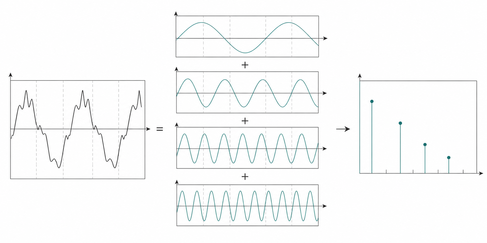
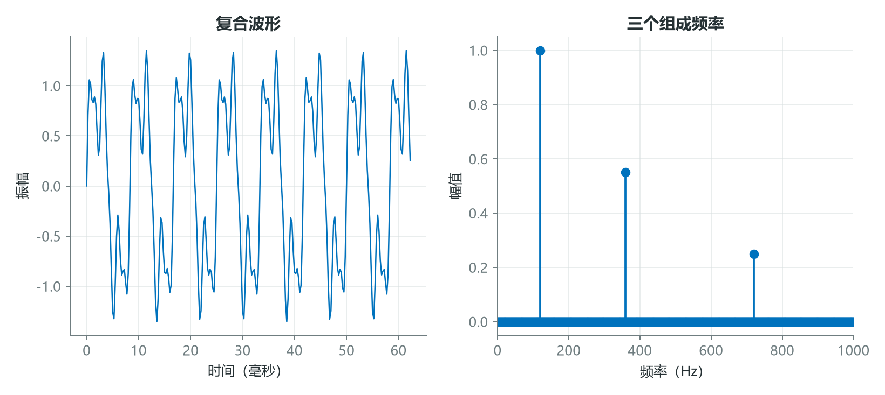
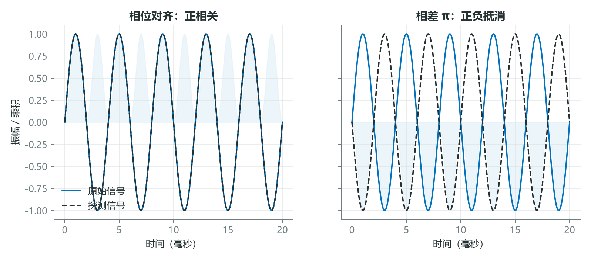
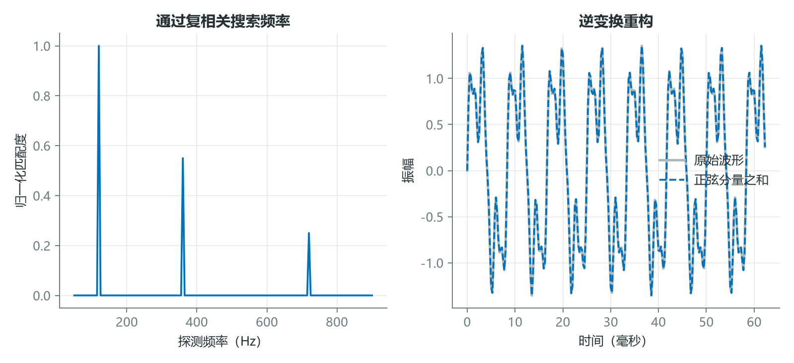
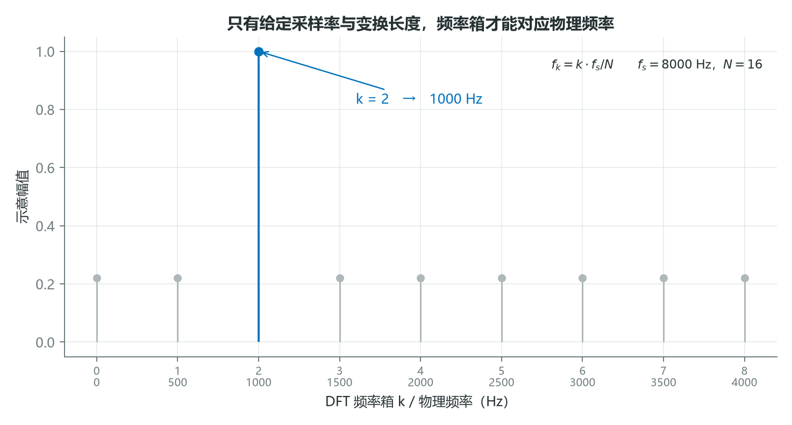

# 傅里叶变换不是魔法：它只是在系统地寻找频率

复杂波形看起来像一团难以解释的起伏，但它可能只是若干简单振荡的叠加。傅里叶变换所做的事，可以直观理解为：用一组不同频率和相位的“探针”与信号比较，测量每个探针的匹配程度。

它不是把声音变成另一种物质，而是把同一组信息从时间坐标重新表达为频率坐标。



*图 1：左侧复合波形可由多个简单振荡相加得到，右侧频谱记录各频率成分的强度。*

## 1. 频谱把“发生了什么”改写为“含有哪些频率”

设信号由三个正弦波组成：

$$
x(t)=\sin(2\pi120t)+0.55\sin(2\pi360t)
+0.25\sin(2\pi720t)。
$$

时域中只能看到复杂的周期起伏；频域中则会在 120、360 和 720 Hz 附近出现三条谱线，其高度与振幅对应。



*图 2：频域没有保留“峰值发生在第几毫秒”这种局部时间信息，却清楚分离了叠加的频率。*

这也解释了为什么整段傅里叶变换不适合定位短事件。若需要知道频率何时出现，应把信号分成短帧再计算，即短时傅里叶变换。

## 2. 相位决定正负抵消，复指数同时处理正弦和余弦

只拿一个固定相位的正弦波去匹配并不完整。即使频率相同，相位错开也可能使乘积正负面积互相抵消。复指数

$$
e^{-j2\pi ft}=\cos(2\pi ft)-j\sin(2\pi ft)
$$

同时提供余弦和正弦两个正交方向，因此可以在一次计算中记录幅度与相位。



*图 3：同频同相时乘积平均为正；相差 $\pi$ 时方向相反。复数表示避免了单一探针相位造成的漏检。*

长度为 $N$ 的离散傅里叶变换定义为

$$
X[k]=\sum_{n=0}^{N-1}x[n]e^{-j2\pi kn/N},
\quad k=0,1,\ldots,N-1。
$$

取 $x=[1,0,-1,0]$，这是四点网格上的一个余弦周期。计算得

$$
X[0]=1+0-1+0=0,
$$

$$
X[1]=1+(-1)e^{-j\pi}=2,
$$

$$
X[2]=1+(-1)e^{-j2\pi}=0,
$$

$$
X[3]=2。
$$

对实值信号，正负频率互为共轭，因此 $k=1$ 与 $k=3$ 成对出现。实际分析常使用 `rfft`，只返回非负频率部分。

## 3. 变换与逆变换是一对可逆坐标变换

逐个频率做复相关，会在真实成分处得到高匹配值；逆变换则把每个频率箱的复系数重新相加，恢复时间波形。



*图 4：左图在 120、360、720 Hz 处出现峰值；右图说明只要保留完整复系数，正弦分量之和可以恢复原信号。*

逆 DFT 为

$$
x[n]=\frac{1}{N}\sum_{k=0}^{N-1}
X[k]e^{j2\pi kn/N}。
$$

NumPy 中可以直接验证：

```python
import numpy as np

sr = 4000
t = np.arange(sr) / sr
x = (
    np.sin(2 * np.pi * 120 * t)
    + 0.55 * np.sin(2 * np.pi * 360 * t)
    + 0.25 * np.sin(2 * np.pi * 720 * t)
)

X = np.fft.rfft(x)
freqs = np.fft.rfftfreq(len(x), d=1 / sr)
magnitude = 2 * np.abs(X) / len(x)

x_reconstructed = np.fft.irfft(X, n=len(x))
print(np.max(np.abs(x - x_reconstructed)))
```

最后的误差通常接近浮点数精度。若只保留幅度、丢弃相位，便不能保证重建出原来的时间波形；如果只保留少数谱线，则得到的是一种有损近似。

## 4. 频谱读数必须连同采样率、窗和归一化一起解释



*图 5：同一个频率箱索引只有结合采样率 $f_s$ 和变换长度 $N$，才能转换为赫兹。示例中第 2 箱对应 1000 Hz。*

DFT 的第 $k$ 个频率箱对应

$$
f_k=\frac{k f_s}{N}。
$$

因此同一个数组索引，在不同采样率或 FFT 长度下代表不同物理频率。窗函数会改变谱峰宽度和泄漏，单边谱还需要正确处理直流、Nyquist 箱与幅度缩放。绘图“看见一根峰”之前，必须先确认这些条件。

## 结语

傅里叶变换最重要的直觉，是相关与重构：用复指数系统地询问每个频率“你在信号里有多少”，再把回答按原相位相加回去。频谱不是声音的全部，却是理解谐波、滤波、声谱图和大量音频特征的共同入口。

当一个频谱峰值升高时，你看到的是声源真的增强了，还是窗口、归一化和采样参数共同制造的变化？

## 课程来源与复现材料

- [原课程视频](https://www.youtube.com/watch?v=XQ45IgG6rJ4)
- [PDF 课件](<../source_course/10 - Fourier Transform The Intuition/Demystifying the Fourier Transform The Intuition.pdf>)
- [课程 Notebook](<../source_course/10 - Fourier Transform The Intuition/Fourier Transform.ipynb>)
- 叙事底稿：`ダウンロード (4).md`。
