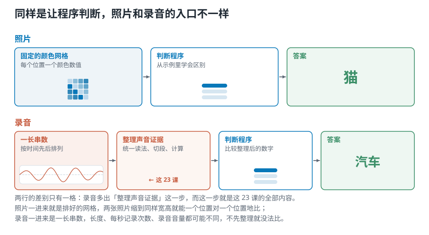

# 让电脑判断声音之前，为什么要先处理录音？

> **导读：** 给程序一张猫的照片，它面对的是一块排整齐的颜色网格；给程序一段音乐，它拿到的却是一长串按时间出现的数字。两者都能用来分类，但入口并不一样。这一课先把整套课程的任务定清楚：我们要让程序根据 1 秒音乐判断古典、爵士或摇滚，并沿着 23 课，把原始录音逐步整理成可信、可比较的证据。波形、频谱和声谱图会在后面逐一学习，本课只把它们放到路线图上，不提前讲结论。

<picture>
  <source media="(max-width: 640px)" srcset="../../零基础版_01-05/figures/mobile/00-course-position-01.svg">
  
</picture>

## 照片能直接比较，录音为什么要先整理

先想一个熟悉的问题：给程序看许多已经标好“猫”和“狗”的照片，再让它判断一张新照片属于哪一类。

负责做这种判断的程序，后面简称为**分类程序**。它要做的事并不神秘：从带答案的示例中寻找差别，再把新输入归到某一类。

照片通常可以排成固定大小的颜色网格。网格中的每个位置都有数值，因此不同照片很容易先整理成相同形状，再交给分类程序比较。

录音的入口不同。麦克风会随着时间不断记数，一秒钟就可能记下几万次。一段短录音得到的是一长串有先后顺序的数字。**声道**是一个文件同时保存的声音路数；不同录音的长短、声道数量和记录速度都可能不同。程序当然可以直接接收原始录音，但在真正比较之前，仍然要先回答几个问题：

- 每段录音要读多长？
- 不同文件怎样采用一致的读法？
- 哪些数字能说明音乐风格，哪些只是音量、设备或录音位置造成的差别？
- 整理之后有没有丢掉任务真正需要的线索？



*图 1：照片常从固定网格开始；录音先是一串随时间排列的数字。本课程关注中间的“整理声音证据”。*

这就是**音频信号处理**在本课程里的作用：把录音中的数字读懂、切开、计算和整理，让后续程序拿到能够比较的证据。

## 处理声音以后，程序能做什么

课程用音乐风格分类贯穿始终，但同一套思路并不只服务于音乐。

当任务是判断“这是什么声音”时，可以识别警报、车辆、动物叫声或机器故障；当任务是理解人声时，可以把语音变成文字，也可以核对说话者；当任务是改善录音时，可以削弱不想要的杂声（通常叫噪声）、修复缺失的信息；当任务是分析音乐时，还可以寻找乐器、节拍、情绪和曲目结构。

这些应用表面上差别很大，起点却相同：**先从录音里找到与任务有关的证据。**

本课程选择“古典、爵士、摇滚”三分类，是因为结果容易理解，也能让后面学到的每一种计算都回到同一个问题上：这个数字是否真的有助于区分三种音乐？

## 这 23 课沿着哪条路前进

下面的图是全课程地图。图里有一些现在还不需要掌握的名称。[**傅里叶变换**](10-傅里叶变换的直觉-电脑怎样从复杂波形里找出频率.md)是把复杂变化拆成不同快慢成分的计算；[**声谱图**](../../零基础版_16-20/16-功率声谱图与相对分贝-怎样把STFT画得可信.md)（第 16 课）把这些成分随时间排成二维图；MFCC 则用较少的数字概括它们。这里先把三者当作路标，走到对应课程时再从问题、图和代码重新讲起。

<picture>
  <source media="(max-width: 640px)" srcset="../../课程总纲/figures/mobile/course-roadmap.svg">
  
</picture>

*图 2：整套课程只有一条主线——听懂声音，切分声音，寻找振动快慢，构建表示，最后提取特征。*

| 阶段 | 主要问题 | 学完后的结果 |
|---|---|---|
| 01—05 | 程序判断音乐要解决什么，声音怎样变成数字 | 认清课程任务，理解声音和录音参数 |
| 06—10 | 怎样沿时间切开声音，并提取基础证据 | 会把录音切成短段，也会计算强弱与变化 |
| 11—15 | 怎样从复杂变化中找到不同的振动快慢 | 会找出一段声音包含哪些快慢成分，以及它们何时出现 |
| 16—20 | 怎样把这些成分整理得更稳定、更接近听觉 | 得到适合听觉比较的二维图和数字表 |
| 21—23 | 怎样用少量数字概括一小段声音 | 根据任务选择最终证据 |

更完整的课程边界、环境说明和各课入口，统一放在[课程总纲](../../课程总纲/README.md)里。后面的文章不再重复安装步骤。

## 每一课都把原理和代码放在一起

这套教程不会把“原理课”和“编程课”拆成两条互不相干的线。每遇到一个新概念，我们都会完成同一组动作：

1. 先说明它要解决什么问题。
2. 用图看清输入、输出和变化过程。
3. 用一小段代码算出真实结果。
4. 改一个参数或输入，观察结果为什么改变。
5. 把可复用的完整版本留在课程项目中。

正文只保留理解实验必需的代码。对应章节的完整脚本放在[课程代码目录](../../课程代码/README.md)，读者可以直接运行，也可以在那里查看额外的检查、参数和边界情况。

课程主要使用 Python。数组计算由 NumPy 完成，音频读取和常用音频工具主要由 librosa、SoundFile 提供，图由 Matplotlib 绘制。它们分别是什么、怎样安装，只需在开课前看一次[“动手之前”](../../课程总纲/README.md#动手之前装好环境和代码)。

原课程默认读者已经会写一些 Python。本教程不要求音频或信号处理基础，但你最好能看懂变量、函数调用、循环和列表。如果暂时写不出这些代码，也可以先运行完整脚本，再对照正文逐行阅读。

## 学完以后，你应该真正会什么

23 课结束时，目标不是背出一串函数名，而是能够：

- 解释声音怎样被记录为数字，以及“每秒记录多少次”等参数改变了什么；
- 看懂随时间起伏的记录线、声音成分表和二维声音图各自表达的信息；
- 自己实现课程中的核心计算，并检查单位、坐标和数组形状；
- 根据任务选择特征，说明它保留了什么、丢掉了什么；
- 把许多音乐片段整理成一张可供分类程序使用的特征表。

本系列到“为分类程序准备可信的输入”为止。怎样训练更复杂的学习程序、设计网络或部署服务，不在这 23 课的范围内。把边界说清楚，是为了让每一课都服务于同一个可验收的结果。

## 实验：先确认三段课程素材能被程序读到

这一课的实验不分析曲线，也不计算声音由哪些快慢成分组成。我们只完成项目真正的第一步：确认任务、文件和标签。

实验输入是三段课程自带的音乐：

```python
COURSE_AUDIO = [
    ("debussy.wav", "古典"),
    ("duke.wav", "爵士"),
    ("redhot.wav", "摇滚"),
]
```

我们约定，未来交给分类程序的是一段 **1 秒音乐**，程序输出“古典、爵士、摇滚”中的一个标签。这里的标签就是每段示例已有的正确类别。

准备好总纲中的环境和素材后，运行完整脚本：

```bash
python lessons/lesson01_course_map.py
```

完整代码见 [`lesson01_course_map.py`](../../课程代码/lessons/lesson01_course_map.py)。脚本先读取文件信息，不改变每秒记录次数，也不合并同时保存的多路声音：

```python
def inspect_course_audio():
    rows = []
    folder = audio_dir()
    for filename, label in COURSE_AUDIO:
        info = sf.info(os.path.join(folder, filename))
        rows.append({
            "file": filename,
            "label": label,
            "duration_s": info.duration,
            "sample_rate_hz": info.samplerate,
            "channels": info.channels,
        })
    return rows
```

实际输出如下：

```text
[正文] 课程要解决的问题
  输入：1 秒音乐片段
  输出：古典、爵士、摇滚中的一个标签
  本系列先完成可信的音频特征，
  不把训练深度模型当作终点。

[正文] 三段主素材
  debussy.wav | 古典
    30.00 秒 | 22050 Hz | 1 声道
  duke.wav | 爵士
    30.00 秒 | 22050 Hz | 1 声道
  redhot.wav | 摇滚
    30.00 秒 | 22050 Hz | 1 声道
  三个文件都能读取，
  课程项目才有共同的起点。

[正文] 已写出 dataset_manifest.csv
  共 3 行主素材；
  后续脚本沿用这里的文件名和标签。
```

先看数字带来的结论：三个文件都能正常读取；它们都是 30 秒、每秒记录 22050 次、单声道。至少在文件长度、记录速度和声道数量上，三段主素材有一致的起点。

这不代表三段音乐已经“完全可比”，更不代表采样率相同就能区分风格。它只排除了最前面的一类麻烦：某个文件读不到，或者三段素材连基本格式都不一致。采样率和声道究竟表示什么，会在第 04 课正式学习。

脚本还会写出 `dataset_manifest.csv`。这是一张三行的小表，固定文件名、标签和原始信息。后面的课程继续使用同一组约定，就不会出现正文写一套名称、代码又使用另一套名称的问题。

除了三段主素材，完整脚本还会列出七段对照声音：噪声、钢琴、萨克斯、音阶、颤音、小提琴和人声。它们会在讲音高、音色、颤音和噪声时使用，但不会混入三种音乐风格的标签表。

## 这一课只定问题，不抢后面的答案

现在我们已经知道课程要完成什么，也确认了共同素材。到这里就够了。

本课没有解释波形为什么上下摆动，没有讲“频率”怎样计算，也没有比较频谱和声谱图。提前把这些内容塞进导论，会让同一个概念在后面重复出现，也会让第一次接触声音处理的读者失去顺序。

[下一课](02-波形频率与音高-声音曲线记录了什么.md)从声音怎样产生讲起，再第一次认真阅读录音软件里的那条曲线：它记录了什么，振动快慢为什么会和音高有关。
