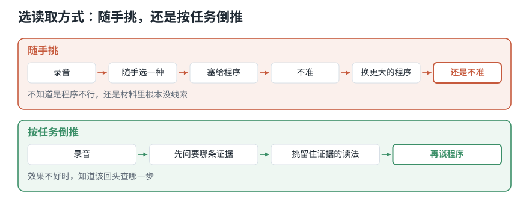
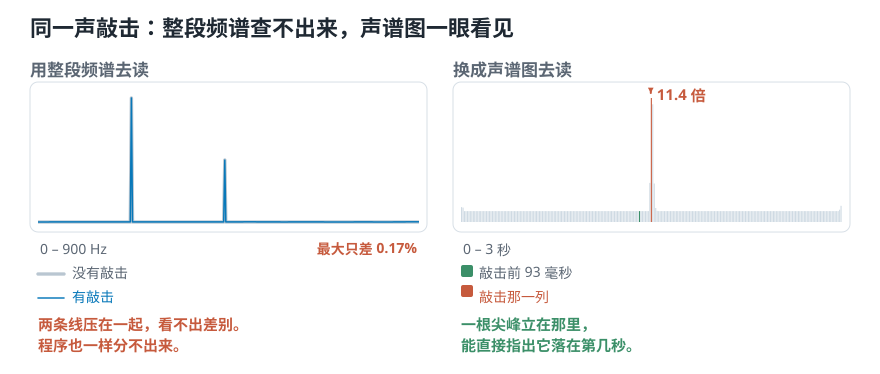

# 电脑读录音的三种方式：波形、频谱与声谱图

> **导读：** 电脑读一段录音，可以用波形、频谱、声谱图三种方式。**读法选错了，你要找的那个声音，程序就永远找不到——换再厉害的程序也补不回来。** 本文拿一段"持续嗡嗡声、中间夹一下敲击"的录音，把三种读法都算一遍：用整段频谱去读，那声敲击只让数值动了 0.17%，小到和正常的噪声起伏分不开，程序**不可能**发现它响过；换成声谱图去读，敲击那一瞬间的数值是旁边的 11.4 倍，**一眼就能指出它落在第几秒**。同一段声音，同一下敲击，读法不同，一个查不出来，一个一目了然。

<picture>
  <source media="(max-width: 640px)" srcset="../../零基础版_01-05/figures/mobile/00-course-position-01.svg">
  
</picture>

## 电脑读一段录音，有哪三种方式

简单来说：**电脑要读一段录音，有三种常见的方式。** 同一段声音，三种方式读出来的东西完全不同。

- **波形**：把每一个瞬间的强弱按时间排成一条线。
- **频谱**：不管先后，只统计整段里各种高低的成分各占多少。
- **声谱图**：切成小段，每段算一张成分表，再按时间贴成一张图。

它解决什么问题？很多人遇到“程序判断不准”，第一反应是换一个更厉害的程序。但程序只能拿它收到的东西做判断。**读取方式选错了，你要找的那个特征在进入程序之前就已经丢掉了**——这时候换什么程序都补不回来。

<picture>
  <source media="(max-width: 640px)" srcset="../../零基础版_01-05/figures/mobile/01-before-after.svg">
  
</picture>

*图 1：上面那条路走到头，你不知道是程序不行还是材料里根本没线索；下面那条路，效果不好时知道回头查哪一步。*

想象一下你要描述一场足球比赛。**逐秒流水账**记下每一刻谁在哪儿（波形）；**赛后统计表**只给控球率、射门数、跑动距离（频谱）；**分钟级的战况图**每五分钟一格，既有统计又有先后（声谱图）。三份材料都真实，但“第 78 分钟那个进球”只在第一份和第三份里找得到。

**换句话说：同一场比赛，记录方式决定了你事后还能查到什么。** 电脑读录音也是这样。

类比到此为止。下面回到真实的数字。

## 为什么不能只挑一种

| | 波形 | 频谱 | 声谱图 |
|---|---|---|---|
| 横轴 | 时间 | 高低（一秒振动几次，叫**频率**） | 时间 |
| 纵轴 | 强弱 | 强弱 | 高低（颜色表示强弱） |
| 答得了“什么时候” | ✓ | ✗ | ✓ |
| 答得了“有哪些成分” | ✗ | ✓ | ✓ |
| 需要你先做选择 | 否 | 否 | 是（切多长） |
| 数据量（10 秒 @22050） | 22 万个数 | 11 万个数 | 1025 × 431 |

**什么时候用波形：** 只关心“什么时候响、响多久、有没有削顶”。找起音、切静音、检查录音质量。

**什么时候用频谱：** 声音在这段时间里基本不变，只想知道它由什么组成。判断一个稳定音有多高、看电机有没有出现新的固定成分。

**什么时候用声谱图：** 只要任务同时关心“是什么”和“什么时候”，就是它。这门课后面 90% 的内容都建立在它上面。

**什么时候三个都不够：** 需要的证据根本不在声音的强弱和频率里，比如“这句话是谁说的”——那要在声谱图之上再学一层，是后面几组的事。

## 流程长什么样

<picture>
  <source media="(max-width: 640px)" srcset="../../零基础版_01-05/figures/mobile/01-pipeline.svg">
  
</picture>

*图 2：五个方框里只有第四步是我们能自由选择的——前三步由物理和硬件决定，第五步是结果。所以“给程序看什么”这个决定，全部落在第四步。*

五个方框里只有**第四步**是这一课的主题——也是整条链上你唯一能自由选的地方。

- **麦克风**负责把空气的推挤变成电压。它测的是**它所在那一个位置**上的变化，换个位置录，结果就不同。
- **采样量化**负责把连续电压变成有限个数字。它决定了这段录音里总共有多少信息可用（[第 04 课](../../零基础版_01-05/04-采样率与位深-44.1kHz和16bit决定了什么.md)）。
- **读取方式**不改变这串数字本身，只决定程序看到的是它的哪一面：**哪些信息被摆到明处，哪些被藏起来**。
- **程序**只能看到第 ④ 步交给它的东西。

## 核心概念一：波形

**它是什么：** 把每一个瞬间的强弱，按时间先后画成一条线。

电脑每隔极短的时间量一次麦克风的电压，记成一个数字。一秒量两万多次，十秒就攒下二十多万个数字。把它们按时间画出来，就是剪辑软件里那条上下抖动的“声音波浪”。

**最小例子：**

```python
import librosa

y, sr = librosa.load("debussy.wav", sr=22050, mono=True)
seg = y[:10 * sr]
print(seg.shape, sr)
```

```text
(220500,) 22050
```

十秒，22 万个数。**每个数字对应一个精确到 1/22050 秒的瞬间**——这就是波形的强项：时间位置准到毫秒以下。

**常见错误：把纵轴的数值当成物理单位。** 那条线的高低，已经被麦克风灵敏度、放大器增益、软件自动做的音量拉平（这一步叫**归一化**）改过好几手。没有专门标定过的话，它只是一个相对数值，不能当成“多少帕的压力”。

## 核心概念二：频谱

**它是什么：** 不管时间顺序，只统计整段里各种高低的成分各占多少分量。

任何一段声音，都可以看成很多种高低不同的“纯音”混在一起。频谱就是把它们各自占多少列成一张成分表：横轴从低音排到高音，某个位置柱子越高，这种高低的成分就越多。

**最小例子：**

```python
import numpy as np

spectrum = np.abs(np.fft.rfft(seg))
print(spectrum.shape, round(sr / len(seg), 3), "Hz")
```

```text
(110251,) 0.1 Hz
```

22 万个数变成 11 万个数，代价是**时间彻底没了**。这 11 万个数里，没有任何一个能告诉你某件事发生在第几秒。频率分辨率倒是极高——每 0.1 Hz 一格，因为整整十秒都拿来做统计了。

**常见错误：用整段频谱去找短促事件。** 下面 Hello World 会给出这个错误的具体代价。

## 核心概念三：声谱图

**它是什么：** 把录音切成许多小段，每段单独算一张成分表，再按时间顺序并排贴好。

<picture>
  <source media="(max-width: 640px)" srcset="../../零基础版_01-05/figures/mobile/01-three-views.svg">
  
</picture>

*图 3：三张图算的是同一段声音。左图的尖峰和右图的竖亮带，指的是同一下敲击；中图那三根柱子，对应右图那三条一直延伸到底的横线。*

**最小例子：**

```python
S = np.abs(librosa.stft(seg, n_fft=2048, hop_length=512))
print(S.shape)
```

```text
(1025, 431)
```

1025 行是频率格，431 列是时间帧。横轴时间、纵轴频率、亮度表示强弱——两样都在。

**代价是你必须替它做一个选择：** `n_fft=2048` 就是“每一小段切多长”。切得短，时间上看得准，每段里能分辨的高低就粗；切得长，高低分得细，“到底是哪一瞬间”又模糊了。这个取舍没有标准答案，[第 15 课](../../零基础版_11-15/15-短时傅里叶变换STFT-怎样同时看见频率与出现时间.md)会展开。

**常见错误：两张声谱图颜色范围不一样就直接比。** 颜色只是相对强弱的映射，参考值不同的两张图，亮度完全没有可比性。

## 环境准备

这门课全程只需要这几个包，装一次就够：

```bash
pip install numpy librosa soundfile matplotlib
```

本文全部代码在以下版本上实测通过：

| 包 | 版本 |
|---|---|
| Python | 3.12.10 |
| numpy | 2.5.2 |
| librosa | 1.0.0 |
| soundfile | 0.14.0 |

验证装好没有：

```python
import numpy as np, librosa
print(np.__version__, librosa.__version__)
```

音频素材用课程自带的三段音乐：`debussy.wav`（钢琴）、`duke.wav`（爵士）、`redhot.wav`（摇滚）。

## Hello World：让证据消失一次

光说“频谱会丢掉时间”不够有说服力。我们直接造一段声音，把它丢掉的东西量出来。

**Step 1 — 造一段“嗡嗡声 + 一下敲击”**

```python
import numpy as np

sr = 22050
rng = np.random.default_rng(0)
t = np.arange(3 * sr) / sr

hum = 0.3 * np.sin(2 * np.pi * 220 * t) + 0.15 * np.sin(2 * np.pi * 440 * t)

knock = np.zeros_like(hum)
k0, n = int(1.5 * sr), int(0.03 * sr)
knock[k0:k0 + n] = rng.standard_normal(n) * 0.9 * np.exp(-np.arange(n) / 120)

mix = hum + knock          # 有敲击
```

**Step 2 — 比较“有敲击”和“没敲击”的整段频谱**

```python
Smix = np.abs(np.fft.rfft(mix))
Shum = np.abs(np.fft.rfft(hum))
diff = np.max(np.abs(Smix - Shum)) / Smix.max() * 100
print(f"{diff:.2f} %")
```

```text
0.17 %
```

**Step 3 — 换成声谱图再看一次**

```python
import librosa

Sg = np.abs(librosa.stft(mix, n_fft=1024, hop_length=256))
col = int(1.5 * sr / 256)                     # 敲击落在第几列
print(round(float(Sg[:, col].sum() / Sg[:, col - 8].sum()), 1), "倍")
```

```text
11.4 倍
```

<picture>
  <source media="(max-width: 640px)" srcset="../../零基础版_01-05/figures/mobile/01-knock-evidence.svg">
  
</picture>

*图 4：左边两条线是「有敲击」和「没敲击」的整段频谱，完全压在一起——0.17% 的差别在图上根本看不出来。右边每一根竖条是声谱图的一列，敲击那一列（橙色）比 93 毫秒之前那一列（绿色）高 11.4 倍。*

<picture>
  <source media="(max-width: 640px)" srcset="../../零基础版_01-05/figures/mobile/01-evidence.svg">
  
</picture>

*图 5：注意中间那张频谱——敲击的能量被整段一平均，已经淹没在噪底里，图上完全找不到它。*

逐行看关键的那几句：

- `np.fft.rfft(mix)` 对**整整三秒**做一次频率统计。敲击只占 30 毫秒，是全长的 1%，一平均就摊薄了。
- `diff` 那一行算的是“加了敲击之后，整段频谱最多变了多少”。**0.17%**——比大多数噪声都小，任何程序都不可能靠它把敲击认出来。
- `librosa.stft(..., hop_length=256)` 每 256 个样本算一列，敲击只影响它落进去的那几列。
- 最后一行拿那一列和 8 列之前（也就是敲击发生前 93 毫秒）比。**11.4 倍**。

同一段声音，同一个事件。换一种读取方式，就从“查不出来”变成“一眼看见”。

## 一层层加上去

### Level 1：三种表示各算一次

上面已经做完了。输入一段录音，输出三个数组。

### Level 2：换成课程自己的三段音乐

```python
for name in ["debussy.wav", "duke.wav", "redhot.wav"]:
    z, sr = librosa.load(name, sr=22050, mono=True)
    S = np.abs(librosa.stft(z[:10 * sr], n_fft=2048, hop_length=512))
    print(f"{name:12s} {S.shape}")
```

```text
debussy.wav  (1025, 431)
duke.wav     (1025, 431)
redhot.wav   (1025, 431)
```

参数一样，形状就一样——**这是后面能把它们放进同一张表的前提**。

### Level 3：按任务反推该用哪一种

三段音乐要分出风格，先问差别在哪：

- “摇滚的高频成分比钢琴多”——这是**整段的成分比例**，整段频谱就够。
- “节奏密不密、力度是平稳还是忽强忽弱”——这是**随时间变化**的事，整段一平均就没了，只有声谱图看得见。

所以要分得开，光靠一张整段成分表不够。这个判断不需要写一行训练代码，光看图就能得出。

### Level 4：把选择写进配置

到这里应该意识到：`sr`、`n_fft`、`hop_length` 这三个数一旦不同，算出来的东西就不能互相比。把它们集中到一个地方，是[第 04 课](../../零基础版_01-05/04-采样率与位深-44.1kHz和16bit决定了什么.md)动手做要产出的 `config.py`。

## 工程上会咬人的几件事

**边界：`rfft` 和 `fft` 不是一回事。** 真实音频的频谱前后两半是镜像的，`np.fft.rfft` 只返回前一半加一个点（`len(seg)//2 + 1`）。用 `np.fft.fft` 会拿到两倍长度、后一半是冗余的结果。[第 13 课](../../零基础版_11-15/13-离散傅里叶变换DFT-有限样本怎样变成频率格.md)讲为什么。

**性能：整段 `rfft` 很贵。** 上面十秒录音的 `rfft` 输出有 11 万个点。真要用频谱，一般也是分帧之后逐帧算，而不是对整段来一发。

**可复现：预处理会改变模型看到的线索。** 统一采样率、合并声道、裁静音、调音量——每一步都在改输入。如果拿来学习的录音和最终考核的录音在这些方面不一致，程序很可能学到的是“这段录音用哪台设备录的”。所以训练前先跑一遍体检，并且**按数据来源分组统计**：

```python
summary = {
    "sample_rate_hz": int(sr),
    "duration_s": float(len(y) / sr),
    "peak": float(np.max(np.abs(y))),
    "rms": float(np.sqrt(np.mean(y ** 2))),
    "silent_ratio": float(np.mean(np.abs(y) < 1e-4)),
}
print(summary)
```

划分数据时先按录音对象或采集批次分组，再用学习用的那一组决定音量调整规则。否则考核录音的信息会提前混进训练过程，让成绩看起来比真实情况好。这种问题叫**数据泄漏**。

## 常见问题

**Q1：最容易搞错什么？**

用整段频谱去找短促事件。上面量过了：0.17%。这不是程序不够聪明，是材料里根本没留下线索。**只要任务里出现「什么时候」三个字，就不能用整段统计。**

**Q2：频谱和声谱图有什么区别？**

频谱是**一张**成分表，对应整段；声谱图是**很多张**成分表并排贴起来，每张对应一小段。声谱图的每一列，就是那一小段的频谱。

**Q3：怎么排查？**

按这个顺序：

1. 打印形状。波形是一维，频谱是一维，声谱图是二维 `(频率格, 时间帧)`。
2. 声谱图的行数应该等于 `n_fft // 2 + 1`。2048 → 1025。对不上说明参数传错了。
3. 把声谱图画出来，和波形叠在一起看。波形上的尖峰，声谱图上应该有对应的亮柱。
4. 换一段你**确定**有明显事件的录音试一遍。图上找不到，说明是代码问题，不是数据问题。

**Q4：实际项目里最该注意什么？**

训练时和上线时必须走**完全同一条**处理链。采样率、声道合并方式、归一化规则、`n_fft`、`hop_length`，任何一项不同，两批特征就不可比。

## 速查表

| 概念 | 含义 | 关键代码 |
|---|---|---|
| 波形 | 每个瞬间的强弱，按时间排 | `librosa.load(path, sr=22050)` |
| 频谱 | 整段的成分分布，无时间 | `np.abs(np.fft.rfft(y))` |
| 声谱图 | 逐段的成分分布，有时间 | `np.abs(librosa.stft(y, n_fft, hop_length))` |
| 声谱图形状 | `(n_fft//2+1, 帧数)` | `S.shape` |
| 归一化 | 把音量拉到可比较的范围 | `y / np.max(np.abs(y))` |
| 数据泄漏 | 考核信息提前混进训练 | 先按来源分组，再定规则 |

## 接下来学什么

1. **本课**：电脑读录音的三种方式。
2. **第 02 课**：最底下那条曲线到底记了什么。
3. **第 03 课**：它给出的数值和听感差在哪。
4. **第 04 课**：这些数字是怎么产生的。
5. **第 05 课**：该从中算出什么交给程序。
6. **第 06 课起**：把长序列切成小段，逐段计算。

下一课回到最底下那条曲线，看它到底记录了什么——以及为什么它给出的数字，耳朵并不那样使用。

<!-- exercise:start -->

## 动手做：第 1 步 · 先用三种表示各看一眼

课程项目《三首曲子，一个分类器》共 23 步，这是第 1 步。项目的第一步不是写代码，而是先确认“这三种风格的差别，到底体现在哪一种表示上”。

1. 打开 `debussy.wav`、`duke.wav`、`redhot.wav`，各听 10 秒，用自己的话写下三句话：这三段声音最明显的差别是什么。
2. 用任意工具（Audacity、librosa 都行）为每段各画三张图：波形、整段频谱、声谱图。
3. 对照你写下的那三句话，逐条标注：这个差别在哪一张图上看得见？在哪一张图上被抹掉了？

**做完应该有**：一份 `notes/01-观察.md`，包含九张图和一张“差别 × 表示”的对照表。

**自检**：你应该会发现：摇滚和古典的高频差别在整段频谱上就很明显，但“节奏密不密”只有声谱图看得出来。如果三张图看起来都差不多，多半是画图时纵轴范围没统一。

下一步：[第 02 课 · 把音频读成一串数字](02-波形频率与音高-声音曲线记录了什么.md)　·　[项目全貌](../../课程项目/README.md)

<!-- exercise:end -->
