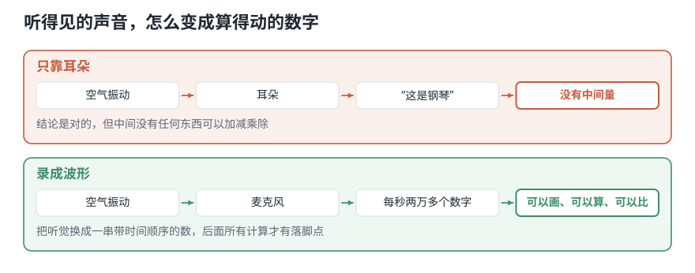
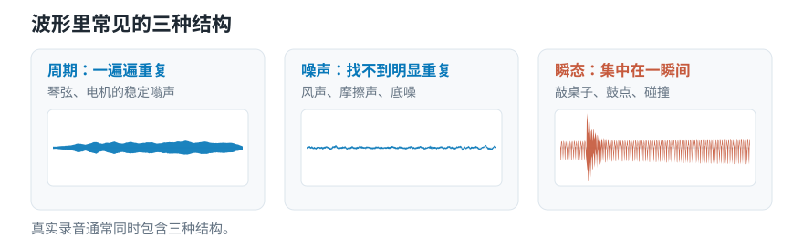
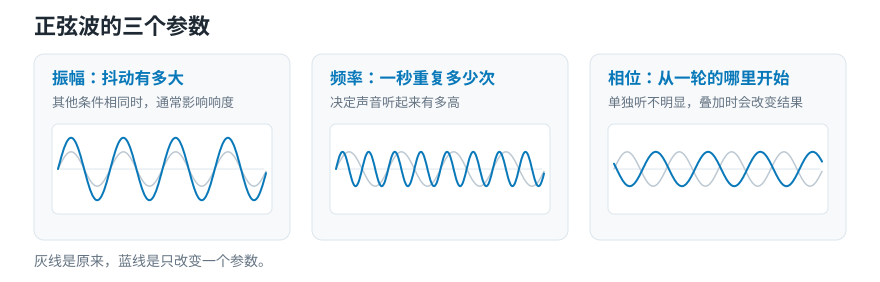
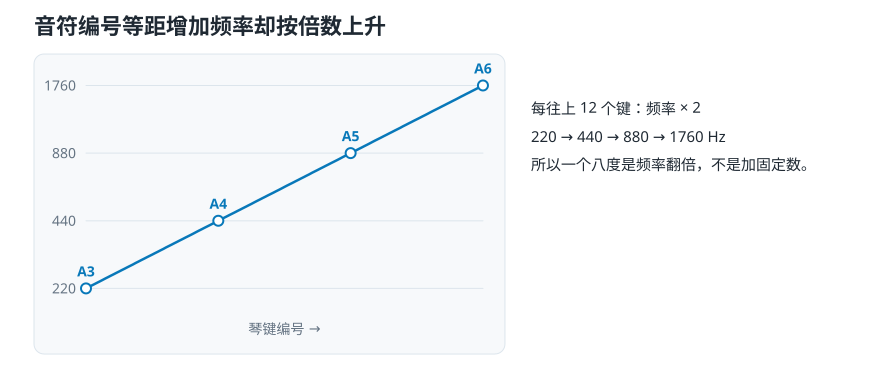

# 录音软件里那条线记下了什么？——波形、频率与音高

> **导读：** 对着手机说一句话，屏幕上会出现一条抖动的线。**这条线不是“你的声音”，它记的是麦克风那一个位置上、空气被推挤的强弱。** 分清这件事有实际用处：换个位置录同一个声音，数字就不一样，所以拿两次录音的数值直接比大小是没有意义的。本文还会说明，这条线给出的“频率”为什么不能当成耳朵听到的“高低”——220 到 440 差 220 赫兹，440 到 880 差 440 赫兹，差值翻了一倍，听起来却是同样远的距离。**所以比较两个音高，只能相除，不能相减。**

<picture>
  <source media="(max-width: 640px)" srcset="../../零基础版_01-05/figures/mobile/00-course-position-02.svg">
  
</picture>

## 波形记下来的到底是什么

上一课只定下了课程任务：让程序从录音里找到可比较的证据。**这一课第一次打开录音本身，回答声音怎样产生，以及屏幕上那条波形到底记录了什么。**

简单来说：波形记录的是——麦克风所在的那一个位置上，空气被推挤的强弱随时间怎样变化。

注意这句话里的两个限定词。波形不是“声音”，是**一份记录**；记的也不是“整个房间里的声音”，是**麦克风所在那一个点上的**。这两点后面都会让人算错东西。

<picture>
  <source media="(max-width: 640px)" srcset="../../零基础版_01-05/figures/mobile/02-why-waveform.svg">
  
</picture>

*图 1：上面那条路结论是对的，但中间没有任何东西可以加减乘除；下面那条路把听觉换成一串带时间顺序的数。*

想象一下海边的浮标。它不会跟着浪跑到岸上，只是**在原地上下动**。你在岸上架一台相机，每隔 1/22050 秒记一次浮标的高度，就得到一串数字。这串数字不是“海浪”，是“**那一个浮标**在每一刻的高度”。

波形记的就是这样一串数字，只是把浮标换成了麦克风前面那一团空气，把相机换成了麦克风：麦克风每隔 1/22050 秒量一次自己面前的空气被推挤得有多厉害，记下一个数。

浮标这个类比还带出了声音的一条基本性质：**空气本身并不跟着声音跑，只在原地来回动，把「挤」这件事一站站传下去。** 这种「能量在传、介质在原地」的波，物理上叫**机械波**——声音必须有空气、水或固体当介质才能传，真空里没有介质，也就没有声音。

类比到此为止。下面是真实的机制。

<picture>
  <source media="(max-width: 640px)" srcset="../../零基础版_01-05/figures/mobile/02-air-to-numbers.svg">
  
</picture>

*图 2：注意第二步那一格里的小点——左边密、右边疏。空气本身没有跟着往右跑，只是在原地来回动，把“挤”这件事传给下一团。*

## 为什么要先弄清它记的是什么

不弄清楚，会犯两类很难查的错。

| 误解 | 实际情况 | 后果 |
|---|---|---|
| 波形就是声音本身 | 是某一个位置的记录 | 换个麦克风位置重录，特征全变，以为是算法不稳 |
| 纵轴是真实的空气压力 | 是被放大倍数和自动音量拉平改过的相对值 | 拿两次录音的绝对幅度做比较，结论无效 |
| 一秒振动次数差得多 = 听起来差得远 | 耳朵按比例听，不按差值 | 坐标轴用等距刻度，低音区全挤成一团 |

**什么时候必须在意这些：** 只要你要跨录音比较绝对数值，或者要把频率画在坐标轴上。这门课两件事都要做。

**什么时候可以先不管：** 同一段录音内部做相对比较，比如“第 3 秒比第 5 秒响”。这时候单位是什么都无所谓。

## 一次振动由什么决定

**波形这条线里同时装着三样东西**，这也是后面两课的分工：

| 波形里装着 | 人听到的是 | 讲在哪一课 |
|---|---|---|
| **频率**：一秒振动多少次 | 音高 | 本课 |
| **强度**：振动携带多少能量 | 响度 | [第 03 课](03-分贝响度与音色-为什么音量一样听起来仍不同.md) |
| **音色**：波形的形状本身 | 是什么乐器 | [第 03 课](03-分贝响度与音色-为什么音量一样听起来仍不同.md) |

**这一课只讲第一行。** 后两行整篇留给下一课——先把「一秒振动多少次」这一件事弄透，比三样一起讲省力得多。

在所有会重复的波形里，最简单的是一条光滑的、匀速上下的曲线，叫**正弦波**——听起来像那种非常干净的电子提示音。一条正弦波只用三个旋钮就能完全描述，三个各管一件事：

- **振幅**决定这条曲线上下抖多大。抖得越大，这个声音通常听起来越响；但「听起来有多响」还受别的因素影响，[第 03 课](03-分贝响度与音色-为什么音量一样听起来仍不同.md)专门讲这件事。
- **频率**决定这条曲线一秒重复多少次。它的单位叫**赫兹**（Hz）：440 Hz 就是这条曲线一秒重复 440 次。
- **相位**决定这条曲线从一轮里的哪个位置开始画。三个里它最容易被忽略，也只有它单独听不出来。

真实声音当然不止一条正弦。但**很多复杂声音都可以用一组高低、大小、起点不同的正弦波叠加出来**——这正是后面整个傅里叶部分的基础。

## 核心概念一：三种结构

**它是什么：** 真实波形里混着三种完全不同的形状。

- **周期性**：一段图案一遍遍出现。持续拉响的琴弦、匀速转动的电机。听起来有明确的高低——一个能唱出来的音，这个「有多高」就叫**音高**。
- **噪声**：抖来抖去看不出规律。风声、摩擦声、电流底噪。听起来沙沙的，唱不出来。
- **瞬态**：突然出现又很快消失。敲一下桌子、鼓槌打下去。能量高度集中在极短时间里。

<picture>
  <source media="(max-width: 640px)" srcset="../../零基础版_01-05/figures/mobile/02-three-structures.svg">
  
</picture>

*图 3：三条曲线都来自真实录音。左边是小提琴，同一段图案一遍遍出现；中间是噪声，怎么看都找不到重复；右边是一下敲击，几乎全部能量都挤在开头那一小段里。*

**为什么要分清：** 这三种里，只有对第一种问“这个音有多高”才有答案。音高说的就是“一秒重复几次”，只有重复的东西才数得出次数。一台运转的机器三种都会发出来：转子发出周期性的嗡嗡声，气流发出噪声，轴承的缺陷每转一圈磕一下，发出瞬态。

**常见错误：对噪声段计算音高。** 音高算法照样会返回一个数字，也不会报错。但这个数字不代表音高，它只是这段噪声里碰巧最强的那个成分。所以你要先判断这一段是不是周期性的，再决定要不要问它的音高。

## 核心概念二：三个旋钮

**最小例子：** 造一条 200 Hz、振幅 0.5、起点在四分之一圈处的正弦。

$$
x(t) = A\sin(2\pi f t + \varphi)
$$

```python
import numpy as np

sr = 16000
t = np.arange(int(sr * 0.5)) / sr
x = 0.5 * np.sin(2 * np.pi * 200 * t + np.pi / 2)

print(round(float(0.5 * np.sin(2 * np.pi * 200 * 0.001 + np.pi / 2)), 4))
```

```text
0.1545
```

<picture>
  <source media="(max-width: 640px)" srcset="../../零基础版_01-05/figures/mobile/02-sine-knobs.svg">
  
</picture>

*图 4：灰线是同一条基准曲线。左图蓝线更高，但一秒里的波数没变；中图波数翻倍，高度没变；右图形状和灰线完全一样，只是整条左右平移了。*

逐项看这行代码：

- `0.5` 是振幅 $A$。
- `2 * np.pi * 200 * t` 里的 `200` 是频率 $f$。乘 $2\pi$ 是把“转几圈”换算成“转过多少弧度”，`2 * np.pi * f` 这一整块叫**角频率**。
- `np.pi / 2` 是初相位 $\varphi$，单位是弧度。$\pi/2$ 表示从四分之一圈处起步，所以 $t=0$ 时曲线不是 0 而是最大值。

**常见错误：以为相位可以随便扔。** 单独听一条持续正弦，改相位确实听不出区别。但它决定这条曲线和**别的**曲线怎样对齐——多条叠加时，相位不同结果就不同，而“什么时候开始”正是识别短促冲击的关键。[第 12 课](../../零基础版_11-15/12-傅里叶变换为什么使用复数-同时测出频率强度与起始位置.md)会把这件事做成实验。

## 核心概念三：耳朵比的是倍数

**它是什么：** 人耳判断“两个音差多远”，靠的不是相减，而是相除。

先说清楚耳朵能听到的范围：**大约 20 Hz 到 20000 Hz**，这就是**听觉范围**。低于 20 Hz 感觉是振动而不是声音，高于 20000 Hz 多数成年人听不见——这个上限还随年龄下降。第 04 课那个 44100 Hz 的采样率就是从这个上限倒推出来的。

**最小例子：**

```python
for a, b in [(220, 440), (440, 880), (880, 1760)]:
    print(f"{a} -> {b}: 差 {b - a} Hz, 比 {b / a:.1f}")
```

```text
220 -> 440: 差 220 Hz, 比 2.0
440 -> 880: 差 440 Hz, 比 2.0
880 -> 1760: 差 880 Hz, 比 2.0
```

赫兹差从 220 涨到 880，翻了四倍。可这三组听起来是**完全相同**的距离——各一个八度。因为比值都是 2。

<picture>
  <source media="(max-width: 640px)" srcset="../../零基础版_01-05/figures/mobile/02-note-vs-hz.svg">
  
</picture>

*图 5：四个圆点在横轴上是等距的（每隔 12 个键），纵轴上却是 220、440、880、1760——每一步都乘以 2，不是加上同一个数。*

这就是波形和听感之间的第一道错位：波形只记下“一秒重复几次”这一个数，而耳朵分辨这个数的时候是按倍数比的。**强度那边是同一回事**——耳朵判断“响多少”同样按倍数，所以要用分贝，[第 03 课](03-分贝响度与音色-为什么音量一样听起来仍不同.md)讲那一半。后面反复出现的对数频率轴和[梅尔刻度](../../零基础版_16-20/17-梅尔刻度与三角滤波器组-为什么频率要按听感重新分带.md)，做的都是同一件事——把赫兹换成一把按倍数分格的尺子，让它对得上耳朵。

**常见错误：把频率轴画成线性刻度，然后说“低频看不清”。** 低频不是看不清，是你给这张图选错了刻度。人耳对频率的分辨力本来就按倍数分布，你却拿等差刻度去画，低音区当然全挤成一团。

## 动手实验：把编号换成赫兹

**这一节要做的事：** 写出琴键编号和赫兹之间的换算，然后验证一条听觉上的基本规律——**编号每加 12，频率正好翻一倍**。最后把它用在一段真实的小提琴录音上，看估出来的音高离整数编号差多少。

环境和音频素材装一次就够，见[课程总纲的「动手之前」](../../课程总纲/README.md)。本课完整代码在 [`课程代码/lessons/lesson02_pitch_and_hz.py`](../../课程代码/lessons/lesson02_pitch_and_hz.py)，下面每个数字都能在它的输出里找到；脚本比正文更全。

音乐软件不直接用赫兹，而是给每个琴键一个**编号**——编号每加 1 升高半音，加 12 升高一个八度。这套编号叫 **MIDI 音符号**。

### 第 1 步 — 写换算函数

```python
def midi_to_hz(m, a4=440.0):
    return a4 * 2 ** ((m - 69) / 12)
```

### 第 2 步 — 查一个音

```python
print(round(midi_to_hz(72), 2))
```

```text
523.25
```

编号 72 是 C5。

### 第 3 步 — 验证「加 12 = 乘 2」

```python
for m in [60, 69, 72, 81]:
    print(m, round(midi_to_hz(m), 2), "->", m + 12, round(midi_to_hz(m + 12), 2))
```

```text
60 261.63 -> 72 523.25
69 440.0 -> 81 880.0
72 523.25 -> 84 1046.5
81 880.0 -> 93 1760.0
```

逐行看：

- `2 ** ((m - 69) / 12)`：69 是基准编号（A4），`/12` 是因为一个八度分成 12 个半音，`2 **` 就是“每 12 个半音翻一倍”。
- `a4=440.0` 是**人为约定**，不是物理常数。乐团用 A4 = 442 Hz 的话，同一个编号对应的赫兹全都按比例提高。
- 这条式子只在**十二平均律**下成立。用纯律或其他调律，半音之间不再保持相同倍数。

### Level 1：编号 → 赫兹

上面做完了。

### Level 2：比半音更细的差别

半音以下的音程差用**音分**表示，一个半音等于 100 音分：

$$
c = 1200 \log_2 \frac{f_2}{f_1}
$$

```python
import numpy as np
print(round(1200 * np.log2(445 / 440), 2))
```

```text
19.56
```

440 Hz 和 445 Hz 差约 19.6 音分，大约五分之一个半音。取对数的好处正在这里：**相同的频率比，永远换算出相同的音分数**，不管落在低音区还是高音区。

### Level 3：反过来，从赫兹找编号

```python
def hz_to_midi(f, a4=440.0):
    return 69 + 12 * np.log2(f / a4)

for f in [261.63, 440.0, 523.25]:
    print(f, "->", round(hz_to_midi(f), 3))
```

```text
261.63 -> 60.0
440.0 -> 69.0
523.25 -> 72.0
```

结果不是整数就说明这个音跑调了，小数部分乘 100 就是偏了多少音分。

### Level 4：用在真实录音上

给一段单音录音估计音高，`librosa` 有现成的：

```python
import librosa
y, sr = librosa.load("violin_c.wav", sr=22050, mono=True)
f0 = librosa.yin(y, fmin=100, fmax=1000, sr=sr)
print(round(float(np.median(f0)), 1), "Hz ->", round(float(hz_to_midi(np.median(f0))), 1))
```

```text
260.3 Hz -> 59.9
```

59.9 不是整数，但离 60（C4）只差 0.1 个半音，也就是 10 音分——正常的演奏和估计误差。**如果算出来是 71.9 或 47.9，那就不是误差，是找错了八度。**

注意 `fmin`／`fmax` 必须自己给。**给错了范围，算法会在错误的区间里找出一个“最像”的答案，而且不会报错。**

## 这三处最容易把结果算错

**边界：`np.log2(0)` 是负无穷。** 频率是 0 或负数时，音分公式算出来是负无穷或 `nan`，后面拿它做的比较和平均值会全部失效。真实录音里静音段估出来的频率经常就是 0，所以你要在转换前把这些帧过滤掉。

**数值：`float32` 够用，但相位累加要小心。** 长时间用 `phase += 2*pi*f/sr` 逐样本累加，误差会积累。直接用 `t = np.arange(n)/sr` 一次性算出来更稳。

**可复现：把 `a4` 和调律写下来。** 同一段录音，按 A4=440 和 A4=442 算出来的编号差约 8 音分。做音乐相关任务时，这个差别足以让两批标注对不上。

## 常见问题

**Q1：最容易搞错什么？**

把频率的**差**当成音程的距离。看到“这两个音差 100 Hz”就以为差得一样多——在低音区那是一个八度还多，在高音区可能连半音都不到。

**Q2：振幅和响度有什么区别？**

振幅是波形数值的大小，是算出来的；响度是听觉的判断，还受频率、时长、环境影响。两个振幅相同的声音可以听起来一响一轻。[第 03 课](03-分贝响度与音色-为什么音量一样听起来仍不同.md)专门讲这件事。

**Q3：怎么排查？**

1. 先画出来。波形应该在 −1 到 1 之间；超出说明读取时没归一化。
2. 造一条已知频率的正弦，用你的分析代码跑一遍，看能不能还原出那个频率。**用合成信号验证代码，再用真实录音验证结论**，顺序不能反。
3. 音高结果不是整数编号时，先看小数部分：偏 0.1 以内是正常的演奏误差，偏 0.5 说明找错了八度。

**Q4：实际项目里最该注意什么？**

跨录音比较绝对幅度之前，先确认两段的录音链路一致。做不到就先归一化，并在笔记里写清楚这一步删掉了什么。

## 速查表

| 概念 | 含义 | 关键代码 |
|---|---|---|
| 波形 | 一个位置上的推挤强弱随时间的记录 | `librosa.load(path, sr=22050)` |
| 振幅 | 抖动有多大 | 公式里的 $A$ |
| 频率 | 一秒重复几次，单位 Hz | 公式里的 $f$ |
| 相位 | 从一轮的哪个位置起步，单位弧度 | 公式里的 $\varphi$ |
| 八度 | 频率翻一倍 | `f * 2` |
| MIDI 编号 → Hz | $440\times 2^{(m-69)/12}$ | `440 * 2**((m-69)/12)` |
| Hz → MIDI 编号 | $69 + 12\log_2(f/440)$ | `69 + 12*np.log2(f/440)` |
| 音分 | 一个半音 = 100 音分 | `1200 * np.log2(f2/f1)` |

## 接下来学什么

1. **本课**：这条线记了什么，它给出的频率为什么不能直接当高低。
2. **第 03 课**：它的数值为什么不等于听感。
3. **第 04 课**：这些数字是怎么产生的。
4. **第 05 课**：该从中算出什么交给程序。

这一课发现了第一道错位：**波形给出的频率数字，耳朵是按倍数在用。** 下一课会遇到第二道——振幅和响度之间也不是直线关系，而且比这一道更难绕开。
