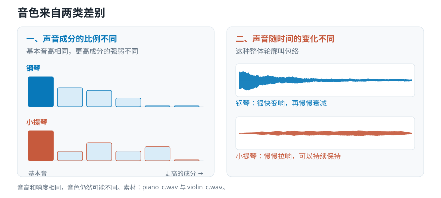

# 音量一样，为什么听起来不一样？——分贝、响度与音色

> **导读：** 音量条没动，换一首歌却明显更吵。这不是错觉：**仪器量到的数字，和耳朵听到的响度，本来就不是一回事。** 本文会做一个实验——两段声音的数值精确相同，听感指标却差了 3.6，因为一段的能量集中在低处，另一段摊满了高频。**把这两种数混着用，你就会把"录得响"当成"听起来响"，据此调出来的东西全是偏的。** 从声源到耳朵之间的六个量——声功率、声强、声压、分贝、响度、音色——本文逐个说清各自管什么、什么时候不能互换。

<picture>
  <source media="(max-width: 640px)" srcset="../../零基础版_01-05/figures/mobile/00-course-position-03.svg">
  
</picture>

## 这一课在拆什么

简单来说：从声源到你的耳朵之间隔着好几层，日常全都叫“声音有多大”，其实是六个互不等价的量。

它解决什么问题？只要你要拿一个数字说“这个声音更响”，就必须知道自己说的是哪一层。说错一层，结论就站不住。

六层依次是：**声功率**（声源每秒放出多少能量）→ **声强**（传到这个位置每平方米通过多少）→ **声压**（麦克风真正量到的压力变化）→ **分贝**（把两个量的比值写成对数的一种记法）→ **响度**（听觉给出的判断）→ **音色**（高低和响度都对齐之后，还剩下的那点差别）。前三个是物理量，第四个是记法，后两个是感觉。

```text
混用的后果：
  测出 RMS 相同 → 说“一样响” → 用户反馈其中一个吵得多 → 查不出原因

分清之后：
  RMS 相同 → 但频率分布不同 → 中高频多的那个听起来更响 → 该换听感相关的指标
```

想象一下灯泡。**60 瓦**是灯泡自己每秒放出多少能量，和你站在哪儿无关；**桌上那张纸有多亮**取决于你离多远；**照度计上的读数**是仪器在那个位置量到的。三件事，三个数，日常都说“这灯很亮”。声音一模一样。

类比到此为止。下面是六个量各自的定义。

## 为什么必须分清

| 量 | 描述谁 | 换个位置会变吗 | 单位 |
|---|---|---|---|
| 声功率 | 声源 | 不会 | 瓦特 |
| 声强 | 某个位置 | 会 | W/m² |
| 声压 | 某个位置 | 会 | 帕斯卡 |
| 分贝 | 两个量的比 | 看参考值 | dB（无量纲） |
| 响度 | 听者 | 会 | 宋 / 方 / LUFS |
| 音色 | 听者 | 基本不会 | 无单一标度 |

**什么时候必须在意：** 跨录音比较、写报告给别人看、任何要下“更响”结论的场合。

**什么时候可以粗糙一点：** 同一条录音链路内部做相对比较。这时候只要口径一致，用哪个量都能排出顺序。

**特别注意 dB 这一行。** 它是唯一一个“看参考值”的量，也是实践中出错最多的地方——下面单开一节讲。

## 从声源到耳朵的链条

<picture>
  <source media="(max-width: 640px)" srcset="../../零基础版_01-05/figures/mobile/03-lamp-analogy.svg">
  
</picture>

*图 1：三张卡片的图案分别是灯泡在发光、光向外扩散、仪表在读数。同一件事的三个环节，量到的是三个不同的东西。*

```text
声源每秒放出多少能量          → 声功率（瓦特）
        ↓ 能量摊在越来越大的球面上
到这个位置每平方米通过多少     → 声强（W/m²）
        ↓ 麦克风响应的是压力变化，不是能量
这个位置的空气压力变化多大     → 声压（帕斯卡）
        ↓ 范围太大，改写成对数
写成好读的数字                → 分贝（相对某个参考值）
        ↓ 耳朵对不同频率的敏感度不一样
听起来有多响                  → 响度
        ↓ 减掉高低和响度之后还剩下的
听起来像什么乐器              → 音色
```

- **声功率**描述声源，走远两步也不会变。
- **声强**描述某个位置，同一份能量摊得越开就越小。
- **声压**是麦克风真正响应的东西——它感受的是压力变化，不是能量。
- **分贝**不是一个量，是一种**记法**：把两个量的比值写成对数。
- **响度**和**音色**是听觉的输出，没有公式能从前面几个量直接算出来。

## 核心概念一：距离翻倍，掉到四分之一

**它是什么：** 声源放出的能量摊在一个不断长大的球面上。球面积和半径的平方成正比，所以半径变 2 倍，面积变 4 倍，每平方米就只剩四分之一。

<picture>
  <source media="(max-width: 640px)" srcset="../../零基础版_01-05/figures/mobile/03-distance.svg">
  
</picture>

*图 2：左边一格、右边四格，面积差四倍，可两边装的是同样多的能量——所以每格只剩四分之一，而不是一半。*

$$
I(r) = \frac{P}{4\pi r^2}
$$

**最小例子：** 取声功率 $P = 1$ W。

```python
import numpy as np

for r in (1, 2, 4):
    print(f"r={r} m: I = {1 / (4 * np.pi * r ** 2):.4f} W/m^2")
```

```text
r=1 m: I = 0.0796 W/m^2
r=2 m: I = 0.0199 W/m^2
r=4 m: I = 0.0050 W/m^2
```

1 米到 2 米，从 0.0796 掉到 0.0199——正好四分之一，不是一半。这条规律叫**平方反比**。

**常见错误：直接套用到房间里。** 公式只在**自由场**（周围没有墙面反射的空间）、而且声源小到可以当作一个点、还向各方向均匀发声时才成立。房间里墙面反射会补回来一部分，音箱通常也有指向性，所以**室内实测的衰减总是小于理论值**。用理论值去校准室内测量，会一直对不上。

## 核心概念二：分贝是比值，不是大小

**它是什么：** 耳朵能处理的范围大得惊人——刚能听见和会让人疼痛之间，能量相差约一万亿倍。把 0.000000000001 和 1 写在同一张表上没法看，于是改用对数记法。

<picture>
  <source media="(max-width: 640px)" srcset="../../零基础版_01-05/figures/mobile/03-decibel.svg">
  
</picture>

*图 3：横轴每往右一格就是十倍，纵轴却只往上走 30。从“刚能听见”到“接近疼痛”，能量差了一万亿倍，画成分贝不过是一条直线。*

两个常用定义：

$$
L_I = 10\log_{10}\frac{I}{I_0}\ \mathrm{dB}, \qquad I_0 = 10^{-12}\ \mathrm{W}/\mathrm{m}^2
$$

$$
L_p = 20\log_{10}\frac{p_{\mathrm{rms}}}{p_0}\ \mathrm{dB\ SPL}, \qquad p_0 = 20\ \mu\mathrm{Pa}
$$

为什么一个用 10 一个用 20？因为声强正比于声压的**平方**，取对数把平方变成乘 2，于是 $10\times 2 = 20$。判断规则：比较**功率类**的量用 10，比较**幅度类**的量用 20。

**最小例子：** 算三段音乐的电平。

```python
import librosa, numpy as np

for name in ["debussy.wav", "duke.wav", "redhot.wav"]:
    z, sr = librosa.load(name, sr=22050, mono=True)
    rms = float(np.sqrt(np.mean(z ** 2)))
    print(f"{name:12s} RMS={rms:.4f}  dBFS={20 * np.log10(rms):.1f}")
```

```text
debussy.wav  RMS=0.0707  dBFS=-23.0
duke.wav     RMS=0.0799  dBFS=-22.0
redhot.wav   RMS=0.0925  dBFS=-20.7
```

摇滚比钢琴高 2.3 dB。**这个数字不能说成“摇滚响 2.3 分贝”**——它是相对满幅的，不是相对听阈的。

**常见错误：把 dBFS 当成 dB SPL。**

- **dB SPL** 参考空气中约定的一个极小压力值，和真实世界的响亮程度挂钩。
- **dBFS** 参考这个数字系统能表示的最大值，0 代表已经到顶，所以通常是负数。

**两者不能互相换算**，除非录音链路做过声学标定。看到 $-12\ \mathrm{dB}$ 就说“这声音很轻”，没有依据。

## 核心概念三：响度是听觉的判断

**它是什么：** 耳朵不平等地接收所有频率。它对中高频比较敏感，对很低的低频不那么敏感。所以两段测得数值相近的声音，只要频率分布不同，听感就可能明显有别。

摇滚曲目通常中高频成分更密——这就是音量条没动它却更吵的原因。

工程上常用**均方根**（RMS）概括一段波形整体有多大：每个采样值平方、求平均、再开方。怎么算是[第 09 课](../../零基础版_06-10/09-RMS与过零率怎么计算-用整体强弱和翻越零线次数检查声音.md)的主题。这里只用它的一条性质：

**RMS 只看波形数值，完全不知道人耳对哪些频率更敏感。**

**常见错误：拿 RMS 相同当成听起来一样响。** 下面 Hello World 就是这个错误的实验版。

## 环境准备

和前两课相同：

```bash
pip install numpy librosa
```

版本：Python 3.12.10 / numpy 2.5.2 / librosa 1.0.0。

## Hello World：两个 RMS 完全相同的声音

**Step 1 — 造一条 220 Hz 正弦**

```python
import numpy as np, librosa

sr = 16000
t = np.arange(sr) / sr
sine = np.sin(2 * np.pi * 220 * t)
```

**Step 2 — 造一段白噪声，并把 RMS 对齐到正弦**

```python
rng = np.random.default_rng(0)
noise = rng.standard_normal(sr)
noise *= np.sqrt(np.mean(sine ** 2)) / np.sqrt(np.mean(noise ** 2))
```

**Step 3 — 量三个指标**

```python
for name, y in {"正弦": sine, "白噪声": noise}.items():
    print(f"{name}: RMS={np.sqrt(np.mean(y ** 2)):.4f} "
          f"质心={float(librosa.feature.spectral_centroid(y=y, sr=sr).mean()):.0f}Hz "
          f"平坦度={float(librosa.feature.spectral_flatness(y=y).mean()):.4f}")
```

```text
正弦: RMS=0.7071 质心=229Hz 平坦度=0.0000
白噪声: RMS=0.7071 质心=3997Hz 平坦度=0.5631
```

逐行看：

- 第二步那一行把噪声整体缩放，让它的 RMS 精确等于正弦的。**两者 RMS 一模一样：0.7071。**
- **质心**是能量在频率轴上的平均位置。229 Hz vs 3997 Hz——差 17 倍。噪声的能量摊在整个频段上，重心自然被拉到很高。
- **平坦度**衡量各个频率分布得有多均匀。正弦只有一个频率，平坦度 0.0000；白噪声到处都有，0.5631。

同一个 RMS，两段声音在频率上的样子完全不同。**这就是「RMS 相同 ≠ 听起来一样响」的机器版证据。**

注意这个实验的边界：它证明的是**计算特征不同**，不是“主观上一定谁更响”。要下听感结论，还得控制回放声级、房间条件和实验设计。

## 一层层加上去

### Level 1：一段声音的电平

上面做完了。

### Level 2：换成听感相关的指标

RMS 不够时，用广播和音频制作里的 **LUFS**。它在计算前先给信号加一道模拟人耳频率响应的滤波，所以两段 LUFS 相同的素材，听起来确实差不多响。

```bash
pip install pyloudnorm
```

```python
import pyloudnorm as pyln

meter = pyln.Meter(sr)
print(round(meter.integrated_loudness(sine), 1), "LUFS")
print(round(meter.integrated_loudness(noise), 1), "LUFS")
```

```text
-4.0 LUFS
-0.4 LUFS
```

**RMS 精确相同的两段，LUFS 差了 3.6。** 这 3.6 就是频率分布造成的听感差——RMS 完全看不到它，LUFS 因为算之前先加了一道模拟人耳的滤波，所以看得到。

### Level 3：把三段音乐拉到同一电平

```python
def normalize_rms(y, target_dbfs=-20.0):
    rms = np.sqrt(np.mean(y ** 2))
    return y * (10 ** (target_dbfs / 20) / max(rms, 1e-12))
```

这正是本课动手做要写的函数。**注意它做的是整段缩放**，波形的形状一点没变——摇滚还是更“满”，钢琴还是起伏更大。

### Level 4：音色——高低和响度都对齐之后剩下的

<picture>
  <source media="(max-width: 640px)" srcset="../../零基础版_01-05/figures/mobile/03-timbre.svg">
  
</picture>

*图 4：左边的柱子来自真实录音的频谱——钢琴的成分一路递减，小提琴却是第三、第五根特别强，两者音高完全相同。右边两条包络同样来自真实录音：钢琴一敲就到顶再衰减，小提琴一直保持。*

音色不是一个单一的量，它主要来自两方面：

- **成分比例。** 一个乐器发出的音不只有那个基本的高低，还带着一串更高的成分，它们之间的强弱比例各乐器都不同。
- **随时间变化的方式。** 钢琴一敲就到最响然后衰减，小提琴可以慢慢变响并保持。这个“怎么开始、怎么结束”的轮廓叫**包络**。很多时候去掉起音那零点几秒，人反而认不出是什么乐器。

## 工程上会咬人的几件事

**边界：`log10(0)` 是负无穷。** 静音段的 RMS 是 0，直接取对数会得到 `-inf`，一路污染后面的均值。永远写成 `20 * np.log10(max(rms, 1e-12))`。

**数值：先归一化还是先算特征，结果不同。** 逐帧归一化会把“忽强忽弱”这个信息彻底抹掉。要统一电平，就整段统一，不要逐帧。

**可复现：电平基准要写下来。** `target_dbfs=-20` 是个约定，不是标准。换成 −16 或 −23，所有幅度相关的特征都会整体平移。

## 常见问题

**Q1：最容易搞错什么？**

拿 dBFS 当 dB SPL 用。软件里显示 −12 dB，说的是“离削顶还有 12 dB”，和这段声音在房间里有多吵**没有任何关系**。

**Q2：声强和声压有什么区别？**

声强是每平方米通过多少能量（W/m²），声压是空气压力的变化（Pa）。麦克风响应的是声压。两者的关系是声强正比于声压的平方——这就是分贝公式里一个用 10 一个用 20 的原因。

**Q3：怎么排查？**

1. 打印 RMS 的原始值，不要只看 dB。看到 `-inf` 就知道有静音段。
2. 归一化前后各画一次波形。形状应该完全一样，只是整体缩放。形状变了说明用错了函数。
3. 两段声音“RMS 相同但听感不同”时，先算质心和平坦度，通常能立刻看出差在哪。

**Q4：实际项目里最该注意什么？**

**先统一电平，再提取特征。** 否则分类器很可能学到的是“谁录得响”，而不是你想要的差别。这是本课动手做的全部意义。

## 速查表

| 概念 | 含义 | 关键代码 |
|---|---|---|
| 声功率 | 声源每秒放出多少能量（W） | — |
| 声强 | 每平方米通过多少（W/m²） | `P / (4*np.pi*r**2)` |
| 声压 | 空气压力变化（Pa），麦克风量的 | — |
| 平方反比 | 距离翻倍，声强剩四分之一 | 仅自由场成立 |
| dB SPL | 相对听阈，和真实响亮挂钩 | `20*np.log10(p/20e-6)` |
| dBFS | 相对满幅，0 = 到顶 | `20*np.log10(rms)` |
| RMS | 波形整体有多大 | `np.sqrt(np.mean(y**2))` |
| LUFS | 加了人耳加权的响度 | `pyln.Meter(sr).integrated_loudness(y)` |
| 频谱质心 | 能量在频率轴上的重心 | `librosa.feature.spectral_centroid` |
| 音色 | 成分比例 + 包络 | — |

## 接下来学什么

```text
数字为什么不等于听感（本课）
   ↓
这些数字本身是怎么来的 → 第 04 课：采样率与位深
   ↓
该从中算出什么 → 第 05 课
   ↓
怎么逐段算 → 第 06 课起
```

这一课留下一个很实际的后果：**把三段音乐交给程序之前，得先统一电平**。而电平这个数字本身能有多精细、能记到多小，取决于录音时定下的两个参数——下一课就说这两个。

<!-- exercise:start -->

## 动手做：第 3 步 · 把响度统一，别让音量冒充风格

课程项目《三首曲子，一个分类器》共 23 步，这是第 3 步。摇滚那段本来就录得更响。如果不处理，分类器学到的可能只是"谁的音量大"，而不是风格差别。

1. 算出三段音乐各自的均方根，换算成相对满幅的分贝值（dBFS）。
2. 在 `soundlab/io.py` 里加一个 `normalize_rms(y, target_dbfs=-20)`，把每段调整到同一个均方根电平。
3. 统一前后各画一次三段的波形，放在一起对比。
4. 在笔记里写清楚：这一步删掉了什么信息，以及为什么这里可以删。

**做完应该有**：`normalize_rms` 函数，以及统一前后的对比图。

**自检**：统一之后，三段的均方根应该几乎相同（差别小于 0.1 dB），但波形的**形状**差别仍在——摇滚仍然更"满"，古典仍然起伏更大。如果形状也变得差不多了，说明你误用了逐帧归一化。

上一步：[第 02 课 · 把音频读成一串数字](02-波形频率与音高-声音曲线记录了什么.md)　·　下一步：[第 04 课 · 锁死预处理参数](04-采样率与位深-44.1kHz和16bit决定了什么.md)　·　[项目全貌](../../课程项目/README.md)

<!-- exercise:end -->
