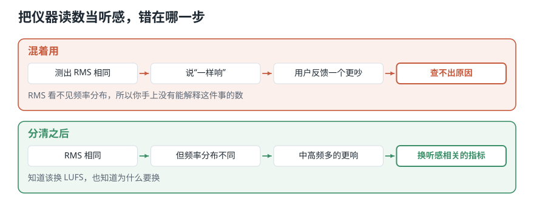

# 音量一样，为什么听起来不一样？——分贝、响度与音色

> **导读：** 音量条没动，换一首歌却明显更吵。这不是错觉：**仪器量到的数字，和耳朵听到的响度，本来就不是一回事。** 本文会做一个实验——两段声音的数值精确相同，听感指标却差了 3.6，因为一段的能量集中在低处，另一段摊满了高频。**把这两种数混着用，你就会把“录得响”当成“听起来响”，据此调出来的东西全是偏的。** 从声源到耳朵之间的六个量——声功率、声强、声压、分贝、响度、音色——本文逐个说清各自管什么、什么时候不能互换。

<picture>
  <source media="(max-width: 640px)" srcset="../../零基础版_01-05/figures/mobile/00-course-position-03.svg">
  
</picture>

## 「声音有多大」其实是六个不同的量

简单来说：从声源到你的耳朵之间隔着好几层，每一层都能量出一个数。日常我们把这些数全都叫“声音有多大”，但它们互相不能换着用。

分清这六个量能解决什么问题？只要你要拿一个数字说“这个声音更响”，你就得说清这个数字量的是哪一层。层说错了，后面的结论就不成立。

六层依次是：**声功率**（声源每秒放出多少能量）→ **声强**（传到这个位置每平方米通过多少）→ **声压**（麦克风真正量到的压力变化）→ **分贝**（把两个量的比值写成对数的一种记法）→ **响度**（听觉给出的判断）→ **音色**（高低和响度都对齐之后，还剩下的那点差别）。前三个是物理量，第四个是记法，后两个是感觉。

<picture>
  <source media="(max-width: 640px)" srcset="../../零基础版_01-05/figures/mobile/03-mixup-cost.svg">
  
</picture>

*图 1：上面那条路查不出原因——手上那个读数看不见声音的高低分布；下面那条路知道该换成什么指标。*

想象一下灯泡。**60 瓦**是灯泡自己每秒放出多少能量，和你站在哪儿无关；**桌上那张纸有多亮**取决于你离灯多远；**照度计上的读数**是仪器在那个位置量到的。三件事，三个数，日常都说“这灯很亮”。

声音也分这三层：音箱自己每秒放出多少能量，是**声功率**（对应 60 瓦）；这份能量传到你站的位置还剩多少，是**声强**（对应纸有多亮）；麦克风在那个位置量到的读数，是**声压**（对应照度计）。

类比到此为止。下面是六个量各自的定义。

## 为什么必须分清

| 量 | 描述谁 | 换个位置会变吗 | 单位 |
|---|---|---|---|
| 声功率 | 声源 | 不会 | 瓦特 |
| 声强 | 某个位置 | 会 | W/m² |
| 声压 | 某个位置 | 会 | 帕斯卡 |
| 分贝 | 两个量的比 | 看参考值 | dB（无量纲） |
| 响度 | 听者 | 会 | 宋 / 方 / LUFS |
| 音色 | 听者 | 基本不会 | 无单一标度 |

**什么时候必须在意：** 跨录音比较、写报告给别人看、任何要下“更响”结论的场合。

**什么时候可以粗糙一点：** 同一条录音链路内部做相对比较。这时候只要口径一致，用哪个量都能排出顺序。

**特别注意 dB 这一行。** 它是唯一一个“看参考值”的量，也是实践中出错最多的地方——下面单开一节讲。

## 从声源到耳朵的链条

<picture>
  <source media="(max-width: 640px)" srcset="../../零基础版_01-05/figures/mobile/03-lamp-analogy.svg">
  
</picture>

*图 2：三张卡片的图案分别是灯泡在发光、光向外扩散、仪表在读数。同一件事的三个环节，量到的是三个不同的东西。*

<picture>
  <source media="(max-width: 640px)" srcset="../../零基础版_01-05/figures/mobile/03-loudness-chain.svg">
  
</picture>

*图 3：前三个是物理量，第四个只是一种记法，后两个是感觉。日常说的「声音有多大」把六个混在一起说。*

- **声功率**描述声源，走远两步也不会变。
- **声强**描述某个位置，同一份能量摊得越开就越小。
- **声压**是麦克风真正量到的东西：空气推动振膜，振膜量下来的是压力的变化，不是能量。
- **分贝**不是一个量，是一种**记法**：把两个量的比值写成对数。
- **响度**和**音色**是听觉的输出，没有公式能从前面几个量直接算出来。

## 核心概念一：距离翻倍，掉到四分之一

**它是什么：** 声源放出的能量摊在一个不断长大的球面上。球面积和半径的平方成正比，所以半径变 2 倍，面积变 4 倍，每平方米就只剩四分之一。

<picture>
  <source media="(max-width: 640px)" srcset="../../零基础版_01-05/figures/mobile/03-distance.svg">
  
</picture>

*图 4：左边一格、右边四格，面积差四倍，可两边装的是同样多的能量——所以每格只剩四分之一，而不是一半。*

$$
I(r) = \frac{P}{4\pi r^2}
$$

**最小例子：** 取声功率 $P = 1$ W。

```python
import numpy as np

for r in (1, 2, 4):
    print(f"r={r} m: I = {1 / (4 * np.pi * r ** 2):.4f} W/m^2")
```

```text
r=1 m: I = 0.0796 W/m^2
r=2 m: I = 0.0199 W/m^2
r=4 m: I = 0.0050 W/m^2
```

1 米到 2 米，声强从 0.0796 掉到 0.0199——正好剩四分之一，不是一半。这条规律叫**平方反比**。所以你把麦克风从 1 米挪到 2 米重录一遍，同一个声源录下来的幅度会掉一大截；这时候两段录音的绝对数值已经没法直接比了，差的是距离，不是声源。

**常见错误：直接套用到房间里。** 公式只在**自由场**（周围没有墙面反射的空间）、而且声源小到可以当作一个点、还向各方向均匀发声时才成立。房间里墙面反射会补回来一部分，音箱通常也有指向性，所以**室内实测的衰减总是小于理论值**。用理论值去校准室内测量，会一直对不上。

## 核心概念二：分贝是比值，不是大小

上一课说过，耳朵比较频率是按倍数的（440 到 880、880 到 1760，都算一个八度）。**强度这边完全一样，而且倍数还要夸张得多。**

**它是什么：** 耳朵能处理的范围大得惊人——刚能听见和会让人疼痛之间，能量相差约一万亿倍。把 0.000000000001 和 1 写在同一张表上没法看，于是改用对数记法。

<picture>
  <source media="(max-width: 640px)" srcset="../../零基础版_01-05/figures/mobile/03-decibel.svg">
  
</picture>

*图 5：横轴每往右一格就是十倍，纵轴却只往上走 30。从“刚能听见”到“接近疼痛”，能量差了一万亿倍，画成分贝不过是一条直线。*

两个常用定义：

$$
L_I = 10\log_{10}\frac{I}{I_0}\ \mathrm{dB}, \qquad I_0 = 10^{-12}\ \mathrm{W}/\mathrm{m}^2
$$

$$
L_p = 20\log_{10}\frac{p_{\mathrm{rms}}}{p_0}\ \mathrm{dB\ SPL}, \qquad p_0 = 20\ \mu\mathrm{Pa}
$$

为什么一个用 10 一个用 20？因为声强正比于声压的**平方**，取对数把平方变成乘 2，于是 $10\times 2 = 20$。判断规则：比较**功率类**的量用 10，比较**幅度类**的量用 20。

记住一个换算就够用：**声强每翻一倍，强度级大约涨 3 dB**（因为 $10\log_{10}2 \approx 3.01$）。所以「+3 dB」不是「大一点点」，是**能量翻倍**；换成幅度类的量，翻倍是 **+6 dB**。

**最小例子：** 算三段音乐的电平。

```python
import librosa, numpy as np

for name in ["debussy.wav", "duke.wav", "redhot.wav"]:
    z, sr = librosa.load(name, sr=22050, mono=True)
    rms = float(np.sqrt(np.mean(z ** 2)))
    print(f"{name:12s} RMS={rms:.4f}  dBFS={20 * np.log10(rms):.1f}")
```

```text
debussy.wav  RMS=0.0707  dBFS=-23.0
duke.wav     RMS=0.0799  dBFS=-22.0
redhot.wav   RMS=0.0925  dBFS=-20.7
```

摇滚比钢琴高 2.3 dB。**这个数字不能说成“摇滚响 2.3 分贝”**——它是相对满幅的，不是相对听阈的。

**常见错误：把 dBFS 当成 dB SPL。**

- **dB SPL** 参考空气中约定的一个极小压力值，和真实世界的响亮程度挂钩。
- **dBFS** 参考这个数字系统能表示的最大值，0 代表已经到顶，所以通常是负数。

**两者不能互相换算**，除非录音链路做过声学标定。看到 $-12\ \mathrm{dB}$ 就说“这声音很轻”，没有依据。

## 核心概念三：响度是听觉的判断

**它是什么：** 响度是人对声强的**主观**判断，不是仪器读数。它有单位，叫**方**（phon）；但它同时取决于三件和声强无关的事：这个声音的**频率**、**持续多久**、以及**听的人多大年纪**。

先给两条边界。人能听见的最弱的声音，声强约 $10^{-12}\ \mathrm{W/m^2}$，叫**听阈**——上一节那个 0 dB 的参考值就是它。让人感到疼痛的强度大约是 $1\ \mathrm{W/m^2}$，叫**痛阈**。**两者相差一万亿倍**，而这一万亿倍的范围，耳朵是一路听下来的。

人耳对不同频率的敏感程度不一样：同样的能量放在中高频，人听着就比放在很低的低频要响。把「多大声强的这个频率，听起来和 1000 Hz 的多少分贝一样响」画成一族曲线，就是**等响曲线**——它们在低频那头明显往上翘，意思是低音要更多能量才能听着一样响。

摇滚曲目的能量通常更多堆在中高频——音量条没动，你却觉得换了这首更吵，原因就在这里。

工程上常用**均方根**（RMS）概括一段波形整体有多大：每个采样值平方、求平均、再开方。怎么算是[第 09 课](09-RMS与过零率怎么计算-用整体强弱和翻越零线次数检查声音.md)的主题。这里只用它的一条性质：

**RMS 只看波形数值，完全不知道人耳对哪些频率更敏感。**

**常见错误：拿 RMS 相同当成听起来一样响。** 下面的动手实验就是这个错误的实验版。

## 核心概念四：音色是三件事，不是一件

**它是什么：** 把音高、响度、时长三样都对齐之后，两个声音**仍然**听得出不一样——剩下的这点差别就是**音色**。日常形容它的词都是借来的：明亮、暗、闷、刺、温暖。

这个定义有个好处：它直接告诉你怎么做实验——**先把别的都控制住，剩下的就是它**。下面的实验用小提琴和萨克斯：两段录音是同一个音（C4），统一电平之后均方根完全相同，听起来却谁都不会认错。

音色不是一个能用一个数说清的量。它至少由**三件独立的事**合成：

| | 是什么 | 怎么量 |
|---|---|---|
| **包络** | 声音怎么开始、怎么持续、怎么结束 | 逐帧的最高峰连成的那条外轮廓 |
| **泛音分布** | 除了那个基本的高低，还有哪些成分、各占多少 | 各个整数倍频率上的强度 |
| **调制** | 强弱或高低本身在不在有规律地抖 | 包络自己的起伏快慢 |

### 包络：Attack-Decay-Sustain-Release

一个音从出现到消失，通常分四段：**起音**（Attack，从无声冲到最响）、**衰减**（Decay，从峰值退到一个稳定值）、**保持**（Sustain，停在那里）、**释放**（Release，松手之后落回无声）。工程上按四段的首字母叫它 **ADSR**。

钢琴一敲就到顶，然后一路衰减，没有保持；小提琴可以慢慢拉响并一直保持。**很多时候把起音那零点几秒切掉，人反而认不出是什么乐器**——起音段携带的信息比想象中多。

### 泛音分布：基频和它的整数倍

一个乐器发出的从来不是一条干净的正弦。它是**很多条正弦叠在一起**，每一条叫一个**分音**；其中最低的那条叫**基频**，决定你听到的音高。如果某条分音的频率正好是基频的整数倍，就叫**泛音**。

- 基频的整数倍全都对得上的乐器叫**谐波乐器**：弦乐、管乐、人声。它们有明确的音高。
- 对不上的叫**非谐波乐器**：钹、锣、多数鼓。它们的音高含糊甚至说不出来。

**同一个音高，泛音分布不同，听起来就完全不同**——下面的实验会把小提琴、萨克斯、钢琴的分布量出来。

### 调制：抖动本身也是音色

高低周期性地抖，叫**揉弦**（vibrato）；强弱周期性地抖，叫**颤音**（tremolo）。两者都不改变这个音的音高和平均响度，**只改变听感**。课程素材里的 `tremolo.wav` 就是专门给这一条准备的。

**常见错误：把音色当成一个可以直接算出来的数。** 没有哪个函数返回「音色」。你只能分别去量它的三个来源——而这三个来源分别落在第 08 课（包络）、第 10 课起（泛音分布）和第 21—23 课（频谱统计）。**「音色」是一个要用一组特征去逼近的目标，不是一个特征。**


## 动手实验：两个 RMS 完全相同的声音

**这一节要做的事：** 造两段 **RMS 精确相同**的声音——一条纯正弦和一段白噪声——再用三个指标去量它们。目的是坐实一句话：**RMS 相同不等于听起来一样响。** 最后把三段音乐拉到同一电平，为后面几课的特征提取做准备。

环境和音频素材装一次就够，见[课程总纲的「动手之前」](../../课程总纲/README.md)。本课完整代码在 [`课程代码/lessons/lesson03_loudness.py`](../../课程代码/lessons/lesson03_loudness.py)，下面每个数字都能在它的输出里找到；脚本比正文更全。

### 第 1 步 — 造一条 220 Hz 正弦

```python
import numpy as np, librosa

sr = 16000
t = np.arange(sr) / sr
sine = np.sin(2 * np.pi * 220 * t)
```

### 第 2 步 — 造一段白噪声，并把 RMS 对齐到正弦

```python
rng = np.random.default_rng(0)
noise = rng.standard_normal(sr)
noise *= np.sqrt(np.mean(sine ** 2)) / np.sqrt(np.mean(noise ** 2))
```

### 第 3 步 — 量三个指标

```python
for name, y in {"正弦": sine, "白噪声": noise}.items():
    print(name)
    print("  RMS  ", round(float(np.sqrt(np.mean(y ** 2))), 4))
    print("  质心 ", round(float(librosa.feature.spectral_centroid(y=y, sr=sr).mean())), "Hz")
    print("  平坦度", round(float(librosa.feature.spectral_flatness(y=y).mean()), 4))
```

```text
正弦
  RMS   0.7071
  质心  229 Hz
  平坦度 0.0
白噪声
  RMS   0.7071
  质心  4001 Hz
  平坦度 0.561
```

逐行看：

- 第二步那一行把噪声整体缩放，让它的 RMS 精确等于正弦的。**两者 RMS 一模一样：0.7071。**
- **质心**是能量在频率轴上的平均位置。229 Hz 对 4001 Hz——差 17 倍。噪声的能量摊在整个频段上，重心自然被拉到很高。
- **平坦度**衡量各个频率分布得有多均匀。正弦只有一个频率，平坦度 0.0；白噪声到处都有，0.561。

两段声音的 RMS 一模一样，在频率上的分布却完全不同。**这就是「RMS 相同不等于听起来一样响」的证据：RMS 这个数字量不到频率分布，所以它给不出听感的结论。**

注意这个实验的边界：它证明的是**计算特征不同**，不是“主观上一定谁更响”。要下听感结论，还得控制回放声级、房间条件和实验设计。

### Level 1：一段声音的电平

上面做完了。

### Level 2：换成听感相关的指标

RMS 不够时，用广播和音频制作里的 **LUFS**。它在计算前先给信号加一道模拟人耳频率响应的滤波，所以两段 LUFS 相同的素材，听起来确实差不多响。

```bash
pip install pyloudnorm
```

```python
import pyloudnorm as pyln

meter = pyln.Meter(sr)
print(round(meter.integrated_loudness(sine), 1), "LUFS")
print(round(meter.integrated_loudness(noise), 1), "LUFS")
```

```text
-4.0 LUFS
-0.4 LUFS
```

**RMS 精确相同的两段，LUFS 差了 3.6。** 这 3.6 就是频率分布造成的听感差——RMS 完全看不到它，LUFS 因为算之前先加了一道模拟人耳的滤波，所以看得到。

### Level 3：把三段音乐拉到同一电平

```python
def normalize_rms(y, target_dbfs=-20.0):
    rms = np.sqrt(np.mean(y ** 2))
    return y * (10 ** (target_dbfs / 20) / max(rms, 1e-12))
```

它已经收在 `soundlab/io.py` 里，后面每一课都会用到（[第 07 课](07-振幅包络RMS与过零率-不用频谱能看出什么.md)会用它做一个关键的对照实验）。**注意它做的是整段缩放**，波形的形状一点没变——摇滚还是更“满”，钢琴还是起伏更大。

### Level 4：把音色的三件事各量一遍

先确认这一对素材真的把音高和响度都控制住了：

```text
             时长     基频 Hz     编号     统一后 RMS   包络峰值出现在
  小提琴    2.71s     260.3      59.9      0.1000          54%
  萨克斯    1.31s     261.7      60.0      0.1000           4%
  钢琴      1.54s     528.4      72.2      0.1000           6%
```

**小提琴 59.9 和萨克斯 60.0 是同一个音（C4），统一电平之后均方根也精确相同——两个变量都锁住了。** 钢琴那一行是 72.2，高了整整一个八度，所以它不能进这一对比较（旧图注说钢琴和小提琴音高相同，那是错的）。

**第一件事，包络：** 萨克斯在整段的 4% 处就冲到最响，小提琴要到 54% 才到顶。一个是吹出来的，一个是拉出来的——「怎么开始、怎么持续」完全不同。

**第二件事，泛音分布**（跳过起音，取中间一段稳定的，量前 6 个整数倍频率相对基频的强度）：

| 乐器 | 基频 | 2 倍 | 3 倍 | 4 倍 | 5 倍 | 6 倍 |
|---|---|---|---|---|---|---|
| 小提琴 | 1.0 | **2.73** | 0.29 | 0.11 | 0.23 | 0.26 |
| 萨克斯 | 1.0 | **1.80** | 0.42 | 0.46 | 0.36 | 0.14 |
| 钢琴 | 1.0 | 0.43 | 0.08 | 0.08 | 0.01 | 0.00 |

**小提琴在 2 倍频率上的强度是基频的 2.7 倍，萨克斯 1.8 倍，钢琴只有 0.43 倍。** 也就是说钢琴的能量集中在基频本身，另外两件乐器把大量能量放在整数倍上——这正是「同一个音听起来完全不同」的来源之一。

**第三件事，调制：** `tremolo.wav` 全长 14.12 秒，它的包络自己在起伏，最强的起伏频率是 **0.57 Hz**（每 1.76 秒重复一次），起伏幅度 99%。而且 1.14、1.71、2.27 Hz 处也有峰——说明这个起伏不是平滑的正弦。

<picture>
  
</picture>

*图 6：最上面先确认前提——小提琴 59.9 和萨克斯 60.0 是同一个音，统一电平后 RMS 都是 0.1000，两个变量都锁住了。下面三格分别是音色的三个来源：①包络（萨克斯 4% 处到顶，小提琴 54%）、②泛音分布（小提琴的 2 倍频率是基频的 2.73 倍）、③调制（tremolo.wav 的包络每 1.76 秒起伏一次）。*

**这三个数分别落在后面三处：** 包络是[第 08 课](08-振幅包络怎么计算-从逐帧最大值到可靠时间轴.md)要写的函数，泛音分布要等[第 10 课](10-傅里叶变换的直觉-电脑怎样从复杂波形里找出频率.md)之后才算得出来，调制则要先有包络再对包络做一次频率分析。**音色不是一个特征，是一组特征要共同逼近的目标。**

## 这三处最容易把结果算错

**边界：`log10(0)` 是负无穷。** 静音段的 RMS 是 0，直接取对数会得到 `-inf`，一路污染后面的均值。永远写成 `20 * np.log10(max(rms, 1e-12))`。

**数值：先归一化还是先算特征，结果不同。** 逐帧归一化会把“忽强忽弱”这个信息彻底抹掉。要统一电平，就整段统一，不要逐帧。

**可复现：电平基准要写下来。** `target_dbfs=-20` 是个约定，不是标准。换成 −16 或 −23，所有幅度相关的特征都会整体平移。

## 常见问题

**Q1：最容易搞错什么？**

拿 dBFS 当 dB SPL 用。软件里显示 −12 dB，说的是“离削顶还有 12 dB”，和这段声音在房间里有多吵**没有任何关系**。

**Q2：声强和声压有什么区别？**

声强是每平方米通过多少能量（W/m²），声压是空气压力的变化（Pa）。麦克风响应的是声压。两者的关系是声强正比于声压的平方——这就是分贝公式里一个用 10 一个用 20 的原因。

**Q3：怎么排查？**

1. 打印 RMS 的原始值，不要只看 dB。看到 `-inf` 就知道有静音段。
2. 归一化前后各画一次波形。形状应该完全一样，只是整体缩放。形状变了说明用错了函数。
3. 两段声音“RMS 相同但听感不同”时，先算质心和平坦度，通常能立刻看出差在哪。

**Q4：实际项目里最该注意什么？**

**先统一电平，再提取特征。** 否则分类器很可能学到的是“谁录得响”，而不是你想要的差别。[第 07 课](07-振幅包络RMS与过零率-不用频谱能看出什么.md)把这件事量成了具体数字：不统一电平，摇滚的 RMS 是古典的 1.49 倍；统一之后变成 0.99 倍，那点差别原来全是录音电平。

## 速查表

| 概念 | 含义 | 关键代码 |
|---|---|---|
| 声功率 | 声源每秒放出多少能量（W） | — |
| 声强 | 每平方米通过多少（W/m²） | `P / (4*np.pi*r**2)` |
| 声压 | 空气压力变化（Pa），麦克风量的 | — |
| 平方反比 | 距离翻倍，声强剩四分之一 | 仅自由场成立 |
| dB SPL | 相对听阈，和真实响亮挂钩 | `20*np.log10(p/20e-6)` |
| dBFS | 相对满幅，0 = 到顶 | `20*np.log10(rms)` |
| RMS | 波形整体有多大 | `np.sqrt(np.mean(y**2))` |
| LUFS | 加了人耳加权的响度 | `pyln.Meter(sr).integrated_loudness(y)` |
| 频谱质心 | 能量在频率轴上的重心 | `librosa.feature.spectral_centroid` |
| 音色 | 包络 + 泛音分布 + 调制 | 三者分别在 08、10 起、21—23 |

## 两组三个词，别混

到这里第 02、03 两课合起来把「一个声音」说完了。**声音这个波本身有三个可测的量，人对它的感觉也有三个词，两组一一对应但不是一回事：**

| 波本身（可以量） | 人的感觉（要问人） | 讲在哪一课 |
|---|---|---|
| **频率**：一秒振动多少次 | **音高**：听起来多高 | [第 02 课](02-波形频率与音高-声音曲线记录了什么.md) |
| **强度**：振动携带多少能量 | **响度**：听起来多响 | 本课 |
| **音色**（波形形状）：包络、泛音分布、调制 | **音色**：听起来是什么乐器 | 本课 |

左边一列全都能用公式算，右边一列都要做听觉实验才知道。**这门课后面算的全是左边**——右边只在需要解释「为什么这个特征更接近人耳」时才出现（比如第 17 课的梅尔刻度）。混着用就会得出「RMS 相同所以一样响」这类结论，本课的实验已经把它证伪了。

## 接下来学什么

1. **本课**：数字为什么不等于听感。
2. **第 04 课**：这些数字本身是怎么来的。
3. **第 05 课**：该从中算出什么交给程序。
4. **第 06 课起**：把长序列切成小段，逐段计算。

这一课留下一个很实际的后果：**把三段音乐交给程序之前，得先统一电平**。而电平这个数字本身能有多精细、能记到多小，取决于录音时定下的两个参数——下一课就说这两个。
