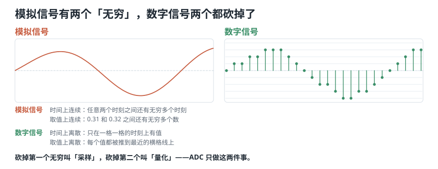
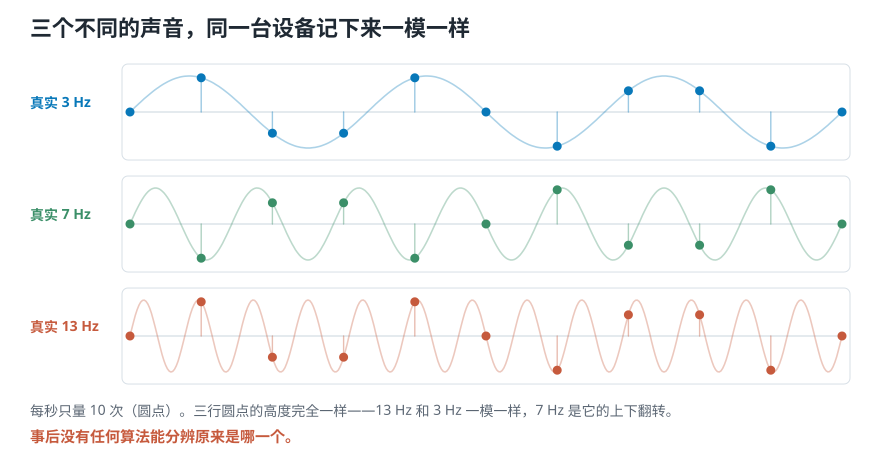
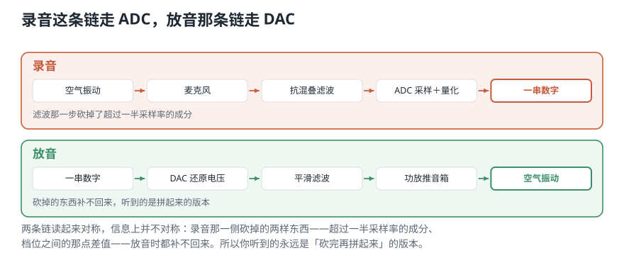

# 连续的声音，怎样变成一串数字又变回来？

> **导读：** 前两课讲的都是连续变化的东西——空气压力、频率、响度。可**计算机一样都存不下**：它存不了无穷多个时刻，也存不了无穷多种取值。这一课走完整条转换链：麦克风送出连续变化的电压 → 一个叫 ADC 的部件把它变成一串数字 → 计算成什么样都行 → 最后一个叫 DAC 的部件把数字变回连续电压，推动音箱。**ADC 只做两件事：多久量一次（采样），每次量得多细（量化）。** 这两件事各有各的代价，而且**性质完全不同：一件事后能补救，另一件永远补不回来。**

<picture>
  <source media="(max-width: 640px)" srcset="../../零基础版_01-05/figures/mobile/00-course-position-04.svg">
  
</picture>

## 麦克风送出来的，是连续变化的电压

麦克风前面的空气一紧一松地推着振膜，振膜跟着动，把这个机械运动变成**连续变化的电压**。这种「任何一个瞬间都有值、值可以是任意小数」的信号，叫**模拟信号**。

模拟信号有两个「无穷」：

- **时间上是连续的**：任意两个时刻之间，还有无穷多个时刻。
- **取值上是连续的**：0.31 和 0.32 之间，还有无穷多个可能的数。

## 麻烦来了：计算机两个无穷都存不下

计算机的存储是有限的。它没法存下无穷多个时刻，也没法给每个瞬间存一个无限精确的小数。

所以要把模拟信号变成**数字信号**——**时刻是有限个、每个取值也只能从有限个档位里挑一个**的信号。

<picture>
  <source media="(max-width: 640px)" srcset="../../零基础版_01-05/figures/mobile/04-analog-vs-digital.svg">
  
</picture>

*图 1：左边是模拟信号，一条不断的曲线；右边是数字信号，只在一格一格的时刻上有值，而且每个值都被推到最近的横格线上。两次「砍」各有名字，下一节就讲。*

## 从模拟到数字：ADC 做两件事

负责这次转换的部件叫 **ADC**（模数转换器，analog-to-digital converter）。它只做两件事：

1. **采样**：每隔固定的一小段时间量一次，记下当时的值。这一刀砍掉「时间上的无穷」。
2. **量化**：量到的值不原样保存，而是靠到有限个档位里最近的那一个。这一刀砍掉「取值上的无穷」。

这套「按固定间隔取值、每个值再靠到有限档位」的做法有个标准名字，叫**脉冲编码调制**，缩写 **PCM**。未压缩的 WAV 文件里存的就是这样一串 PCM 数据。

<picture>
  <source media="(max-width: 640px)" srcset="../../零基础版_01-05/figures/mobile/04-adc-order.svg">
  
</picture>

*图 2：真实的 ADC 在采样之前还有一步「先把太高的成分去掉」，图上叫抗混叠滤波。这一步的位置不能挪，下一节讲混叠时会看到为什么。*

## 第一件事：采样

**采样**就是每隔固定时间量一次。

- 两次测量之间的时间叫**采样周期**，记作 $T$。
- 一秒钟量多少次叫**采样率**，记作 $f_s$。两者互为倒数：$f_s = 1/T$。

44100 Hz 的意思就是一秒量 44100 次，采样周期 $T = 1/44100 \approx 22.7$ 微秒。

**第 $n$ 个采样点对应的时刻**是：

$$
t_n = n \cdot T = \frac{n}{f_s}
$$

这条式子后面一直要用：拿到第 12000 个采样点，想知道它是第几秒，就除以采样率。**所以呢？** 所以「第几个数」和「第几秒」之间是可以互相换算的——但换算要用采样率。采样率记错了，整条时间轴就错了，这也是第 01 课要把采样率固定下来的原因。

## 为什么偏偏是 44100 Hz

第 02 课量过：人耳大致能听到 20 Hz 到 20 kHz。要把接近 20 kHz 的成分记下来，采样率得多高？

答案由**奈奎斯特频率**给出：**采样率的一半**，记作 $f_s/2$，是采样之后还能无歧义表示的最高频率。反过来说：

$$
f_{s} > 2 f_{\max}
$$

- 要覆盖 20 kHz，采样率至少要 40 kHz。
- CD 用 44100 Hz，奈奎斯特频率是 **22050 Hz**，比 20 kHz 多出 2 kHz 余量。

**为什么要留这 2 kHz？** 因为真实的滤波器没法在某个频率上垂直截断，必须有一段**过渡带**慢慢降下去。把目标频带贴死在奈奎斯特边界上，过渡带就没地方放了。

## 混叠：采得不够勤，高音会变成假低音

如果信号里有超过 $f_s/2$ 的成分，会怎样？

先看一个你肯定见过的版本：看汽车广告时，车明明在往前开，车轮却像在**慢慢倒转**。摄像机每秒拍 24 张，如果辐条在两张之间转了 350 度，照片上看它就是**往回退了 10 度**。一张张连起来，轮子就像在倒转。轮子当然在正转，问题出在拍得太慢。

声音里的同一个现象叫**混叠**。用脚本量一次——用每秒 10 次的采样率去测三个不同的信号：

```text
真实  3 Hz -> 看起来像 3 Hz
真实  7 Hz -> 看起来像 3 Hz
真实 13 Hz -> 看起来像 3 Hz
（采样率都是每秒 10 次）
```

三个完全不同的信号，采样之后都变成了 3 Hz。再看采样点上的原始数值：

```text
 3 Hz: +0.000 +0.951 -0.588 -0.588 ...
 7 Hz: +0.000 -0.951 +0.588 +0.588 ...
13 Hz: +0.000 +0.951 -0.588 -0.588 ...
```

**3 Hz 和 13 Hz 的采样值完全相同；7 Hz 是 3 Hz 的相反数。**

<picture>
  <source media="(max-width: 640px)" srcset="../../零基础版_01-05/figures/mobile/04-alias-samples.svg">
  
</picture>

*图 3：细线是三个真实的信号，圆点是每秒 10 次的测量结果。13 Hz 那行圆点和 3 Hz 完全重合，7 Hz 是它的上下翻转。*

**所以呢？** 所以「无法区分」不是一句形容，是字面意思：**没有任何算法能从这 11 个数里还原出原来是哪一条。** 混叠一旦发生就不可修复——把文件转成更高的采样率只是增加点的数量，救不回已经没有的信息。

这正是 ADC 必须**先滤波再采样**的原因：宁可在采样之前就把超过 $f_s/2$ 的成分砍掉，也不能让它们折回来污染低频。

**最常见的一个错**：自己写 `y[::4]` 这种「每四个取一个」来降采样。脚本实测：

```text
原信号 300 Hz 幅度 1.0
     ＋ 8000 Hz 幅度 0.5
采样率 20000，降到 5000
一半是 2500，8000 会折回 2000

              300Hz   2000Hz
每 4 个取 1   1.0000   0.5000
先滤波再降     1.0000   0.0000
```

直接抽样那一行，**2000 Hz 处凭空冒出 0.50**——正是那个 8000 Hz 折回来的，而原信号在这个频率上本来什么都没有。它现在已经和真实的低频混在一起，事后分不出来。先滤波那一行是 0.0000。

`librosa.load(path, sr=16000)` 和 `scipy.signal.resample_poly` 内部都做了这道滤波；自己切片没有，而且**不会报任何错**。

## 第二件事：量化

采样解决了「多久量一次」。**量化**解决「每次量得多细」。

量到的电压是个任意小数，但只能存成有限个档位里的一个。**档位的个数由位深决定**：

- **位深**（bit depth，也叫分辨率）是每个采样值用多少个二进制位来存。
- $B$ 位能表示 $2^B$ 个档位：8 位 256 个，**16 位 65536 个**，24 位一千六百多万个。
- **CD 用的就是 16 位。**

<picture>
  <source media="(max-width: 640px)" srcset="../../零基础版_01-05/figures/mobile/04-levels.svg">
  
</picture>

*图 4：左图的蓝色阶梯是明显的大台阶，右图几乎贴着灰色原曲线走。档位数从 8 变成 32，改动量就差了这么多。*

拿一个数手算一遍。3 位有 8 个档位，把 −1 到 +1 均分，步长是 $2/(2^3-1) = 0.2857$：

```text
x = 0.37  ->  q = 0.4286   误差 -0.0586
```

**所以呢？** 这个 0.0586 就是量化误差。**和混叠不同，这个代价是渐变的**：档位粗一点只是每个数差一点点，不会把一个声音变成另一个声音。**这就是两处取舍性质不同的地方——采样率选错不可逆，位深选小只是不够精确。**

## 一分钟声音要占多少内存

未压缩 PCM 的码率是：

$$
R = f_s \times B \times C
$$

$C$ 是声道数。按 CD 的参数算：

```text
fs=44100  B=16  声道=2
码率 = 1411200 bit/s
10 分钟 = 105.84 MB
```

每秒 141 万比特。**所以呢？** 所以采样率翻一倍、或者位深从 16 换成 24，文件大小和后面每一步的计算量都跟着成正比地涨。这就是「不能把两个数字都往大里调」的实际代价。

## 动态范围与量化信噪比

**动态范围**指的是：**一个系统能记录的最大信号和最小信号之间差多少。** 位深越高，档位越细，能分辨的最小变化就越小，动态范围就越大。

把它写成一个数，就是**量化信噪比**（SQNR）——最大信号强度和量化误差之间的比值。对理想均匀量化器加满幅正弦输入：

$$
\mathrm{SQNR} \approx 6.02B + 1.76\ \mathrm{dB}
$$

脚本把理论值和实测值放在一起对过：

```text
   位深   理论 dB   实测 dB      差
    4     25.84     25.68   -0.16
    8     49.92     49.98   +0.06
   12     74.00     74.03   +0.03
   16     98.08     98.08   +0.00
```

**8 位以上时实测和理论几乎完全重合**；4 位时低了 0.16 dB，因为台阶太粗，「误差均匀分布在半个台阶内」这个前提开始不成立。

**所以呢？** 这条式子最值钱的不是那个 1.76，而是**斜率**：**位深每加 1 位，动态范围约多 6 dB。** 从 16 位换到 24 位，理论上多 48 dB。

但要注意：**这是理论上限，不是设备保证值。** 模拟前端的噪声、失真、时钟抖动都会让实测低于它。24 位的 146 dB 在任何真实设备上都达不到——这也是「位深调过头毫无收益」的原因：房间的环境声早就比最细的那个档位大得多了。

## 录音走 ADC，放音走 DAC

最后把整条链合上。

<picture>
  <source media="(max-width: 640px)" srcset="../../零基础版_01-05/figures/mobile/04-record-playback.svg">
  
</picture>

*图 5：上面一条是录音，下面一条是放音。两条链互为逆过程，但不是完全对称的——录音那条上有一步「滤波」，丢掉的东西放音时补不回来。*

**录音这条链：** 空气振动 → 麦克风变成连续电压 → 抗混叠滤波 → **ADC**（采样 + 量化）→ 一串数字存进文件。

**放音这条链：** 一串数字 → **DAC**（digital-to-analog converter，数模转换器）把它变回连续电压 → 平滑滤波 → 功放推动音箱 → 空气振动 → 你的耳朵。

两条链读起来对称，但**信息上不对称**：录音那一侧砍掉的两样东西——超过 $f_s/2$ 的成分、档位之间的那点差值——放音时都补不回来。**你听到的永远是「砍完之后再拼起来」的版本。**

## 这一课得到了什么，下一课接着讲什么

| | 采样 | 量化 |
|---|---|---|
| 决定什么 | 多久量一次（采样率 $f_s$） | 每次量得多细（位深 $B$） |
| 上限在哪 | 能无歧义记录到 $f_s/2$ | $2^B$ 个档位 |
| 出错的样子 | 高频**变成**另一个低频 | 每个数值差一点点 |
| 能不能补救 | **不能** | 能，只是误差大一点 |
| 代价 | 文件和计算量成正比涨 | 文件成正比涨 |

从第 01 课到这里，一段真实的声音已经变成了一串参数明确的数字：每秒多少个、每个多少档、共几个声道。可这串数字有几十万个，直接丢给分类程序并不合适。

[下一课](05-音频特征的分类-该从录音里算出什么交给模型.md)问的是：**从这几十万个数字里，到底该算出些什么交给程序？** 那一课会给出一张分类地图，把「音频特征」这件事按五个维度拆开。
