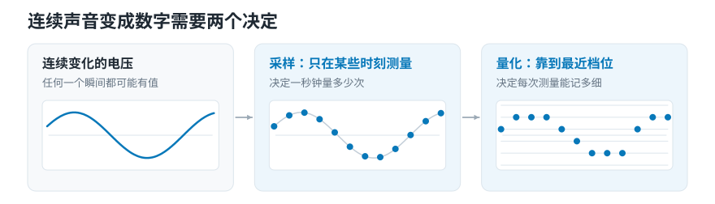
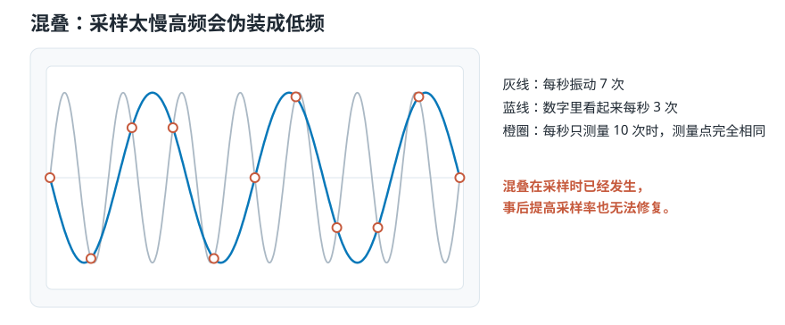
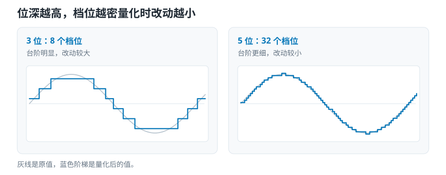
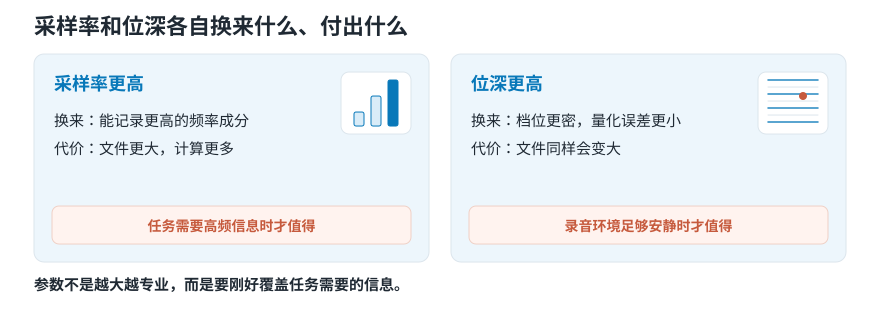

# 采样率和位深：电脑录音时定下的两个数

> **导读：** 电脑存不下连续的声音，只能做两件退让：**每隔一小段时间量一次**（采样率），**量到的数靠到最近的档位**（位深）。两件退让的代价完全不同——前者出错事后无法修复，后者只是精度差一点。本文用代码把第一种错误造出来给你看：3 Hz、7 Hz、13 Hz 会被同一台设备记成一模一样的数字。

<picture>
  <source media="(max-width: 640px)" srcset="../../零基础版_01-05/figures/mobile/00-course-position-04.svg">
  
</picture>

## 这两个数字是什么

简单来说：**计算机存不下连续的东西，只能做两件退让，这两个数字就是那两件退让的参数。**

- **采样率**（44100）：不是每时每刻都记，而是每秒量 44100 次。
- **位深**（16）：量到的数不原样保存，而是靠到 65536 个档位里最近的那个。

它解决什么问题？麦克风输出的是连续变化的电压——任何一个瞬间都有值，值可以是任意小数。计算机两样都存不下。

```text
连续世界：
  无穷多个时刻 × 无穷多个可能取值

数字录音：
  每秒 44100 个时刻 × 每个 65536 种取值
  → 一分钟立体声约 10.6 MB
```

想象一下拍视频。摄像机不连续记录，它每秒拍 24 张照片，放起来就像连续的。声音是同一回事，只是快得多——一秒要“拍”四万多次，而且每张照片的亮度只能取有限个档位。

类比到此为止。两件退让的代价**性质完全不同**，这才是这一课真正要说的。

## 为什么不能都往大里调

| | 采样率 | 位深 |
|---|---|---|
| 决定什么 | 能无歧义记录到多高的成分 | 每次测量的精度 |
| 出错的样子 | 高频**变成**另一个低频 | 数值有一点偏差 |
| 能不能事后补救 | **不能** | 能（只是误差大一点） |
| 调大的收益 | 只在真的需要更高成分时才有 | 只在录音链路够安静时才有 |
| 调大的代价 | 文件和计算量成正比增加 | 文件成正比增加 |

**什么时候该提高采样率：** 关注的成分确实超过当前的一半采样率。做超声、或者要捕捉极短的突变。

**什么时候不必：** 机械诊断只关心 4 kHz 以下，那 16 kHz 采样在滤波条件合适时通常就够了。

**什么时候该提高位深：** 录音现场很安静，量化档位的间隔已经成为最主要的误差来源。录音时常用 24 位，是为了把增益设得保守些、给突然变大的声音留余量。

**什么时候不必：** 房间环境声、麦克风自身的沙沙声已经比档位间隔大得多。这时候再细的档位，只是在更精确地记录这些杂音。

## 两件退让分别发生在哪

<picture>
  <source media="(max-width: 640px)" srcset="../../零基础版_01-05/figures/mobile/04-two-decisions.svg">
  
</picture>

*图 1：从左到右，同一条曲线先被打成一串孤立的点（只在某些时刻取值），再被推到横格线上（只能落在有限几个档位）。两步各丢掉一部分信息。*

```text
连续电压（任意时刻、任意取值）
        ↓
① 抗混叠滤波   先砍掉记不清楚的高频   ← 关键，且必须在采样之前
        ↓
② 采样         每 1/fs 秒量一次        ← 采样率登场
        ↓
一串孤立的数（时刻离散，取值仍连续）
        ↓
③ 量化         靠到最近的档位          ← 位深登场
        ↓
一串整数（时刻离散，取值也离散）
```

- **抗混叠滤波**是唯一一个“不做就没救”的步骤。它必须在采样**之前**，因为采样之后已经分不出真假了。
- **采样**决定时间轴有多密。
- **量化**决定纵轴有多细。

顺序不能换。这是这张流程图里最重要的一件事。

## 核心概念一：采样率与那个“两倍”

**它是什么：** 一秒钟测量多少次。44100 Hz 就是每秒 44100 次。

为什么偏偏是四万多？人耳通常能听到每秒振动 20 次到 20000 次。要保留接近两万次的变化，一秒测四万多次是数学上的最低要求：

$$
f_{\mathrm{s}} > 2f_{\max}
$$

$f_{\mathrm{s}}/2$ 叫 **Nyquist 频率**，是采样后能无歧义表示的最高频率。

这里的“两倍”不是为了正好抓住一个高点和一个低点，而是为了**让不同快慢的变化不至于留下完全相同的数字**。下一节就是这句话的实验。

**常见错误：把目标频带贴到 Nyquist 边界上。** 真实的抗混叠滤波器不可能在某个频率上垂直截断，必须留**过渡带**。这正是 CD 用 44.1 kHz 而不是刚好 40 kHz 来覆盖 20 kHz 的原因之一。

## 核心概念二：混叠

**它是什么：** 采样不够勤时，一个太高的成分会在数字里变成一个原本不存在的低音。

先看一个你肯定见过的版本。看汽车广告时，车明明在向前开，车轮却看起来在**慢慢倒转**。摄像机每秒拍 24 张，如果辐条在两张之间转了 350 度，照片上看它就是**往回退了 10 度**。一张张连起来，车轮就像在倒转。

轮子当然在正着转，问题出在拍得太慢。

<picture>
  <source media="(max-width: 640px)" srcset="../../零基础版_01-05/figures/mobile/04-aliasing.svg">
  
</picture>

*图 2：橙圈是每秒 10 次的测量点。它们同时落在灰线和蓝线上——只看这些点，无法判断原来是哪一条。*

伪装后的频率落在哪里，可以算：

$$
f_{\mathrm{alias}} = \min_{k \in \mathbb{Z}} \left|f - k f_{\mathrm{s}}\right|
$$

**常见错误：以为可以事后修复。** 伪装完成之后，这个假的低音和一个真的低音在数据里**长得完全一样**，没有任何办法区分。把文件“升级”到更高采样率只是增加点的数量，救不回已经丢失的信息。所以真实设备总是先滤波再采样——宁可不要那部分内容。

## 环境准备

和前三课相同：

```bash
pip install numpy
```

版本：Python 3.12.10 / numpy 2.5.2。本课不需要读音频文件。

## Hello World：让三个不同的频率变成同一个

**Step 1 — 写混叠公式**

```python
def alias(f, fs):
    k = round(f / fs)
    return abs(f - k * fs)
```

**Step 2 — 用 10 Hz 的采样率去测三个不同的信号**

```python
fs = 10.0
for f in (3, 7, 13):
    print(f"真实 {f:>2} Hz, fs={fs:.0f} -> 看起来像 {alias(f, fs):.0f} Hz")
```

```text
真实  3 Hz, fs=10 -> 看起来像 3 Hz
真实  7 Hz, fs=10 -> 看起来像 3 Hz
真实 13 Hz, fs=10 -> 看起来像 3 Hz
```

**Step 3 — 直接验证：三条曲线在采样点上完全重合**

```python
import numpy as np

n = np.arange(11)
for f in (3, 7, 13):
    vals = np.sin(2 * np.pi * f * n / fs)
    print(f"{f:>2} Hz:", " ".join(f"{v:+.3f}" for v in vals))
```

```text
 3 Hz: +0.000 +0.951 -0.588 -0.588 +0.951 +0.000 -0.951 +0.588 +0.588 -0.951 -0.000
 7 Hz: +0.000 -0.951 +0.588 +0.588 -0.951 +0.000 +0.951 -0.588 -0.588 +0.951 -0.000
13 Hz: +0.000 +0.951 -0.588 -0.588 +0.951 -0.000 -0.951 +0.588 +0.588 -0.951 +0.000
```

逐行看：

- **3 Hz 和 13 Hz 的采样值完全相同**（差别只在浮点的正负零）。13 Hz 高出 Nyquist 频率 5 Hz，落回来就成了 3 Hz。
- **7 Hz 是 3 Hz 的相反数**，也就是同一条 3 Hz 曲线相位翻转 180 度。它同样是 3 Hz，只是起点不同。
- 三行数字放在一起，就是“**无法区分**”的字面含义。没有任何算法能从这 11 个数里还原出原来是哪一条。

这就是混叠不可修复的全部原因。

## 一层层加上去

### Level 1：算出会不会混叠

上面做完了。判据只有一条：$f > f_s/2$ 就会。

### Level 2：第二件退让——量化

**位深**决定每次测量允许用多少个档位：8 位 256 个，16 位 65536 个，24 位一千六百多万个。

<picture>
  <source media="(max-width: 640px)" srcset="../../零基础版_01-05/figures/mobile/04-levels.svg">
  
</picture>

*图 3：左图的蓝色阶梯是明显的大台阶，右图几乎贴着灰色原曲线走。档位数从 8 变成 32，改动量就差了这么多。*

$B$ 位时，把 $-1$ 和 $+1$ 都当作网格端点的教学式量化器，步长为

$$
\Delta = \frac{2}{2^B - 1}
$$

```python
def quantize(x, bits):
    step = 2.0 / (2 ** bits - 1)
    return np.round((np.clip(x, -1, 1) + 1) / step) * step - 1

B, x = 3, 0.37
step = 2 / (2 ** B - 1)
q = quantize(x, B)
print(f"3 bit: 步长={step:.4f}  x=0.37 -> q={q:.4f}  误差={x - q:.4f}")
```

```text
3 bit: 步长=0.2857  x=0.37 -> q=0.4286  误差=-0.0586
```

误差 −0.0586。**和混叠不同，这个代价是渐变的**：档位粗一点只是误差大一点，不会把一个声音变成另一个声音。

### Level 3：位深换算成信噪比

用“原来的声音有多强”除以“量化误差有多强”，得到**信号与量化误差之比**（SQNR）。对理想均匀量化器和满幅正弦输入：

$$
\mathrm{SQNR} \approx 6.02B + 1.76\ \mathrm{dB}
$$

```python
for B in (8, 16, 24):
    print(f"{B:>2} bit: SQNR ≈ {6.02 * B + 1.76:.2f} dB")
```

```text
 8 bit: SQNR ≈ 49.92 dB
16 bit: SQNR ≈ 98.08 dB
24 bit: SQNR ≈ 146.24 dB
```

**这是理论上限，不是设备保证值。** 模拟前端噪声、失真、时钟抖动都会让实测值低于它。24 位的 146 dB 在任何真实设备上都达不到——这也是“位深调过头毫无收益”的原因。

### Level 4：算成本

未压缩 PCM 的码率是 $R = f_{\mathrm{s}} B C$，其中 $C$ 是声道数。

```python
fs, B, C = 44100, 16, 2
rate = fs * B * C
print(rate, "bit/s ；10 分钟 =", round(rate * 600 / 8 / 1e6, 2), "MB")
```

```text
1411200 bit/s ；10 分钟 = 105.84 MB
```

<picture>
  <source media="(max-width: 640px)" srcset="../../零基础版_01-05/figures/mobile/04-tradeoff.svg">
  
</picture>

*图 4：两张卡片结构相同：上面是换来什么，中间是代价，最下面那条橙色的才是判断依据——它决定了这个参数值不值得提高。*

## 工程上会咬人的几件事

**边界：重采样也会混叠。** 把 44.1 kHz 的文件降到 16 kHz 时，如果不先滤掉 8 kHz 以上的成分，同样会产生假的低频。`librosa.load(path, sr=16000)` 内部做了这道滤波，但自己写 `y[::3]` 这种“抽样”就没有——**这是初学者最常见的一个坑**。

**数值：PCM 的端点约定不统一。** 上面那个教学量化器把 $-1$ 和 $+1$ 都当端点，但有符号整数的正负范围其实不对称（16 位是 −32768 到 32767）。做逐位比较时必须查具体格式定义。

**可复现：训练和上线必须走同一条链。** 模型按 16 kHz 训练，上线收到 44.1 kHz 文件时，也要用**同一套规则**转换到 16 kHz。两种数字含义不同的数据混着喂，程序会先学会“这条数据是哪来的”。

## 常见问题

**Q1：最容易搞错什么？**

用切片降采样。`y[::3]` 看起来是“每三个取一个”，实际上跳过了抗混叠滤波，高频会全部折回来变成假的低频，而且**不会报任何错**。永远用 `librosa.resample` 或 `scipy.signal.resample_poly`。

**Q2：采样率和位深有什么区别？**

采样率管**时间轴**有多密，位深管**纵轴**有多细。一个决定你能记录到多高的频率，一个决定每个数值有多准。两者互相独立，出错的性质也完全不同——前者不可逆，后者只是精度问题。

**Q3：怎么排查？**

1. 怀疑混叠时，先画频谱。混叠产生的假峰通常出现在**意料之外的低频**，而且改变采样率时它会移动，真实成分不会。
2. 用合成信号验证：造一个已知超过 Nyquist 的正弦，看你的代码是否报错或滤掉。什么都不做就说明有坑。
3. 怀疑量化问题时，看 SQNR 理论值和实测底噪的差距。差得远说明瓶颈不在位深。

**Q4：实际项目里最该注意什么？**

**把采样率写进配置文件，而不是散落在每个函数的默认参数里。** 这就是本课动手做要产出的 `config.py`。后面 19 课算出来的数字能不能互相比较，全看这一步。

## 速查表

| 概念 | 含义 | 关键代码 |
|---|---|---|
| 采样率 $f_s$ | 每秒量几次 | `librosa.load(p, sr=22050)` |
| Nyquist 频率 | $f_s/2$，能无歧义记录的上限 | `sr / 2` |
| 混叠 | 高频伪装成低频，不可修复 | `abs(f - round(f/fs)*fs)` |
| 抗混叠滤波 | 采样**之前**先砍高频 | 重采样库内部已做 |
| 位深 $B$ | 每次测量多少档位 | `2 ** B` |
| 量化步长 | $2/(2^B-1)$ | `2 / (2**bits - 1)` |
| SQNR | $6.02B + 1.76$ dB（理论上限） | `6.02*B + 1.76` |
| 码率 | $f_s B C$ | `sr * bits * channels` |

## 接下来学什么

```text
数字是怎么来的（本课）
   ↓
该从这串数字里算出什么 → 第 05 课：抽象层级、时间尺度、信号域
   ↓
怎么把长序列切成小段 → 第 06 课
   ↓
每段算什么 → 第 07 课起
```

到这里，一段录音已经变成了一串参数明确的数字。可这串数字有几十万个，直接交给程序并不合适。下一课问的是：**从这串数字里，到底该算出些什么交给它？**

<!-- exercise:start -->

## 动手做：第 4 步 · 锁死预处理参数

课程项目《三首曲子，一个分类器》共 23 步，这是第 4 步。这一步产出的不是代码，而是一份约定。它决定了后面 19 课算出来的数字能不能互相比较。

1. 新建 `config.py`，写入 `SR = 22050`、`MONO = True`、`TARGET_DBFS = -20`，并注明为什么选 22050（它能覆盖多少频率范围？够不够用？）。
2. 把 `soundlab/io.py` 改成从 `config.py` 读参数，不再接受散落的默认值。
3. 故意做一次错误实验：把其中一段用 8000 Hz 读进来，画出它的频谱，和 22050 Hz 的版本放在一起。

**做完应该有**：`config.py`，以及那张"采样率不一致会发生什么"的对比图。

**自检**：8000 Hz 版本的频谱在 4000 Hz 处直接截断。如果你把它和 22050 Hz 的特征混进同一张表，模型会先学会"这条数据是哪台设备录的"。这正是必须锁死参数的原因。

上一步：[第 03 课 · 把响度统一，别让音量冒充风格](03-分贝响度与音色-为什么音量一样听起来仍不同.md)　·　下一步：[第 05 课 · 切出数据集](05-音频特征怎么选-抽象层级时间尺度与模型输入.md)　·　[项目全貌](../../课程项目/README.md)

<!-- exercise:end -->
