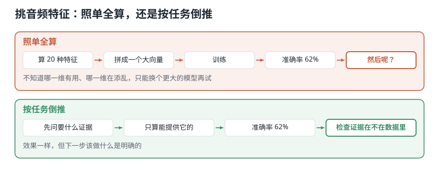
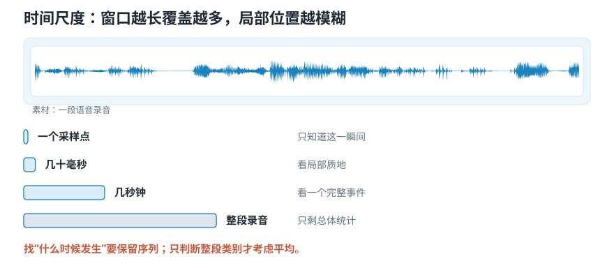

# 该从录音里算出什么交给模型？——音频特征的四个选择

> **导读：** 搜“该用什么音频特征”，会搜到一份长清单，每个名字都有现成的库函数。可是**这些名字回答的不是同一种问题**，全算一遍塞给程序，效果通常更差——更麻烦的是出了问题你不知道该改哪一维，只能换个更大的模型再试一次。本文用四个能逐条回答的问题替代那份清单：拆成什么、看多长、从哪个角度、谁来算。**四个问题答完，输入规格就定下来了；效果不好时，也知道回头该查哪一步。**

<picture>
  <source media="(max-width: 640px)" srcset="../../零基础版_01-05/figures/mobile/00-course-position-05.svg">
  
</picture>

## 音频特征是什么

简单来说：**音频特征是从录音里提取出来、用来帮程序做判断的数字摘要。**

假设你想在车间放一个麦克风，让程序听着一台空调，判断它是不是快坏了。搜一下怎么做，很快会搜到这样一份清单：

> 振幅包络、梅尔频谱、MFCC、深度嵌入……

每个名字都很专业，都有现成的库函数，一行代码就能算。于是最自然的做法是：全都算一遍，一股脑塞给程序。

**这种做法通常效果不好，而且出了问题不知道该改哪里。**

<picture>
  <source media="(max-width: 640px)" srcset="../../零基础版_01-05/figures/mobile/05-list-vs-backward.svg">
  
</picture>

*图 1：两条路的准确率可以一样，差别在于效果不好时你知不知道下一步该做什么。*

想象一下去医院。医生不会把所有检查都做一遍再看结果，他先问你哪里不舒服，据此决定验血还是拍片。**清单是检查项目表，不是诊断流程。**

类比到此为止。下面是四个问题。

## 为什么“哪个特征最好”这个问法不成立

因为这些名字**回答的不是同一种问题**。

| 描述 | 属于哪一层 | 能直接比吗 |
|---|---|---|
| “这一刻有多响” | 直接从信号算 | — |
| “高低成分怎样随时间变化” | 由上一层组织起来 | 和上一行不可比 |
| “这台设备是否异常” | 需要从数据里学 | 和前两行都不可比 |

把它们排成一份“从差到好”的名单，就像把体温计、CT 和医生的诊断排名次——三者层级不同，各自回答不同的问题。

**什么时候需要这四个问题：** 任何一次“该用什么特征”的决策。

**什么时候可以跳过：** 复现别人已经验证过的方案，且不打算改。这时候照抄参数就行，但**必须把参数完整记下来**。

## 四个问题的顺序

<picture>
  <source media="(max-width: 640px)" srcset="../../零基础版_01-05/figures/mobile/05-four-questions.svg">
  
</picture>

*图 2：四张卡片是依次回答的，不是四选一。每张卡片最下面那行小字，是这个问题在空调例子里的具体答案。*

这四个问题要**按顺序**回答，不是从里面四选一：

- **① 拆成什么**：先把任务拆成能直接测量的现象。这一步的答案决定了后面三步在为什么服务；跳过它，后面三步就没有判断依据。
- **② 看多长**：由 ① 的答案决定。任务要找“什么时候发生”，就必须一段一段地留住先后顺序；只判断“整段属于哪一类”，才可以把时间压掉。
- **③ 从哪个角度**：由 ①② 一起决定。要找的证据在时间上，就看时间；在成分上，就看成分；两样都要，就用同时看的那种。
- **④ 谁来算**：主要由手上有多少数据决定，和前三步相对独立。数据少就按公式算，数据多才轮到让模型自己学。

## 核心概念一：抽象层级

**它是什么：** 一个描述离原始测量有多远。

回到那台空调。“它是不是快坏了”没有任何函数能直接算出来。第一步不是调库函数，而是把它拆成可以直接测量的现象：

- 是不是出现了以前没有的、某个固定高低的尖锐声？
- 是不是出现了一下下有规律的撞击？
- 背景那层沙沙的声音是不是比以前更大了？

三条都是可以直接算的。工程里把这个“离原始测量有多远”叫**抽象层级**：

| 层级 | 例子 | 含义稳定吗 |
|---|---|---|
| 低层 | 这一小段有多响、某个频段有多少能量 | 稳定，换项目也一样 |
| 中层 | 音高轮廓、节拍位置、成分分布形状 | 较稳定 |
| 高层 | 说话人是谁、什么音乐风格、情绪如何 | **离不开训练它的那批数据** |

拆的时候有一张现成的清单可以对：**声音能被描述的方面就那么几个。**

| 方面 | 描述什么 | 空调那个例子里对应哪一条 |
|---|---|---|
| 节拍 | 事件在时间上怎样排列，快慢是否稳定 | 有规律的撞击 |
| 音高 | 这个音有多高 | 新出现的固定高低的尖声 |
| 音色 | 同样的音高和响度，听起来为什么不一样 | 底噪的质地变了 |
| 和声 | 同时响的几个音之间是什么关系 | （这个例子用不上） |

这四个方面来自音乐，但**不只对音乐有用**——上面那台空调，三条可测现象正好落在前三行。**先在这张表上定位，再去挑特征**，比直接翻特征清单可靠得多。

**常见错误：直接去找一个「能判断异常」的特征。** 越抽象的目标，越应该先拆成低层的可测证据。跳过拆解，你会在清单里挑一个名字最像的，然后发现它测的根本不是你要的东西。

## 核心概念二：时间尺度

**它是什么：** 一次看多长。窗口不同，能看见的东西完全不同。

<picture>
  <source media="(max-width: 640px)" srcset="../../零基础版_01-05/figures/mobile/05-time-scale.svg">
  
</picture>

*图 3：四条色条的长度差就是覆盖范围的差。最上面那条几乎看不见——一个采样点确实什么也说明不了。*

- **一个采样点**：只知道那一瞬间振动了多少，单独看几乎没有信息。
- **几十毫秒**：能看到局部质地，比如这一小段是元音还是摩擦音。
- **几秒钟**：能看到一个完整事件，比如一次敲击、一个词、一小节音乐。
- **整段录音**：只剩总体统计，比如“平均而言这段偏尖锐”。

**常见错误：为了让每段录音长度一致，直接对整段求平均。** 下面的动手实验会把这个错误的代价量出来。

## 核心概念三：信号域

**它是什么：** 从哪个角度观察。

**这三个角度你已经见过了。** [第 01 课](01-课程导论-程序要分辨三种音乐先得跨过哪一步.md)的三种读取方式就是它们：**波形**按时间看（什么时候响、什么时候静，适合找撞击和起音，展开在[第 02 课](02-波形频率与音高-声音曲线记录了什么.md)）、**频谱**按成分看（高的成分多还是低的多，适合判断音高，展开在[第 10 课](10-傅里叶变换的直觉-电脑怎样从复杂波形里找出频率.md)）、**声谱图**两者同时看（哪些成分在什么时候出现，展开在第 16 课）。这里不再重讲一遍，只补上那一课没提的一件事——

在“按成分看”这个角度上还有几种常用变体，都是在原始成分分布上再加工一层：

| 名字 | 强调什么 | 故意丢掉什么 | 展开在 |
|---|---|---|---|
| 梅尔频谱 | 按人耳分辨习惯划分区间 | 高频的细节 | [第 17 课](../../零基础版_16-20/17-梅尔刻度与三角滤波器组-为什么频率要按听感重新分带.md) |
| MFCC | 用很少几个数概括整体形状 | 精细结构 | [第 19 课](../../零基础版_16-20/19-MFCC中的对数与DCT-为什么少量系数能概括频谱轮廓.md) |
| CQT | 按音乐的音高关系划分 | 非音乐场景的适配性 | — |
| 色度图 | 12 个音名，忽略八度 | **这个音在高音区还是低音区** | — |

**常见错误：只写「它保留了什么」，不写「它放弃了什么」。** 每一种变换在突出某种关系的同时，一定会删掉另一些信息。评价一种表示必须同时写两半，只写前一半就会选错。

## 核心概念四：产生方式

**它是什么：** 这份摘要是人按公式算的，还是程序从数据里学的。

<picture>
  <source media="(max-width: 640px)" srcset="../../零基础版_01-05/figures/mobile/05-rule-vs-learn.svg">
  
</picture>

*图 4：两张卡片之间是箭头，不是分隔线。下面那条橙色的才是实际做法：前面按公式算好，后面交给程序去学。*

| | 按规则算出来 | 让程序从数据里学 |
|---|---|---|
| 依据来自哪里 | 人已有的声音知识和公式 | 训练数据与人工给出的答案 |
| 样本需求 | 较低 | 较高 |
| 可解释性 | 高，可逐项排查 | 低，需额外分析手段 |
| 跨项目复用 | 定义稳定 | 依赖训练分布 |
| 主要风险 | 规则不适合任务，漏掉关键线索 | 数据覆盖不足，学到无关差异，成绩虚高 |

**常见错误：把它当成二选一。** 很多实用系统的做法是：前面用一个稳定、便宜、可解释的规则算好中间表示（比如梅尔频谱），后面交给模型去学。既省数据，又保留灵活性。

按「谁来算」这一条，实际的音频系统分成三层，一层套一层：

| 系统类型 | 特征谁来定 | 判断谁来做 | 要多少数据 |
|---|---|---|---|
| 规则系统 | 人写公式 | 人写规则（比如「超过这个阈值就报警」） | 几乎不需要 |
| 传统机器学习 | 人写公式 | 模型从数据里学 | 几十到几千条 |
| 深度学习 | 模型自己学 | 模型自己学 | 通常上万条起 |

**这三层不是「谁更先进」的排名，是「你手上有多少数据」的分层。** 本课程停在第一、二层：算出可解释的特征，再用最简单的方法验证它们分不分得开——数据只有几十个片段时，第三层根本训不起来。

## 动手实验：平均一次，答案就没了

**这一节要做的事：** 拿六个数做一次最小的实验——**把顺序完全打乱，均值和标准差一位小数都不变**。这一条能一次性说清「整段求平均」到底删掉了什么。后面几层把同一份录音摆成两种形状，看它们各自还能回答什么问题。

环境和音频素材装一次就够，见[课程总纲的「动手之前」](../../课程总纲/README.md)。本课完整代码在 [`课程代码/lessons/lesson05_feature_choices.py`](../../课程代码/lessons/lesson05_feature_choices.py)，下面每个数字都能在它的输出里找到；脚本比正文更全。

第二个问题（看多长）最容易被随手糊弄过去——“为了长度一致，整段求个平均吧”。这一步的代价可以直接量出来。

### 第 1 步 — 六小段的能量，峰值在第 3 段和第 5 段

```python
import numpy as np

z = [0.1, 0.2, 0.9, 0.4, 0.8, 0.1]
print("均值 =", round(float(np.mean(z)), 4), " 标准差 =", round(float(np.std(z)), 4))
```

```text
均值 = 0.4167  标准差 = 0.3236
```

### 第 2 步 — 把顺序完全打乱，再算一次

```python
print("倒序 =", round(float(np.mean(z[::-1])), 4), " 标准差 =", round(float(np.std(z[::-1])), 4))
```

```text
倒序 = 0.4167  标准差 = 0.3236
```

### 第 3 步 — 结论

$$
\mu = \frac{1}{M}\sum_{m=1}^{M} z_m, \qquad
\sigma = \sqrt{\frac{1}{M}\sum_{m=1}^{M}(z_m - \mu)^2}
$$

逐行看：

- 两组数字**完全相同**，一位小数都不差。
- 这不是巧合：$\mu$ 和 $\sigma$ 的定义里都是求和，而**加法不在乎顺序**。
- 推广一下：**任何与顺序无关的统计量，都无法还原峰值出现在第几段。** 换成最大值、中位数、分位数，结论一样。

所以判据非常干脆：任务里出现“**什么时候**”，就必须保留一段一段的先后顺序；只判断“整段属于哪一类”，才可以考虑压成统计量。

### Level 1：两种形状，同一份数据

```python
import librosa

y, sr = librosa.load("debussy.wav", sr=16000, mono=True)
y = y[:5 * sr]

mel_power = librosa.feature.melspectrogram(
    y=y, sr=sr,
    n_fft=1024,        # 每帧参与变换的样本数
    hop_length=160,    # 帧移 = 10 ms @16kHz
    n_mels=64,         # 64 个梅尔频带
    power=2.0,         # 输出功率谱
)
log_mel = librosa.power_to_db(mel_power, ref=1.0, top_db=80)

frame_sequence = log_mel.T                                        # 保留时间
global_vector = np.r_[log_mel.mean(axis=1), log_mel.std(axis=1)]  # 丢掉时间

print(log_mel.shape, frame_sequence.shape, global_vector.shape)
```

```text
(64, 501) (501, 64) (128,)
```

- `log_mel` 是 64 行 × 501 列：64 个频带，501 个时间帧。
- `frame_sequence` 转置成 `(501, 64)`，**501 个时刻各一个 64 维向量**，适合找事件位置。
- `global_vector` 是 128 维：64 个均值 + 64 个标准差。**长度固定，和录音多长无关**，适合做第一版对照方案。

这里的 `n_fft`、`hop_length`、`n_mels` 三个数一旦不同，输出形状就不同——[第 01 课](01-课程导论-程序要分辨三种音乐先得跨过哪一步.md)量过这件事，三段音乐用同一组参数才都得到 `(1025, 431)`。

### Level 2：`ref` 换一个值，同一段录音算出来的数就不一样

```python
lm_fixed = librosa.power_to_db(mel_power, ref=1.0, top_db=80)
lm_self = librosa.power_to_db(mel_power, ref=np.max, top_db=80)

print("ref=1.0   最大 =", round(float(lm_fixed.max()), 2), " 最小 =", round(float(lm_fixed.min()), 2))
print("ref=max   最大 =", round(float(lm_self.max()), 2), " 最小 =", round(float(lm_self.min()), 2))
```

```text
ref=1.0   最大 = 12.75  最小 = -64.32
ref=max   最大 = 0.0  最小 = -77.06
```

- `ref=1.0` 用固定参考功率，**不同录音之间的绝对电平差异被保留下来**。
- `ref=np.max` 让每段录音以自身峰值为 0 dB，**便于比较分布形状，但会抹掉录音之间的电平差**。

如果任务恰好依赖“这台机器比以前更吵了”，用 `ref=np.max` 就会把关键线索删掉——而且不会报错。

### Level 3：把四个问题套到空调上

1. **拆成什么**：新出现的固定高低的尖声 / 有规律的撞击 / 底噪变大。
2. **看多长**：撞击是事件，必须保留时间序列；底噪变化可以整段统计。
3. **哪个角度**：找尖声要看成分分布；找撞击要保留时间；两者都要，就用同时看的那种。
4. **谁来算**：数据少，先用规则算出的特征做一个能解释、能对照的初版方案（这种初版方案通常叫**基线**）；数据够了再考虑让模型自己学。

答案是四个问题**共同**决定的，不是从清单上挑一个名词。

### Level 4：套到本课程的项目上

三段音乐分风格，同样过一遍：拆成“高频占比 / 节奏密度 / 力度起伏”；节奏和力度是随时间的事，要留序列；三条证据分别落在成分、时间、时频三个角度；数据只有几十个片段，用规则算。把这四条写下来，就是这个项目的特征清单。

## 这三处最容易把结果算错

**边界：`top_db` 会截断。** `top_db=80` 表示这个函数只保留峰值以下 80 dB 的范围，比这更弱的一律夹到最低值。素材本身动态范围很大时，这个默认值会把最轻的那部分细节全部削平，而且不会报错——你只会看到一片一样的底色。

**性能：`hop_length` 直接决定输出规模。** 上面 5 秒得到 501 帧；`hop_length` 减半，帧数翻倍，后面所有计算跟着翻倍。

**可复现：`ref` 属于必须记录的参数。** 它和 `n_fft`、`hop_length`、`n_mels` 一样会改变数值，却更容易被忘记，因为它不影响输出形状——**形状对了不代表数值可比**。

## 常见问题

**Q1：最容易搞错什么？**

为了“让每段录音长度一致”而整段求平均。上面证明过了：均值和标准差在打乱顺序后一模一样。**长度是统一了，答案也一起没了。**

**Q2：`frame_sequence` 和 `global_vector` 该用哪个？**

看任务问的是什么。问“哪一类”用 `global_vector`，长度固定、简单模型就能吃；问“第几秒”必须用 `frame_sequence`。两个都要，就保留序列，让后面的程序自己组合前后信息——**从序列可以得到统计量，反过来不行**。

**Q3：怎么排查？**

1. 先打印形状。`(64, 501)` 还是 `(501, 64)`？转置搞反是最常见的错误，而且很多函数不会报错。
2. 特征算出来全是 `-80`？检查 `ref` 和 `top_db`，多半是被夹到底了。
3. 换录音后数值整体平移？看看是不是用了 `ref=np.max`，它会跟着每段自己的峰值走。
4. 模型效果差时，**沿四个问题反查**：目标拆错了？时间窗过长过短？读取方式删掉了关键信息？数据量还不够让程序自己学？

**Q4：实际项目里最该注意什么？**

把所有影响数值的参数——`sr`、`n_fft`、`hop_length`、`n_mels`、`ref`、`top_db`——和模型一起做版本记录，并在一批没有参与训练的录音上比较。**少记一个 `ref`，半年后就复现不出来了。**

## 速查表

| 概念 | 含义 | 关键代码 |
|---|---|---|
| 音频特征 | 从录音提取的数字摘要 | — |
| 抽象层级 | 离原始测量有多远 | 低层 / 中层 / 高层 |
| 时间尺度 | 一次看多长 | 采样点 / 几十 ms / 几秒 / 整段 |
| 信号域 | 从哪个角度看 | 时间 / 成分 / 时频 |
| 梅尔频谱 | 按听感划分频带 | `librosa.feature.melspectrogram` |
| 转成 dB | 压缩数值范围 | `librosa.power_to_db(S, ref=1.0)` |
| 逐帧序列 | 保留时间，长度随录音变 | `log_mel.T` → `(帧数, 频带)` |
| 整段向量 | 丢掉时间，长度固定 | `np.r_[S.mean(1), S.std(1)]` |
| 基线 | 能解释、能对照的初版方案 | — |

## 接下来学什么

1. **本课**：该算出什么，四个问题定下输入规格。
2. **第 06 课**：把长序列切成小段。
3. **第 07–09 课**：三种时域特征怎么算。
4. **第 10 课起**：换个角度，看频率。

第一组到这里结束。这五课回答的是“程序拿到的到底是什么、该给它什么”。从下一课起动手：把一整段录音切成小段，逐段算出可以比较的数字。
