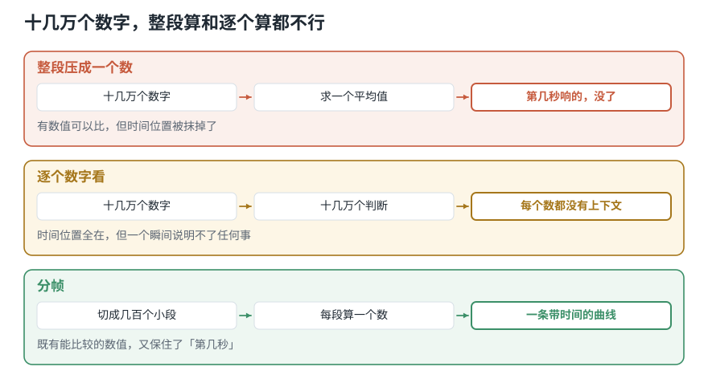

# 整段录音太长，先切成小段：分帧、加窗与聚合

> **导读：** 十秒录音有二十多万个数字。整段求一个平均，"第几秒响的"就没了；逐个数字看，每个数字又太短、没有上下文，什么也判断不出来。**分帧就是这两难之间的那条路**：把录音切成许多短小、互相重叠的片段，再逐段计算——这样既得到了可以互相比较的数值，又保住了"第几秒"。本文说清帧长和帧移各管什么，以及切完之后要不要连时间一起扔掉。

<picture>
  <source media="(max-width: 640px)" srcset="../../零基础版_06-10/figures/mobile/00-course-position-06.svg">
  
</picture>

## 分帧是什么

简单来说：**把一整段录音切成许多很短、而且互相重叠的小片段，之后所有计算都对着这些小片段做。** 每个小片段叫一**帧**，切的这个动作叫**分帧**。

它解决的问题很具体。假设我们录下十秒钟的机器运转声，想找出其中有没有短促的碰撞：

<picture>
  <source media="(max-width: 640px)" srcset="../../零基础版_06-10/figures/mobile/06-why-framing.svg">
  
</picture>

*图 1：前两条路各缺一半——一条丢了时间，一条没有上下文。分帧是中间那条。*

想象一下用手机拍视频。摄像机并不连续记录，它每秒拍 24 张照片，放起来就像连续的。分帧就是给声音做同样的事：**一秒钟“拍”几十到上百张，每一张覆盖二三十毫秒。**

类比到这里为止。和视频不一样的是，声音的这些“照片”是**互相重叠**的——下一帧不会等上一帧结束才开始。为什么要重叠，下面就说。

## 为什么必须切段，不能整段算

| | 整段算一个数 | 逐个样本看 | 分帧 |
|---|---|---|---|
| 输出 | 1 个数 | 十几万个数 | 几百个数 |
| 保留时间位置 | 否 | 是 | 是（精确到帧） |
| 每个数有没有上下文 | 有（但太粗） | 没有 | 有（一帧的长度） |
| 长度是否固定 | 是 | 随录音长度变 | 随录音长度变 |
| 适合 | 判断整段属于哪一类 | 几乎没有直接用途 | 找事件、看变化过程 |

**什么时候适合分帧：** 任务关心“什么时候”，或者关心声音随时间怎么变。找碰撞、找起音、识别语音、跟踪音高，全都要分帧。

**什么时候不需要：** 任务只要一个整段结论，而且录音很短、内容均匀。比如判断一段 0.5 秒的纯音是什么频率，直接对整段做一次频率分析就够了。

注意：**「不需要分帧」和「分帧之后再把结果聚合成一个数」不是一回事。** 后者仍然要先切段、逐段算，只是最后一步才把时间压掉。这样得到的统计量，比直接对整段算一次要稳得多——因为它是许多段各自算完再汇总的，个别一段出问题不会带偏全部。

## 从整段录音到一串数字，中间要走哪四步

<picture>
  <source media="(max-width: 640px)" srcset="../../零基础版_06-10/figures/mobile/06-pipeline.svg">
  
</picture>

*图 2：上面那条蓝色曲线是整段录音，先被切成彼此相邻的小段；每段算出一个数以后，既可以保留先后顺序，也可以进一步汇总。*

<picture>
  <source media="(max-width: 640px)" srcset="../../零基础版_06-10/figures/mobile/06-framing-pipeline.svg">
  
</picture>

*图 3：②和④都是可选的。④一旦做了，「第几秒」就再也找不回来。*

四个组件各自的分工：

- **分帧**决定“每次看多长、隔多久看一次”。它不产生新信息，只是把一条长序列重组成许多次局部观察。
- **加窗**只在后面要做频率分析时才需要。它把每一帧的两端压到零，这样后面的频率分析就不会把切口本身当成录音里真实存在的成分。
- **逐帧计算**是真正提取信息的一步，它决定这一帧被概括成什么数字。这是[第 07 课](../../零基础版_06-10/07-振幅包络RMS与过零率-不用频谱能看出什么.md)到[第 09 课](../../零基础版_06-10/09-RMS与过零率怎么计算-用整体强弱和翻越零线次数检查声音.md)的内容。
- **聚合**决定要不要扔掉时间。它和第一步是一对：分帧把时间轴切细，聚合再把它抹掉。

## 核心概念一：帧长和帧移

**帧长**是每一帧覆盖多少声音，也就是一次看多长。**帧移**是从这一帧的开头走到下一帧的开头要走多远。

帧移比帧长小时，相邻两帧就会重叠。

<picture>
  <source media="(max-width: 640px)" srcset="../../零基础版_06-10/figures/mobile/06-frame-hop.svg">
  
</picture>

*图 4：长方框的宽度是帧长；上方橙色箭头是帧移。帧移小于帧长，所以第 1、2、3 帧互相重叠。*

**为什么要重叠？** 因为一个短促事件可能正好落在切口上。不重叠的话，它会被劈成两半，两帧各看到一点，两边都不明显。重叠之后，总有一帧完整地罩住它。

例如，采样率 16000 Hz、帧长 400 个样本、帧移 160 个样本：

```text
帧长 400 / 16000 = 0.025 秒 = 25 毫秒
帧移 160 / 16000 = 0.010 秒 = 10 毫秒
重叠 = 25 - 10 = 15 毫秒（60%）
```

写成公式，采样率记作 $f_{\mathrm{s}}$、一帧含 $K$ 个样本时，一帧覆盖的时间是

$$
T_{\mathrm{frame}}=\frac{K}{f_{\mathrm{s}}}
$$

帧数则是

$$
N = 1 + \left\lfloor \frac{L - K}{H} \right\rfloor
$$

其中 $L$ 是总样本数，$H$ 是帧移。这条式子后面每一课都要用，值得记住。

**常见错误：把帧移写成帧长。** 参数名很像，写反了程序不会报错，只是帧数少了一半，而且不再重叠。下面 Hello World 里会看到这个错误长什么样。

## 核心概念二：加窗

直接从连续波形中截下一段，左右边缘通常接不上。对“这一帧最大有多大”这类计算，切口不要紧；但要分析这一帧含有哪些高低成分时，突然的边缘会制造出原录音里根本没有的成分。这种能量散到邻近位置的现象叫**频谱泄漏**。

做法是让一帧中间保持原样、两端逐渐减小到零。这个逐点相乘的平滑形状叫**窗函数**，最常用的一种叫 **Hann 窗**。

<picture>
  <source media="(max-width: 640px)" srcset="../../零基础版_06-10/figures/mobile/06-windowing.svg">
  
</picture>

*图 5：左上是直接截下的小段，左下是两端被 Hann 窗压低后的结果；右侧橙线的远处起伏更低，说明假成分减少了。*

加窗也有代价：它压住了边缘的突然跳变，同时会让一个频率的主峰稍微变宽——也就是说，你换来了更少的假成分，付出的是频率分得没那么细。所以**“有没有加窗、加的哪种窗”必须和后面的频率分析一起记录下来**，否则两次跑出来的结果没法比。

**常见错误：算振幅类特征时也加窗。** 窗把两端乘小了，这一帧的最大值和 RMS 都会跟着变小（下面有实测数字）。加窗是为频率分析服务的，不是默认动作。

## 环境准备

这一组五课共用同一套环境，装一次就够。

```bash
pip install numpy librosa soundfile
```

本文全部代码在以下版本上实测通过：

| 包 | 版本 |
|---|---|
| Python | 3.12.10 |
| numpy | 2.5.2 |
| librosa | 1.0.0 |
| soundfile | 0.14.0 |

验证一下装好没有：

```python
import numpy as np, librosa
print(np.__version__, librosa.__version__)
```

音频素材用课程自带的 `debussy.wav`。下面所有输出都是用它跑出来的。

## Hello World：把 1 秒切成 42 帧

**Step 1 — 读入 1 秒音频**

```python
import numpy as np
import librosa

y, sr = librosa.load("debussy.wav", sr=22050, mono=True)
seg = y[:sr]                      # 只取第 1 秒
print(sr, len(seg))
```

```text
22050 22050
```

**Step 2 — 写分帧函数**

```python
def frame(y, frame_length=1024, hop_length=512):
    n = 1 + (len(y) - frame_length) // hop_length
    idx = np.arange(frame_length)[None, :] + hop_length * np.arange(n)[:, None]
    return y[idx]
```

**Step 3 — 切，并看形状**

```python
frames = frame(seg)
print(frames.shape)
```

```text
(42, 1024)
```

逐行看关键的那三句：

- `n = 1 + (len(y) - frame_length) // hop_length` 就是上面那条帧数公式。代进去：`1 + (22050 - 1024) // 512 = 1 + 41 = 42`。
- `np.arange(frame_length)[None, :] + hop_length * np.arange(n)[:, None]` 造出一张 `(42, 1024)` 的下标表：第 `i` 行是 `[i*512, i*512+1, ..., i*512+1023]`。
- `y[idx]` 用这张表一次性取出所有帧，不用写循环。

把帧移错写成帧长会怎样？

```python
print(frame(seg, 1024, 1024).shape)   # 帧移 = 帧长，不重叠
print(frame(seg, 1024,  512).shape)   # 帧移 = 半帧，重叠 50%
```

```text
(21, 1024)
(42, 1024)
```

程序不会报错，只是帧数少了一半。**发现这类错误的办法只有一个：先用公式手算一遍，再和代码对。**

## 一层层加上去

### Level 1：只分帧

就是上面的 Hello World。输入一段录音，输出 `(帧数, 帧长)` 的二维数组。

### Level 2：加上窗函数

```python
window = np.hanning(1024)
framed = frame(seg)
windowed = framed * window          # 广播到每一帧

print(round(window[0], 4), round(window[512], 4), round(window[-1], 4))
print(round(float(np.sqrt(np.mean(framed[0] ** 2))), 5))
print(round(float(np.sqrt(np.mean(windowed[0] ** 2))), 5))
```

```text
0.0 1.0 0.0
0.05299
0.03413
```

窗在两端是 0、中间是 1。注意第三行：**同一帧加窗之后 RMS 从 0.053 掉到 0.034**，少了三分之一。这就是上面说的“算振幅类特征别加窗”——数值会被窗本身改掉。

### Level 3：逐帧算一个数

```python
frames = frame(seg)
rms = np.sqrt(np.mean(frames ** 2, axis=1))

print(rms.shape)
print(np.round(rms[:5], 4))
```

```text
(42,)
[0.053  0.0596 0.0672 0.076  0.0753]
```

`axis=1` 是关键：沿着“帧内样本”这个方向求平均，于是每一帧塌成一个数，42 帧得到长度 42 的一条曲线。**写成 `axis=0` 就变成了对同一位置的所有帧求平均，得到长度 1024 的东西——形状看着也对，含义完全错。**

### Level 4：聚合成固定长度

许多程序要求每段录音最终都变成相同数量的数字。最直接的办法是对逐帧结果求统计量：

```python
summary = np.array([rms.mean(), rms.std(), rms.max()])
print(np.round(summary, 4))
```

```text
[0.0694 0.0097 0.0881]
```

<picture>
  <source media="(max-width: 640px)" srcset="../../零基础版_06-10/figures/mobile/06-sequence-summary.svg">
  
</picture>

*图 6：上方每个点仍对应一个时间位置。左下保留整条曲线，右下只留下均值和波动，录音长度固定了，但事件位置也消失了。*

**这一步不可逆。** 42 个数变成 3 个数之后，“峰值出现在第几帧”永远找不回来了。所以：

- 要找“故障在第几秒出现”，保留 `rms`，不要 `summary`。
- 只判断“整段属于哪一类”，可以用 `summary`。
- 两者都要，就保留序列，让后面的程序自己组合前后信息。

### Level 5：包装成可复用的模块

到这里已经够写成一个模块了——这正是本课「动手做」要产出的 `soundlab/framing.py`。

## 这三处最容易把结果算错

**边界：尾巴被丢掉了。** 上面的 `frame()` 只保留完整帧：

```python
used = (frames.shape[0] - 1) * 512 + 1024
print(used, len(seg), len(seg) - used)
```

```text
22016 22050 34
```

1 秒里有 34 个样本没进任何一帧。34 个样本只有 1.5 毫秒，通常无所谓；但如果录音很短、或者关键事件恰好在最末尾，就必须处理。三种做法（丢弃 / 保留短帧 / 补零）在[第 08 课](../../零基础版_06-10/08-振幅包络怎么计算-从逐帧最大值到可靠时间轴.md)展开。

**性能：别写 Python 循环。** 用下标表一次性取帧，比 `for` 循环快一到两个数量级。数据量大时，还可以用 `np.lib.stride_tricks.sliding_window_view` 做到不复制内存——但要注意它返回的是视图，**原地修改会污染原数组**。

**可复现：参数必须记录。** 帧长、帧移、窗函数、采样率，四个里改任何一个，算出来的数字都不一样。把它们放进 `config.py` 而不是散落在各个函数的默认值里，是本组后面四课能互相对得上的前提。

## 常见问题

**Q1：帧长该选多少？**

先问任务关心的变化持续多久，再倒推。语音常用 20–40 毫秒，因为口型变化大约就是这个速度；机械振动、鲸鱼叫声都要重新定。没有通用最佳值——**帧越短事件位置越准，帧越长每帧信息越多**，这条取舍躲不掉。

**Q2：帧移和帧长有什么区别？**

帧长是“一次看多宽”，帧移是“隔多久看一次”。两个数互相独立：帧长决定每帧的信息量和时间分辨率，帧移决定输出曲线的采样密度。常用 `帧移 = 帧长 / 2`（重叠 50%）或 `帧长 / 4`。

**Q3：结果不对怎么排查？**

按这个顺序：

1. 先用 $N = 1 + \lfloor (L-K)/H \rfloor$ 手算帧数，和 `frames.shape[0]` 对。对不上说明参数传错了。
2. 打印 `frames.shape`，确认是 `(帧数, 帧长)` 而不是反过来。
3. 打印 `rms.shape`，确认长度等于帧数。等于帧长就是 `axis` 写反了。
4. 画出 `rms` 曲线，和原波形叠在一起看。峰应该对得上。

**Q4：实际项目里最该注意什么？**

训练时和上线时必须用**同一套**帧长、帧移、窗函数和采样率。参数不一致的两批特征混在一起，程序会先学会“这条数据是哪一批的”。

## 速查表

| 概念 | 含义 | 关键代码 |
|---|---|---|
| 帧 | 一小段连续的声音样本 | `frames[i]` |
| 帧长 `frame_length` | 一次看多长（样本数） | `1024` |
| 帧移 `hop_length` | 隔多久看一次（样本数） | `512` |
| 帧数 | $1+\lfloor (L-K)/H \rfloor$ | `1 + (len(y)-K)//H` |
| 窗函数 | 把两端压到 0，减少频谱泄漏 | `np.hanning(K)` |
| 逐帧计算 | 每帧塌成一个数 | `np.mean(frames**2, axis=1)` |
| 聚合 | 整条曲线压成几个统计量 | `rms.mean(), rms.std()` |

## 接下来学什么

1. **本课**：把长序列切成小段。
2. **第 07 课**：三种时域特征分别回答什么问题。
3. **第 08、09 课**：振幅包络、RMS 与过零率怎么写。
4. **第 10 课起**：换个角度，不看时间看频率。

下一课先不写代码，而是横向比较三种最常用的逐帧特征，弄清它们各自能回答什么、不能回答什么——**选错了特征，实现得再干净也没用。**

<!-- exercise:start -->

## 动手做：第 6 步 · 写出分帧函数

课程项目《三首曲子，一个分类器》共 23 步，这是第 6 步。1 秒片段还是太长，一个数字概括不了。分帧是后面所有逐帧特征的共同底座。

1. 写 `soundlab/framing.py`，实现 `frame(y, frame_length=1024, hop_length=512)`，返回形状为 `(帧数, 帧长)` 的二维数组。
2. 用第 06 课的公式手算一遍：一个 1 秒、22050 Hz 的片段，用这组参数能切出多少帧？再用代码验证。
3. 加一个可选的 `window="hann"` 参数，对每帧乘上窗函数。
4. 把 `FRAME_LENGTH` 和 `HOP_LENGTH` 也放进 `config.py`。

**做完应该有**：`soundlab/framing.py`，手算与代码结果一致。

**自检**：手算结果应该是 `1 + floor((22050 - 1024) / 512) = 42` 帧。如果代码给出 43，检查是不是补了边；如果给出 21，检查帧移是不是写成了帧长。

上一步：[第 05 课 · 切出数据集](../../零基础版_01-05/05-音频特征怎么选-抽象层级时间尺度与模型输入.md)　·　下一步：[第 07 课 · 先看看三种时域特征分不分得开](../../零基础版_06-10/07-振幅包络RMS与过零率-不用频谱能看出什么.md)　·　[项目全貌](../../课程项目/README.md)

<!-- exercise:end -->
