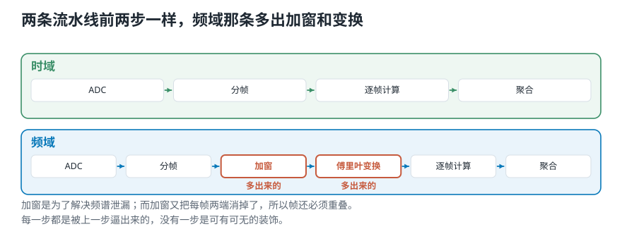
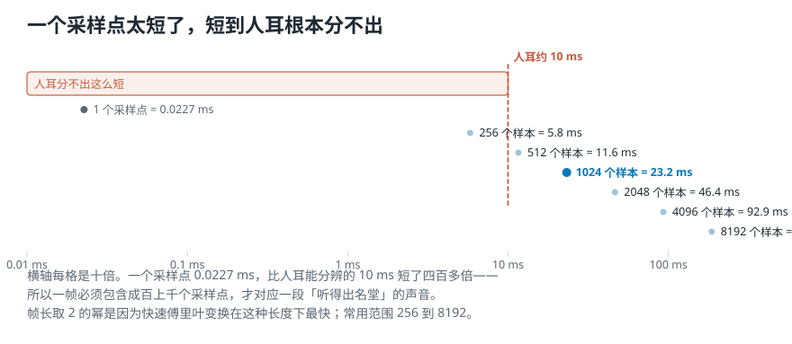
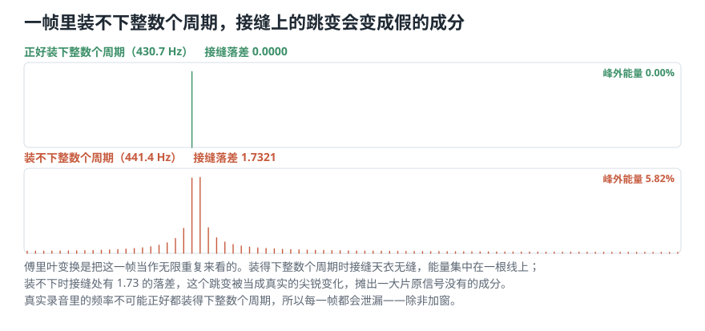
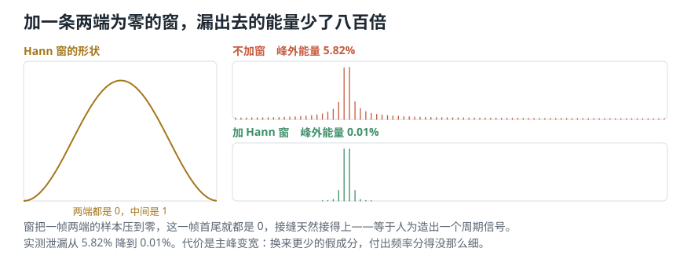
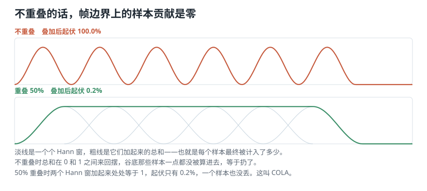

# 从整段录音到一串可比较的数，中间要走哪几步？

> **导读：** 上一课把「该算什么」分成了五个维度，其中信号域那一维分了三档：时域、频域、时频。这一课讲**前两档各自的完整流水线**——从 ADC 出来的一串数字开始，到最后交给程序的那几个数为止，中间每一步是什么、为什么少不了。两条流水线的前半段是一样的（都要先切段），**分岔发生在频域那条上：它多了「加窗」这一步。** 而加窗又会带出一个新问题，逼出「帧必须重叠」这个结论。

<picture>
  <source media="(max-width: 640px)" srcset="../../零基础版_06-10/figures/mobile/00-course-position-06.svg">
  
</picture>

## 时域这条流水线

先看最简单的那条。第 04 课讲过，麦克风送出的连续电压要先经过一个部件才变成一串数字，那个部件叫 **ADC**。这一课就从这串数字开始。

从它出发到最后得到特征，中间四步：这串数字 → 切成小段 → 每段算一个数 → 把这些数汇总。四步各有名字：

> **ADC** → **分帧** → **逐帧计算** → **聚合**

- **ADC**：第 04 课讲完了，输出是一串数字。
- **分帧**：把这一长串切成许多小段。每一小段叫一**帧**，切这个动作就叫**分帧**。
- **逐帧计算**：对每一小段算出一个数（或一组数）。
- **聚合**：把逐帧的结果汇总成最终交出去的东西——可以取均值、中位数，也可以用更复杂的统计模型。

最后交出去的东西有三种可能的形状：**一个数**、**一个向量**、或者**一个矩阵**。这取决于聚合那一步做到什么程度，也取决于逐帧算的是一个数还是一组数。

<picture>
  <source media="(max-width: 640px)" srcset="../../零基础版_06-10/figures/mobile/06-two-pipelines.svg">
  
</picture>

*图 1：上面是时域这条，下面是频域那条。两条的前两步完全一样，**分岔在第三步**——频域那条多了加窗和傅里叶变换。*

## 一帧要多长：得让耳朵「听得出」

分帧的第一个问题是：**一帧切多长？**

先看反面。上一课算过，44.1 kHz 采样时**一个采样点只占 0.0227 毫秒**。而人耳能分辨的最短时间差大约是 **10 毫秒**。

**0.0227 毫秒对 10 毫秒——短了四百多倍。**

**所以呢？** 所以一个采样点根本不构成「一段能听出名堂的声音」——它比人耳的分辨极限短了四百多倍。要让一帧对应一段**人耳能感知的内容**，帧长必须大得多。

工程上的两条惯例：

- **取 2 的幂**。1024、2048 这样的数。这不是迷信——后面要用的快速傅里叶变换在长度是 2 的幂时最快。
- **常用范围 256 到 8192 个样本。**

换算成时间（44.1 kHz 下）：

| 帧长 | 44.1 kHz | 22.05 kHz |
|---|---|---|
| 256 | 5.8 ms | 11.6 ms |
| **512** | **11.6 ms** | 23.2 ms |
| 1024 | 23.2 ms | 46.4 ms |
| 2048 | 46.4 ms | 92.9 ms |
| 4096 | 92.9 ms | 185.8 ms |
| 8192 | 185.8 ms | 371.5 ms |

512 个样本在 44.1 kHz 下正好是 11.6 毫秒，刚过人耳 10 毫秒那条线。**本课程统一用 22050 Hz 采样、帧长 1024、帧移 512**，也就是一帧 46.4 毫秒、每 23.2 毫秒往前走一步。

<picture>
  <source media="(max-width: 640px)" srcset="../../零基础版_06-10/figures/mobile/06-frame-size.svg">
  
</picture>

*图 2：最上面那一小格是单个采样点，几乎看不见。中间那条虚线是人耳约 10 毫秒的分辨极限。常用的帧长都落在它右边。*

## 实验：把 1 秒切成 42 帧

运行 [`lesson06_framing.py`](../../课程代码/lessons/lesson06_framing.py)。帧数可以先用公式手算：

$$
N = 1 + \left\lfloor \frac{L - K}{H} \right\rfloor
$$

$L$ 是总样本数，$K$ 是帧长，$H$ 是帧移。代进去：

```text
采样率 22050，1 秒 = 22050 个数
手算 1 + (22050-1024)//512 = 42
代码给出 (42, 1024)
帧长 46.4 ms，帧移 23.2 ms
重叠 50%
```

**手算和代码对得上。** 这一步别省——把帧移错写成帧长是最常见的错：

```text
帧移 = 帧长（不重叠）  (21, 1024)
帧移 = 半帧（重叠 50%）(42, 1024)
```

**程序不会报错，只是帧数少了一半。** 发现这类错误的办法只有一个：先用公式手算一遍，再和代码对。

切完之后逐帧算一个数，比如均方根：

```text
frames (42, 1024) -> rms (42,)
前 5 帧
 [0.053, 0.0596, 0.0672,
  0.076, 0.0753]
```

`axis=1` 是关键：沿着「帧内样本」这个方向求平均，**每一帧塌成一个数**。写成 `axis=0` 会得到 `(1024,)`——**形状看着也「对」，含义完全错**。

再聚合成固定长度：

```text
42 个数 -> [0.0694, 0.0097, 0.0881]
峰值原本出现在第 11 帧（0.255 秒）
```

**这一步不可逆。** 42 个数变成 3 个之后，「峰值在第 11 帧」这个信息永远找不回来了。要找「故障在第几秒」，就保留整条曲线；只判断「整段属于哪一类」，才能压成统计量——这正是上一课那个「加法不在乎顺序」的结论。

## 频域那条流水线，为什么要多一步

时域这条到此为止。频域那条的前两步一模一样：ADC → 分帧。**分岔在下一步。**

要看「这一帧里有哪些高低成分」，得对这一帧做傅里叶变换（第 10 课起细讲）。可**直接拿切下来的一帧去做，会出问题。**

## 频谱泄漏：切口自己造出了原来没有的成分

傅里叶变换在看一帧数据时，是**把这一帧当成无限重复的**——第一个样本紧接在最后一个样本后面，一遍一遍循环下去。

于是麻烦来了：

- 如果这一帧里**正好装下整数个周期**，接缝处天衣无缝，重复起来还是一条光滑的正弦。
- 如果**装不下整数个周期**，接缝处就有一个突然的跳变。

**而这个跳变，在傅里叶变换看来是一个真实存在的、非常尖锐的变化**——它会被解释成一堆原信号里根本没有的高频成分。这个现象叫**频谱泄漏**。

用两条正弦量一次。同样是 1024 个样本，一条正好装下 20 个周期，另一条装 20.5 个：

```text
正好装下整数个周期 430.7 Hz
  接缝落差 0.0000
  峰外能量 0.00%
装不下整数个周期 441.4 Hz
  接缝落差 1.7321
  峰外能量 5.82%
```

<picture>
  <source media="(max-width: 640px)" srcset="../../零基础版_06-10/figures/mobile/06-leakage.svg">
  
</picture>

*图 3：上面一条正好装下整数个周期，能量集中在一根线上；下面一条装不下，接缝处有 1.73 的落差，能量摊到了旁边一大片。多出来的那些成分，原信号里一个都没有。*

**所以呢？** 5.82% 的能量跑到了不该有的地方。真实录音里的频率**不可能**正好都是「帧长的整数倍分之一」，所以**每一帧都会泄漏**——除非做点什么。

## 加窗：把两端压到零，接缝就平了

做的这件事叫**加窗**：给每一帧乘上一条中间高、两端降到零的曲线。

- 它**把一帧两端的样本消掉**；
- 于是这一帧首尾都变成 0，**接缝天然接得上**，等于人为造出了一个周期性信号。

最常用的一种叫 **Hann 窗**。

<picture>
  <source media="(max-width: 640px)" srcset="../../零基础版_06-10/figures/mobile/06-window-effect.svg">
  
</picture>

*图 4：左边是 Hann 窗自己的形状，中间高两端为零；右边是同一条「装不下整数个周期」的正弦，加窗前后的频谱对比。*

实测同一条 441.4 Hz 的正弦：

```text
不加窗：峰外能量占 5.82%
加 Hann 窗：峰外能量占 0.01%
```

**加窗把漏到旁边的能量压到了原来的八百分之一。**

**代价也要说清楚：** 加窗压住了接缝的跳变，同时会让主峰**变宽**一点。换来的是更少的假成分，付出的是频率分得没那么细。所以**「有没有加窗、加的哪种窗」必须和频率分析的其他参数一起记录下来**，否则两次跑出来的结果没法比。

**还有一条：算振幅类特征时不要加窗。** 实测同一帧：

```text
第 0 帧原样的 RMS   0.05299
第 0 帧加窗后的 RMS 0.03413
```

掉到了原来的 64.4%——**这个变化是窗本身造成的，不是声音变小了。** 加窗是为频率分析服务的，不是默认动作。

## 又一个问题：加窗把两端的样本扔了

现在回头看加窗做了什么：**它把每一帧两端的样本乘成了零。**

Hann 窗两端的值实测就是 `0.0000`。所以**正好落在帧边界上的那些样本，谁也没真正「看到」过它们**——它们被乘没了。

如果帧与帧之间**不重叠**，那这些边界样本就是彻底丢了。

## 重叠帧：让每个样本的贡献都一样

解决办法是让相邻的帧**互相重叠**。两个参数：

- **帧长** $K$：一帧覆盖多少个样本。
- **帧移** $H$：从这一帧开头走到下一帧开头，要走多少个样本。

$H < K$ 时，相邻两帧就重叠了。重叠多少，可以量出来——把许多个 Hann 窗按各自的位置叠加起来，看每个位置上加出来的总和稳不稳：

```text
不重叠   帧移 1024
  叠加值 0.0000 ~ 1.0000
  起伏 100.0%
重叠 50%  帧移 512
  叠加值 0.9985 ~ 1.0000
  起伏 0.2%
重叠 75%  帧移 256
  叠加值 1.9978 ~ 1.9985
  起伏 0.0%
```

<picture>
  <source media="(max-width: 640px)" srcset="../../零基础版_06-10/figures/mobile/06-cola.svg">
  
</picture>

*图 5：上面是不重叠——叠加值在 0 和 1 之间来回摆，谷底的样本贡献是 0。下面是 50% 重叠——两个 Hann 窗加起来处处等于 1，每个样本的贡献一样多。*

**所以呢？** 不重叠时，叠加值的起伏是 **100%**：帧边界上的样本贡献是零，等于被扔掉了。50% 重叠时起伏只有 **0.2%**，**每个样本的贡献几乎完全一样，一个也没丢**。这条性质叫 **COLA**（constant overlap-add，常数重叠相加）。

重叠还顺带解决另一件事——**一个短促事件正好骑在切口上**。实测：

```text
帧移 1024（重叠 0%）
  最强的一帧读到 0.3059 = 71%
帧移 512（重叠 50%）
  最强的一帧读到 0.4326 = 100%
（完整罩住时应读到 0.4326）
```

不重叠时事件被切口劈成两半，两帧各看到一半，最强的那一帧只读到七成；重叠之后**总有一帧完整罩住它**，读数回到 100%。

## 完整的频域流水线

把上面的都串起来，频域那条完整走一遍：

> **ADC** → **分帧** → **加窗** → **傅里叶变换** → **逐帧计算** → **聚合**

和时域那条比，多的就是**加窗**和**傅里叶变换**两步。而加窗之所以出现，是为了解决泄漏；重叠之所以出现，是为了补上加窗扔掉的两端。**每一步都是被上一步逼出来的，没有一步是可有可无的装饰。**

## 一个会咬人的细节：尾巴

最后一件事。录音的长度通常不是帧长和帧移的整倍数，末尾会剩一小截：

```text
1 秒 22050 个样本，用掉 22016
剩 34 个 = 1.5 毫秒
这 34 个没进任何一帧
```

1.5 毫秒通常无所谓。但**录音很短、或者关键事件恰好在最末尾时就必须处理**。三种做法——丢弃、保留短帧、补零——在[第 08 课](../../零基础版_06-10/08-实现振幅包络-把公式写成能跑的代码.md)展开。

## 这一课得到了什么，下一课接着讲什么

| | 时域流水线 | 频域流水线 |
|---|---|---|
| 第 1 步 | ADC | ADC |
| 第 2 步 | 分帧 | 分帧 |
| 第 3 步 | — | **加窗** |
| 第 4 步 | — | **傅里叶变换** |
| 第 5 步 | 逐帧计算 | 逐帧计算 |
| 第 6 步 | 聚合 | 聚合 |

四个必须一起记录的参数：**帧长、帧移、窗函数、采样率**。四个里改任何一个，算出来的数字都不一样——把它们放进 `config.py` 而不是散落在各个函数的默认值里，是这一组后面四课能互相对得上的前提。

流水线搭好了，可**「逐帧计算」那一格里到底该算什么**，还是空的。[下一课](07-三个时域特征-不做频率分析能问出什么.md)填上时域这条的三个答案：振幅包络、均方根、过零率——**不用做任何频率分析，只看那条曲线本身，能问出什么。**
