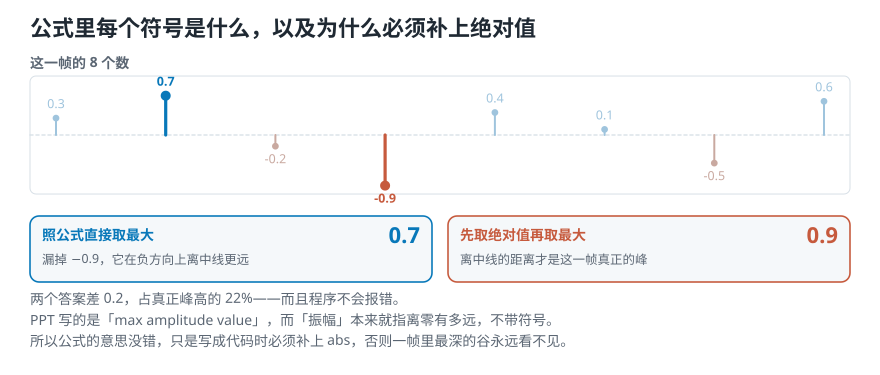

# 不做任何频率分析，只看那条曲线能问出什么？

> **导读：** 上一课把流水线搭好了，「逐帧计算」那一格还空着。这一课填上时域这条的三个答案：**振幅包络**（这一帧最高多少）、**均方根**（这一帧整体多强）、**过零率**（这一帧穿过中线多少次）。三个都不需要任何频率分析，只看那条曲线本身。**它们不是三个可以互换的名字，而是三个不同的问题**——每一个都有自己的公式、自己的弱点、自己的用武之地。这一课把三个公式各拿一个八个数的小帧手算一遍，你拿笔就能核对。

<picture>
  <source media="(max-width: 640px)" srcset="../../零基础版_06-10/figures/mobile/00-course-position-07.svg">
  
</picture>

## 三个时域特征

时域特征就是**直接从那条曲线算出来、不做频率分析**的特征。本课讲三个最常用的，先各用一句话说清它们分别是什么：

- **振幅包络**指的是：一帧里最高的那个数有多大。英文缩写 **AE**。
- **均方根**指的是：一帧整体上有多强，帧里每个数都参与。英文缩写 **RMS**。
- **过零率**指的是：一帧里那条曲线穿过中线多少次。英文缩写 **ZCR**。

<picture>
  <source media="(max-width: 640px)" srcset="../../零基础版_06-10/figures/mobile/07-three-questions.svg">
  
</picture>

*图 1：三个特征各问一个不同的问题。三个答案都在手上，才知道这一帧是「短促一下」还是「一直很响」。*

下面三节各讲一个。为了能拿笔核对，三个公式都用同一个八个数的小帧算：

$$
s = [\,0.3,\; 0.7,\; -0.2,\; -0.9,\; 0.4,\; 0.1,\; -0.5,\; 0.6\,]
$$

这一帧的样本数记作 $K = 8$。

## 振幅包络：这一帧里最高的那个数

**定义：一帧里所有样本中，最大的那个振幅值。**

$$
\mathrm{AE}_t \;=\; \max_{k = t\cdot K}^{(t+1)\cdot K - 1} s(k)
$$

公式看着吓人，逐项拆开只有四样东西：

| 符号 | 是什么 |
|---|---|
| $\mathrm{AE}_t$ | 第 $t$ 帧的振幅包络——**要算的那个结果** |
| $s(k)$ | 第 $k$ 个样本的振幅——**原始的那串数** |
| $K$ | 帧长，一帧有多少个样本 |
| $k = t \cdot K$ | 第 $t$ 帧的**第一个**样本的编号 |
| $(t+1)\cdot K - 1$ | 第 $t$ 帧的**最后一个**样本的编号 |

所以这条式子读出来就是：**在第 $t$ 帧那一段里，从头扫到尾，取最大的那个。** 对每一帧都这么算一次，把结果按时间连起来，就是一条贴着波形外沿走的线。

<picture>
  <source media="(max-width: 640px)" srcset="../../零基础版_06-10/figures/mobile/07-ae-formula.svg">
  
</picture>

*图 2：上面是公式各部分对应什么，下面是这八个数上的实际结果。注意最右边那两个数不一样。*

### 照公式写代码会漏掉一半

拿这八个数跑一遍：

```text
照公式直接取最大    0.7
先取绝对值再取最大  0.9
```

**两个数不一样，差 0.2。**

原因是 $-0.9$：它是负的，但它离中线的距离比 $+0.7$ 更远。**这一帧真正的峰是 0.9，不是 0.7。**

“最大振幅”里的[**振幅**](02-声音与波形-一次振动怎样变成录音里那条线.md)本来就指“离零有多远”，不带符号。所以写成代码时**必须补上绝对值**：

```python
ae = np.max(np.abs(frame))     # 不能写成 np.max(frame)
```

漏掉 `abs`，一帧里最深的那个谷就永远看不见——而对打击类的声音来说，谷往往和峰一样深。

### 优点、缺点、用在哪

- **能粗略反映响度。** 峰越高，通常听着越响。
- **对离群值敏感。** 一帧里只要有一个异常大的数，整帧的结果就被它一个人决定了。一次爆音、一次点击噪声，都会让这一帧的 AE 冲到顶。
- **常见用途：起音检测**（找出每一下是什么时候开始的）、**音乐曲风分类**。

## 均方根：这一帧整体有多强

AE 只看一个数。**RMS 让这一帧里的每一个数都参与。**

$$
\mathrm{RMS}_t \;=\; \sqrt{\frac{1}{K}\sum_{k=t\cdot K}^{(t+1)\cdot K-1} s(k)^2}
$$

这条式子从里往外读，正好三层：

| 这一层 | 在算什么 |
|---|---|
| $s(k)^2$ | 第 $k$ 个样本的**能量** |
| $\sum s(k)^2$ | 这一帧**所有样本的能量加起来** |
| $\frac{1}{K}\sum$ | 除以样本数，得到**平均能量** |
| $\sqrt{\phantom{x}}$ | 再开平方 |

名字就是倒着念这三步：**R**oot（根）· **M**ean（均）· **S**quare（方）。

<picture>
  <source media="(max-width: 640px)" srcset="../../零基础版_06-10/figures/mobile/07-rms-steps.svg">
  
</picture>

*图 3：从八个原始数走到 0.5256，中间三步。*

### 为什么要平方，又为什么要开回来

拿那八个数直接求平均：

```text
直接求平均 = 0.0625
```

几乎是零。**因为正负互相抵消了**——这一帧明明在剧烈振动，直接平均却量不出任何强弱。

平方就解决了这件事：**平方之后全是正数，没有抵消**。

```text
① 每个数平方
   0.09 0.49 0.04 0.81
   0.16 0.01 0.25 0.36
② 全部加起来   2.21
③ 除以 K=8     0.2762
④ 开平方       0.5256
```

那**为什么还要开回来**？因为平方之后量级变了（0.2762 和原始那些数不在一个尺度上）。开平方把它**换回和原始样本一样的量级**，这样 RMS 和 AE 才能画在同一张图上直接比。

### 优点、缺点、用在哪

- **能反映响度**，而且比 AE 更贴近「整体感觉」。
- **比 AE 更不怕离群值。** 一个孤立的尖峰要和其余 $K-1$ 个数一起平均，被稀释掉了。
- **常见用途：音频分段**（把一段长录音切成若干有意义的片段）、**音乐曲风分类**。

## 过零率：这一帧穿过中线多少次

前两个都在量「有多大」。**ZCR 完全不管大小，只数次数。**

**定义：信号穿过横轴的次数。**

<picture>
  <source media="(max-width: 640px)" srcset="../../零基础版_06-10/figures/mobile/07-zcr-definition.svg">
  
</picture>

*图 4：绿点是曲线穿过中线的位置。数它们有几个，就是这一帧的过零次数。*

写成公式：

$$
\mathrm{ZCR}_t \;=\; \frac{1}{2}\sum_{k=t\cdot K}^{(t+1)\cdot K-1}\bigl|\,\mathrm{sgn}(s(k)) - \mathrm{sgn}(s(k+1))\,\bigr|
$$

核心是那个 $\mathrm{sgn}$，叫**符号函数**，它把一个数压成三种情况之一：

$$
\mathrm{sgn}(x) = \begin{cases}
+1 & x > 0\\
-1 & x < 0\\
\ \ 0 & x = 0
\end{cases}
$$

然后看**相邻两个样本的符号一样不一样**：

- 同号，比如 $(+1) - (+1) = 0$，取绝对值除以 2 还是 **0**——没穿过。
- 异号，比如 $(-1) - (+1) = -2$，取绝对值除以 2 得 **1**——穿过了一次。

那个 $\frac{1}{2}$ 就是干这个用的：把「差 2」换算成「1 次」。

### 手算这八个数

```text
原始   0.3  0.7 -0.2 -0.9
       0.4  0.1 -0.5  0.6
符号    +1   +1   -1   -1
        +1   +1   -1   +1
相邻异号？ 0 1 0 1 0 1 1
```

加起来：**这一帧穿过中线 4 次。**

### 一个必须知道的口径差异

手算到“4 次”就结束了——**它给的是一个次数**。但实际使用时，还要除以帧长换成比例，好让不同帧长之间能比。**除数有两种写法**：

```text
除以相邻对的个数 7 = 0.5714
  ← 本课程 soundlab 的口径
除以帧长 8       = 0.5000
  ← librosa 的口径
```

这不是我推的，脚本里真调了一次 librosa 让它自己给：

```text
librosa 实际算出来 0.5000
等于 4/8，确实是除以帧长
zero_crossings(pad=False)
数出 4 次，和上面的手算一致
```

**所以呢？** 两个口径差一个 $K/(K-1)$。帧长 1024 时这个差只有 0.1%，可以忽略；但**同一个数据集必须自始至终用同一个口径**，否则两批数字没法直接比。[第 09 课](09-实现RMS与过零率-先调库再手写然后对齐.md)把手写实现和 librosa 对齐时，第一个要对上的就是这个除数。

### 优点、缺点、用在哪

- **完全不受音量影响。** 把整段乘以 10，穿过中线的次数一次也不会变——下面有实测。
- **不能单独用来判断音高。** 噪声也可能频繁过零；录音里很小的电气抖动还会制造额外的交点。
- **常见用途：**
  - **分辨打击乐和有音高的乐音**——打击声穿零又多又不规则。
  - **单音高估计**——只有一个音在响时，过零次数和音高有直接关系。
  - **语音的清浊音判断**——「s」「f」这类摩擦音的过零率远高于元音。

## 实验：换成真实录音，三条曲线各画各的

运行 [`lesson07_three_time_features.py`](../../课程代码/lessons/lesson07_three_time_features.py)，对 `debussy.wav` 的前 3 秒逐帧算三个数：

```text
66150 个样本，帧长 1024 帧移 512
切出 128 帧
       最小     最大     平均
AE   0.1315  0.2685  0.1808
RMS  0.0426  0.0888  0.0647
ZCR  0.0450  0.0929  0.0654
```

<picture>
  <source media="(max-width: 640px)" srcset="../../零基础版_06-10/figures/mobile/07-three-curves.svg">
  
</picture>

*图 5：四条线共用同一条时间轴。最上面是原始波形，下面三条是逐帧算出的 AE、RMS、ZCR。*

三条曲线都是 128 个点、共用同一条时间轴。但**它们不是彼此的缩放版**——把三条各自除以自己的最大值之后算相关系数：

```text
AE 和 RMS   0.794
AE 和 ZCR  -0.322
RMS 和 ZCR -0.552
```

**所以呢？** AE 和 RMS 高度同向（0.794），因为两个都在量「这一帧振动得多大」。ZCR 和它们是**负相关**，而且明显弱一截——它数的是穿过中线的次数，和振动多大根本不是一回事。

要点不是这个负号有多大，而是：**ZCR 量的是另一件事，不能拿它替代 AE 或 RMS，反过来也不行。**

## 最直接的证据：把整段乘以 10

```text
      原样    ×10 后   倍数
AE   0.1808  1.8081  10.00
RMS  0.0647  0.6465  10.00
ZCR  0.0654  0.0654   1.00
```

AE 和 RMS 严丝合缝地跟着变了 10 倍。**ZCR 一动不动。**

**所以呢？** 乘一个正数不会让曲线多穿过中线一次，也不会少一次。这条性质说明 ZCR 和「录得多响」完全无关——[第 09 课](09-实现RMS与过零率-先调库再手写然后对齐.md)比较语音和噪声时要用到它。

## 这一课得到了什么，下一课接着讲什么

| | AE | RMS | ZCR |
|---|---|---|---|
| 问什么 | 最高多少 | 整体多强 | 穿线多少次 |
| 用几个样本 | 只用最大的那一个 | 全部 $K$ 个 | 全部相邻对 |
| 怕离群值吗 | **很怕** | 不太怕 | 不怕 |
| 受音量影响吗 | 是 | 是 | **完全不受** |
| 常见用途 | 起音检测、曲风分类 | 音频分段、曲风分类 | 打击乐对乐音、单音高估计、清浊音判断 |

三个公式讲完了，**但还没有一行真正能跑在整首曲子上的实现**。上面那些数是脚本算的，脚本里的函数还没拆开看过。

[下一课](08-实现振幅包络-把公式写成能跑的代码.md)从头实现振幅包络：读进三段音乐、画出波形、手写 AE、把帧编号换算成时间、最后把包络叠在波形上——完整走一遍，看看三种曲风的包络长得有多不一样。
