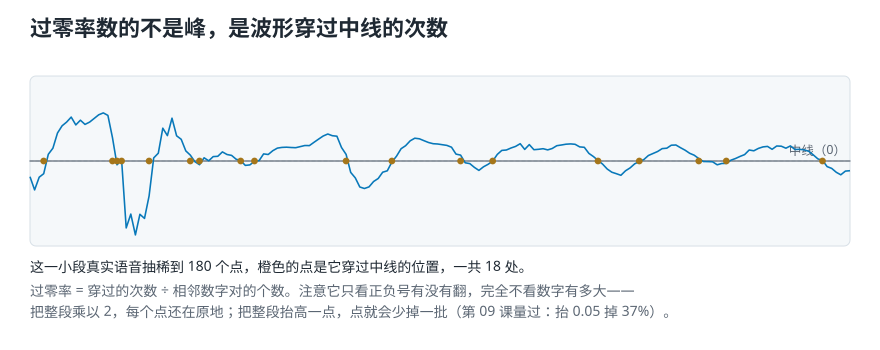
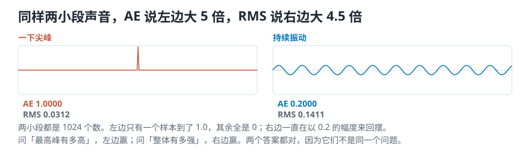
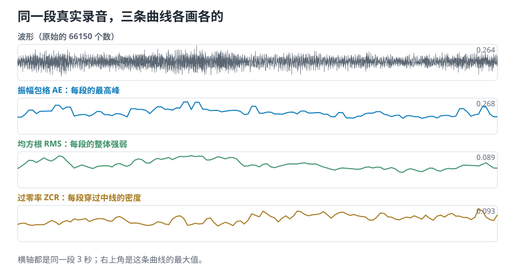
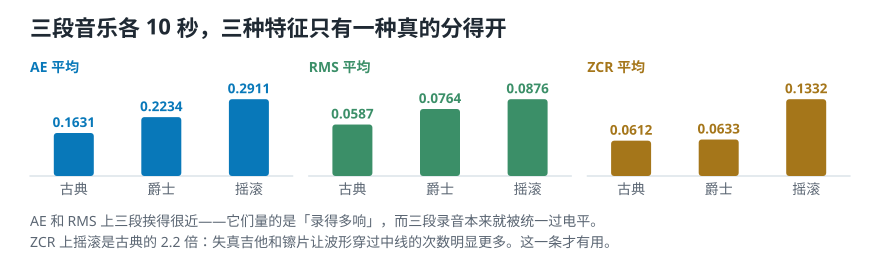

# 同一小段声音，三个数各回答一个问题：振幅包络、RMS 与过零率

> **导读：** 上一课把录音切成了小段。现在每一小段要被概括成一个数——概括成哪个数，决定了你之后还能问什么。**最高峰有多高、整体有多强、上下翻得有多密，是三个不同的问题，三种特征各答一个。** 本文用三段真实音乐算一遍：三个数里只有一个真的分得开古典和摇滚，另外两个量的其实是“谁录得响”。

<picture>
  <source media="(max-width: 640px)" srcset="../../零基础版_06-10/figures/mobile/00-course-position-07.svg">
  
</picture>

## 这三个数是什么

简单来说：**把录音切成小段之后，每一小段可以用三个数来概括——这一段的最高峰有多高、这一段整体有多强、这一段的曲线上下翻越中线有多频繁。** 它们分别叫**振幅包络**（缩写 **AE**）、**均方根**（缩写 **RMS**）和**过零率**（缩写 **ZCR**）。

这三个数都只用录音本身那条起伏的线算出来，不需要先把声音拆成高音和低音。工程上把“沿着时间看这条线”的做法叫**时域分析**，所以这三个数合称**时域特征**。

它们值钱在便宜：三个数各自只要几行代码、算一遍不到一秒，而且**在你还没决定用什么模型之前，它们就已经能告诉你这批录音里三种风格分不分得开**。

<picture>
  <source media="(max-width: 640px)" srcset="../../零基础版_06-10/figures/mobile/07-one-number-vs-three.svg">
  
</picture>

*图 1：左边整段只留一个平均值，问“哪一下是碰撞”就答不上来了；右边切段之后每段算三个数，峰落在第几段看得见。*

## 为什么不先把声音拆成高低成分

把声音拆成高低成分（第 10 课起要讲的做法）能回答的问题多得多。既然如此，为什么还要先学这三个便宜的数？

| | 三个时域特征 | 拆成高低成分 |
|---|---|---|
| 需要先定的参数 | 帧长、帧移 | 帧长、帧移、窗函数、变换点数、单位 |
| 一段 10 秒音乐算一遍 | 约 10 毫秒 | 约 100 毫秒起，看参数 |
| 能回答 | 有多响、变化有多快 | 还包括：由哪些高低成分组成 |
| 答不了 | 这个音是高是低、两件乐器听起来为什么不一样 | —— |
| 写错了容易发现吗 | 容易，三个数都能手算验证 | 难，行列方向写反了图还是画得出来 |

**什么时候这三个数就够了：** 任务只关心“有没有声音”“什么时候变响”“变化是急是缓”。检测机器异响、切掉录音里的静音段、判断一段音频里有没有人在说话，都属于这一类。

**什么时候不够：** 任务要判断音高、要分辨两件乐器、要认出说的是哪个字。这些差别藏在高低成分的分布里，这三个数看不见。

还有一个更实际的理由：**这三个数是检查数据的第一道工具。** 如果三种风格在这三个数上完全分不开，先该怀疑的不是模型，而是数据本身——而这三个数一跑就知道。本文的实验做的就是这件事。

## 三个数各问一个问题

<picture>
  <source media="(max-width: 640px)" srcset="../../零基础版_06-10/figures/mobile/07-three-questions.svg">
  
</picture>

*图 2：三个问题互相不能替代。只知道“最高峰有多高”，答不出“是短促的一下还是一直很响”。*

三个组件的分工：

- **振幅包络**只看一帧里最极端的那一个数字，其余全部丢掉。它回答“这一小段有没有出现过很大的振动”。
- **均方根**把一帧里所有数字一起算进去。它回答“这一小段整体有多强”，因此比只看一个数稳得多。
- **过零率**完全不看数字有多大，只数正负号翻转了几次。它回答“这一小段的波形抖得有多密”，是三个数里唯一一个和“录得多响”无关的。

它们和上一课的关系是：**分帧决定“每次看多长”，这三个特征决定“每次看完之后记下什么”。** 三个都算完，你手里就是三条等长的曲线，横轴是同一条时间轴。

## 核心概念一：振幅包络

**振幅包络**取每帧离中线最远的那一个数，再把这些数按时间连起来，画出录音的外轮廓。注意是「离中线最远」而不是「最大」：录音的数字有正有负，一帧里最深的那个谷和最高的那个峰一样，都是一次很大的振动。

一帧从第 $tK$ 个样本开始、含 $K$ 个样本时（$s$ 是整段录音）：

$$
\mathrm{AE}(t)=\max_{k=tK}^{(t+1)K-1}\left|s(k)\right|
$$

竖线是绝对值，也就是「离中线有多远」。**整条公式只说了一件事：在第 $t$ 帧里，找出离中线最远的那个数。**

- **它的强项：** 对突然出现的尖峰最敏感。找起音、找碰撞、找削波（信号超出录音允许的范围被削平），它一定抓得到。
- **它的弱点：** 一帧里只要有一个异常数字，整帧的结果就被它决定。
- **常用在：** 起音检测、音乐风格分类。

## 核心概念二：均方根

**均方根**把一帧里所有数字先平方、再求平均、最后开平方——名字就是倒着念这三步：根、均、方。

平方是为了让正负不互相抵消。1.0、−1.0、0.5、−0.5 这四个数直接求平均等于 0，可它们每个都不小；平方之后负号消失，再开平方把量级换回来，得到 0.7906。

$$
\mathrm{RMS}(t)=\sqrt{\frac{1}{K}\sum_{k=tK}^{(t+1)K-1}s(k)^{2}}
$$

<picture>
  
</picture>

*图 3：同样那四个数，平方、求平均、再开平方。直接求平均得到 0，均方根得到 0.7906——名字就是倒着念这三步。*

- **它的强项：** 一帧里所有数字都出一份力，所以比只看一个数稳得多，单个坏样本带不偏它。
- **它的弱点：** 正因为稳，孤立的尖峰会被稀释到看不见（[第 09 课](09-RMS与过零率怎么计算-用整体强弱和翻越零线次数检查声音.md)会量出这个稀释有多厉害）。
- **常用在：** 音频分段、音乐风格分类、响度归一化。
- **注意：** 它不是响度。人听到的响还和频率高低、持续多久、播放音量有关，[第 03 课](03-强弱响度与音色-音量一样为什么听起来不同.md)分清过这两件事。

## 核心概念三：过零率

**过零率**数的是这一帧的曲线穿过中线多少次。它完全不看数字有多大，只看正负号。

先给每个数字定一个符号：正数记 $+1$，负数记 $-1$，**恰好等于零的记 $0$**。相邻两个符号只要不同，就算穿过一次：

$$
\mathrm{ZCR}(t)=\frac{1}{2}\sum_{k=tK}^{(t+1)K-2}\left|\operatorname{sgn}(s(k))-\operatorname{sgn}(s(k+1))\right|
$$

<picture>
  
</picture>

*图 4：一小段真实语音，抽稀到 180 个点，橙色的点是它穿过中线的位置，一共 18 处。注意这些点只跟正负号有关——把整段乘以 2，每个点还在原地。*

这条公式给出的是**次数**。本课程统一再除以相邻数字对的个数 $K-1$，把它换成**比例**——这样帧长不同的两批数据也能放在一起比。

**「恰好等于零记 0」这一条不是摆设。** 一个数值正好落在零上的样本，两边各算半次穿越；如果不作处理、直接按正负两分，它会被数成一整次，读数虚高。下面第 1 步的输出里能看到这个差别。

- **它的强项：** 三个数里唯一和「录得多响」无关的（下一节会坐实）。
- **它的弱点：** 录音的底噪会在中线附近制造大量假交点。
- **常用在：** 区分打击类声音和有音高的声音、单音音高估计、语音里判断这一段是浊音还是清音。
- **注意：** 它不能当音高用。摆得快确实会让交点变多，但一段没有稳定起伏规律的声音（工程上叫**噪声**）交点同样很多，它却根本没有音高可言。真要测音高，得等到第 10 课之后的频率分析。

**这一课不写这三个函数。** 三个都只有三四行，难的是边界条件——绝对值的顺序、时间轴怎么对齐、结尾不足一帧怎么办、靠近零的小数算不算穿越、波形整条抬离中线怎么办。这些是[第 08](08-振幅包络怎么计算-从逐帧最大值到可靠时间轴.md)、[第 09](09-RMS与过零率怎么计算-用整体强弱和翻越零线次数检查声音.md) 两课整篇的内容。**先弄清哪个数值得算，再去算它**，顺序反过来会白写很多代码。

## 核心概念四：三个数里只有一个和「录得多响」无关

这是本课要坐实的那一条，也是三个数之间最重要的差别。

**把整段录音乘以一个正数**——也就是把音量调大——会发生什么？

- **振幅包络跟着变。** 每个数字都乘了同一个数，最大的那个也跟着乘，包络整条按比例抬高。
- **均方根跟着变。** 平方、平均、开平方三步都是按比例的，结果同样按比例抬高。
- **过零率一点不变。** 它只看正负号，而**乘以一个正数不会改变任何一个数字的正负号**，所以穿过中线的次数一次不多、一次不少。

结论很硬：**AE 和 RMS 量的是「这段录音有多响」，ZCR 量的是「这段声音抖得有多密」。** 前者会被录音设备、母带处理、播放音量改掉，后者不会。

它答不了的问题也要说清楚：**过零率不能当音高用。** 摆得快确实会让交点变多，但一段没有稳定起伏规律的声音（工程上叫**噪声**）交点同样很多，它却根本没有音高可言。真要测音高，得等到第 10 课之后的频率分析。

## 动手实验：三个数里，哪一个真的分得开古典和摇滚

**这一节要做的事：** 先用两小段自己造的声音，把三个数的分工看清楚；再换成真实录音，看三条曲线长什么样；最后拿三段风格不同的音乐，回答一个能验收的问题——**这三个数里，哪一个真的在量“风格”，哪一个只是在量“谁录得响”？**

环境和音频素材装一次就够，见[课程总纲的「动手之前」](../../课程总纲/README.md)。本课的完整代码在 [`课程代码/lessons/lesson07_three_time_features.py`](../../课程代码/lessons/lesson07_three_time_features.py)，下面每一个数字都能在它的输出里找到同一个；脚本比正文更全，多出参数扫描和边界检查。

### 第 1 步 — 两小段声音，三个数给出三种答案

先造两小段谁都看得懂的声音：一段**只有一个尖峰**（1024 个数字里只有正中间那个是 1.0，其余全是 0），一段是**持续的低频振动**（每秒重复 220 次的规律起伏，最高只到 0.2）。

```python
import numpy as np

SR, N = 22050, 1024
spike = np.zeros(N)
spike[N // 2] = 1.0                                    # 只有一下，但很高
t = np.arange(N) / SR
hum = 0.2 * np.sin(2 * np.pi * 220 * t)                # 一直在响，但不高

for name, sig in [("一下尖峰", spike), ("持续振动", hum)]:
    ae = float(np.max(np.abs(sig)))
    rms = float(np.sqrt(np.mean(sig ** 2)))
    zcr = float(zero_crossing_rate(sig[None, :])[0])    # 实现见第 09 课
    print(f"{name} {ae:.4f} {rms:.4f} {zcr:.4f}")
```

```text
一下尖峰 1.0000 0.0312 0.0000
持续振动 0.2000 0.1411 0.0196
```

<picture>
  <source media="(max-width: 640px)" srcset="../../零基础版_06-10/figures/mobile/07-spike-vs-hum.svg">
  
</picture>

*图 5：同样这两小段声音，振幅包络说左边大 5 倍，均方根说右边大 4.5 倍。两个数都没算错。*

**这六个数字是本课最值得记住的一组。** 逐个读：

- **AE：1.0000 对 0.2000，尖峰是振动的 5 倍。** 因为 AE 只看最高的那一个数，尖峰虽然只出现一瞬，那一瞬确实到顶了。
- **RMS：0.0312 对 0.1411，振动反过来是尖峰的 4.5 倍。** 因为 RMS 把一千多个数一起算，尖峰那一下被另外 1023 个 0 稀释掉了，而振动是每个数字都在出力。
- **ZCR：0.0000 对 0.0196。** 尖峰那一段除了正中间那个 1.0，其余全是零，一次也没有从正跨到负，所以是 0；振动在这 1024 个数里穿了 20 次。**这里有一个陷阱**：恰好等于零的样本既不算正也不算负，处理不当会被数成两次穿越，把尖峰算成 0.0020、振动算成 0.0205。第 09 课会正面处理这一处。

**同一对声音，AE 和 RMS 给出方向相反的结论，而它们都对。** 这说明“哪个特征更准”这个问法不成立——只能问“我要回答的是哪个问题”。找爆音、找碰撞这类**短促一下**的事件用 AE；判断一段整体强弱用 RMS。用反了不会报错，只会安安静静给你一个答不上题的数。

### 第 2 步 — 换成真实录音，三条曲线一起画

`frame()` 是第 06 课写好的分帧函数，这里直接用：

```python
import librosa

y, sr = librosa.load("audio/debussy.wav", sr=22050, mono=True, duration=3.0)
frames = frame(y, 1024, 512)

ae = np.max(np.abs(frames), axis=1)
rms = np.sqrt(np.mean(frames ** 2, axis=1))
zcr = zero_crossing_rate(frames)

print(len(y), frames.shape, ae.shape, rms.shape, zcr.shape)
print(np.round(rms[:5], 4))
```

```text
66150 (128, 1024) (128,) (128,) (128,)
[0.053  0.0596 0.0672 0.076  0.0753]
```

3 秒录音是 66150 个数字，切成 128 帧，三条曲线各 128 个点。**先核对形状，再看数值**：三个 `(128,)` 都对上了帧数，说明 `axis` 没写反。要是哪一个变成了 `(1024,)`，就是沿着错误的方向算了——形状看着也“像对的”，含义完全不同。

<picture>
  <source media="(max-width: 640px)" srcset="../../零基础版_06-10/figures/mobile/07-three-curves.svg">
  
</picture>

*图 6：最上面是原始录音，下面三条曲线来自同一份数据。AE 和 RMS 起伏的形状很像，但 AE 整体更高——它取的是每帧的最高峰。ZCR 完全走自己的路。*

### 第 3 步 — 三段音乐，问一个能验收的问题

取三段风格不同的音乐各 10 秒，每段算出三个数的平均值：

```python
for name in ["debussy", "duke", "redhot"]:
    y, _ = librosa.load(f"audio/{name}.wav", sr=22050, mono=True, duration=10.0)
    f = frame(y, 1024, 512)
    print(name,
          round(float(np.max(np.abs(f), axis=1).mean()), 4),
          round(float(np.sqrt(np.mean(f ** 2, axis=1)).mean()), 4),
          round(float(zero_crossing_rate(f).mean()), 4))
```

```text
debussy 0.1631 0.0587 0.0612
duke    0.2234 0.0764 0.0633
redhot  0.2911 0.0876 0.1332
```

看上去三个数都分得开：摇滚（`redhot`）在 AE 上是古典（`debussy`）的 1.78 倍，RMS 上 1.49 倍，ZCR 上 2.18 倍。**三个都能用？** 先做一步检查。

第 03 课统一过响度：整段乘以一个数，把它拉到同一个电平上。对这三段做同一件事，再算一次：

```python
def rms_normalize(y, target_dbfs=-20.0):
    r = float(np.sqrt(np.mean(y ** 2)))
    return y * (10 ** (target_dbfs / 20) / max(r, 1e-12))
```

```text
debussy 0.2709 0.0975 0.0612
duke    0.2603 0.0890 0.0633
redhot  0.3195 0.0962 0.1332
```

<picture>
  <source media="(max-width: 640px)" srcset="../../零基础版_06-10/figures/mobile/07-music-compare.svg">
  
</picture>

*图 7：上下两排是同一份数据，只差“有没有统一电平”这一步。摇滚对古典的倍数，AE 从 1.78 掉到 1.18，RMS 从 1.49 掉到 0.99，ZCR 一动没动。*

**这一步把三个数分成了两类：**

- **AE 和 RMS 塌了。** 摇滚对古典的倍数从 1.78 和 1.49 掉到 1.18 和 0.99——RMS 那个 0.99 意味着**统一电平之后，摇滚和古典的整体强弱几乎完全一样**。原来那点差别几乎全部来自“这张唱片压得比较响”，和音乐是什么风格没关系。要是不做这一步就把 RMS 喂给程序，程序学会的会是“哪张唱片录得响”，换一批唱片就全错。
- **ZCR 一点没变，还是 2.18 倍。** 因为统一电平只是整段乘一个正数，**每个数字的正负号一个也没变，穿过中线的次数当然一次不多一次不少**。这 2.18 倍是失真吉他和镲片真实带来的差别——它们让波形抖得更密。

**所以这一课的答案是：三个数里只有过零率量的是风格本身。** 另外两个量的是录音电平，除非你先把电平统一掉。

### 加一层：换帧长，看哪个数会跟着变

```python
for n in (256, 1024, 4096):
    f = frame(y, n, n // 2)
    print(n, f.shape[0],
          round(float(np.max(np.abs(f), axis=1).mean()), 4),
          round(float(np.sqrt(np.mean(f ** 2, axis=1)).mean()), 4),
          round(float(zero_crossing_rate(f).mean()), 4))
```

```text
 256 1721 0.1433 0.0585 0.0612
1024  429 0.1631 0.0587 0.0612
4096  106 0.1881 0.0589 0.0613
```

帧长从 256 换到 4096，**AE 的平均值从 0.1433 涨到 0.1881，高了三分之一；RMS 和 ZCR 基本没动。** 原因不难想：AE 只取每帧最高的那一个数，帧越长，一帧里越容易撞上一个高峰，平均值自然往上走。RMS 和 ZCR 是整帧一起算的，帧变长只是把更多数字放进同一次平均，结果差不多。

**这意味着 AE 的数值离开帧长就没有意义。** 两批特征只要帧长不同，AE 那一列就不能放在一起比——而这种错误不会报错，只会让结论慢慢变得不可信。

### 加一层：把三条曲线压成表里的一行

程序通常要求每段录音最终变成相同数量的数字。把每条曲线各取四个统计量，一段 10 秒的音乐就变成 12 个数：

| 风格 | `ae_mean` | `ae_std` | `rms_mean` | `zcr_mean` |
|---|---|---|---|---|
| 古典 | 0.2709 | 0.0650 | 0.0975 | 0.0612 |
| 爵士 | 0.2603 | 0.1327 | 0.0890 | 0.0633 |
| 摇滚 | 0.3195 | 0.1152 | 0.0962 | 0.1332 |

（表里只列了 12 列中的 4 列，其余 8 列是三条曲线各自的最大值和最小值。）

注意 `ae_std` 这一列（它衡量这条曲线忽高忽低的程度）：古典 0.0650，爵士 0.1327。**爵士的起伏是古典的两倍**——统一电平之后 AE 的平均值已经分不开三种风格，但它的“忽大忽小程度”还留着信息。**平均值分不开，不等于这条曲线没用。**

这张表就是课程项目里 `features.csv` 的前 12 列。第 09 课会把它真正写进文件。

## 这三处最容易把结果算错

**边界：三条曲线必须来自同一次分帧。** 如果 AE 用了 1024 的帧长、RMS 用了 2048，两条曲线长度不同，画在一起就对不齐，而程序不会提醒你。**先算一次 `frames`，再从它算出三个数**，是最省事的防错法。

**数值稳定性：先统一电平，再算 AE 和 RMS。** 顺序反了不会报错，只会让这两列量到「谁录得响」。ZCR 不受这一步影响，但它有另外两个自己的坑（零线阈值、直流偏置），第 09 课单独处理。

**可复现：AE 必须和帧长一起记录。** 上面量到了，帧长从 256 换到 4096，AE 平均值涨三分之一。所以特征表里存的不能只是 `ae_mean = 0.1631`，还得记着它是用哪组帧长帧移算出来的。这三个参数同样进[第 04 课](04-采样率与位深-44.1kHz和16bit决定了什么.md)那个 `config.py`，后面两课还会往这张表上加。

## 常见问题

**Q1：这三个特征最容易写错的是哪里？**

`axis` 写反。`np.mean(frames ** 2, axis=1)` 是每帧算一个数，`axis=0` 是把所有帧的同一个位置平均起来——形状看着也“对”，含义完全错。**每写完一个特征函数，先打印形状，确认它等于帧数。**

**Q2：AE 和 RMS 到底该用哪个？**

问你要找的是“一下”还是“一片”。找爆音、找敲击、找削波用 AE，因为它对单个极端值最敏感；判断整段有多强、算响度类指标、做归一化用 RMS，因为它稳定，不会被一个坏样本带偏。**两个都算上也完全可以**——它们只有一行代码的成本，而且 AE 和 RMS 的比值本身就有用：比值大说明这一段是尖锐的瞬间事件，比值小说明是持续的声音。

**Q3：结果不对怎么排查？**

按这个顺序：

1. 打印三条曲线的形状，都应该等于帧数。
2. 检查 AE 是不是恒等于 RMS 的某个固定倍数。如果是，多半是 `np.abs` 忘了写，或者两个函数复制粘贴串了。
3. 检查 ZCR 是不是接近 0.5。那说明相邻样本几乎每次都在变号，通常是数据里混进了随机噪声，或者读文件时把字节顺序读错了。
4. 把三条曲线和原始波形画在一起看。AE 的峰应该落在波形最高的地方，对不上就是时间轴标错了（第 08 课专门讲这件事）。

**Q4：实际项目里最该注意什么？**

**先统一电平，再算特征。** 本文的实验就是为这件事做的：不统一，AE 和 RMS 量的是录音电平；统一了，它们才开始量声音本身。这一步做不做，改变的不是准确率高几个点，而是结论对不对。

## 速查表

| 特征 | 回答什么 | 怎么算 | 常用在 | 电平 | 帧长 |
|---|---|---|---|---|---|
| 振幅包络 AE | 这一帧最高峰有多高 | 先取绝对值，再取最大值 | 起音检测、削波检查、风格分类 | 会变 | 会变，帧越长越大 |
| 均方根 RMS | 这一帧整体有多强 | 平方 → 求平均 → 开平方 | 音频分段、响度归一化、风格分类 | 会变 | 基本不变 |
| 过零率 ZCR | 波形穿过中线有多密 | 数正负号翻转次数，除以 $K-1$ | 打击类 vs 有音高、单音音高估计、清浊音判别 | **不变** | 基本不变 |

三个函数怎么写、边界条件怎么处理，在[第 08 课](08-振幅包络怎么计算-从逐帧最大值到可靠时间轴.md)和[第 09 课](09-RMS与过零率怎么计算-用整体强弱和翻越零线次数检查声音.md)。

| 参数 | 本文取值 | 改了会怎样 |
|---|---|---|
| 采样率 | 22050 | 三个数全变，两批特征不能比 |
| 帧长 / 帧移 | 1024 / 512 | AE 明显变，RMS 与 ZCR 基本不变 |
| 统一电平 | −20 dBFS | 不做的话，AE 与 RMS 量的是录音电平 |

## 接下来学什么

1. **第 06 课**：把整段录音切成小段。
2. **本课**：每一小段该记下哪三个数，以及哪个数真的有用。
3. **第 08 课**：把振幅包络写成能用的函数——难点不在取最大值，在时间轴怎么对准。
4. **第 09 课**：把 RMS 和过零率写完，产出第一版特征表。
5. **第 10 课起**：换个角度，不看时间看频率。

下一课只做一件事：把“每帧取最大值”这句话变成一个不会算错的函数。听起来一行就够，实际上有三个坑——绝对值的顺序、结尾不足一帧的那一小截，以及每个点该标在时间轴的哪个位置。
