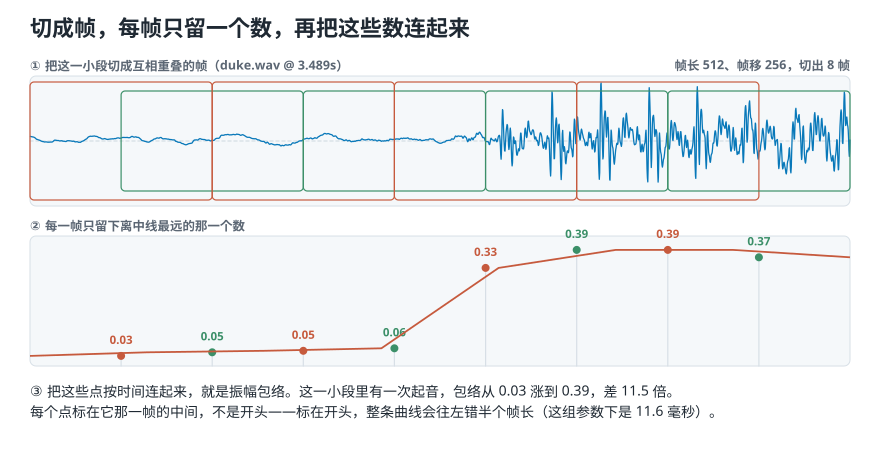
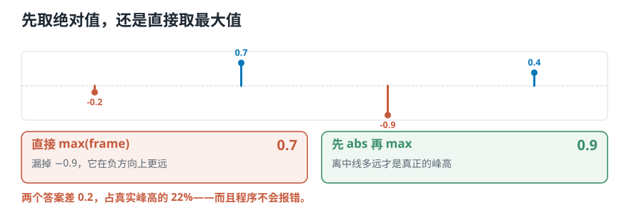

# 程序怎样画出录音的外轮廓？——逐帧取最大值，再把时间轴对准

> **导读：** 振幅包络的定义只有一句话：**每一小段里取离中线最远的那个数**。可这句话写成代码，有四个地方会安静地出错——绝对值的顺序、帧长、结尾不足一帧的那一小截、还有每个点该标在时间轴的哪个位置。本文把这四处逐个量一遍：时间轴标错的那一处，能让包络的峰和录音的峰差 28.5 毫秒，而画出来的图看着完全正常。

<picture>
  <source media="(max-width: 640px)" srcset="../../零基础版_06-10/figures/mobile/00-course-position-08.svg">
  
</picture>

## 振幅包络是怎么算出来的

简单来说：**把录音切成许多小段，每段留下离中线最远的那一个数字，再把这些数按时间连成一条线。** 这条线贴着录音的外沿走——哪里有敲击，它就抬起来；安静下来，它就落回去。上一课介绍过它叫**振幅包络**。

它值钱的地方在于把“这段录音里什么时候响过”变成了一条可以逐点比较的曲线。想自动找出录音里每一次敲击发生在第几秒，这是最省事的一条路。

<picture>
  
</picture>

*图 1：素材是 `duke.wav` 第 3.489 秒那一小段，里面正好有一次起音。上格橙绿相间的方框是互相重叠的帧；下格每个点是对应那一帧里离中线最远的那个数，八个点从 0.03 涨到 0.39，差 11.5 倍。每个点标在它那一帧的中间。*

## 为什么一句话的定义，实现起来会错

公式短不等于好写。**这句定义里有四个词没说清楚，每一个都得你自己定，而且定错了程序都不报错。**

| 定义里没说的 | 你必须做的决定 | 定错了会怎样 |
|---|---|---|
| “离中线最远” | 先取绝对值再取最大值，还是直接取最大值 | 所有向下的峰全被漏掉 |
| “切成小段” | 每段多长 | 太长，两下相邻的敲击会并成一下 |
| 录音结尾 | 不足一段的那一小截怎么办 | 两批数据帧数不一致，没法比较 |
| “按时间连起来” | 每个点标在小段的开头还是中间 | 整条曲线平移半个帧长 |

最后一条最阴险：**曲线画出来形状完全正常，只是整体往右挪了一点。** 你不会发现，直到用它去定位事件时才发现每个事件都晚了几十毫秒。本文的实验会把这个偏差量出来。

**什么时候需要这么小心：** 要用包络定位事件的时间（找起音、找碰撞、切分音符），四个决定都得写对。

**什么时候可以放松：** 只要一个整段的统计量（比如整段包络的平均值和起伏程度），时间轴标在哪里就无所谓了——反正最后要把时间压掉。但即使这时，帧长仍然要记录，上一课量过：帧长从 256 换到 4096，包络平均值会涨三分之一。

## 核心概念一：先取绝对值，再取最大值

录音里的数字有正有负。正负只说明空气是被推出去还是被拉回来，**离中线远才代表振动大**。所以一帧里最深的那个谷，和最高的那个峰一样重要。

<picture>
  <source media="(max-width: 640px)" srcset="../../零基础版_06-10/figures/mobile/08-abs-first.svg">
  
</picture>

*图 2：上半直接比大小，最大的是 0.7；下半先量“离中线有多远”，答案是 0.9。同一组数字，两种做法差 22%。*

公式在[第 07 课](07-振幅包络RMS与过零率-不用频谱能看出什么.md)给过了，这里只看它写成代码是什么样：

```python
ae = np.max(np.abs(frames), axis=1)
```

**常见错误：写成 `np.max(frames, axis=1)`。** 少了 `np.abs`，向下的峰全被忽略。这个错误在音乐上尤其难发现，因为波形通常上下大致对称，算出来的曲线看着也像模像样，只是系统性地偏小。

## 核心概念二：帧长决定两下敲击分不分得开

帧越短，包络上的点越密，短促变化的位置越清楚；帧越长，一个点概括的时间越长，曲线越平滑，**也越容易把两个挨着的峰合成一个**。

这不是“看起来平滑一点”的美学问题，而是一条可以量的界线：**帧长一旦超过两个事件之间的间隔，这两个事件就会落进同一帧，从此在包络上只剩一个峰。**

<picture>
  <source media="(max-width: 640px)" srcset="../../零基础版_06-10/figures/mobile/08-frame-length.svg">
  
</picture>

*图 3：两下敲击相隔 30 毫秒。帧长 256 个样本（11.6 毫秒）时数得出两个峰；换成 1024（46.4 毫秒）就只剩一个，那一下永远找不回来了。*

所以选帧长的顺序是：**先问你要分开的事件间隔多久，再倒推帧长。** 说话时相邻音素大约几十毫秒，鼓点之间可以短到十几毫秒，机器碰撞可能只有几毫秒。没有通用最佳值。

## 核心概念三：每个点该标在时间轴的哪里

一帧覆盖的是一段时间，不是一个瞬间。把这一帧算出的那个数画到图上时，横坐标该取哪里？

- **标在帧的开头**：第 0 帧标在 0 秒，第 1 帧标在帧移对应的时刻，以此类推。写起来最省事。
- **标在帧的中间**：每个点往右挪半个帧长。

<picture>
  <source media="(max-width: 640px)" srcset="../../零基础版_06-10/figures/mobile/08-time-axis.svg">
  
</picture>

*图 4：同一帧、同一个数值，两种标法差半个帧长。帧长 1024、采样率 22050 时，这是 23.22 毫秒。*

**该用帧中心。** 理由很直接：这个数是整帧一起算出来的，它代表的是这一帧覆盖的那段时间，用中点代表一段时间比用起点更公平。用起点等于系统性地把每个事件报早了半个帧长。

```python
def frame_times(m, hop_length, frame_length, sr):
    return (np.arange(m) * hop_length + frame_length / 2) / sr
```

**常见错误：调库的时候忘了库已经替你做过这件事。** `librosa.frames_to_time()` 默认按帧中心算，如果你自己又加了半帧，就往右挪了两次。下面的实验里有一个能验收的检查办法。

## 动手实验：写出一条能和波形对齐的振幅包络

**这一节要做的事：** 从四个数字开始，一步步把上面三个决定落到代码里；最后做一次**对齐检查**——包络最高的那一帧，和录音里最响的那个样本，应该落在同一个时刻。这个检查能一次性验出绝对值和时间轴两处错误。

环境和音频素材装一次就够，见[课程总纲的「动手之前」](../../课程总纲/README.md)。本课完整代码在 [`课程代码/lessons/lesson08_amplitude_envelope.py`](../../课程代码/lessons/lesson08_amplitude_envelope.py)，下面每个数字都能在它的输出里找到；脚本还多做了三种写法的耗时对比。

### 第 1 步 — 四个数字，先把绝对值这一步坐实

```python
import numpy as np

four = np.array([-0.2, 0.7, -0.9, 0.4])
print(four.max())            # 直接比大小
print(np.abs(four).max())    # 先量离中线的距离
```

```text
0.7
0.9
```

**差 0.2，占正确答案的 22%。** 四个数里离中线最远的是 −0.9，可它是负数，直接比大小时排在最后。真实录音一帧有一千多个数字，这种漏掉不会只发生一次，而是每一帧都发生。

### 第 2 步 — 真实录音上跑一遍，先核对帧数

```python
import librosa

y, sr = librosa.load("audio/debussy.wav", sr=22050, mono=True, duration=3.0)
frames = frame(y, 1024, 512)              # 第 06 课的分帧函数
env = np.max(np.abs(frames), axis=1)

print(len(y), 1 + (len(y) - 1024) // 512, env.shape, round(float(env.max()), 4))
```

```text
66150 128 (128,) 0.2685
```

**先手算、再和代码对**，这是防错成本最低的一步：$1+\lfloor (66150-1024)/512 \rfloor = 128$，代码给出的也是 128。对不上就是参数传错了，不用往下查。

顺便看一眼结尾丢了多少：

```python
used = (128 - 1) * 512 + 1024
print(used, len(y) - used, round((len(y) - used) / sr * 1000, 2))
```

```text
66048 102 4.63
```

**102 个样本、4.63 毫秒没进任何一帧。** 对一段音乐来说无所谓；但如果录音很短，或者你要找的那一下正好在最末尾，它就没了。第 3 个“加一层”给出三种处理办法。

### 第 3 步 — 对齐检查：包络的峰落在正确的时刻吗

这一步是本课的验收标准。**录音里最响的那个样本在第几秒，包络最高的那一帧就该标在第几秒**——两者最多差半帧，差得更多就是标错了。

```python
peak_time = int(np.argmax(np.abs(y))) / sr        # 录音里最响的位置
k = int(np.argmax(env))                           # 包络最高的那一帧

t_start  = k * 512 / sr                           # 标在帧开头
t_center = (k * 512 + 1024 / 2) / sr              # 标在帧中间
print(round(peak_time, 4), round(t_start, 4), round(t_center, 4))
```

```text
1.0502 1.0217 1.0449
```

- **标在帧开头：1.0217 秒，比真实位置早了 28.5 毫秒。**
- **标在帧中间：1.0449 秒，只差 5.3 毫秒**——这 5.3 毫秒是帧内部的位置差，无法再小，因为一帧只给一个数。

28.5 毫秒是什么概念？它比两下鼓点之间的间隔还长。**用这条曲线去标注事件，每个事件都会被系统性地报早一点，而图上看不出任何异常。** 所以这个对齐检查值得每次都跑一遍。

### 加一层：帧长换三种，两下敲击还剩几个峰

造两下相隔 30 毫秒的敲击，用三种帧长各算一次包络，数一数峰：

```text
  帧长    覆盖时间   帧数   数出几个峰
   256    11.6 ms    85       2
  1024    46.4 ms    20       1
  4096   185.8 ms     4       1
```

**帧长 256 覆盖 11.6 毫秒，比 30 毫秒的间隔短，两下分得开；换成 1024，覆盖 46.4 毫秒，已经比间隔长，两下落进同一帧，包络上只剩一个峰。** 第二下不是变模糊了，是彻底没了——后面无论用什么办法都补不回来。

这就是“帧长必须短于你想分开的两个事件之间的间隔”的实测版本。

### 加一层：结尾那一小截，三种处理各得到多少帧

<picture>
  <source media="(max-width: 640px)" srcset="../../零基础版_06-10/figures/mobile/08-tail.svg">
  
</picture>

*图 5：橙色叉是丢掉不足一帧的尾部；绿色短框是保留短帧；补零则把最后一帧填满。*

同一段 3 秒录音，三种规则的结果：

| 规则 | 帧数 | 具体情况 |
|---|---|---|
| 丢掉尾巴 | 128 | 最后 102 个样本没用上 |
| 保留短尾帧 | 130 | 有 2 帧不满一帧，只有 614 和 102 个样本 |
| 补零到整帧 | 129 | 补进去 410 个零 |

三种都对，各有代价：

- **丢掉尾巴**：帧数最整齐，代价是最后 4.63 毫秒的声音不进结果。
- **保留短尾帧**：一点声音都不丢，代价是最后两帧用的样本数和别的帧不同。对振幅包络影响不大（取最大值不看用了多少个数），**但对 RMS 影响很大**——它要除以样本个数，短帧会算出偏高或偏低的值。
- **补零到整帧**：每帧长度一致。对包络无害（补的零不会成为最大值），对 RMS 同样有害，因为那些零会把平均值拉低。

**没有一种规则永远正确，但整个数据集必须用同一种，而且写进配置。** 训练时保留短尾帧、上线时丢掉尾巴，两边的帧数就对不上了。

### 加一层：和 librosa 对齐，为什么它多出两帧

| 分帧方式 | 帧数 |
|---|---|
| 我们的 `frame()` | 128 |
| librosa `center=False` | 128 |
| librosa `center=True` | 130（两头各补了 512 个零） |

`center=True` 是 librosa 一系列函数的默认行为：**它在录音两头各补半帧的零，好让第 0 帧的中心正好落在 0 秒。** 代价是多出两帧，而且开头结尾那两帧有一半内容是凭空补的零。

两种都合理，**危险的是混用**：你自己算的特征用 `center=False`，别人给你的用 `center=True`，两批数据的第 $k$ 帧对应的其实不是同一时刻，整体差半帧。合并之前先对一次帧数，是最省事的检查。

### 加一层：三种写法，哪种最快

同一条包络，三种写法算 30 秒音乐：

```text
逐个样本的 Python 循环    156.6 毫秒
每帧一次 numpy 切片        1.66 毫秒
下标表一次取出所有帧        4.68 毫秒
```

**逐个样本的循环慢了两个数量级，这没有悬念。** 意外的是第三行：下标表并不是最快的，因为它要把 `(帧数, 帧长)` 这张表整个复制出来，而这里只从每帧取一个最大值，复制的成本没赚回来。

**那还要不要用下标表？** 要——当同一批帧要反复使用的时候。下一课要在同一次分帧上算三个特征，切一次用三回，这时候下标表就划算了。**“哪种写法快”取决于你接下来要用它做几件事，不是一个固定答案。**

## 这三处最容易把结果算错

**边界：包络和 RMS 对尾帧的敏感程度不一样。** 上面说过，补零和短尾帧对取最大值几乎无害，对求平均却有害。所以**别把“尾帧规则”当成一个可以随手改的参数**——改它会让同一份录音的包络纹丝不动、RMS 却变了，这种不一致最难查。

**数值稳定性：多声道要先说清楚怎么处理。** 立体声录音是两条曲线。最简单的做法是先混成单声道再算；但如果任务关心左右差别，就该分别算两条包络。**不要对两个声道取最大值再合并**——那样得到的曲线不对应任何一个真实声道。

**可复现：包络的数值离开三个参数就没有意义。** 帧长、帧移、尾帧规则，缺一个都无法复现。写进 `config.py`，并且在特征表里连参数一起存。

## 常见问题

**Q1：最容易写错的是哪里？**

`np.abs` 忘了写。它不报错、不改变曲线形状，只让所有数值系统性地偏小。**自查办法：把包络画在波形上，它应该正好贴着波形的外沿。** 穿进波形内部就是漏了绝对值。

**Q2：振幅包络和均方根，什么时候会给出不同的答案？**

上一课量过：一帧里只有一个尖峰时，包络说满格、均方根说十分之一。**包络对单个极端值敏感，均方根对整帧的整体强弱敏感。** 具体到工程上：找削波和爆音用包络，因为它一定会抓到那一个越界的样本；做响度归一化用均方根，因为一个坏样本不该决定整段的增益。

**Q3：包络算出来不对，怎么排查？**

按这个顺序：

1. 手算帧数，和 `env.shape[0]` 对。对不上是参数传错。
2. 做上面第 3 步的对齐检查。差半帧左右就是时间轴标法的问题。
3. 把包络画在波形上。整体偏低是漏了 `np.abs`；穿过波形是画反了坐标。
4. 检查是不是对同一段录音用了两套帧长——三条曲线长度不同就会对不齐。

**Q4：实际项目里最该注意什么？**

**先固定参数，再算特征；不要边调参数边看结果。** 帧长改一次，包络的每一个数都变了，之前算好的表就作废。把帧长、帧移、尾帧规则和时间轴标法四件事在项目开始时定下来写进配置，比事后发现两批特征对不上要省事得多。

## 速查表

| 决定 | 本文取值 | 写错的后果 |
|---|---|---|
| 绝对值顺序 | 先 `abs` 再 `max` | 向下的峰全漏掉，数值系统性偏小 |
| 帧长 | 1024（46.4 毫秒） | 超过事件间隔，两个峰并成一个 |
| 帧移 | 512（23.2 毫秒） | 决定曲线上点的密度 |
| 尾帧规则 | 丢掉不足一帧的部分 | 两批数据帧数不一致 |
| 时间轴 | 帧中心 | 标在帧起点，事件全部报早 23.22 毫秒 |

| 检查 | 怎么做 | 通过的标准 |
|---|---|---|
| 帧数 | 手算 $1+\lfloor (L-K)/H \rfloor$ | 和 `env.shape[0]` 一致 |
| 对齐 | 比较波形最响的时刻和包络最高帧的时刻 | 相差不超过半帧 |
| 绝对值 | 把包络画在波形上 | 贴着外沿，不穿进去 |

## 接下来学什么

1. **第 07 课**：三个时域特征各回答什么问题。
2. **本课**：把振幅包络写成一个能和波形对齐的函数。
3. **第 09 课**：把均方根和过零率写完，并回答一个新问题——两个特征一起看，真的比只看一个强吗？
4. **第 10 课**：换个角度，从“有多响”走到“由哪些频率组成”。

下一课会把“两个数一起看更好”这句常见的话拿去实测。答案有点扫兴：确实更好，但只多了 2.2 个百分点。
