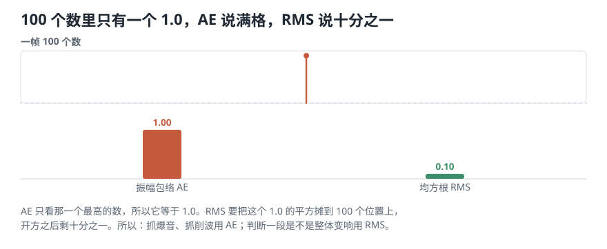

# 一段声音整体有多强、抖得有多密？——RMS 与过零率怎么算

> **导读：** 上一课把振幅包络写完了，它只看每帧最高的那一个数。这一课写另外两个：**均方根把一帧里所有数字一起算，过零率干脆不看数字大小，只数正负号翻了几次。** 两个函数各只有三四行，难的是它们各自会在什么地方骗你——过零率会因为波形整条抬高 0.05 而凭空掉 37%，而“两个特征一起看更好”这句常听的话，实测下来只多了 2.2 个百分点。

<picture>
  <source media="(max-width: 640px)" srcset="../../零基础版_06-10/figures/mobile/00-course-position-09.svg">
  
</picture>

## 这一课要写的是什么

两个函数：**均方根**（缩写 **RMS**，一帧整体有多强）和**过零率**（缩写 **ZCR**，一帧的曲线穿过中线有多密）。它们的定义和公式在[第 07 课](07-三个时域特征-不做频率分析能问出什么.md)，这一课只做一件事：**把它们写成不会算错的代码。**

两个函数各只有三四行，可它们各自有一处会安静骗人的地方——一个把孤立尖峰稀释到看不见，一个会因为那条录音曲线（也就是**波形**，[第 02 课](02-声音与波形-振动怎样变成录音里那条线.md)讲过它记的是什么）整条抬高一点就凭空掉三成。这两处是本课的正题。

它们和上一课的振幅包络建在同一次分帧上：**切一次，用三回。** 这是[第 08 课](08-振幅包络怎么计算-从逐帧最大值到可靠时间轴.md)末尾留下的伏笔——正因为要复用，把所有帧一次取成一张 `(帧数, 帧长)` 的表才划算。

## 为什么三四行的函数还值得单开一课

两个函数加起来不到十行，公式上一课也给完了。那为什么还要一整课？

因为**它们出错的时候不报错**。下面这张表列的是本课会逐个量出来的四处：

| 会发生什么 | 表现出来是 | 会报错吗 | 量出来是多少 |
|---|---|---|---|
| 孤立尖峰被均方根稀释 | 一次削波和一段呼吸声读数差不多 | 不会 | 帧长 1024 时只值 0.0312 |
| 波形整条抬离中线 | 过零率凭空变小 | 不会 | 抬高 0.05 就掉 37% |
| 底噪在中线附近抖 | 过零率凭空变大 | 不会 | 阈值 0 与 0.01 差 15% |
| 结尾那一帧不满 | 均方根被除错了数 | 不会 | 短帧只有 102 个样本 |

**四处都不会让程序停下来，只会让数字慢慢变得不可信。** 这一课就是把这四处逐个坐实，然后给出对策。

顺带说一句为什么标准做法是均方根而不是「先取绝对值再求平均」——后者其实也能用，那四个数会得到 0.75，同样不为零。**选均方根的理由是它和能量直接相关**：平方之后的平均值正比于这段振动携带的能量，所以整个音频和电学领域都用它。跨工具、跨文献比较数字时，大家说的 RMS 是同一件事。

## 核心概念一：写成代码只有一行，但有一处要当心

第 07 课那三步——平方、求平均、开平方——写成代码是这样：

```python
rms = np.sqrt(np.mean(frames.astype(np.float64) ** 2, axis=1))
```

`axis=1` 沿着「一帧内部」这个方向求平均，于是每一帧塌成一个数。

**常见错误：忘了 `astype(np.float64)`。** 音频常以 32 位浮点存放，平方之后很小的数会更小。3 秒音乐不会出问题，但一段很安静的录音累加上百万个平方项时，精度会肉眼可见地掉。**先转成 64 位再算，成本只有多占一点内存。**

## 核心概念二：一个孤立尖峰，两个特征分道扬镳

<picture>
  <source media="(max-width: 640px)" srcset="../../零基础版_06-10/figures/mobile/09-ae-vs-rms-outlier.svg">
  
</picture>

*图 1：100 个数字里只有一个是 1.0，其余全是 0。振幅包络说 1.00，均方根说 0.10。*

这个 10 倍的差距不是巧合，它有一条能手算的规律：**一帧有 $K$ 个数字、其中只有一个是 $A$ 时，RMS 恰好等于 $A/\sqrt{K}$。** $K=100$ 时是 $1/10$，$K=1024$ 时是 $1/32$。

**所以帧越长，一个孤立尖峰在 RMS 上就越不起眼。** 这正是设计意图：RMS 要回答的是“这一帧整体有多强”，一个样本不该左右它。反过来，**要找的就是那个孤立样本时（削波、爆音、点击噪声），必须用振幅包络**，RMS 会把它稀释到看不见。

## 核心概念三：中线在哪里，由你决定

过零率的定义只依赖一件事：**中线在哪里。** 它默认中线就是 0。可如果整条波形被抬高了一点，中线相对波形就不在中间了——低处的摆动够不着零线，穿越次数凭空减少。

<picture>
  <source media="(max-width: 640px)" srcset="../../零基础版_06-10/figures/mobile/09-zcr-offset.svg">
  
</picture>

*图 2：同一小段真实语音，只是整条向上平移。声音一点没变，过零率却一路往下掉。*

这种“整条抬离中线”在真实录音里很常见，来自录音设备的**直流偏置**——声卡或前级给信号加了一个恒定的小量。它在波形图上几乎看不出来，却能实实在在改变过零率。

**对策只有一行：算过零率之前，先减去整段的平均值。**

```python
y = y - y.mean()        # 把中线拉回 0
```

**常见错误：以为归一化已经处理了这件事。** 除以峰值只改变幅度，不改变中线位置；抬高 0.05 的波形除以峰值之后，仍然是抬高的。**幅度归一化和去偏置是两件事，都要做。**

## 动手实验：把两个特征写完，并量一次“两个一起看强多少”

**这一节要做的事：** 前两步先在几个手算得出来的小例子上把公式坐实；第三步换成五段真实素材；最后回答一个大家都在说、却很少有人量过的问题——**“两个特征一起看比单看一个好”，到底好多少？**

环境和音频素材装一次就够，见[课程总纲的「动手之前」](../../课程总纲/README.md)。本课完整代码在 [`课程代码/lessons/lesson09_rms_zcr.py`](../../课程代码/lessons/lesson09_rms_zcr.py)，跑完还会把第一版 `features.csv` 写到当前目录。

### 第 1 步 — 四个数，把三步走一遍

```python
import numpy as np

q = np.array([1.0, -1.0, 0.5, -0.5])
print(q.mean())                     # 直接求平均
print((q ** 2).tolist())            # 方
print((q ** 2).mean())              # 均
print(np.sqrt((q ** 2).mean()))     # 根
```

```text
0.0
[1.0, 1.0, 0.25, 0.25]
0.625
0.7906
```

**从 0 变成 0.7906**，而且这个数和原来那四个数字量级相当——0.7906 落在 0.5 和 1.0 之间，正是这一组数该有的“平均强度”。如果少了最后一步开平方，结果是 0.625，量级对不上，没法和振幅包络比较。

### 第 2 步 — 100 个数里只有一个 1.0

```python
one = np.zeros(100)
one[50] = 1.0
print(np.abs(one).max(), np.sqrt(np.mean(one ** 2)))
```

```text
1.0 0.1
```

再验证一下 $A/\sqrt{K}$ 这条规律：

| 一帧有几个数 $K$ | 只有一个 1.0 时的 RMS | $1/\sqrt{K}$ |
|---|---|---|
| 4 | 0.5000 | 0.5000 |
| 100 | 0.1000 | 0.1000 |
| 1024 | 0.0312 | 0.0312 |

**帧长 1024 时，一个满刻度的孤立尖峰在 RMS 上只值 0.0312。** 这个数字比很多正常录音的 RMS 还低——也就是说，**光看 RMS，一次削波和一段安静的呼吸声长得一模一样。** 要抓削波，必须同时看振幅包络。

### 第 3 步 — 五段真实素材

取五段素材各 3 秒，各自除以自身峰值（这样比的是声音本身，不是谁录得响），帧长 400、帧移 160：

| 素材 | RMS 平均 | ZCR 平均 |
|---|---|---|
| 古典 | 0.2400 | 0.0655 |
| 爵士 | 0.1353 | 0.0356 |
| 摇滚 | 0.1266 | 0.1260 |
| 语音 | 0.1483 | 0.0922 |
| 噪声 | 0.1605 | 0.1141 |

两个观察，方向相反：

- **语音 0.0922 和噪声 0.1141 在过零率上挨得太近。** 教材里常说“噪声的过零率明显高于语音”，在这一对素材上并不成立——两个数只差 24%，而它们各自在不同帧之间的起伏比这还大。**别把教材里的定性说法当成你手上数据的结论，量一次再说。**
- **古典 0.0655 和摇滚 0.1260 差了近一倍。** 这一对分得开，原因上一课说过：失真吉他和镲片让波形穿过中线的次数明显更多。

### 加一层：整条波形抬高一点，过零率掉多少

```python
for d in (0.0, 0.02, 0.05):
    print(d, zero_crossing_rate(frame(y + d, 400, 160)).mean())
```

```text
0.00   0.0922
0.02   0.0770     比原来低 16%
0.05   0.0584     比原来低 37%
```

**这段语音一个数字都没被改变过内容，只是整条曲线抬高了 0.05——过零率就掉了 37%。** 0.05 相对于满刻度 1.0 是很小的量，播放出来完全听不出区别。

如果你的数据集里一半录音有偏置、一半没有，过零率这一列量到的就是“用了哪台设备”，不是声音本身。**减去均值这一行，是整条流水线上最便宜的一次保险。**

### 加一层：零线阈值该设多大

把离中线很近的小数当成零，能压掉底噪制造的假交点。阈值设多大有讲究：

| 零线阈值 | 语音的过零率 |
|---|---|
| 0 | 0.0922 |
| 0.0001 | 0.0921 |
| 0.01 | 0.0782 |

**0.0001 几乎没有影响，说明这段录音在中线附近确实很干净；0.01 把读数压低了 15%，已经在删真实的摆动了。** 合理的做法是先看一眼这段录音安静处的幅度大概是多少，取比它稍大的值，**然后整个数据集用同一个阈值，写进配置**。

### 加一层：“两个一起看更好”，好 2.2 个百分点

这是本课的正题。古典和摇滚各 411 帧，一共 822 帧，逐帧判断它属于哪一类：

- 只看 RMS，把所有可能的分界线都试一遍，取最好的那条；
- 只看 ZCR，同样处理；
- 两个一起看，按到两类中心的距离归类。

<picture>
  <source media="(max-width: 640px)" srcset="../../零基础版_06-10/figures/mobile/09-joint.svg">
  
</picture>

*图 3：横轴 RMS、纵轴 ZCR，每个点是一帧。两团点在两个方向上都有重叠，合起来才把交界处那一小块分开。*

| 用什么判断 | 822 帧里分对的比例 |
|---|---|
| 只看 RMS | 91.0% |
| 只看 ZCR | 84.1% |
| 两个一起看 | 93.2% |

**结论有两层，第二层更重要：**

第一层：两个一起确实更好，91.0% 提到 93.2%。这符合直觉——两个特征各自看错的那些帧不完全重合，合起来能救回一部分。

第二层：**只多了 2.2 个百分点。** 加一个特征，代价是多一列要存、多一个参数要记录、多一处会出错的地方；换回 2.2 个百分点值不值，要看任务。**“多加特征总是更好”是错的**，它有成本，而这个成本只有量过才知道划不划算。

顺带说一句，这里的 93.2% 不是“分类器的准确率”。它是**逐帧**判断，而且分界线是在同一批数据上挑出来的——换一批录音会掉。它只能用来比较三种做法的相对高低，不能当成模型性能报出去。

### 加一层：写出第一版 features.csv

把三条曲线各取四个统计量，五段素材写成一张表：

```python
row = {"file": name, "style": style}
for key, curve in [("ae", ae), ("rms", rms), ("zcr", zcr)]:
    for k, v in summarize(curve).items():
        row[f"{key}_{k}"] = round(v, 6)
```

```text
5 行 × 15 列
参数：sr=22050 frame=400
     hop=160 归一化=峰值
```

**这四个参数必须和表存在一起。** 一张只有数字的 `features.csv` 在三个月后是废纸——你没法判断它能不能和新算的一批合并。最省事的做法是把参数写进文件名或者同目录的一个 `params.json`。

## 这三处最容易把结果算错

**边界：短尾帧会让 RMS 算错，包络却没事。** 上一课说过这件事，这里是它咬人的地方：RMS 要除以样本个数。如果最后一帧只有 102 个样本，而你还按 400 去除，结果偏小四倍；按 102 去除又和别的帧不可比。**最省事的办法是丢掉不足一帧的尾巴**，本课程就是这么做的。

**数值稳定性：过零率的分母别写成帧长。** 一帧 $K$ 个数字，相邻的对只有 $K-1$ 个。帧长 400 时，用 400 当分母会让每个值偏小 0.25%——不多，但它是系统性的，两份用不同分母算出的数据放在一起就有一条看不见的偏差。

**可复现：过零率有三个参数，不是一个。** 帧长、帧移之外，还有**零线阈值**和**要不要先去均值**。后两个最容易漏记，而它们对结果的影响（15% 和 37%）比帧长还大。

## 常见问题

**Q1：RMS 和振幅包络，我该存哪个？**

**两个都存。** 它们的比值本身就是信息：比值接近 1，说明这一帧从头到尾强度均匀；比值很大，说明这一帧里有一个孤立的尖峰。这一个比值能替你抓出削波和点击噪声，而它不需要任何额外计算。

**Q2：过零率和音高有什么关系？**

对一段**纯粹的、只有一个频率的**声音，过零率确实正比于频率——每秒来回一次就穿过中线两次。但真实声音几乎从不是单一频率的，高频成分只要有一点点，就能大幅拉高穿越次数。**所以过零率是“抖得有多密”的粗略指标，不是音高。** 真要测音高，得等到第 10 课之后的频率分析。

**Q3：结果不对怎么排查？**

按这个顺序：

1. 打印两条曲线的形状，都应该等于帧数。
2. 检查 RMS 是不是恒等于振幅包络乘以某个固定的数。如果是，多半两个函数复制粘贴串了。
3. 打印 `y.mean()`。明显不等于 0 就是有直流偏置，过零率一定偏低。
4. 检查 RMS 有没有出现 0。整帧全零会让后面取对数时变成负无穷——加一个很小的下限，别让它直接进对数。

**Q4：实际项目里最该注意什么？**

**别把“多加一个特征”当成免费的。** 本课量到的 2.2 个百分点是一个有用的参照：新特征带来的提升要自己量，量完再决定留不留。留下来的每一列都要一直跟着数据集走，一直有出错的机会。

## 速查表

| 特征 | 关键参数（缺一个就复现不出来） | 最容易被什么骗 |
|---|---|---|
| 均方根 RMS | 帧长、帧移、尾帧规则 | 孤立尖峰被稀释成 $1/\sqrt{K}$ |
| 过零率 ZCR | 帧长、帧移、零线阈值、有没有先去均值 | 直流偏置，抬高 0.05 就掉 37% |

两个特征的定义和公式在[第 07 课](07-三个时域特征-不做频率分析能问出什么.md)。

| 这一课量出来的数 | 值 | 说明什么 |
|---|---|---|
| 四个数的 RMS | 0.7906 | 直接平均得 0，均方根才有意义 |
| 100 个数里一个 1.0 | AE 1.00 / RMS 0.10 | 找孤立尖峰只能用 AE |
| 语音抬高 0.05 | 过零率掉 37% | 算之前必须去均值 |
| 只看 RMS / 只看 ZCR / 两个一起 | 91.0% / 84.1% / 93.2% | 加特征有用，但只多 2.2 个百分点 |

## 接下来学什么

1. **第 06 课**：把整段录音切成小段。
2. **第 07 课**：三个时域特征各回答什么问题。
3. **第 08 课**：振幅包络怎么写才对得准时间。
4. **本课**：均方根和过零率写完，第一版特征表出炉。
5. **第 10 课**：换个角度——不再问“有多响”，改问“这段声音由哪些频率组成”。

到这里，只靠波形本身能算的东西基本用完了。三个特征加起来仍然答不出最基本的一个问题：**这个音是高是低？** 下一课不写特征，而是从一个更朴素的问题出发——**电脑怎么可能从一团混在一起的波形里，把某一个频率单独找出来？** 答案只用到乘法和平均。
