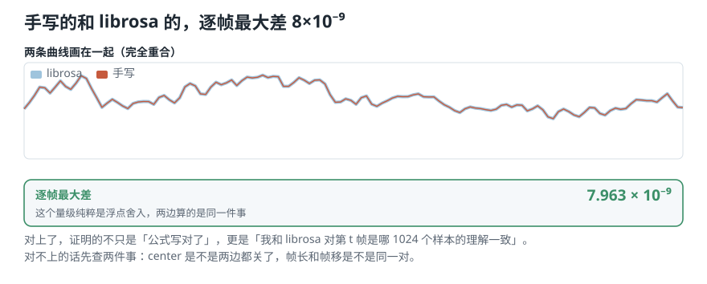
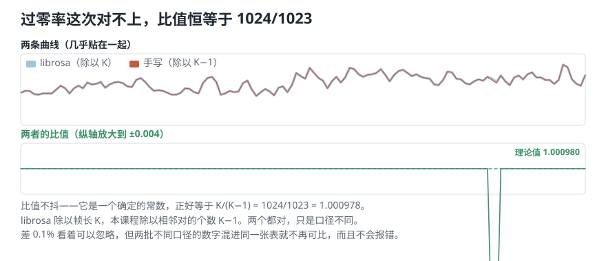
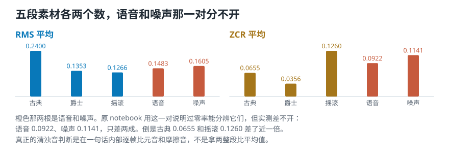
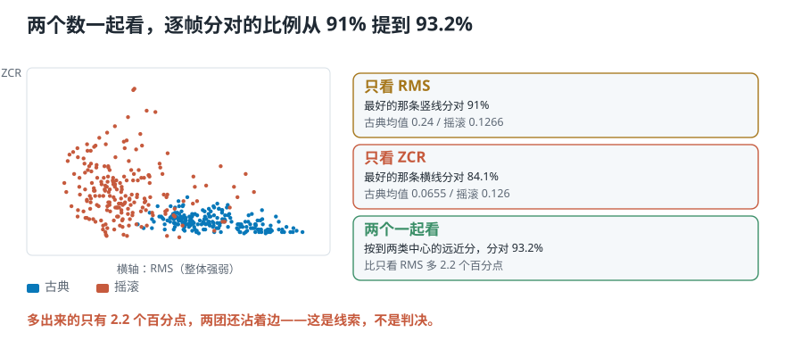
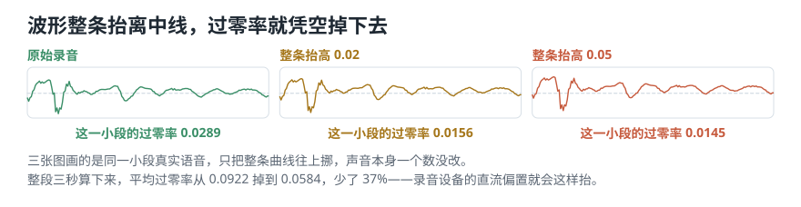

# 先调库，再手写，然后逼它们对上

> **导读：** 这一课实现剩下的两个时域特征。做法和上一课不同：**先用 librosa 一行算出来，再从零手写一遍，然后把两个结果逐帧比对。** 这一步不是走形式——**数值对不上，就说明你和库对「一帧是哪些样本」的理解不一样**，后面所有比较都不成立。均方根这边两边严丝合缝（逐帧最大差 8×10⁻⁹）；过零率那边**故意对不上**，比值正好是 1024/1023——这正是第 07 课留下的那个「除以 K 还是除以 K−1」。

<picture>
  <source media="(max-width: 640px)" srcset="../../零基础版_06-10/figures/mobile/00-course-position-09.svg">
  
</picture>

## 第 1 步：先用 librosa 算一遍

```python
import librosa
y, sr = io.load("debussy", seconds=3)
r = librosa.feature.rms(y=y, frame_length=1024, hop_length=512, center=False)[0]
```

```text
形状 (128,)
前 5 帧
 [0.05299, 0.05962, 0.0672,
  0.07602, 0.0753]
```

**一行就出结果。** 128 帧，和第 06 课手算的帧数一致。

注意 `center=False` 这个参数——上一课量过，`center=True` 会在两头各补半帧的零，多出两帧。这里关掉它，才能和自己写的对上。

## 第 2 步：从零手写，然后逼它们对上

```python
frames = frame(y, 1024, 512)          # (128, 1024)
mine = np.sqrt(np.mean(frames ** 2, axis=1))
```

三步：平方、沿 `axis=1` 求平均、开方。`axis=1` 是「沿着帧内样本这个方向」，每一帧塌成一个数。

**关键是接下来这一步——把两个结果逐帧相减：**

```text
手写的形状 (128,)，librosa 的形状 (128,)
逐帧最大差 7.963e-09
两者是否在浮点误差内一致：True
```

<picture>
  <source media="(max-width: 640px)" srcset="../../零基础版_06-10/figures/mobile/09-align-rms.svg">
  
</picture>

*图 1：两条曲线画在一起完全重合，粗的是 librosa、细的是手写。下面那格给出逐帧的最大差——量级在 10⁻⁹，纯粹是浮点舍入。*

**所以呢？** $8\times10^{-9}$ 这个量级说明差别纯粹来自浮点舍入，两边算的是同一件事。**这证明的不只是「我的公式写对了」，更是「我和 librosa 对『第 $t$ 帧是哪 1024 个样本』的理解完全一致」。**

**对不上的话先查两件事：** `center` 是不是两边都关了；帧长和帧移是不是同一对。这两个是最常见的原因。

## 第 3 步：过零率——这次故意对不上

同样的流程走一遍：

```python
lib  = librosa.feature.zero_crossing_rate(y, frame_length=1024,
                                          hop_length=512, center=False)[0]
mine = zero_crossing_rate(frame(y, 1024, 512))
```

```text
librosa 前 5 帧
 [0.0498,  0.05273, 0.05273,
  0.04785, 0.04688]
手写的前 5 帧
 [0.04985, 0.05279, 0.05279,
  0.04790, 0.04692]
```

**很接近，但不相等。** 差多少？

```text
两者的比值（中位数）1.000978
理论值 K/(K-1) = 1024/1023
              = 1.000978
对得上：True
```

<picture>
  <source media="(max-width: 640px)" srcset="../../零基础版_06-10/figures/mobile/09-align-zcr.svg">
  
</picture>

*图 2：两条曲线几乎贴在一起，但比值稳定在 1.000978，不是随机抖动——这说明差异有确定的来源。*

**所以呢？** 这个比值**不是随机误差，是一个确定的常数**——正好是 $K/(K-1)$。第 07 课手算八个数时就看见过它：

- **librosa 除以帧长 $K$**（1024）；
- **本课程除以相邻对的个数 $K-1$**（1023）。

哪个「对」？**两个都对**，只是口径不同。$K-1$ 更贴合定义（$K$ 个样本之间只有 $K-1$ 个相邻对），$K$ 更省事。

**要紧的是：挑一个，然后一直用它。** 帧长 1024 时差 0.1%，看着可以忽略——但**两批用不同口径算出来的数字混进同一张表，就不再可比了**，而且这个错**不会报错**。

**这就是「先调库、再手写、然后对齐」这个流程的价值：** 它把一个原本会安静潜伏下去的口径差，变成了一个当场看得见的数。

## 第 4 步：五段素材各算一遍

参数换成语音领域的惯例：帧长 400（18.1 毫秒）、帧移 160（7.3 毫秒）。

```text
        RMS 平均   ZCR 平均   帧数
古典     0.2400    0.0655    411
爵士     0.1353    0.0356    411
摇滚     0.1266    0.1260    411
语音     0.1483    0.0922    411
噪声     0.1605    0.1141    411
```

<picture>
  <source media="(max-width: 640px)" srcset="../../零基础版_06-10/figures/mobile/09-five-clips.svg">
  
</picture>

*图 3：每段素材两个数。注意语音和噪声那一对——它们在过零率上几乎挨在一起。*

原 notebook 用「语音对噪声」来说明过零率能分辨这两类。**但实测这一对分不开：**

- 语音 **0.0922**，噪声 **0.1141**——只差两成，重叠严重。
- 古典 **0.0655**，摇滚 **0.1260**——差了近一倍，这一对才分得开。

**所以呢？** 「过零率能区分语音和噪声」这句话，**在这份素材上不成立**。这不是说这条规律错了——真正的清浊音判断是在**一句话内部**逐帧比较元音和摩擦音，而不是拿整段语音去和整段噪声比平均值。**换个素材、换个比法，结论就变了。**

这也是为什么每一条「某某特征能区分某某」的说法，都值得自己在手头的数据上量一次。

## 第 5 步：「两个一起看更好」到底好多少

把古典和摇滚的每一帧当成一个点，逐帧判断它属于哪一类：

```text
古典 411 帧 + 摇滚 411 帧 = 822 帧
只看 RMS，最好的分界线  91.0%
只看 ZCR，最好的分界线  84.1%
两个一起看              93.2%
```

<picture>
  <source media="(max-width: 640px)" srcset="../../零基础版_06-10/figures/mobile/09-joint.svg">
  
</picture>

*图 4：每个点是一帧。横轴是 RMS，纵轴是 ZCR。两团点明显分开，但边界上仍然沾着。*

**所以呢？** 两个一起看确实更好，**但只多了 2.2 个百分点**。

「组合多个特征效果更好」这句话经常被当成理所当然。**它是对的，但强多少值得自己量一次再说**——这里单看 RMS 已经能到 91.0%，加上 ZCR 才到 93.2%。如果你以为加一个特征能带来质变，这个数会让你重新安排优先级。

而且要注意：**这 93.2% 是在同一批数据上挑出最好的分界线得到的**，不是在没见过的新录音上测的。真实的评估必须用没参与调参的数据。

## 两个会安静出错的地方

### 一、波形整条抬离中线，过零率凭空掉下去

```text
抬高 0.00：过零率 0.0922
抬高 0.02：过零率 0.0770  低 16%
抬高 0.05：过零率 0.0584  低 37%
```

<picture>
  <source media="(max-width: 640px)" srcset="../../零基础版_06-10/figures/mobile/09-zcr-offset.svg">
  
</picture>

*图 5：三张小图画的是同一小段真实语音，只把整条曲线往上挪。声音一个数没改，过零率却掉了 37%。*

**所以呢？** 声音一点没变，只是整条曲线离开了中线，**低处的摆动够不着零线了**。真实录音里这种偏移来自设备的直流偏置，**在波形图上几乎看不出来**。

**对策：算过零率之前先减去整段的平均值。** 一行的事，但不做就会安静地错下去。

### 二、零线阈值

为了避免底噪让正负号来回翻，通常会把靠近零的小数当成零：

```text
阈值 0        过零率 0.0922
阈值 0.0001   过零率 0.0921
阈值 0.01     过零率 0.0782
```

0.0001 几乎没有影响；0.01 把读数压低了 **15%**。

**阈值该设多大取决于录音底噪，没有通用答案。但整个数据集必须用同一个值**，而且要和帧长、帧移一起记录下来。

## 项目出口：第一版 features.csv

到这里，三个时域特征都能算了。把五段素材各压成一行：

```text
5 行 × 15 列
参数 sr=22050
     frame=400  hop=160
     归一化=峰值
```

每段音频用三个特征 × 五个统计量（均值、标准差、最大、最小、中位数）得到 15 个数。

**这四个参数必须和表存在一起。** 少了它们，这张表下次就复现不出来——形状对得上，数值全不一样。

## 这一课得到了什么，下一课接着讲什么

一条可以一直用下去的工作方法：**先调库拿到结果，再从零手写一遍，然后逐帧比对。** 对上了，说明你和库对数据的切分方式理解一致；对不上，那个差值本身就是最有价值的信息——它把一个会潜伏的口径差变成了当场看得见的数。

三个实测结论：

- RMS 手写和 librosa 逐帧最大差 **8×10⁻⁹**，完全一致。
- ZCR 比值稳定在 **1.000978 = 1024/1023**，是口径差不是 bug。
- 「两个特征一起看」比单看最好的那个只多 **2.2 个百分点**。

到这里，**只看那条曲线能问出来的问题问完了**。可有些事情它永远答不了：一段声音里同时有低音和高音，波形上完全看不出来；两段波形长得很像，听起来却是两件乐器。

[下一课](../../零基础版_06-10/10-傅里叶变换的直觉-拿已知频率去问声音里有没有它.md)换一个角度：**不看曲线随时间怎么起伏，而是问它由哪些高低成分组成。** 那是整个课程后半段的起点。
