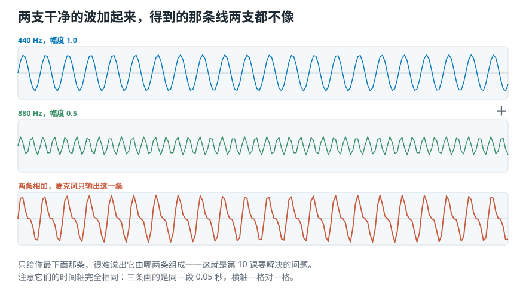
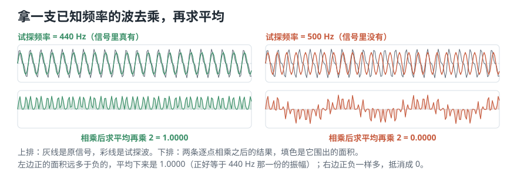
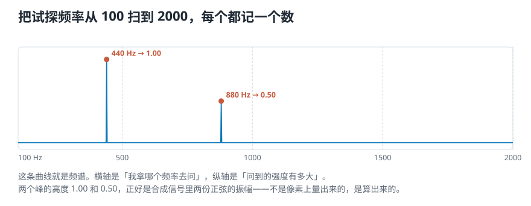
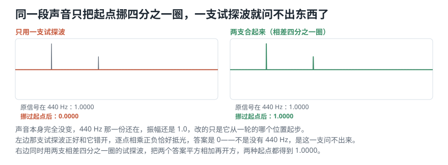
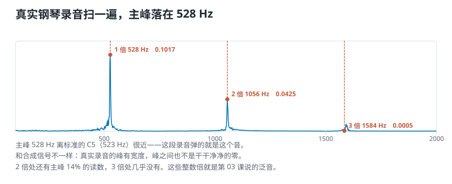
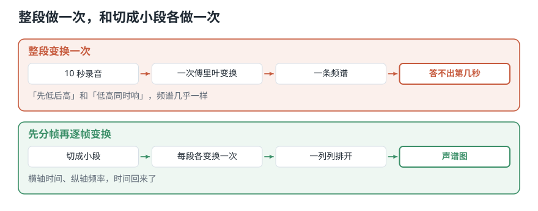

# 电脑怎样从一条曲线里，找出它由哪些高低成分组成？

> **导读：** 前四课把「只看那条曲线」能问的都问完了。可有些事它永远答不了——同时按下钢琴的三个键，麦克风只记下**一条**起伏的曲线，波形上完全看不出里面有三个音。这一课换个角度：**不问它随时间怎么起伏，问它由哪些高低成分组成。** 做法出乎意料地朴素：**拿一支已知频率的波去和它逐点相乘，再求平均。** 对上了平均值不为零，对不上正负抵消成零。把所有频率都试一遍，得到的那条曲线就是**频谱**。

<picture>
  <source media="(max-width: 640px)" srcset="../../零基础版_06-10/figures/mobile/00-course-position-10.svg">
  
</picture>

## 目标：把一个复杂声音拆成它的频率成分

第 02 课说过一句话：**很多复杂声音都可以用一组高低、大小、起点各不相同的正弦波叠加出来。**（**正弦波**就是那种最简单的、光滑匀速上下的曲线，听起来像很干净的电子提示音；**频率**指它一秒重复多少次，决定听起来有多高。）

现在要做的是**反过来**：给你叠加好的结果，**把它拆回去**——说出里面有哪些频率、每个有多强。

<picture>
  <source media="(max-width: 640px)" srcset="../../零基础版_06-10/figures/mobile/10-two-sines-add.svg">
  
</picture>

*图 1：440 Hz 幅度 1.0 的一条，880 Hz 幅度 0.5 的一条，逐点相加得到下面那条。麦克风记下的只有下面那条——上面两条得靠算法找回来。*

做这件事的方法叫**傅里叶变换**。它把声音从**时间域**（横轴是时间）换到**频率域**（横轴是频率）。

## 更深一点的直觉：拿正弦去比

PPT 上这句话是整节课的钥匙：

> **拿各种频率的正弦波去和信号比较。每一个频率都得到一个强度和一个相位。强度高，说明这个信号和这支正弦很像。**

「比较」具体怎么比？**逐点相乘，然后求平均。**

- 频率**对上**了：信号的波峰和试探波的波峰同时出现，乘出来大多是正数，平均下来是个不为零的数。
- 频率**对不上**：两者时快时慢地错开，乘出来正负各半，**平均下来互相抵消，结果接近零**。

## 第 1 步：拿三个频率试一试

造一个已知答案的信号：**440 Hz 幅度 1.0** 加 **880 Hz 幅度 0.5**。然后拿三支试探波去乘：

```text
用 440 Hz 试探 -> +1.0000
用 500 Hz 试探 -> -0.0000
用 880 Hz 试探 -> +0.5000
（都是相乘求平均再乘 2）
```

<picture>
  <source media="(max-width: 640px)" srcset="../../零基础版_06-10/figures/mobile/10-probe-match.svg">
  
</picture>

*图 2：上排灰线是原信号、彩线是试探波；下排是两者逐点相乘的结果，填色是它围出的面积。左边正的面积远多于负的，平均出来 1.0000；右边正负一样多，抵消成 0。*

**所以呢？** 三个数一个不差：

- 440 得到 **1.0000**——正是它在信号里的幅度。
- 880 得到 **0.5000**——也对上了。
- 500 得到 **0.0000**——信号里根本没有这个频率。

**这个方法不只告诉你「有没有」，还直接给出「有多强」。** 那个乘 2 就是为此加的：让读数直接等于幅度，不用再换算。

## 第 2 步：把所有频率都试一遍

一个频率试完了，那就**从低到高全试一遍**：

```text
一共试了 951 个频率
  最高的两处：  440 Hz  读数 1.0000
  最高的两处：  880 Hz  读数 0.5000
其余 949 个频率的读数最大只有 0.0000
```

<picture>
  <source media="(max-width: 640px)" srcset="../../零基础版_06-10/figures/mobile/10-sweep.svg">
  
</picture>

*图 3：横轴是「我拿哪个频率去问」，纵轴是「问到的强度有多大」。**这条曲线就是频谱。***

**951 个频率里，949 个的读数是 0.0000，只有两个不是。** 这两个峰的高度 1.00 和 0.50，正好是合成时两支正弦的幅度——不是画上去的，是算出来的。

## 第 3 步：只把起点挪一下，一支试探波就失灵了

上面有个隐患。把同一个信号的**起点挪四分之一圈**（正弦换成余弦），声音本身完全没变——含有的频率和强度一模一样，均方根都是 0.7906，**只有起点不同**。

再用同一支正弦试探波去问 440 Hz：

```text
原信号            +1.0000
挪过起点的        -0.0000
```

**读数掉到了 0。**

**不是这段声音里没有 440 Hz** ——它明明还在，幅度还是 1.0。是**试探波和它错开了四分之一圈**：一个在波峰时另一个正好在零点，乘出来正负恰好抵光。

<picture>
  <source media="(max-width: 640px)" srcset="../../零基础版_06-10/figures/mobile/10-phase-kills.svg">
  
</picture>

*图 4：左边只用一支试探波——挪过起点后整条读数塌了。右边用两支相差四分之一圈的，两种起点都稳定给出 1.0000。*

### 解决办法：用两支，相差四分之一圈

一支正弦、一支余弦，两个结果取直角三角形的斜边：

用 $a$ 记正弦那支的读数、$b$ 记余弦那支的读数，强度就是

$$
\sqrt{a^2 + b^2}
$$

```text
换成两支取直角边长：1.0000 和 1.0000
两支合起来，起点挪到哪里读数都一样
```

**而且两支还顺带给出了起点位置**：

```text
原信号     +1.5708 弧度
挪过起点的 -0.0000 弧度
差 1.5708，正好四分之一圈
```

1.5708 就是 $\pi/2$。**两支试探波同时给出了「有多强」和「从哪里起步」两个数**——后者就是第 02 课提过的**相位**。

**所以呢？** PPT 把这一整套写成三步：

1. **选一个频率**
2. **调整相位**，找到让面积最大的那个起点
3. **算出强度**

用两支相差四分之一圈的试探波，第 2 步和第 3 步一次就做完了。**至于为什么两支就够、为什么后面要写成复数，是[第 11 课](11-复数-一个数怎样同时装下强度和起点.md)的事。**

## 第 4 步：能拆开，就能拼回去

如果频谱真的完整记下了这个信号，那**只用扫出来的那几个成分，应该能把原波形拼回来**。

```text
只用 440 和 880 两个频率重建
逐点最大误差 2.11e-15
```

**误差量级 $10^{-15}$，是浮点运算的残渣。**

**所以呢？** 这个信号本来就只由这两支波组成，所以能**完全**拼回来。这件事很重要，它说明：**频谱不是随便挑出的几项摘要，它和原波形装着同样多的信息。**

- 从波形算出频谱，叫**傅里叶变换**。
- 从频谱拼回波形，叫**逆傅里叶变换**。
- 拿一组正弦按各自的强度和起点叠出想要的声音，这种做法叫**加法合成**。

## 第 5 步：换成真实的钢琴录音

合成信号太干净了。同一套试探，用在真实的 `piano_c.wav` 上：

```text
1 秒钢琴录音，扫 100–2000 Hz
最高点 527 Hz，读数 0.1819
  1 倍   527 Hz  0.1819
  2 倍  1054 Hz  0.0251
  3 倍  1581 Hz  0.0012
```

<picture>
  <source media="(max-width: 640px)" srcset="../../零基础版_06-10/figures/mobile/10-piano-spectrum.svg">
  
</picture>

*图 5：真实录音的频谱不像合成信号那样只有两根干净的线——峰有宽度，峰之间也不是零。但主峰仍然清清楚楚。*

**527 Hz 离标准的 C5（523 Hz）很近**——这段录音弹的就是这个音。而 2 倍处还有主峰 **14%** 的读数，3 倍处几乎没有。

**这些整数倍就是第 03 课讲过的泛音。** 那一课说「同一个音高、不同乐器听起来不一样，差别在泛音分布上」——**现在你有了一个能把泛音分布真的量出来的工具。**

## 一个必须交代的局限：时间没了

试探这套办法有个代价。看这个实验：造两段声音，一段**先低后高**，一段**先高后低**，成分完全一样只是顺序相反。整段各扫一次：

```text
              440 Hz    880 Hz
先低后高       0.5000    0.5000
先高后低       0.5000    0.5000
```

**读数一模一样。**

<picture>
  <source media="(max-width: 640px)" srcset="../../零基础版_06-10/figures/mobile/10-time-lost.svg">
  
</picture>

*图 6：整段做一次，「先低后高」和「先高后低」给出同一条频谱；先分帧再逐帧变换，顺序就回来了。*

**所以呢？** 时间信息在**「求平均」那一步**就被抹掉了——平均不在乎顺序，这正是第 05 课那个「加法不在乎顺序」的老结论。

**怎么找回来？** 用第 06 课那条频域流水线：**先分帧，再对每一帧各做一次变换。** 那就是[第 15 课](../../零基础版_11-15/15-短时傅里叶变换STFT-怎样同时看见频率与出现时间.md)的短时傅里叶变换，把每一帧的结果排成一列，就得到声谱图。

## 这一课得到了什么，下一课接着讲什么

**傅里叶变换不是把声音「变成另一种东西」的魔法。** 它做的事从头到尾只有一件：**拿一组已知频率去和信号比较，记下每个频率匹配得有多强、从哪里起步。**

四个实测结论：

- 440 和 880 的读数是 **1.0000 和 0.5000**，正好是合成时的幅度。
- 951 个试探频率里 **949 个读数为 0**——没有的频率真的读不出来。
- 只用两个成分重建原波形，逐点最大误差 **2.11×10⁻¹⁵**：频谱和波形装着同样多的信息。
- 真实钢琴录音主峰 **527 Hz**，2 倍处还有主峰的 **14%**——泛音第一次被量了出来。

以及一个悬而未决的问题：**一支试探波会被起点位置抹掉，得用两支。** 这两支为什么正好是「相差四分之一圈」的一对？为什么把它们写成一个数会更方便？

[下一课](11-复数-一个数怎样同时装下强度和起点.md)回答这个：**为什么描述一次振动需要两个数，以及为什么把这两个数装进一个复数会让后面所有公式都变简单。**
