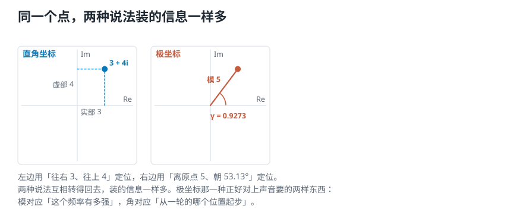
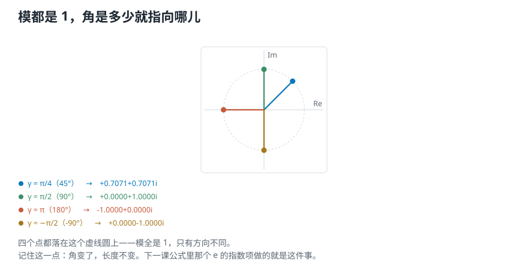

# 一个数，怎样同时装下「有多强」和「从哪里起步」？

> **导读：** 上一课留下一个悬念：**一支试探波会被起点位置抹掉，得用两支。** 于是每个频率问出来的不是一个数，而是**两个**——强度，和从哪里起步。可「强度」是个普通的数，一个普通的数装不下两样东西。这一课引入的**复数**，正是为解决这件事而来：**一个复数就是平面上的一个点，而一个点天生带着两个信息——离原点多远，朝哪个方向。** 前者对应强度，后者对应起点。这一课不讲抽象的数学，只把上一课量到的那两个读数，真的拼成一个复数。

<picture>
  <source media="(max-width: 640px)" srcset="../../零基础版_11-15/figures/mobile/00-course-position-11.svg">
  
</picture>

## 为什么非要复数不可

先把上一课的结论摆出来：

- 拿一支已知频率的波去和信号比，**每个频率要问出两个数**——**强度**（有多强），和**相位**（从哪里起步）。
- 强度是一个**实数**，一个数就装得下。
- 可「强度 + 起点」是**两个**数。

**一个普通的数装不下两个数。** 那能不能找到一种数，一个就装下这两样？

**能。它就叫复数。** 名字听着吓人，其实要求非常朴素——**我们需要的只是「平面上的一个点」**，因为一个点天生就带着两个信息：离原点多远、朝哪个方向。

## 一个复数就是平面上的一个点

复数长这样：

$$
z = 3 + 4i
$$

- **3** 叫**实部**，记作 $\mathrm{Re}(z)$；
- **4** 叫**虚部**，记作 $\mathrm{Im}(z)$；
- $i$ 是个记号，它的作用就是**把这两个数分开摆**，让它们不会加到一起。

把实部当横坐标、虚部当纵坐标，$3 + 4i$ 就是平面上**横 3、纵 4** 那个点。

<picture>
  <source media="(max-width: 640px)" srcset="../../零基础版_11-15/figures/mobile/11-complex-plane.svg">
  
</picture>

*图 1：同一个点，两种说法。左边用「往右 3、往上 4」定位，右边用「离原点 5、朝 53.13°」定位。两种说法装的信息一样多。*

这种「往右多远、往上多远」的定位方式叫**直角坐标**。

## 换一种说法：模和角

同一个点，还可以这样描述：**离原点有多远，朝哪个方向。**

- **模**，记作 $|z|$，就是**离原点的距离**。按勾股定理：

$$
|z| = \sqrt{3^2 + 4^2} = 5
$$

- **角**，记作 $\gamma$，就是**从横轴正方向转过多少**：

$$
\gamma = \arctan\frac{4}{3} = 0.9273
$$

单位是**弧度**，换算成角度是 53.13°。

这叫**极坐标**。转回去也能对上：

```text
5.0000·cos(0.9273)
  + 5.0000·sin(0.9273)i
= 3.0000 + 4.0000i
和原来的 z 一致：True
```

**所以呢？** 两种说法装的信息一样多，只是切入点不同。而**极坐标那一种，正好对上我们要的东西**：

| 极坐标 | 对应声音里的 |
|---|---|
| **模** $\lvert z\rvert$ | **强度**——这个频率有多强 |
| **角** $\gamma$ | **相位**——从一轮的哪个位置起步 |

## 欧拉公式：把「模和角」写成一个乘法

极坐标写成 $|z|(\cos\gamma + i\sin\gamma)$ 有点长。有一条公式能把括号里那一串压成一个符号：

$$
e^{i\gamma} = \cos\gamma + i\sin\gamma
$$

这就是**欧拉公式**。它不是定义，是一条能验证的等式——脚本逐个角度对过：

```text
γ        左边 e^(iγ)   右边 cos+isin
0.0000  +1.0000+0.0000i  同  True
0.7854  +0.7071+0.7071i  同  True
1.5708  +0.0000+1.0000i  同  True
3.1416  -1.0000+0.0000i  同  True
```

有了它，任何复数都能写成：

$$
z = |z| \cdot e^{i\gamma}
$$

**读法很直白：一个「多长」乘上一个「朝哪儿」。** $e^{i\gamma}$ 这一块模永远是 1，它**只管方向，不管长度**。

顺带一提，把 $\gamma = \pi$ 代进去：

```text
e^(iπ) + 1
 = 0.00e+00 + 1.22e-16i
 也就是 0
```

这就是有名的**欧拉恒等式**，把 $e$、$i$、$\pi$、$1$、$0$ 五个常数串在了一起。（$1.22\times10^{-16}$ 是浮点残渣，不是真的不等于零。）

## 角就是「指向哪儿」

<picture>
  <source media="(max-width: 640px)" srcset="../../零基础版_11-15/figures/mobile/11-directions.svg">
  
</picture>

*图 2：四个点的模都是 1，只有角不同。角是多少，就指向哪儿。*

```text
γ = π/4  ( +45°) -> +0.7071+0.7071i
γ = π/2  ( +90°) -> +0.0000+1.0000i
γ = π    (+180°) -> -1.0000+0.0000i
γ = −π/2 ( -90°) -> +0.0000-1.0000i
```

**模都是 1，只有方向不同。** 记住这一点：**角变了，长度不变。** 下一课的公式里那个 $e$ 的指数项，做的就是「只转方向、不改长度」这件事。

## 回到上一课：那两个读数就是一个复数

现在把这套东西接回声音。上一课在 440 Hz 上量到两个数：

```text
余弦那支 +0.0000   ← 当实部
正弦那支 +1.0000   ← 当虚部
拼成一个复数 z = +0.0000+1.0000i
```

<picture>
  <source media="(max-width: 640px)" srcset="../../零基础版_11-15/figures/mobile/11-two-probes-one-number.svg">
  
</picture>

*图 3：左边是第 10 课的两支试探波各自的读数；右边把它们当成一个点的横纵坐标。这个点离原点的距离就是强度，方向就是相位。*

验证一下这个点的模和角，是不是就是上一课的强度和相位：

```text
模 |z| = 1.0000
  第 10 课的强度 1.0000  一致 True
角 = +1.5708 弧度
  第 10 课的相位 +1.5708 一致 True
```

**两个都对上了。** 这不是巧合——上一课算强度用的就是 $\sqrt{a^2+b^2}$，那正是求模；算相位用的是 $\arctan$，那正是求角。**我们其实早就在算复数了，只是没这么叫它。**

## 关键的一步：挪动起点，模不变、角变

上一课最有说服力的实验是「把起点挪四分之一圈」。现在用复数再做一次：

```text
原来的   z = +0.0000+1.0000i
         模 1.0000  角 +1.5708
挪过起点 z'= +1.0000-0.0000i
         模 1.0000  角 -0.0000
```

**模几乎没变**（差 $3.33\times10^{-15}$，浮点残渣），**角差了 1.5708 弧度 = 90°**——正好四分之一圈。

**所以呢？** 这两行数把整件事说完了：

- **声音的强度没变**，因为 440 Hz 那一份的幅度确实还是 1.0 → **模不变**。
- **变的只是起点**，挪了四分之一圈 → **角正好变了四分之一圈**。

**模记「有多强」，角记「从哪里起步」，一个复数把两件事都装下了。** 上一课那个「一支试探波会被起点抹掉」的问题，到这里彻底消失——因为**模根本不受角的影响**。

## 这一课得到了什么，下一课接着讲什么

复数不是为了「更高深」才引进来的。**它就是平面上的一个点**，而我们需要的恰好是一个能同时记住「多远」和「朝哪」的东西。

| 复数的说法 | 声音里的意思 |
|---|---|
| 实部 $\mathrm{Re}(z)$ | 余弦那支试探波的读数 |
| 虚部 $\mathrm{Im}(z)$ | 正弦那支试探波的读数 |
| 模 $\lvert z\rvert$ | **这个频率有多强** |
| 角 $\gamma$ | **从一轮的哪个位置起步** |
| $e^{i\gamma}$ | 一个只管方向、模恒为 1 的因子 |

三个实测结论：

- $3+4i$ 的模是 **5**、角是 **0.9273 弧度**，两种坐标互相转得回去。
- 欧拉公式在四个角度上**逐个对上**；$e^{i\pi}+1$ 算出来是 $10^{-16}$ 量级的零。
- 把信号起点挪四分之一圈，**模差 $3\times10^{-15}$、角差正好 90°**。

[下一课](12-复数形式的傅里叶变换-把强度和起点写进一个系数.md)把这个复数正式塞进傅里叶变换的公式里：**每个频率算出一个复数系数，它的模是幅度谱、它的角是相位谱。** 然后走一次完整的往返——变换过去，再变换回来，看能不能一个数不差地拼回原信号。
