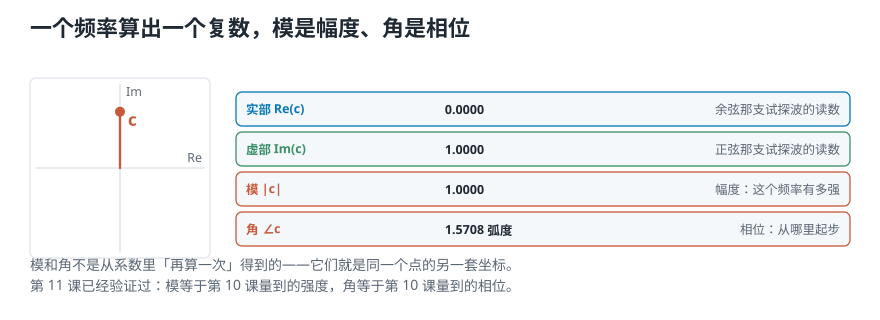
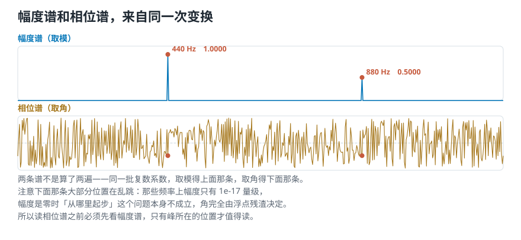
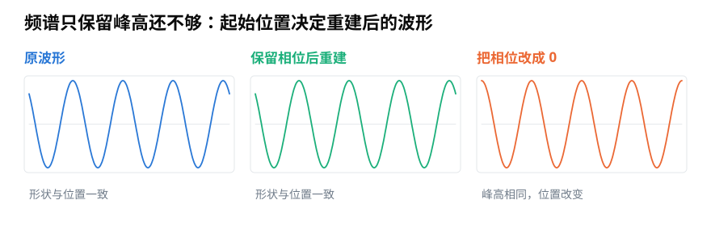

# 把「有多强」和「从哪里起步」，写进同一个系数

> **导读：** 上一课把复数准备好了：**模记强度，角记起点。** 这一课把它正式塞进傅里叶变换——**每个频率算出一个复数系数**，取它的模得到**幅度谱**，取它的角得到**相位谱**。那条看着吓人的公式，拆开之后做的还是第 10 课那件事：**乘一支波，再求平均**，只是欧拉公式把两支试探波合并成了一个 $e$ 的指数。最后走一次完整往返：变过去再变回来，**逐点最大误差 $2.5\times10^{-13}$**；而如果把相位扔掉再变回来，误差变成 **2.05**——差了八万亿倍。

<picture>
  <source media="(max-width: 640px)" srcset="../../零基础版_11-15/figures/mobile/00-course-position-12.svg">
  
</picture>

## 一个频率，一个复数系数

整套做法可以浓缩成一句话：

> **把强度和相位当作极坐标，编码进一个复数。**

上一课已经把这件事验证过了。现在给它一个正式的名字：**每个频率 $f$ 对应一个复数，叫这个频率的傅里叶系数，记作 $c_f$。**

```text
在 440 Hz 上，两支试探波给出 +0.0000 和 +1.0000
写成一个复数系数 c = +0.0000+1.0000i
  |c| = 1.0000        ← 幅度：这个频率有多强
  ∠c  = +1.5708 弧度  ← 相位：从哪里起步
```

<picture>
  <source media="(max-width: 640px)" srcset="../../零基础版_11-15/figures/mobile/12-one-coefficient.svg">
  
</picture>

*图 1：一个频率 → 一个复数 → 两个可读的量。模和角不是从系数里「再算出来」的，它们就是这个点的两种坐标。*

## 那条公式：两支试探波合成一个

第 10 课我们拿两支试探波分别去乘，再各求一次平均。有了欧拉公式，这两次可以合成一次。

回想上一课那条公式，把它的角取成负的：

$$
e^{-i2\pi f t} = \cos(2\pi f t) - i\sin(2\pi f t)
$$

**右边正好装着我们要的那两支波。** 于是「拿余弦乘一遍、拿正弦乘一遍」就变成了**拿这一个复数乘一遍**：

$$
c_f = \frac{2}{T}\int x(t)\, e^{-i2\pi f t}\, \mathrm{d}t
$$

看着吓人，但每一块都是老朋友：

| 这一块 | 是什么 |
|---|---|
| $x(t)$ | 原始信号 |
| $e^{-i2\pi f t}$ | 试探波——**两支合成的一个** |
| $\int \cdots \mathrm{d}t$ | 把逐点相乘的结果加起来 |
| 除以时长 | **求平均** |

**所以这条公式做的还是第 10 课那件事：乘一支波，再求平均。** 唯一的新东西是「那支波现在是复数的」。

验证一下两种算法给的是同一个答案：

```text
两支分开算：          +0.0000+1.0000i
合成一个 e 的指数算： +0.0000+1.0000i
两者一致：True
```

## 幅度谱和相位谱：同一次变换的两半

把所有频率都扫一遍，每个频率得到一个复数系数。然后：

- **取模** → 得到一条曲线，叫**幅度谱**；
- **取角** → 得到另一条曲线，叫**相位谱**。

**两条谱来自同一次变换，不是算了两遍。**

```text
    440 Hz   幅度 1.0000   相位 -1.5708 弧度
    880 Hz   幅度 0.5000   相位 -1.5708 弧度
```

<picture>
  <source media="(max-width: 640px)" srcset="../../零基础版_11-15/figures/mobile/12-mag-and-phase.svg">
  
</picture>

*图 2：上面是幅度谱，两个峰清清楚楚；下面是相位谱，只有在幅度不为零的地方才有意义。*

**一个必须知道的陷阱：幅度接近零的地方，相位是噪声。**

```text
在没有成分的地方，比如 1696 Hz
幅度只有 6.93e-17
这时相位读数 +0.3991 是没有意义的
```

**所以呢？** 那个 $10^{-17}$ 意味着这个频率上什么都没有。**幅度是零时，「从哪里起步」这个问题本身就不成立**——角完全由浮点残渣决定，画出来是一片乱跳的噪声。看相位谱时必须先看幅度谱，只有峰所在的位置才值得读。

## 一次完整往返

现在做这一课最要紧的一件事：**变过去，再变回来。**

逆变换可以分成三步：

1. **取一个纯音**，频率是 $f$；
2. **用幅度加权**，再**加上相位**；
3. **把所有这些加权过的正弦叠加起来。**

写成式子就是：

$$
x(t) = \sum_f |c_f| \cdot \cos\left(2\pi f t + \angle c_f\right)
$$

拿上面扫出来的两个系数试一次：

```text
叠加 440 Hz：幅度 1.0000，相位 -1.5708
叠加 880 Hz：幅度 0.5000，相位 -1.5708
重建后逐点最大误差 2.477e-13
```

<picture>
  <source media="(max-width: 640px)" srcset="../../零基础版_11-15/figures/mobile/12-roundtrip.svg">
  
</picture>

*图 3：上面两条是原波形和重建波形，完全重合。下面那条是把相位扔掉之后的重建结果——形状明显不同。*

**误差 $2.5\times10^{-13}$，是浮点残渣。** 只用两个成分就拼回来了，因为这个信号本来就只由两支波组成。

## 关键实验：把相位扔掉

现在把相位全部当成 0，只用幅度重建一次：

```text
如果把相位全部当成 0 再重建：逐点最大误差 2.0481
比带相位那次大了 8.3e+12 倍
```

**误差从 $10^{-13}$ 跳到了 2.05。**

**所以呢？** 这个对比说明一件很重要的事：**幅度谱只是变换结果的一半。**

- 幅度谱告诉你「有哪些频率、各有多强」——这已经很有用，后面很多特征都只用它。
- 但**只有幅度谱，拼不回原来的波形**。「从哪里起步」这个信息一旦丢掉，就再也补不回来。

**这也解释了为什么可逆这件事值得强调**：只有**幅度和相位都留着**，原信号和它的傅里叶表示才装着同样多的信息。少了一半，就只是一个摘要，不再是另一种完整的写法。

## 三个名字

到这里，三个术语可以正式收下了：

| 名字 | 做的事 |
|---|---|
| [第 10 课](10-傅里叶变换的直觉-拿已知频率去问声音里有没有它.md)讲过的**傅里叶变换** | 从波形算出每个频率的复数系数 |
| **逆傅里叶变换** | 从这些系数把波形拼回来 |
| **傅里叶表示** | 同一段声音的另一种完整写法——不是摘要 |

## 这一课得到了什么，下一课接着讲什么

**那条吓人的公式，拆开只有四块**：原信号、一支复数试探波、把逐点乘积加起来、再除以时长求平均。第 10 课做的就是这件事，只是当时用了两支实数的波。

三个实测结论：

- 两支分开算和合成一个 $e$ 的指数算，结果**完全一致**。
- 幅度接近零处（$6.9\times10^{-17}$）的相位读数是**噪声**，不能当数据用。
- 带相位重建误差 $2.5\times10^{-13}$，**扔掉相位后变成 2.05**——差八万亿倍。

不过上面所有式子都写着积分号，那是**连续**信号的写法：时间连续、频率也连续，要算无穷多个频率。**可计算机手上只有有限个采样点，也不可能算无穷多个频率。**

[下一课](13-离散傅里叶变换-把无穷个频率砍成有限个.md)讲这条公式怎样落到有限的数字上：**两处「砍」——时间上只取 $N$ 个样本，频率上只算 $N$ 个频率**，以及为什么偏偏是这两个 $N$。
