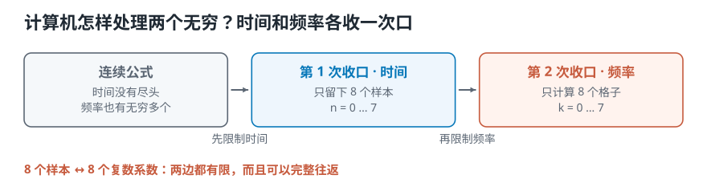
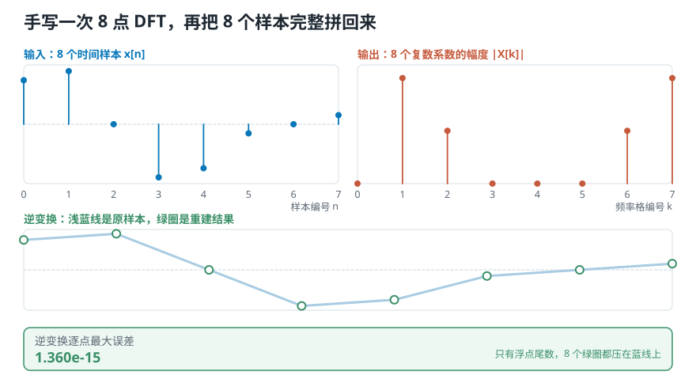
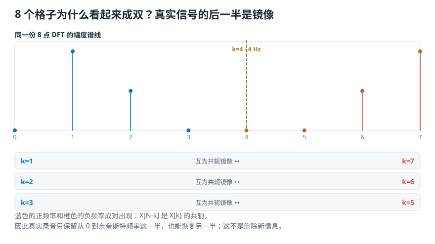
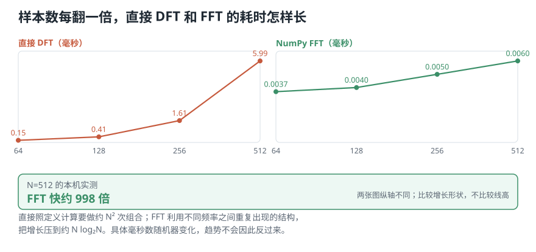

# 计算机只有有限个数字，怎样完成傅里叶变换？

> **导读：** 上一课的公式假设时间连续，而且可以检查无穷多个频率；真实计算机手里只有有限个采样点。要让公式真正跑起来，需要把时间和频率各限制一次：留下 $N$ 个样本，也只计算 $N$ 个频率格。这样得到的计算叫离散傅里叶变换，缩写为 DFT。

<picture>
  <source media="(max-width: 640px)" srcset="../../零基础版_11-15/figures/mobile/00-course-position-13.svg">
  
</picture>

## 上一课的公式，计算机为什么算不完

[上一课](12-复数形式的傅里叶变换-把强度和起点写进一个系数.md)把那套“用已知波去比较，再累积结果”的计算写成了下面的形式：

$$
\hat g(f)=\int g(t)e^{-i2\pi ft}\,dt
$$

先不用重新解释每个符号。我们只看它要求计算机做多少事。

积分号表示要把所有时刻的结果累积起来。如果时间一直向前延伸，就有无穷多个时刻。式子中的 $f$ 又可以取任意频率，因此要想得到完整结果，还得重复计算无穷多个频率。

也就是说，这条公式面对两个无穷：**时间没有尽头，频率也有无穷多个。** 数学可以这样定义，计算机却不可能真的做完。

第 13 课解决的就是这个落地问题。我们要做两次**收口**：每次把一个无穷范围变成有限个位置。

## 数字录音先把时间换成样本编号

第 04 课已经讲过，电脑录音时不会保存连续变化的曲线，而是每隔固定时间记录一个数。

如果两次记录之间相隔 $T$ 秒，那么第 $n$ 个数字对应的时刻就是：

$$
t=nT
$$

$n$ 不是时间本身，而是从 0 开始的**样本编号**。原来的连续信号写作 $g(t)$；变成一串数字以后，可以写作 $x[n]$。

$$
g(t)\quad\longrightarrow\quad x[n]
$$

方括号是在提醒我们：现在只能读取编号为 0、1、2……的那些位置，两个样本之间没有额外的记录。

## 时间只剩离散位置，积分就变成求和

上一课的积分会把连续时间上的所有结果累积起来。现在只有一串样本，计算机能做的对应动作，就是把每个样本的结果相加：

$$
\hat x(f)=\sum_n x[n]e^{-i2\pi fnT}
$$

式子的动作没有变：仍然是把原信号乘上一支已知频率的试探波，再把全部乘积累积起来。改变的是累积方式——连续时间用积分，离散样本用求和。

不过，求和符号下面还没有写起点和终点，频率 $f$ 也仍然可以任意取值。两个无穷还没有真正处理完。

## 第一次收口：时间上只保留 N 个样本

假设一段录音共有 $N$ 个样本。因为编号从 0 开始，它们依次是：

$$
x[0],\ x[1],\ \ldots,\ x[N-1]
$$

于是求和可以写出明确边界：

$$
\hat x(f)=\sum_{n=0}^{N-1}x[n]e^{-i2\pi fnT}
$$

时间这一边已经有限了。不管原来的声音可以持续多久，本次计算只处理手里的 $N$ 个数字。

## 第二次收口：频率上也只计算 N 个格子

接下来不能再让 $f$ 任意变化。我们改用一个整数 $k$ 给要检查的频率编号，并让它也只取 $N$ 个值：

$$
k=0,1,\ldots,N-1
$$

每个编号对应的快慢是 $k/N$ 圈每个样本。把它代回上面的式子，就得到**离散傅里叶变换**：

$$
X[k]=\sum_{n=0}^{N-1}x[n]e^{-i2\pi kn/N}
$$

这条式子看起来密，但工作量已经完全数得清：

- 输入有 $N$ 个样本；
- 输出有 $N$ 个复数系数；
- 计算第 $k$ 个系数时，把 $N$ 个乘积相加；
- $k$ 从 0 算到 $N-1$，总共算 $N$ 次。

<picture>
  <source media="(max-width: 640px)" srcset="../../零基础版_11-15/figures/mobile/13-two-hacks.svg">
  
</picture>

*图 1：第一次收口留下有限个时间样本，第二次留下同样多的频率格。图中的 8 是本课实验使用的具体数量。*

## 为什么偏偏也是 N 个频率格

频率格也取 $N$ 个，原因有两个：要能够逆变换回来，同时不要计算不必要的数量。

先看“能回来”是什么意思。DFT 的逆过程写作：

$$
x[n]=\frac{1}{N}\sum_{k=0}^{N-1}X[k]e^{i2\pi kn/N}
$$

它接收 $N$ 个复数系数，再算回 $N$ 个样本。正向变换与逆向变换使用的是同一组编号，只是指数中的正负号相反，并且逆变换最后除以 $N$。

本课脚本还把这个计算排成一张系数表。对于一般的 $N$ 项序列，只取 $M=4$ 个频率时，表中只有 4 条彼此独立的信息；取 $M=N=8$ 时，才有 8 条：

```text
M=4 个频率格：矩阵秩 4
M=8 个频率格：矩阵秩 8
```

这里的**秩**可以先理解为“真正彼此独立的条件数量”。要恢复任意 8 个未知数，只有 4 条独立条件通常不够；8 条才可能把它们逐一确定。

这句话说的是一般序列。真实录音的样本都是实数，它的 DFT 系数还会出现一种特殊镜像，因此后面确实可以只保存一半左右；那是利用已知关系去掉重复，不是随便把 8 条砍成 4 条。

## 实验：手写一次 8 点 DFT，再把样本拼回来

环境和运行方式统一放在[课程总纲](../../课程总纲/README.md#动手之前装好环境和代码)。本课完整代码是 [`lesson13_dft.py`](../../课程代码/lessons/lesson13_dft.py)。

我们生成 1 秒钟的简单信号：一支 1 Hz 余弦，加上一支振幅为 0.5 的 2 Hz 正弦。采样率设为 8 Hz，因此正好得到 8 个样本：

```text
N = 8，采样率 = 8 Hz
样本编号 n：0 1 2 3 4 5 6 7
x[n]：
+1.0000 +1.2071 +0.0000 -1.2071
-1.0000 -0.2071 +0.0000 +0.2071
```

这里故意只取 8 个点，是为了让每一步都能看见。真实音频会有几万甚至几百万个样本，公式仍然相同。

先照定义手写 DFT，不调用 NumPy 的傅里叶变换：

```python
def direct_dft(x):
    count = len(x)
    out = np.zeros(count, dtype=complex)
    for k in range(count):
        for n in range(count):
            out[k] += x[n] * np.exp(
                -2j * np.pi * k * n / count
            )
    return out
```

外层循环依次选择 $k$，内层循环把这个频率格与所有样本的乘积加起来。8 个 $k$，每个都看 8 个样本，因此这个小实验要完成 $8\times8=64$ 次组合。

脚本算出的主要系数是：

```text
k=1  X=+4.0000-0.0000i
k=2  X=-0.0000-2.0000i
k=6  X=-0.0000+2.0000i
k=7  X=+4.0000+0.0000i
```

$k=1$ 和 $k=2$ 正好对应我们放进去的 1 Hz 与 2 Hz。另一边的 $k=6$ 和 $k=7$ 不是又出现了两支新声音，而是实数信号带来的镜像，稍后就会解释。

把手写结果与 `np.fft.fft(x)` 逐项比较：

```text
手写 DFT 与 np.fft.fft 最大差
1.830e-15
```

误差只在小数点后第 15 位附近，是计算机表示小数留下的尾数。因此手写公式与 NumPy 算的是同一个结果。

逆变换同样照公式写：

```python
def direct_idft(X):
    count = len(X)
    out = np.zeros(count, dtype=complex)
    for n in range(count):
        for k in range(count):
            out[n] += X[k] * np.exp(
                2j * np.pi * k * n / count
            )
    return out / count
```

实际往返结果是：

```text
用全部 8 个系数逆变换：
实部逐点最大误差 1.360e-15
虚部残留 1.221e-15
```

两个误差都只有 $10^{-15}$ 左右。**所以呢？** 8 个复数系数确实把 8 个样本需要的信息保留下来了；变换只是换了一种写法，没有把原信号变成不可恢复的摘要。

<picture>
  <source media="(max-width: 640px)" srcset="../../零基础版_11-15/figures/mobile/13-roundtrip.svg">
  
</picture>

*图 2：最下面的 8 个绿圈全部压在浅蓝线上，说明逆变换得到的每个样本都回到了原位置。上面的频率结果使用细谱线和圆点表示离散格子，没有把频率画成类别柱状图。*

## 频率格编号 k，怎样换成 Hz

$k$ 只是第几个格子，还不是日常使用的频率单位。假设采样率为 $s_r$，每个样本相隔 $T=1/s_r$ 秒，那么第 $k$ 格对应：

$$
F(k)=\frac{k}{NT}=\frac{k\,s_r}{N}
$$

相邻格子的间隔因此是：

$$
\Delta f=\frac{s_r}{N}
$$

本课取 $s_r=8$ Hz、$N=8$，所以每格相差 1 Hz。编号 0、1、2、3、4 依次对应 0、1、2、3、4 Hz。

编号 5、6、7 如果继续按 $k\,s_r/N$ 写，会得到 5、6、7 Hz；但离散计算中的频率每隔采样率就会重复。通常把后一段改写成负频率，得到：

| $k$ | 0 | 1 | 2 | 3 | 4 | 5 | 6 | 7 |
|---:|---:|---:|---:|---:|---:|---:|---:|---:|
| 频率 / Hz | 0 | +1 | +2 | +3 | +4 | -3 | -2 | -1 |

负频率不是耳朵会听见一种“比 0 Hz 还低的音”。它是复数旋转方向的记号：正频率向一个方向转，负频率向相反方向转。对真实录音来说，两边会成对合作，表示普通的正弦或余弦变化。

$k=N/2=4$ 对应 4 Hz，也就是采样率的一半。这个位置是[第 04 课](04-模拟声到数字录音-连续的声音怎样变成一串数字.md)讲过的**奈奎斯特频率**：8 Hz 的采样率最多只能无歧义地表示到 4 Hz。

## 真实录音的后一半，为什么是镜像

如果 $x[n]$ 全是实数，DFT 会满足：

$$
X[N-k]=X[k]^*
$$

右上角的星号表示**共轭**：实部不变，虚部反号。换成上一课的说法，就是两边幅度相同、相位方向相反。

本课 8 点实验正好有三对：

- $k=1$ 与 $k=7$，对应 +1 Hz 与 -1 Hz；
- $k=2$ 与 $k=6$，对应 +2 Hz 与 -2 Hz；
- $k=3$ 与 $k=5$，对应 +3 Hz 与 -3 Hz。

脚本逐对检查后的最大共轭误差是 `2.136e-15`。还是只有浮点尾数，所以镜像关系成立。

<picture>
  <source media="(max-width: 640px)" srcset="../../零基础版_11-15/figures/mobile/13-redundancy.svg">
  
</picture>

*图 3：注意 $k=1$ 与 $k=7$、$k=2$ 与 $k=6$ 的谱线高度相同。中间金色线是奈奎斯特位置，左右两边提供的是成对信息。*

因此，处理真实录音时常常只保留从 0 到奈奎斯特频率这一半。NumPy 里的 `rfft` 就会直接返回这半边；需要还原时，`irfft` 会利用共轭关系补回另一半。这里删除的是能推算出来的重复项，不是声音中独有的新信息。

## 直接计算太慢，FFT 只是换了一种算法

照 DFT 定义计算，每个频率格都要遍历 $N$ 个样本，一共又有 $N$ 个频率格，所以工作量大约按 $N^2$ 增长。

如果样本数量翻倍，每个格子要看的样本翻倍，格子数量也翻倍，总工作量接近原来的四倍。录音动辄有几万点，直接计算很快就会变慢。

**快速傅里叶变换**，缩写为 FFT，会利用不同试探波之间反复出现的结构，避免重复做相同工作。它得到的仍然是 DFT 系数，不是近似结果；改变的是计算路线。典型工作量从 $N^2$ 降到大约 $N\log_2N$。

本课在同一台机器上分别运行了直接矩阵计算与 `np.fft.fft`：

| $N$ | 直接 DFT / ms | NumPy FFT / ms |
|---:|---:|---:|
| 64 | 0.154 | 0.0037 |
| 128 | 0.413 | 0.0040 |
| 256 | 1.606 | 0.0050 |
| 512 | 5.994 | 0.0060 |

512 点时，本次实测相差约 998 倍。**所以呢？** 真正处理长录音时，我们会调用 FFT，而不会照双重循环逐项计算 DFT。

这些毫秒数会随处理器、系统负载和 NumPy 版本变化，不能当作其他电脑的固定成绩。值得观察的是增长形状：样本数连续翻倍时，直接算法的时间弯得越来越陡，FFT 增长得慢得多。

<picture>
  <source media="(max-width: 640px)" srcset="../../零基础版_11-15/figures/mobile/13-dft-vs-fft.svg">
  
</picture>

*图 4：两张图分别使用自己的纵轴，否则 FFT 会被直接 DFT 的大数值压在底部看不见。这里比较曲线怎样增长，不比较两条线在画面上的绝对高度。*

最经典的 **radix-2 FFT** 会不断把问题对半拆开，因此要求 $N$ 是 2 的幂；64、128、256、512 这类长度最方便。

但这不是现代 FFT 函数的输入限制。本课实测 `np.fft.fft` 对 $N=1000$ 和 $N=1024$ 都能正常计算；不同长度只可能带来速度差别。不要为了凑 2 的幂就误以为其他长度算不了。

## 这一课得到了什么，下一课接着讲什么

到这里，这一课完成了六步：

1. 数字录音把连续时间 $t$ 换成样本编号 $n$。
2. 连续积分随之变成对样本求和。
3. 时间上只保留 $N$ 个样本。
4. 频率上只计算 $N$ 个格子。
5. 真实录音的后一半系数与前一半共轭镜像。
6. FFT 利用重复结构，更快地算出同一组 DFT 系数。

现在我们终于有了一条计算机能执行的傅里叶变换。不过本课只用 8 个合成样本验证公式，还没有看真实乐器算出来的频谱是什么样。

[下一课](14-用Python提取频谱-四种声音的频率成分有什么不同.md)会直接调用 `np.fft.fft`，依次读取小提琴、钢琴、萨克斯和噪声，比较四段声音的频率成分。那时重点不再是“DFT 为什么这样算”，而是“怎样把结果的横轴和幅度读对”。
