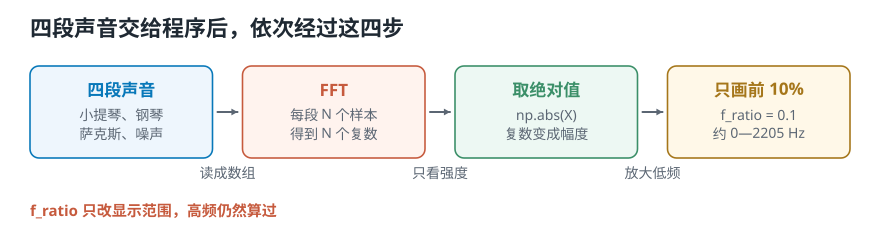
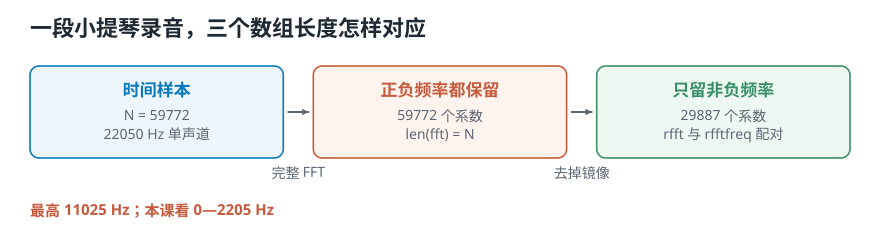
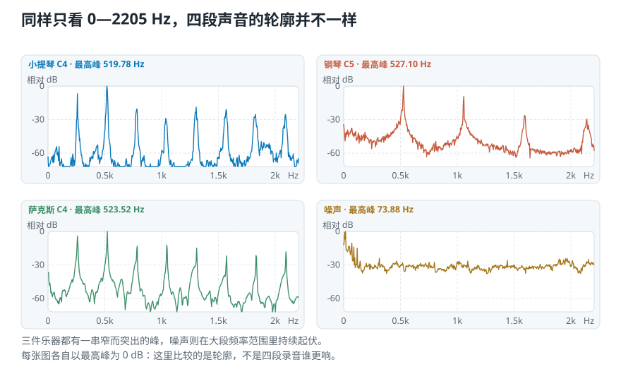

# 用 Python 读取真实声音的频谱：四段声音为什么长得不一样？

> **导读：** 同样弹一个音，小提琴、钢琴和萨克斯听起来仍然不同；噪声又是另一种样子。这一课把四段录音交给 Python，比较它们在不同频率上的强弱分布，并把横轴读成真正的 Hz。

[上一课](13-离散傅里叶变换-把无穷个频率砍成有限个.md)已经把公式变成了计算机能执行的 FFT。但我们只用 8 个自己造的数字验证了它，还没有把一段真实录音放进去。

这一课不再推导公式。我们会先听四个声音文件，再让程序依次完成读取、FFT、取绝对值和画图。这样做完后，屏幕上的曲线才会和耳朵听到的差别对应起来。

## 先听四段声音，再让程序处理它们

先别急着计算。我们准备四个文件，并按下面的顺序播放。前三段都让人听出稳定的高低，这种听觉感受叫[**音高**](02-声音与波形-一次振动怎样变成录音里那条线.md)；最后一段没有稳定重复，只剩杂乱的起伏，这种声音叫**噪声**。

1. [小提琴 C4：violin_c.wav](../../../source_course/audio_resources/violin_c.wav)
2. [钢琴 C5：piano_c.wav](../../../source_course/audio_resources/piano_c.wav)
3. [萨克斯 C4：sax.wav](../../../source_course/audio_resources/sax.wav)
4. [噪声：noise.wav](../../../source_course/audio_resources/noise.wav)

先听很重要。前三段都有明确的音高，却拥有不同的质感；最后一段听不出稳定音高。程序画出的结果，必须能帮助我们解释这个听感差别。

<picture>
  <source media="(max-width: 640px)" srcset="../../零基础版_11-15/figures/mobile/14-source-pipeline.svg">
  
</picture>

*图 1：注意最后一步只是少画一部分结果。高频仍然参加了 FFT，`f_ratio` 没有重新计算声音。*

## 读取录音：先统一成每秒 22050 个数字

读取函数可以使用 `librosa.load`。原文件把左边和右边的声音分别存成两列，这样的文件叫**双声道**。

程序先把两列平均成一列。只保留一列的声音叫**单声道**。然后，程序把四段录音统一为每秒读取 22050 个数字。

“每秒读取多少个数字”叫**采样率**，这里统一为 22050 Hz；[第 04 课](04-模拟声到数字录音-连续的声音怎样变成一串数字.md)解释过它为什么重要。统一之后，四段录音的实际结果是：

| 声音 | 原始采样率 | 统一后的样本数 | 时长 |
|---|---:|---:|---:|
| 小提琴 C4 | 44100 Hz | 59772 | 2.711 秒 |
| 钢琴 C5 | 44100 Hz | 33968 | 1.540 秒 |
| 萨克斯 C4 | 44100 Hz | 28809 | 1.307 秒 |
| 噪声 | 48000 Hz | 581415 | 26.368 秒 |

**所以呢？** 四段录音现在使用相同的时间刻度，数组里相邻两个数字都相隔 `1 / 22050` 秒。样本数仍然不同，是因为文件时长不同，不是读取失败。

课程脚本使用 SciPy 明确完成同样两步，而不是依赖库的隐藏默认值。完整读取和统一采样率的代码在 [`lesson14_fft_spectrum.py`](../../课程代码/lessons/lesson14_fft_spectrum.py)；安装与运行目录统一见[课程总纲](../../课程总纲/README.md)，本课不重复环境准备。

## 输入有 N 个样本，FFT 就返回 N 个结果

先查看小提琴数组的长度，然后运行：

```python
X = np.fft.fft(violin)

print(len(violin))
print(len(X))
```

本次实际输出是：

```text
59772
59772
```

同一种起伏一秒重复多少次，叫**频率**。输入的 59772 个数字按时间排列，输出的 59772 个结果按不同频率排列；每个数组位置就是一个频率格。两边数量相同，正是上一课得到的“`N` 个样本对应 `N` 个复数系数”。

真实录音的后半段频率结果可以从前半段推算出来。NumPy 因此还提供了 `rfft`，专门只返回非负频率这一半：

```python
X = np.fft.rfft(violin)
print(len(X))
```

它返回 29887 个结果，等于 `59772 // 2 + 1`。多出来的 1 包含 0 Hz；当样本数为偶数时，末尾还包含采样率一半的位置。

<picture>
  <source media="(max-width: 640px)" srcset="../../零基础版_11-15/figures/mobile/14-length-and-axis.svg">
  
</picture>

*图 2：小提琴的完整 FFT 有 59772 个系数；去掉能够由镜像推算的负频率后，`rfft` 剩下 29887 个。*

## `np.abs` 做了什么：把一个复数换成一个幅度

FFT 返回的不是普通实数。每个频率格都会得到一个复数，它同时保存这一项有多强、从一轮的哪个位置开始。这个含义在[第 11 课](11-复数-一个数怎样同时装下强度和起点.md)和[第 12 课](12-复数形式的傅里叶变换-把强度和起点写进一个系数.md)已经验证过。

这一课只想画“有多强”，所以对每个结果取绝对值：

```python
X = np.fft.rfft(violin)
magnitude = np.abs(X)
```

复数可以想成平面上的一支箭头。`np.abs` 算的是箭头长度，也就是复数的模：

$$
|X[k]|=\sqrt{\operatorname{Re}(X[k])^2+\operatorname{Im}(X[k])^2}
$$

以小提琴在可见范围内的最高峰为例，脚本实际得到：

```text
k = 1409
X[k] = +793.536 + 915.812i
abs(X[k]) = 1211.780
frequency = 519.78 Hz
```

`1211.780` 是这次整段 FFT 的原始模值。它会随着录音长度和录音电平变化，不能直接解释成原波形的摆动高度，更不能拿它证明小提琴比另一段声音更响。本课只用它寻找一张谱里的峰和轮廓。

把所有 `abs(X[k])` 按频率从低到高排开，得到的曲线叫**幅度谱**。只有把幅度平方后，结果才能称为功率谱；两者不能混用一个名字。

## 数组位置不是 Hz，要给 FFT 配一条正确的频率轴

频率格 `k = 1409` 本身只是数组位置。要知道它代表多少 Hz，还必须结合采样率与样本数。

上一课已经推导过换算式。本课在代码里直接使用与 `rfft` 配套的函数：

```python
X = np.fft.rfft(y)
freqs = np.fft.rfftfreq(len(y), d=1 / sr)

peak_index = np.argmax(np.abs(X))
print(freqs[peak_index])
```

`X[k]` 必须和 `freqs[k]` 成对读取。一种常见错误是使用 `np.linspace(0, sr, len(X))`：它会把最后一个位置放到恰好 `sr`，比真实位置多出一个频率间隔。改用 `fftfreq` 或 `rfftfreq` 就不会猜错终点。

`rfftfreq` 返回的横轴从 0 Hz 到 11025 Hz，也就是采样率的一半。这个上限来自第 13 课讲过的镜像边界，不是程序随便截掉的。

## `f_ratio=0.1` 只是把 0—2205 Hz 放大来看

画图函数可以只保留完整 FFT 的前 10%：

```python
f_bins = int(len(X_mag) * 0.1)
plt.plot(freq[:f_bins], X_mag[:f_bins])
```

采样率为 22050 Hz 时，完整频率范围的 10% 对应大约 2205 Hz。**所以呢？** 图会放大最容易看到乐器主要峰列的低频区域，高于 2205 Hz 的结果仍然存在，只是没有画进这张图。

改用 `rfft` 后，不能再机械地取数组的前 10%。`rfft` 的整个数组只到 11025 Hz，它的前 10% 只到约 1102.5 Hz。课程脚本因此直接按 Hz 选择：

```python
visible = freqs <= sr * 0.1
plt.plot(freqs[visible], magnitude[visible])
```

这里的 `0.1` 仍然以完整采样率为参照，因此显示范围仍是 0—2205 Hz。

## 实验：依次画出四段声音的低频频谱

现在按小提琴、钢琴、萨克斯、噪声的顺序画图。

四段文件时长不同，原始 FFT 模值不能放在同一把尺子上直接比较。为了只看轮廓，课程脚本把每张图在 0—2205 Hz 内的最高峰设成 0 dB，其余位置写成相对它低多少：

```python
reference = magnitude[visible].max()
relative_db = 20 * np.log10(
    np.maximum(magnitude, 1e-15) / reference
)
```

这里的“相对 dB”可以先读成一把方便观察高低差的尺子：0 dB 是本图最高峰，`-30 dB` 明显更弱，`-60 dB` 更弱。因为每张图都选择了自己的最高峰，所以它只能比较形状，不能比较四段录音谁更响。

<picture>
  <source media="(max-width: 640px)" srcset="../../零基础版_11-15/figures/mobile/14-four-spectra.svg">
  
</picture>

*图 3：小提琴和萨克斯在约 260、520、780 Hz 等位置连续出现窄峰；钢琴也有间隔近似固定的峰列，但各峰相对高度和周围衰减不同。噪声没有同样清楚的整齐峰列，曲线在大段频率范围里持续起伏。*

这张图把耳朵听到的差别变成了程序能读取的形状：

- 小提琴在 519.78 Hz 附近最高，但 260 Hz 左右也有一根明显的峰；后面还能看到近似整数倍位置上的峰。
- 钢琴在 527.10 Hz 附近最高，后续峰的间隔和衰减方式与小提琴不同。
- 萨克斯在 523.52 Hz 附近最高，也有规则峰列，但各根峰的相对高度又换了一套组合。
- 噪声本次最高点是 73.88 Hz，但周围没有跟着出现整齐的整数倍峰列。

这些数字后面的结果是：程序不只拿到了“有声音”这一个判断，还拿到了能够区分声音材料的频率轮廓。这正是[第 03 课](03-强弱响度与音色-音量一样为什么听起来不同.md)所说的音色差异，现在第一次由真实 FFT 曲线直接展示出来。

## 最高的峰，不一定就是听到的音高

小提琴文件标的是 C4，基频在 260 Hz 左右，图中最高峰却是 519.78 Hz，接近它的两倍。萨克斯也有相同现象。

这不是 FFT 算错了。周期声音除了最低的重复频率，还会包含它的整数倍成分，叫泛音；某一根泛音完全可能比基频更强。因此，“最高峰在哪里”不能直接等同于“音高是多少”。

噪声更能说明这个限制。它总会有一个数值最大的频率格，本次碰巧是 73.88 Hz，但噪声没有稳定重复，也没有整齐的倍数峰列。把这个最高点宣布成噪声的音高，只是在给随机凸起贴标签。

所以读谱时先问的是“峰怎样排列”，然后才是“最高峰在哪里”。一根孤立的最大值，没有周围结构配合，不能独自证明音高。

## 这一课得到了什么，下一课接着讲什么

这一课完成了五步：

1. 依次听并载入四段真实声音。
2. 用 `np.fft.fft` 或 `rfft` 得到频率结果。
3. 用 `np.abs` 取出幅度，画成幅度谱。
4. 用配套频率轴把数组位置换成 Hz。
5. 只显示 0—2205 Hz，比较四种声音的峰列和轮廓。

现在程序已经能看出小提琴、钢琴、萨克斯和噪声的频率组成不同。但每张图都把整段录音压成了一条曲线：钢琴在哪一刻敲下、哪一刻衰减，已经找不到了。

[下一课](15-短时傅里叶变换-整段频谱为什么找不到声音发生的时间.md)会保留这次 FFT 的做法，却不再一次处理整段录音。程序会把声音切成许多互相重叠的小段，分别计算频率，从而同时回答“有什么频率”和“它什么时候出现”。
