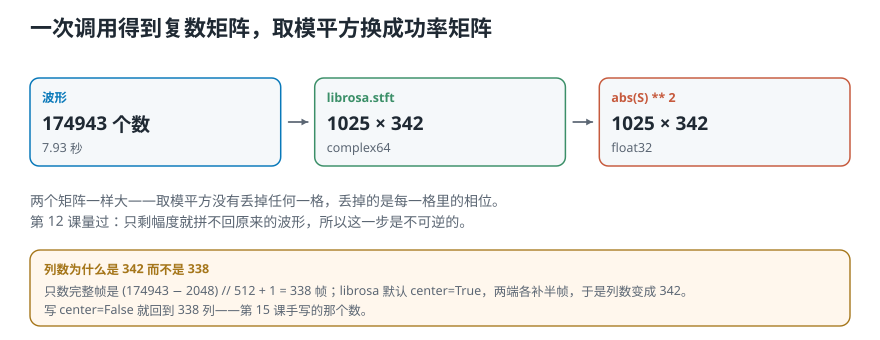
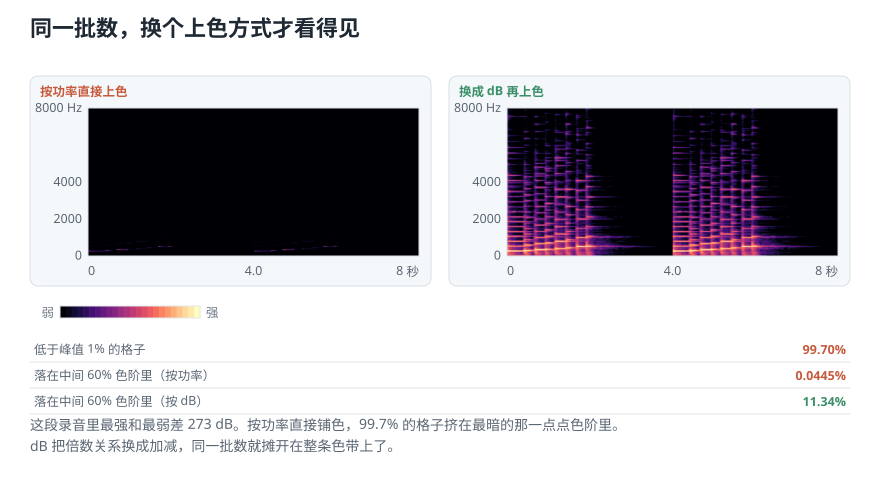
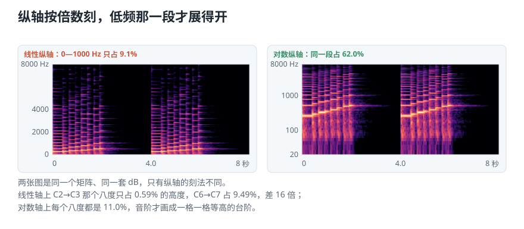
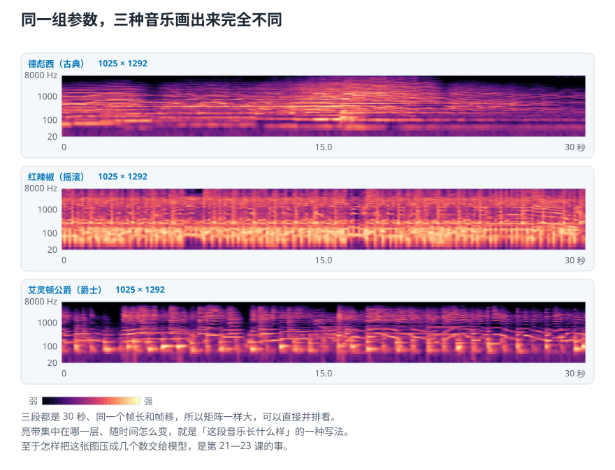

# 同一批数，为什么换个画法才看得见：用 Python 画声谱图

> **导读：** 上一课已经把一段录音变成了一张「哪个高低成分、在哪一段时间、有多强」的大表格。这一课把它真的画出来。可第一次画出来的图几乎是全黑的——不是算错了，是**上色的方式不对**：这张表里 99.70% 的格子都不到最强那一格的百分之一，硬按比例分配颜色，它们全挤进同一种黑。换成分贝上色，再把纵轴改成按倍数刻，同一批数就全都看得见了。

<picture>
  <source media="(max-width: 640px)" srcset="../../零基础版_16-20/figures/mobile/00-course-position-16.svg">
  
</picture>

[上一课](15-短时傅里叶变换-整段频谱为什么找不到声音发生的时间.md)手写了那套做法——**用一扇窗在录音上一格一格往右挪，每挪到一个位置就算一次频率**，把每次的结果排成一列。这套做法叫**短时傅里叶变换**。那一课留下三个没查的问题：现成的库默认会不会在录音两端补东西？画图时画的是模还是功率？颜色和纵轴要不要换成对数？这一课把三个都查掉。

完整代码在[第 16 课脚本](../../课程代码/lessons/lesson16_spectrogram.py)，运行环境沿用[课程总纲](../../课程总纲/README.md)里的一次性配置。

## 先听四段声音

这一课要用四个文件。第一个是一段一格一格往上爬的音阶，后三个是三种风格的音乐，各 30 秒。

1. [音阶：scale.wav](../../../source_course/audio_resources/scale.wav)
2. [德彪西，古典：debussy.wav](../../../source_course/audio_resources/debussy.wav)
3. [红辣椒乐队，摇滚：redhot.wav](../../../source_course/audio_resources/redhot.wav)
4. [艾灵顿公爵，爵士：duke.wav](../../../source_course/audio_resources/duke.wav)

载入之后打印一下：

```text
scale     174943 个样本，  7.93 秒
debussy   661500 个样本， 30.00 秒
redhot    661500 个样本， 30.00 秒
duke      661500 个样本， 30.00 秒
```

四段都被重采样到同一个采样率 22050 Hz。[第 04 课](04-模拟声到数字录音-连续的声音怎样变成一串数字.md)说过原因：采样率不一样，同一个数组位置对应的频率就不一样，后面所有比较都会错位。

先用音阶那一段。它的好处是**答案已经写在耳朵里**——音一格一格往上走，画出来也应该一格一格往上走。图对不对，一眼就能判。

## 一行调用，拿到一张复数矩阵

参数只有两个：一帧看 2048 个样本，每次向右移 512 个。

```text
FRAME_SIZE = 2048
HOP_SIZE   = 512
S = librosa.stft(scale,
                 n_fft=FRAME_SIZE,
                 hop_length=HOP_SIZE)
```

打印它的形状和元素类型：

```text
S.shape = (1025, 342)
元素类型 complex64
```

**1025 这个数上一课已经算过**：一帧 2048 个实数，只需要保留非负那一半，`2048 // 2 + 1 = 1025`。

342 这个数就不太对得上了。上一课的公式说，只数完整帧的话应该是

```text
(174943 - 2048) // 512 + 1 = 338
```

**多出来的四列是补边补出来的。** 这个库默认在录音的两端各补上半帧，好让第一列的中心正好对准第 0 个样本。明确写上不要补边，就回到 338：

```text
librosa.stft(..., center=False)
  -> (1025, 338)
```

**上一课那个悬着的问题到这里有答案了。** 两种都不算错，但同一批录音必须一直用同一种，否则两次算出来的列数对不上，后面按时间对齐就会差半帧。上一课的手写实现写死了不补边，所以那里是 338。

## 取模再平方，复数变成实数

矩阵里每一格都是复数——[第 12 课](12-复数形式的傅里叶变换-把强度和起点写进一个系数.md)讲过，它的模是「这个频率有多强」，角是「从哪里起步」。想用颜色画强弱，就只要模：

```text
Y = np.abs(S) ** 2
Y.shape = (1025, 342)
元素类型 float32
```

<picture>
  <source media="(max-width: 640px)" srcset="../../零基础版_16-20/figures/mobile/16-complex-to-power.svg">
  
</picture>

*图 1：形状一格没变，变的是每一格里装的东西——从一个复数变成一个实数。下面那栏解释列数为什么是 342 而不是 338。*

**形状一模一样，说明没有丢掉任何一格。** 丢掉的是每一格里的角，也就是相位。第 12 课量过这件事的代价：只留幅度，波形就再也拼不回来了。所以这一步是单向的——能画图，不能还原。

平方之后的量叫**功率**。取不取平方都能画图，但平方之后的数和「能量」直接对应，后面几课算特征时用的都是它。

## 照着画一张，结果几乎全黑

现在把这张 1025 × 342 的表格画成图：横向是时间，纵向是频率，每一格的数值换成一种颜色，最强的最亮，零最暗。

画出来是一片黑。**不是算错了。** 把数据摊开数一遍就知道为什么：

```text
低于峰值 1%   的格子占 99.70%
低于峰值 0.1% 的格子占 99.07%
中位数只有峰值的 3.97e-11
```

**颜色是按「占峰值多少」分配的。** 99.70% 的格子都不到峰值的百分之一，于是它们全都落进色带最暗的那一小截里，彼此之间的差别被压没了。落在中间那 60% 色阶里的格子只有 **0.0445%**——那一大片颜色几乎没有内容可画。

根子在于这段录音的动态范围：最强的一格和最弱的一格差 **273 dB**。想让这么大的跨度线性地铺在一条色带上，本来就不可能。

## 换成分贝，同一批数就摊开了

办法是[第 03 课](03-强弱响度与音色-音量一样为什么听起来不同.md)那件老工具：**分贝把倍数关系换成加减。** 差一千倍变成差 30 dB，差一百万倍变成差 60 dB——原本挤在一起的小数值，被拉开成了可以看见的距离。

```text
power_to_db 之后
  范围 -39.05 dB 到 40.95 dB
  跨度 80.00 dB
落在中间 60% 色阶的格子
  按功率上色  0.0445%
  按 dB 上色 11.34%
```

<picture>
  <source media="(max-width: 640px)" srcset="../../零基础版_16-20/figures/mobile/16-why-db.svg">
  
</picture>

*图 2：左右两张图用的是同一个矩阵、同一批数，区别只在于颜色怎么分配。左边看不出这段录音里有音阶，右边一眼就看见了。*

**这里有个坑要说清楚。** 上面那个 80.00 dB 看着像个整数巧合，其实它是函数的默认设置：`power_to_db` 有个 `top_db` 参数，默认 80，意思是「比最强处低 80 dB 以上的，一律按 80 算」。所以这个 80.00 是被截出来的，不是这段录音本身的跨度。

关掉截断看一眼真实情况：

```text
top_db=None
  范围 -100.0 dB 到 41.0 dB
  跨度 141.0 dB
```

**截断是有意义的，不是缺陷。** 不截的话，那些安静到听不见的格子也会分走色带，画面反而更平。但它是一个**必须知道自己在用**的默认值：不同的截断画出来颜色深浅不同，两张图要放在一起比较时，这个数必须一致。

## 纵轴也该按倍数刻

上面那张图还有一处别扭：亮的部分全挤在底下一条窄带里，上面大半张图基本是空的。

原因和颜色那件事一样，只是换到了纵轴上。这段录音的采样率是 22050 Hz，能表示的最高频率是 11025 Hz。而音乐里绝大部分内容在 1000 Hz 以下：

```text
线性纵轴上
  0-1000 Hz 只占 9.07% 的高度
对数纵轴上（从 20 Hz 起算）
  同一段占 61.98%
```

**把纵轴改成按倍数刻，低频那一段就展开了。** 「按倍数刻」的意思是：等高的一段距离代表等倍数的频率变化，而不是等数量的赫兹变化。

<picture>
  <source media="(max-width: 640px)" srcset="../../零基础版_16-20/figures/mobile/16-log-frequency.svg">
  
</picture>

*图 3：还是同一个矩阵、同一套分贝。左边那张的内容全压在底部，右边的音阶变成了一格一格往上走的台阶。*

**为什么按倍数刻正好合适？** [第 02 课](02-声音与波形-一次振动怎样变成录音里那条线.md)算过：音高每升一个八度，频率翻一倍。所以「一个八度」这件事，在线性轴上占多高完全取决于它在高音区还是低音区：

```text
线性纵轴上
  C2 到 C3 只占 0.59% 的高度
  C6 到 C7 占  9.49%
  差 16 倍
对数纵轴上
  9.11 个八度平分，每个都是 10.98%
```

音乐里这两段都是**一个八度**。纵轴按倍数刻之后，一个八度就是固定的高度，音阶画出来才是等高的台阶——图 3 右边那一格一格，正是这么来的。

（至于人耳对频率的感觉具体怎么弯、要弯多少，那不是一条简单的对数曲线能概括的，是下一课的事。）

## 三种风格的音乐，画出来完全不同

四步都定下来了：算 STFT、取模平方、换成分贝、纵轴按倍数刻。现在把它套到三段 30 秒的音乐上。

```text
德彪西（古典）  1025 × 1292
红辣椒（摇滚）  1025 × 1292
艾灵顿公爵（爵士）1025 × 1292
```

**三个矩阵一样大**，因为三段一样长、参数也一样。这正是能并排比较的前提。

<picture>
  <source media="(max-width: 640px)" srcset="../../零基础版_16-20/figures/mobile/16-three-genres.svg">
  
</picture>

*图 4：同一组参数下的三段音乐。亮带集中在哪一层、随时间怎么变，三张图各不相同。*

三张图能直接看出来的差别：古典那段的亮部平滑连绵，几乎没有整齐的竖线；摇滚那段又密又满，高频一直有内容；爵士那段有一排排规律的竖线，那是鼓点——**一次敲击在时间上很短、在频率上铺得很宽，画出来就是一条竖线。**

**但「看得出来」还不等于「能交给模型」。** 一张 1025 × 1292 的图有一百三十多万个数，直接扔给模型既慢又难学。怎样把它压成几个数、压完还保留刚才看到的那些差别，是第 21 课开始的事。

## 这一课得到了什么，下一课接着讲什么

这一课把上一课那张矩阵真正画了出来，四步各解决一件事：

| 这一步 | 解决的问题 |
|---|---|
| `librosa.stft` | 一次调用拿到复数矩阵，并查清默认会补边 |
| `np.abs(S) ** 2` | 复数换成实数功率，形状不变、相位丢掉 |
| `power_to_db` | 273 dB 的跨度换成加减，格子不再挤在一起 |
| 纵轴按倍数刻 | 0—1000 Hz 从占 9.07% 变成占 61.98% |

三个值得记住的数：**99.70%** 的格子低于峰值的百分之一，所以线性上色画不出东西；`power_to_db` 打印的 **80.00 dB** 是默认截断而非数据本身；线性轴上一个八度占的高度能差 **16 倍**，对数轴上则处处相同。

下一课要处理的，是这一课特意避开的那半句话。这一课换对数纵轴，理由只用到「音高按倍数走」——那是音乐本身的结构。可**人耳对频率的感觉并不正好是一条对数曲线**：低频那一段分得比对数更细，高频那一段更粗。[下一课](17-梅尔刻度-怎样按听感重新刻一把频率的尺子.md)引入一把按听感重新刻过的尺子，把频率轴再换一次。
