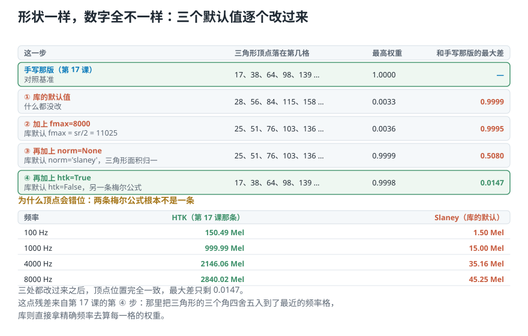
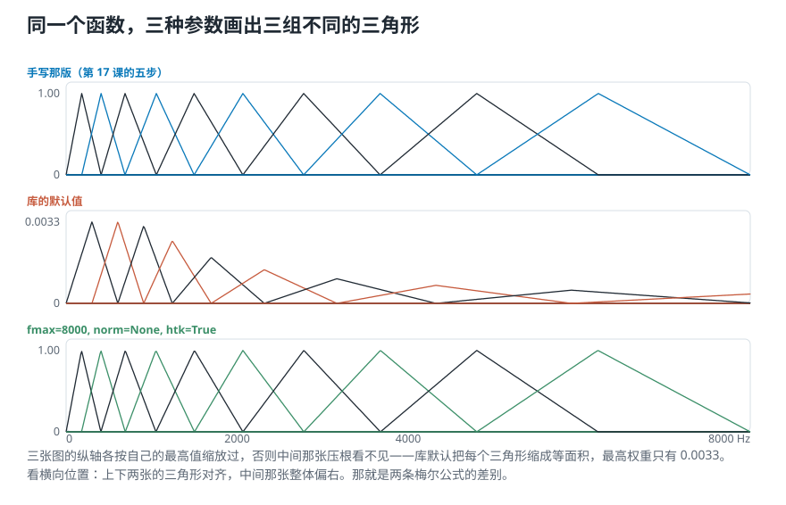
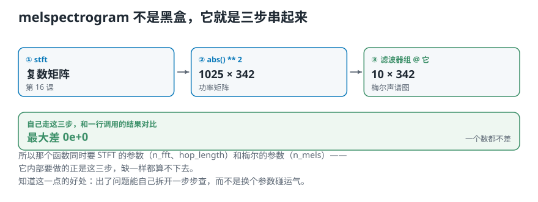
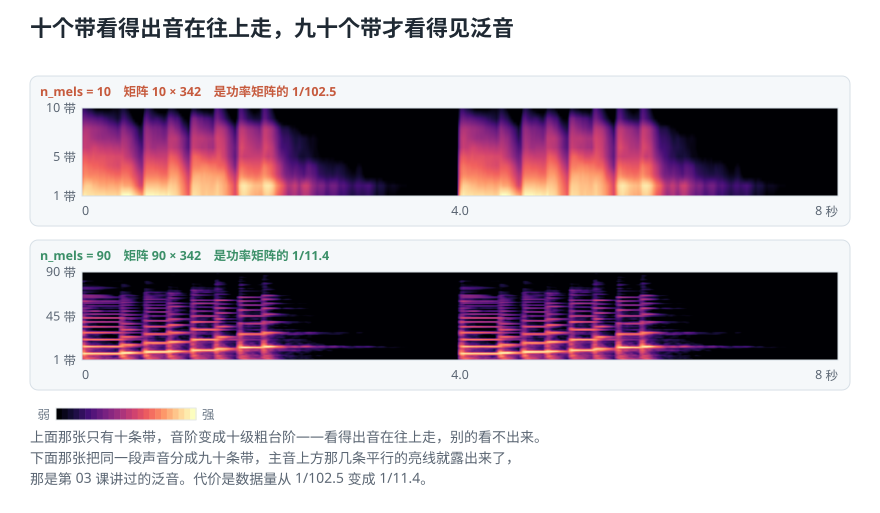

# 形状对上了，数字却全不一样：用 Python 提取梅尔声谱图

> **导读：** 上一课把那组**梅尔滤波器**——十个三角形，每个只管一段频率，中间最敏感、两边逐渐不管——按五步自己造了一遍。这一课让现成的库造一遍，然后把两份结果摆在一起——**形状一模一样，数字一个都对不上。** 顺着差异追下去，会挖出三个默认值：库默认取到的最高频率不是 8000、默认把每个三角形缩成等面积、默认用的**根本不是同一条梅尔公式**。三处改过来之后，最大差从 0.9999 降到 0.0147。剩下的那点残差，也有出处。

<picture>
  <source media="(max-width: 640px)" srcset="../../零基础版_16-20/figures/mobile/00-course-position-18.svg">
  
</picture>

完整代码在[第 18 课脚本](../../课程代码/lessons/lesson18_mel_spectrogram.py)，运行环境沿用[课程总纲](../../课程总纲/README.md)里的一次性配置。

## 一行就拿到了滤波器组

还是[上一课](17-梅尔刻度-怎样按听感重新刻一把频率的尺子.md)那段音阶，还是那组参数：一帧 2048 个样本，10 个**梅尔带**——**也就是**上一课那把按听感刻的尺子上切出来的十段。

```text
librosa.filters.mel(sr=22050,
                    n_fft=2048,
                    n_mels=10)
shape = (10, 1025)
```

**形状对上了。** 10 是带数，1025 是「帧长 / 2 + 1」——和上一课手写那版一模一样。

到这里很容易就翻篇了。但**形状对上不等于内容对上**，所以再多看一眼。

## 数字一个都对不上

把两个矩阵放在一起比。看三样东西：三角形的顶点落在第几个频率格、最高的那个权重是多少、逐格相减的最大差有多大。

```text
手写那版  顶点 17、38、64、98、139 …
          最高权重 1.0000
库的默认  顶点 28、56、84、115、158 …
          最高权重 0.0033
          最大差 0.9999
```

**顶点位置全错开了，最高权重差了三百倍。** 形状一样，只是说两个矩阵都是 10 行 1025 列，不代表里面装的是同一套三角形。

<picture>
  <source media="(max-width: 640px)" srcset="../../零基础版_16-20/figures/mobile/18-alignment.svg">
  
</picture>

*图 1：一行一行往下改，每改一个默认值就重新比一次。绿色那一行是顶点终于对上的时候。*

差异来自三个默认值，一个一个改过来。

### 差别一：最高频率取到哪里

上一课取到 8000 Hz，因为那已经够覆盖音乐的主要内容。**库默认取到奈奎斯特频率**，也就是采样率的一半，22050 的一半是 11025 Hz。

范围一变，十个带要覆盖的区间就变了，每个三角形的位置自然跟着挪。

```text
② 加上 fmax=8000
   顶点 25、51、76、103、136 …
   最大差 0.9995
```

**顶点动了，但还是不对。** 最大差几乎没变——说明主要的差异不在这里。

### 差别二：三角形要不要缩成等面积

上一课每个三角形的顶点都是 1。**库默认把每个三角形缩放成等面积**（参数写作 `norm='slaney'`）：底边越宽的三角形，顶点就压得越低，这样每个带交出的数不会因为它管得宽就自动偏大。

```text
③ 再加上 norm=None
   最高权重 0.9999（终于回到 1 附近）
   最大差 0.5080
```

**最大差掉了一半。** 但顶点位置还是 25、51、76 …，和手写那版的 17、38、64 … 差着一截。

### 差别三：用的不是同一条梅尔公式

这一处最要命。上一课那条公式是

$$
m = 2595 \cdot \log_{10}\left(1 + \frac{f}{700}\right)
$$

它有个名字，叫 **HTK 公式**。而**库默认用的是另一条**，叫 Slaney 刻度——1000 Hz 以下是**直线**，之上才转成对数。两条给出的数完全不在一个量级上：

| 频率 | HTK（上一课那条） | Slaney（库的默认） |
|---:|---:|---:|
| 100 Hz | 150.49 Mel | 1.50 Mel |
| 1000 Hz | 999.99 Mel | 15.00 Mel |
| 4000 Hz | 2146.06 Mel | 35.16 Mel |
| 8000 Hz | 2840.02 Mel | 45.25 Mel |

**两条都叫「梅尔刻度」，都是从听觉实验里拟合出来的，只是拟合的做法不同。** 用哪一条，三角形的位置就完全不同。

```text
④ 再加上 htk=True
   顶点 17、38、64、98、139 …
   最大差 0.0147
```

**顶点位置终于完全一致。**

## 剩下那点残差，也有出处

0.0147 不是零。它来自上一课那五步里的**第 ④ 步**：那里把每个三角形的三个角**四舍五入到了最近的频率格**，比如 180.2 Hz 被挪到第 17 格（183.0 Hz）。库不做这一步，它直接拿精确频率去算每一格的权重。

```text
理论位置    180.2、406.8、691.8 …
手写取整到  183.0、409.1、689.1 …
```

**这两种做法都对。** 教材里那五步是经典写法，取整让手算容易讲清楚；库要的是精度，所以不取整。**知道差别在哪，比知道谁对更有用**——将来两份代码算出来的梅尔特征对不上，第一个该查的就是这里。

<picture>
  <source media="(max-width: 640px)" srcset="../../零基础版_16-20/figures/mobile/18-bank-compare.svg">
  
</picture>

*图 2：三组三角形画在一起。纵轴各按自己的最高值缩放过，否则中间那张压根看不见。看横向位置：上下两张对齐，中间那张整体偏右。*

## 提取梅尔声谱图：那个函数不是黑盒

滤波器组搞清楚了，提取就是一行：

```text
librosa.feature.melspectrogram(
    y=scale, sr=sr,
    n_fft=2048, hop_length=512,
    n_mels=10)
-> (10, 342)，float32
```

**它看着像个黑盒，其实就是前两课那三步串起来。** 自己走一遍验证：

```text
① stft         -> 复数矩阵
② abs() ** 2   -> (1025, 342) 功率
③ 滤波器组 @ 它 -> (10, 342)
和一行调用的最大差 0.000e+00
```

<picture>
  <source media="(max-width: 640px)" srcset="../../零基础版_16-20/figures/mobile/18-black-box.svg">
  
</picture>

*图 3：三步走完，和一行调用的结果一个数都不差。*

**一个数都不差。** 这也解释了那个函数为什么要那么多参数：`n_fft` 和 `hop_length` 是第 ① 步要的，`n_mels` 是第 ③ 步要的——它内部本来就要做完这三步，缺一样都算不下去。

**知道这一点的好处很实在**：结果不对时能自己拆开一步步查，而不是换个参数碰运气。

## 换成分贝

和上一课的声谱图一样，功率矩阵要换成分贝才看得清。

```text
power_to_db(mel)
  范围 -61.63 到 18.37 dB
power_to_db(mel, ref=np.max)
  范围 -80.00 到  0.00 dB
形状都还是 (10, 342)
```

**换算不动形状，只动每一格的数。** 两种写法的区别在参照点：

- 不写 `ref`，参照点是 1.0，于是有正有负；
- 写 `ref=np.max`，就是**把最强的那一格定成 0 dB**，其余全是负的。

后者更常用，因为不同录音的绝对音量本来就没有可比性，看「比最强处低多少」才有意义。至于那个整整齐齐的 −80，还是[第 16 课](16-用Python画声谱图-同一批数为什么换个画法才看得见.md)那个 `top_db=80` 默认截断。

## 十个带够不够

最后动一下带数，看代价。

```text
n_mels= 10 -> (10, 342)     13680 字节
              是功率矩阵的 1/102.5
n_mels= 90 -> (90, 342)    123120 字节
              是功率矩阵的 1/11.4
功率矩阵本身 (1025, 342)  1402200 字节
```

<picture>
  <source media="(max-width: 640px)" srcset="../../零基础版_16-20/figures/mobile/18-bands-10-90.svg">
  
</picture>

*图 4：同一段音阶，同一组参数，只有带数不同。*

**十个带只画得出十级粗台阶**：看得出音在一格一格往上走，别的看不出来。**九十个带**画出来，主音上方那几条平行的亮线就露出来了——那是[第 03 课](03-强弱响度与音色-音量一样为什么听起来不同.md)讲过的泛音，也正是不同乐器听起来不一样的地方。

代价是数据量从功率矩阵的 1/102.5 变成 1/11.4。**要多少细节，就得付多少体积**，没有免费的那一档。

## 这一课得到了什么，下一课接着讲什么

这一课做的事，用一句话说是**把库和手写的对齐**。对齐过程本身比结果值钱：

| 差在哪 | 库的默认 | 上一课手写的 |
|---|---|---|
| 最高频率 | 奈奎斯特频率 11025 Hz | 8000 Hz |
| 三角形归一 | `norm='slaney'`，等面积 | 顶点都是 1 |
| 梅尔公式 | Slaney 刻度 | HTK 刻度 |
| 边界取整 | 不取整，用精确频率 | 四舍五入到最近的频率格 |

三个值得记住的数：默认参数下和手写那版的最大差是 **0.9999**（几乎完全不同），三处改过来降到 **0.0147**；`melspectrogram` 和自己走三步的结果最大差 **0.000e+00**；十个带把数据压到功率矩阵的 **1/102.5**，九十个带是 **1/11.4**。

**还有一件事这一课没说破**：梅尔刻度是照着人耳拟合的。分析海豚的超声或蝙蝠的回声时，它没有任何道理可讲。所以 `n_mels`、`fmin`、`fmax` 这些参数不是「调参」，它们在回答**这段声音是给谁听的**。

到这里，一段录音已经能变成一张「梅尔带 × 时间」的表格了。可 90 行仍然不算少，而且相邻的带之间高度相关——一个音响起来，它的泛音会同时点亮好几条带（[下一课](19-MFCC是什么-把谁在发声和发的什么音分开.md)量到相邻两条的相关系数是 0.95）。下一课要做的是再压一次：**用一种叫倒谱的做法，把「谁在发声」和「发的什么音」分开**，最后只留十几个数。
