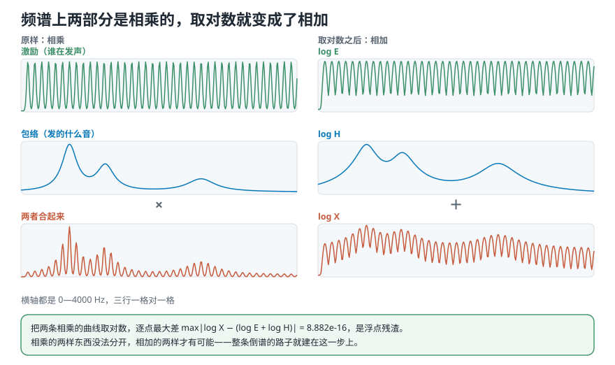
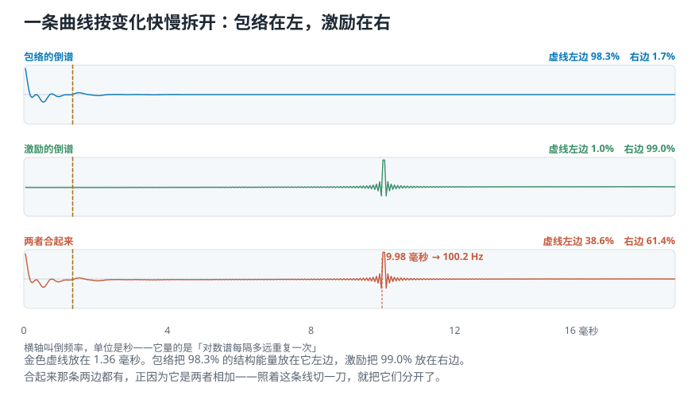
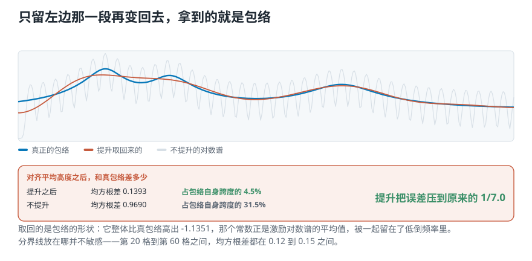
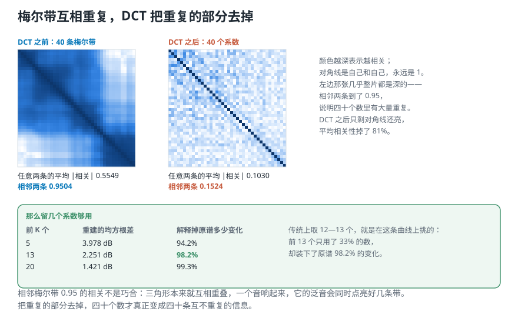

# 把「谁在发声」和「发的什么音」分开：MFCC 是什么

> **导读：** 一段人声里同时装着两样东西——声带振多快（决定音高），和嘴摆成什么形状（决定发的是「啊」还是「衣」）。在频谱上它们是**相乘**的，缠在一起谁也拿不出来。这一课做的事只有一步：**取个对数，相乘就变成了相加**；相加的两样，再变换一次就能落到一根轴的两端。本文把这条路上的每一步都量出来——包络 98.3% 在左边、激励 99.0% 在右边，切一刀就分开了；最后那步 DCT 把梅尔带之间 0.95 的相邻相关压到 0.15，前 13 个系数装下原谱 98.2% 的变化。

<picture>
  <source media="(max-width: 640px)" srcset="../../零基础版_16-20/figures/mobile/00-course-position-19.svg">
  
</picture>

完整代码在[第 19 课脚本](../../课程代码/lessons/lesson19_cepstrum.py)，运行环境沿用[课程总纲](../../课程总纲/README.md)里的一次性配置。

## 一串倒过来的词

这一课有四个新名字。**先不用记，扫一眼就往下走**——每一个后面都会在它真正被用到的地方重新讲一遍。摆在这里是因为它们有个共同点：**都是把原词的前半截倒过来拼的**。

| 原来的词 | 倒过来 | 指什么 |
|---|---|---|
| spectrum（频谱） | **cepstrum** 倒谱 | 对数谱再变换一次得到的东西 |
| frequency（频率） | **quefrency** 倒频率 | 倒谱的横轴 |
| filtering（滤波） | **liftering** 提升 | 在倒谱上做的「滤波」 |
| harmonic（[谐波](03-强弱响度与音色-音量一样为什么听起来不同.md)） | **rhamonic** 倒谐波 | 倒谱上的峰 |

这不是文字游戏。**它在提示一件具体的事：这些量都是在频谱「上面」再做一次变换得到的**，所以横轴不再是频率，滤波也不再是滤波。名字倒过来，是为了让你别把两层搞混。

倒频率的单位不是赫兹，**是秒**。这一点后面会立刻派上用场。

这套做法 1960 年代出自地震研究——当时要在地震波里找回声；1970 年代成了语音识别的首选特征；2000 年代进入音乐处理。

## 一段人声里，其实有两样东西在相乘

说话的时候有两件事同时发生：

- **声带在振**。振得快听起来就高，振得慢就低。它决定[**音高**](02-声音与波形-一次振动怎样变成录音里那条线.md)，工程上把这股振动叫**声门脉冲**。
- **嘴、舌头、喉咙摆成某个形状**。同一个人用同样的音高说「啊」和「衣」，声带的振动没变，变的是这一路管腔的形状。它像一个**滤波器**，决定发出来的是哪个音，工程上叫**声道**。

一个声音是这两样合起来的结果。在**时域**上它们是「卷积」——这个词这一课只用到它唯一需要的那条性质：

> **时域上卷积，频域上就是相乘。**

所以在频谱上，一段语音可以写成

$$
X(f) = E(f) \cdot H(f)
$$

$E$ 是声门脉冲的谱，$H$ 是声道的频率响应。

<picture>
  <source media="(max-width: 640px)" srcset="../../零基础版_16-20/figures/mobile/19-log-splits.svg">
  
</picture>

*图 1：左边三行是原样。最上面那条密密麻麻的是激励——一串等间距的峰，间距就是基频；中间那条平滑的鼓包是包络；最下面是两者相乘的结果。右边三行是各自取对数之后：最下面那条正好等于上面两条相加。*

**这张图的三行值得对着看一遍。** 激励变化很快（每 100 Hz 一个峰），包络变化很慢（整段只有三个鼓包）。相乘之后，快的那层骑在慢的那层上——你在最下面那条曲线里能同时看到两者，但**没有任何办法把它们拆回去**，因为乘法把它们焊死了。

### 怎么读一张对数谱

对着最下面那条看，一张语音的对数谱上有三样东西：

- **谱包络**：那条平滑的、勾着轮廓走的线。它来自声道。
- **共振峰**：包络上那几个鼓包。**它们承载这个声音的身份**——发「啊」还是发「衣」，区别就在这几个鼓包的位置。
- **谱细节**：包络上下密密的锯齿。它来自声门脉冲，间距就是基频。

**语音识别要的是共振峰，不要细节；说话人识别多半反过来。** 所以「把两层分开」不是学术洁癖，它决定你交给模型的是不是它要的那一层。

## 第一步：取对数，乘法就变成了加法

相乘的两样东西分不开，**相加的两样才有可能分开**。而把乘法变成加法只要一个动作：

$$
\log X(f) = \log E(f) + \log H(f)
$$

这一步有个学名叫**同态滤波**，不过名字不重要，重要的是它真的成立。造一个成分完全已知的谱验证一下——激励是基频 100 Hz 的一串谐波，包络是三个共振峰：

```python
X = E * H
print(np.max(np.abs(np.log(X) - (np.log(E) + np.log(H)))))
```

```text
8.882e-16
```

**8.882e-16 是浮点运算的残渣，等于严格相等。** 整条倒谱的路子就建在这一行上。

为什么要用合成的谱，不直接上真实录音？因为真实录音里**没有标准答案**——你不知道真正的包络长什么样，也就没法验证「取回来的对不对」。这里两部分是自己放进去的，每一步都能和原件比。真实语音留到后面。

## 第二步：再变换一次，两部分落到一根轴的两端

现在 $\log X$ 是两条曲线叠加出来的。它们有一个明显的差别：**包络变化慢，激励变化快。**

按变化快慢把一条曲线拆开——这正是傅里叶变换干的事。所以对**对数谱本身**再做一次变换，得到的就是**倒谱**：

```python
cepstrum = np.fft.irfft(np.log(np.abs(X)))
```

横轴叫倒频率，单位是秒：第 $n$ 个点对应 $n/f_{\mathrm{s}}$ 秒。它量的是「对数谱每隔多远重复一次」。

<picture>
  <source media="(max-width: 640px)" srcset="../../零基础版_16-20/figures/mobile/19-quefrency-ends.svg">
  
</picture>

*图 2：三条倒谱画在同一根倒频率轴上。金色虚线放在 1.36 毫秒。*

三行的数字是这一课的核心：

| 这条倒谱来自 | 虚线左边 | 虚线右边 |
|---|---|---|
| 包络（发的什么音） | **98.3%** | 1.7% |
| 激励（谁在发声） | 1.0% | **99.0%** |
| 两者合起来 | 38.6% | 61.4% |

**包络几乎全在左边，激励几乎全在右边。** 合起来那条两边都有——正因为它是两者相加。**照着这条线切一刀，就把它们分开了。**

再看合成那条在右边的那个尖峰：它落在第 220 格，也就是 **9.98 毫秒**。倒过来 $1/0.00998 = 100.2$ Hz——**正是我们放进去的 100 Hz 基频**。这个峰叫**第一个倒谐波**，它就是激励的周期本身。

这也解释了为什么倒频率的单位是秒：**倒谱上一个位于 10 毫秒的峰，说的是「对数谱每隔 100 Hz 重复一次」。**

## 第三步：提升，把包络取回来

既然两部分分在两端，只留左边那一段再变回频率轴上，拿到的应该就是包络。这个动作叫**提升**——在倒谱上做的滤波。

<picture>
  <source media="(max-width: 640px)" srcset="../../零基础版_16-20/figures/mobile/19-liftering.svg">
  
</picture>

*图 3：蓝线是真正的包络，橙线是提升取回来的，灰线是不提升、直接拿对数谱当包络。*

| | 均方根差 | 占包络自身跨度 |
|---|---|---|
| 提升之后 | 0.1393 | **4.5%** |
| 不提升 | 0.9690 | 31.5% |

**提升把误差压到原来的七分之一。**

有一处值得说破：**提升取回的是包络的形状，不是它的绝对高度。** 取回来的那条整体比真包络高出 −1.1351，而激励对数谱的平均值正好是 −1.1360——**那个常数就是激励的平均电平，它落在第 0 格里，被一起留下来了**。所以上面那张表比的是对齐平均高度之后的差。

分界线放在哪并不敏感：

| 分界线 | 对应毫秒 | 均方根差 |
|---|---|---|
| 第 10 格 | 0.45 | 0.3353 |
| 第 20 格 | 0.91 | 0.1498 |
| 第 30 格 | 1.36 | 0.1393 |
| 第 40 格 | 1.81 | 0.1221 |
| 第 60 格 | 2.72 | 0.1365 |
| 第 100 格 | 4.54 | 0.1719 |

太小会把包络自己的细节也切掉，太大会把激励放进来，**中间一大段都差不多**。

## 换成真实语音：那个峰真的是基频

合成信号上说得通，真实语音呢？取课程素材里的 `voice.wav`，挑能量最高的那 20% 帧（一共 259 帧），每帧算一次倒谱，在 60—400 Hz 对应的区间里找最高的峰：

```text
峰最突出的一帧：第 1176 帧
  倒谱第 179 格 = 8.12 毫秒
  换算过来 123.2 Hz
  同一帧 librosa.yin 给 121.964 Hz
  两者差 1.0%
```

一帧对得上可能是运气，所以要看全体：

| 看哪些帧 | 中位相对差 | 差在 5% 以内的占 |
|---|---|---|
| 全部 259 帧 | 3.7% | 56% |
| 只看倒谱峰明显的那 40% 帧 | **1.8%** | **80%** |

峰不明显的那些帧多半是清音——气流噪声，声带根本没振，本来就没有基频可找。

**注意这条结论的方向。** 倒谱里明明白白装着音高，所以「MFCC 和音高无关」这句话只对**低阶系数**近似成立，不能当成倒谱本身的性质——音高就住在高倒频率那一端，是后面主动丢掉的。

## MFCC：把这条链子接到梅尔谱后面

到这里，倒谱这条路已经走完了。**MFCC 就是把它接在第 16—18 课那条链子后面：**

| 第几步 | 做什么 | 哪一课做完的 |
|---|---|---|
| ① | 波形 → 傅里叶变换 | [第 15 课](15-短时傅里叶变换-整段频谱为什么找不到声音发生的时间.md) |
| ② | 取对数幅度 | [第 16 课](16-用Python画声谱图-同一批数为什么换个画法才看得见.md) |
| ③ | 换成梅尔刻度 | [第 17](17-梅尔刻度-怎样按听感重新刻一把频率的尺子.md)、[18 课](18-用Python提取梅尔声谱图-形状对上了数字却全不一样.md) |
| ④ | **离散余弦变换（DCT）** | **本课新增的只有这一步** |

前三步交出来的是一张「梅尔带 × 时间」的表格。第四步对**每一列**（也就是每一帧的那几十个梅尔带）做一次 DCT，得到的一串数就是这一帧的 MFCC。

**所以 MFCC 是「梅尔刻度上的倒谱系数」**——名字里每个字都对得上一步。

## 为什么最后一步用 DCT

上面算倒谱用的是逆傅里叶变换，MFCC 这一步却换成了 DCT。四个理由，前两个一句话说得完，后两个要量：

**一、它是傅里叶变换的简化版。** 同一件事——按变化快慢拆开一条曲线。

**二、它给出实数。** 逆傅里叶变换给复数：40 个梅尔带出来 21 个复数，也就是 42 个实数，数反而变多了；DCT 给 40 个实数。

**三、它去掉梅尔带之间的重复。** 这是最值钱的一条。

<picture>
  <source media="(max-width: 640px)" srcset="../../零基础版_16-20/figures/mobile/19-dct-decorrelate.svg">
  
</picture>

*图 4：左右两张都是 40 × 40 的相关系数矩阵，颜色越深表示越相关。左边几乎整片都是深的，右边只剩一条对角线。*

拿一段真实语音的对数梅尔谱（40 个带 × 1292 帧）量一遍：

| | 任意两条的平均 相关 | 相邻两条 |
|---|---|---|
| 梅尔带之间 | 0.5549 | **0.9504** |
| DCT 系数之间 | 0.1030 | **0.1524** |

**相邻梅尔带 0.95 的相关不是巧合**：那些三角形本来就互相重叠（[第 17 课](17-梅尔刻度-怎样按听感重新刻一把频率的尺子.md)造它们的时候就是这么造的），而且一个音响起来，它的泛音会同时点亮好几条带。**四十个数里真正互不重复的远不到四十个。** DCT 之后平均相关性掉了 81%。

**四、它顺手降了维。** 这就是下一节。

## 取多少个系数

DCT 把能量堆在前几个系数上。留前 $K$ 个、其余清零，再变回去和原谱比：

| 前 K 个 | 重建的均方根差 | 解释掉原谱多少变化 | 用了多少数 |
|---|---|---|---|
| 5 | 3.978 dB | 94.2% | 12% |
| 13 | 2.251 dB | **98.2%** | 32% |
| 20 | 1.421 dB | 99.3% | 50% |
| 40 | 0.000 dB | 100% | 100% |

传统上取 **12—13 个**，就是在这条曲线上挑的：**前 13 个只用了三分之一的数，装下了原谱 98.2% 的变化**；再往后加，换来的越来越少。

低阶系数装的是谱包络的大形状，也就是共振峰——**正是「发的什么音」那一层**；高阶系数装的是细节，多半是激励和噪声。**丢掉高阶，等于主动把「谁在发声」那一层扔了。**

单独一帧的 MFCC 只是一张静态快照。要让模型看见声音怎么变，通常再补两样：**Δ**（相邻帧之间的一阶差分，变化率）和 **ΔΔ**（二阶差分）。13 + 13 + 13，就是常说的**每帧 39 维**。怎么算留到下一课。

## 它擅长什么，不擅长什么

**擅长：**

- 描述频谱的**大结构**，忽略细结构——这正是上面那张重建表说的事。
- 在语音和音乐上都好用。

**不擅长：**

- **不抗噪。** 噪声一进来就搅乱对数谱，而后面每一步都建在对数谱上。
- **要大量领域知识。** 梅尔刻度、三角形滤波器、取 13 个系数——每一个都是人定的选择，不是数据自己学出来的。（也有别的尺子可选，比如 Bark 和 ERB。）
- **不适合合成。** 丢掉的信息太多，拼不回原来的声音。

**常见用途**：语音识别、说话人识别、音乐风格分类、情绪分类、自动标注。

## 小结

这一课只做了一件事：**把相乘的两样东西变成相加，再按变化快慢分开。**

四个可以自己核对的数：

1. 取对数之后 $\max|\log X - (\log E + \log H)| =$ **8.882e-16**——乘法确实变成了加法。
2. 以 1.36 毫秒为界，包络 **98.3%** 的结构能量在左边，激励 **99.0%** 在右边。
3. 提升取回的包络，误差是不提升时的 **1/7.0**（占包络自身跨度 4.5% 对 31.5%）。
4. DCT 把梅尔带之间的相邻相关从 **0.9504** 压到 **0.1524**，前 13 个系数装下原谱 **98.2%** 的变化。

还有一个顺带的收获：真实语音的倒谱峰就是基频，倒谱峰明显的那些帧上，它和专门的音高算法差 **1.8%**。

[下一课](20-用Python取MFCC-一行代码替你做了哪四步.md)把这一步交给库：`librosa.feature.mfcc` 一行拿到 13 个系数，再算一阶和二阶差分，拼成每帧 39 行——然后照例，**把它和这一课手写的这套摆在一起对齐**。四个默认值全改对，最大差才降到 0.0000。
