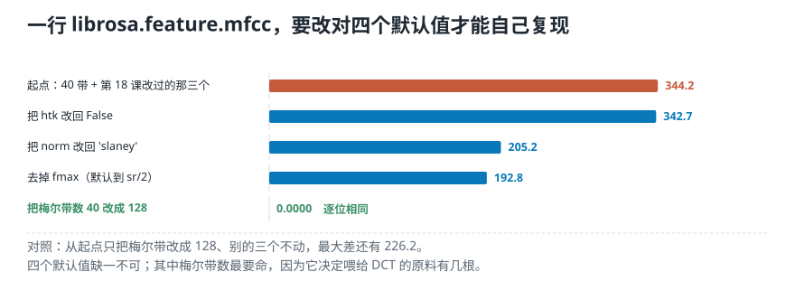
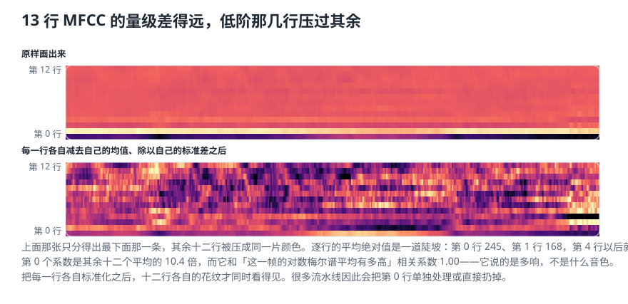
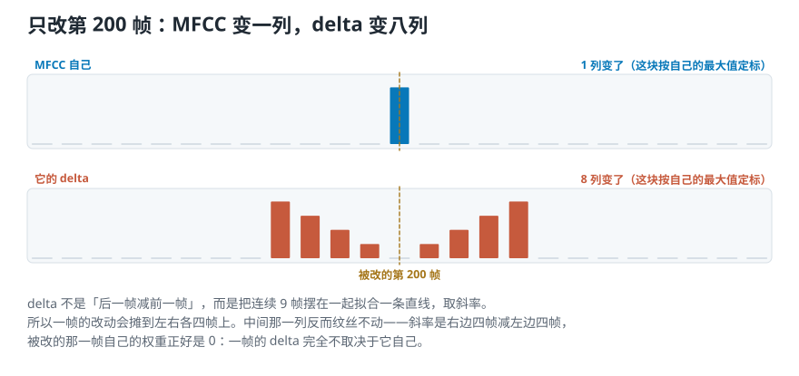
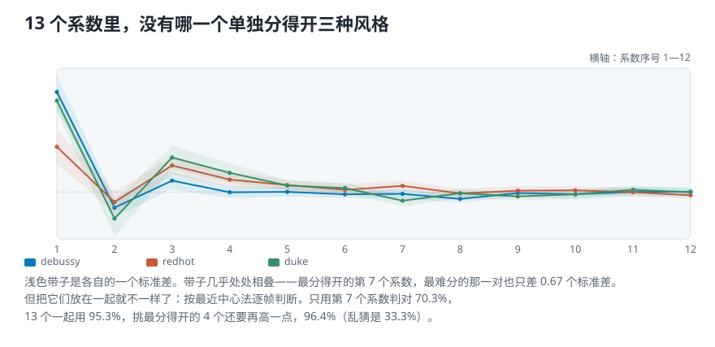

# 一行代码替你做了哪四步：用 Python 取 MFCC

> **导读：** 上一课把 MFCC 整条链子手写了一遍。这一课把它交给库：`librosa.feature.mfcc` 一行返回 13 行系数，`librosa.feature.delta` 再给出一阶和二阶变化率，拼起来就是常说的**每帧 39 维**。照例，一行拿到结果之后要做的第一件事是**把它拆回上一课手写的那四步，逐位对齐**——四个默认值全改对，最大差才降到 0.0000。中间还会撞上两件事：`delta` 不是「后一帧减前一帧」；13 个系数里没有哪一个单独分得开三种风格。

<picture>
  <source media="(max-width: 640px)" srcset="../../零基础版_16-20/figures/mobile/00-course-position-20.svg">
  
</picture>

完整代码在[第 20 课脚本](../../课程代码/lessons/lesson20_mfcc.py)，运行环境沿用[课程总纲](../../课程总纲/README.md)里的一次性配置。

## 一行就拿到了 13 个系数

换一段音乐：德彪西那段古典乐的前 30 秒。

```python
signal, sr = librosa.load("debussy.wav")
mfccs = librosa.feature.mfcc(y=signal, sr=sr,
                             n_mfcc=13)
```

```text
signal  661500 个样本，22050 Hz
mfccs   shape = (13, 1292)
```

`librosa.load` 不写采样率就默认重采样到 22050——[前面十九课](19-MFCC是什么-把谁在发声和发的什么音分开.md)一直用的就是这个数，所以这批特征和之前算过的都能互相比较。

**13 行是系数序号 0 到 12，1292 列是帧。** 帧数还是[第 15 课](15-短时傅里叶变换-整段频谱为什么找不到声音发生的时间.md)那条算式：$1 + 661500 \div 512 = 1292$，一帧覆盖 92.9 毫秒，每 23.2 毫秒挪一次。

数值范围是 −395.7 到 216.5。**这不是分贝。** 分贝停在取对数那一步；再做一次变换之后，出来的系数没有单位。

## 那一行到底等于哪几步

拆开来是四步，每一步都是前两课手写过的：

```text
① melspectrogram(y, sr)   梅尔谱
② power_to_db(...)        取对数
③ dct(type=2, ortho)      再变换一次
④ [:n_mfcc]               取前 13 行
```

既然四步都写过，自己走一遍应该得到同一批数。**试一次，一个都对不上。**

起点不是随便挑的：[第 18 课](18-用Python提取梅尔声谱图-形状对上了数字却全不一样.md)为了让库对上手写的滤波器组，我们亲手改过三个默认值（`fmax=8000`、`norm=None`、`htk=True`）；上一课一直切 40 条梅尔带。就用这套设定当起点，然后一个一个改回去。

<picture>
  <source media="(max-width: 640px)" srcset="../../零基础版_16-20/figures/mobile/20-align-stages.svg">
  
</picture>

```text
起点：40 带 + 上一课那三个  344.2210
htk 改回 False           342.7487
norm 改回 'slaney'       205.2342
去掉 fmax（默认到 sr/2）   192.7903
梅尔带数 40 改成 128        0.0000
```

**最后一步一下子归零。** 但这不等于「只要改梅尔带数就够了」：从起点只把带数改成 128、别的三个不动，最大差还有 226.2。**四个缺一不可。**

其中梅尔带数最要命，而且它错得和另外三个不是同一种错。另外三个改的是三角形长什么样；带数改的是**有几个三角形**。上一课把 40 个数交给最后那一步变换，库交的是 128 个——**输进去的原料根数都不同**，出来的前 13 个系数当然不是同一批。这不是精度问题。

四个全改对之后，两边逐位相同。

## 还有一个不写出来就看不见的默认值

取对数那一步还藏着一个。`power_to_db` 默认 `top_db=80`：**比整段最高点低 80 分贝以下的格子，全部抬到 −80。**

```text
这段音乐真实跨度   94.3 dB
被抬上来的格子     7709 个（占 4.66%）
关掉截断后的最大差  16.7231
```

4.66% 听起来不多，可它改变的是**每一行**。因为最后那一步变换是把整整一列一起变换的：**一列里改动任何一个数，这一列的 13 个系数全都会跟着动。**

上一课已经见过同一件事的另一面——[第 18 课](18-用Python提取梅尔声谱图-形状对上了数字却全不一样.md)打印出的「跨度正好 80.00 分贝」也是这个 `top_db` 截出来的。它是同一个默认值在两课里咬人两次。

## 13 行里，第 0 行说的是另一件事

把 13 行画成一张图，只看得出最下面那一条，其余十二行被压成同一片颜色。

<picture>
  <source media="(max-width: 640px)" srcset="../../零基础版_16-20/figures/mobile/20-thirteen-rows.svg">
  
</picture>

逐行的平均绝对值是一道陡坡：第 0 行 245、第 1 行 168、第 2 行 29、第 3 行 23，第 4 行以后就掉到十上下。**第 0 个系数是其余十二个平均的 10.4 倍。**

它为什么这么大，上一课的公式已经给了答案：**第 0 项就是把整列加起来乘一个常数**，也就是「这一帧的对数梅尔谱平均有多高」。实测两者的相关系数是 **1.00**，和这一帧的均方根电平（分贝）相关 **0.88**。

**它说的是这一帧多响，不是这一帧什么音色。** 所以很多流水线会把第 0 行单独归一化，或者干脆扔掉。

把每一行各自减去自己的均值、除以自己的标准差之后，十二行各自的花纹才同时看得见——上图下半部分就是这么画的。

## 一阶差分与二阶差分

单独一帧的 13 个数是一张静态快照。要让模型看见声音怎么变，再算它的变化率：

```python
delta_mfccs = librosa.feature.delta(mfccs)
delta2_mfccs = librosa.feature.delta(mfccs,
                                     order=2)
```

```text
delta_mfccs   shape = (13, 1292)
delta2_mfccs  shape = (13, 1292)
```

行数列数一个没变：每一帧的 13 个系数，各自多了一个变化率、再多一个变化率的变化率。

## 它沿哪个轴差分

这个矩阵有两个方向：往右是时间，往下是系数序号。差分沿哪个方向做，结果完全不同——而这一点，一行 `shape` 是看不出来的。

做个实验：**只把第 200 帧那一列整体加 10，别的地方一个字不动**，然后看 `delta` 变了哪几列。

<picture>
  <source media="(max-width: 640px)" srcset="../../零基础版_16-20/figures/mobile/20-delta-along-time.svg">
  
</picture>

```text
沿时间轴（默认 axis=-1）
    变了 8 列（第 196—204 列）
沿系数轴（axis=0）
    变了 1 列（第 200 列）
```

默认那一行摊开在九列宽的范围里，说明它确实是**沿时间**在差分。

而且它不是「后一帧减前一帧」。`librosa.feature.delta` 默认 `width=9`：**把连续九帧摆在一起拟合一条直线，取那条直线的斜率。** 所以一帧的改动会摊到左右各四帧上。

九列宽，真正变了的却只有八列——**正中间的第 200 列纹丝不动。** 因为这个斜率算的是「右边四帧减左边四帧」，被改的那一帧自己的权重正好是 0：**一帧的 delta 完全不取决于它自己。**

那它和逐帧相减差多少？两者逐行相关系数平均 0.40，方向一致；幅度只有 0.32 倍——九帧一起看，孤立的抖动被摊平了。窗口左右对称，所以估出来的斜率对准的还是中间那一帧，不会前后偏移。

## 拼成每帧 39 个数

```python
mfccs_features = np.concatenate(
    (mfccs, delta_mfccs, delta2_mfccs))
```

```text
shape = (39, 1292)
```

$13 + 13 + 13 = 39$。这就是上一课末尾提到的那个 39。

**是每一帧 39 个数，不是整段 39 个数。** 这段 30 秒的音乐一共 1292 帧，所以矩阵里躺着 50388 个数。前 13 行说这一帧的谱包络长什么样，中间 13 行说它在往哪个方向变，后 13 行说这个变化本身在加快还是放慢。

## 这 13 个数分得开三种风格吗

回到[第 07 课](07-三个时域特征-不做频率分析能问出什么.md)和[第 09 课](09-实现RMS与过零率-先调库再手写然后对齐.md)那条线：一个特征算出来了，它到底分不分得开？

三段音乐各取前 30 秒，每段 1292 帧，各算 13 个系数的均值和标准差。

<picture>
  <source media="(max-width: 640px)" srcset="../../零基础版_16-20/figures/mobile/20-three-genres.svg">
  
</picture>

看「最难分的那一对，中心差了几个标准差」这个数——越大越分得开：

```text
系数  debussy  redhot   duke   最难一对
  1     168.4    76.3  153.6     0.31
  3      19.3    44.9   58.2     0.38
  4      -0.3    21.1   32.3     0.39
  7      -2.8    10.5  -14.5     0.67
```

**最分得开的第 7 个系数，最难分的那一对也只差 0.67 个标准差**，离「两堆点不重叠」还差得远；13 个里有 7 个不到 0.2，基本重叠在一起。**单看任何一个系数，三种风格都分不干净。**

那 13 个一起看呢？拿最笨的办法验一下：每种风格算一个中心，再把每一帧判给最近的那个中心。

```text
只用第 7 个系数        判对 70.3%
用最分得开的 4 个系数   判对 96.4%
13 个一起用           判对 95.3%
```

乱猜是 33.3%。这不是一个正经的分类器——没有分训练集，也没调任何参数——它只说明一件事：**这些数放在一起，比其中任何一个都强得多。**

还有一点值得注意：**挑出来的 4 个（96.4%）比 13 个全用（95.3%）还高一点。** 那 7 个基本重叠的系数，对这个笨办法来说只是噪声。**特征多不等于分得更开**——第 07、09 课得到的也是这个结论，只是这里的差距大得多。

## 这一课得到了什么，下一课接着讲什么

这一课把上一课手写的那条链子交给了库，然后做了一件 `.shape` 做不到的事：**把一行拆回四步，逐位对齐。**

五个可以自己核对的数：

1. 四个默认值全改对之后，自己算的和库的最大差是 **0.0000**，逐位相同；只改梅尔带数一个，还差 **226.2**。
2. `power_to_db` 默认截掉的那 **4.66%** 格子，会让每一行系数都变，最大差 **16.7231**。
3. 第 0 个系数和「这一帧的对数梅尔谱平均有多高」相关系数 **1.00**，绝对值是其余十二个平均的 **10.4 倍**。
4. 只改一帧，`delta` 在九列宽的范围里变了 **8 列**，正中间那一列不动。
5. 最分得开的单个系数把三种风格判对 **70.3%**，13 个一起用 **95.3%**。

[下一课](21-频域音频特征-一列频谱怎样压成三个数.md)离开 MFCC，回到频谱本身：**一段声音的频谱，除了整张画出来，还能压成几个直接能算的数吗？** 比如高频部分占了多少能量、频谱的重心落在哪里——这些数比 39 行小得多，却也能提供另一组可比较的证据。
