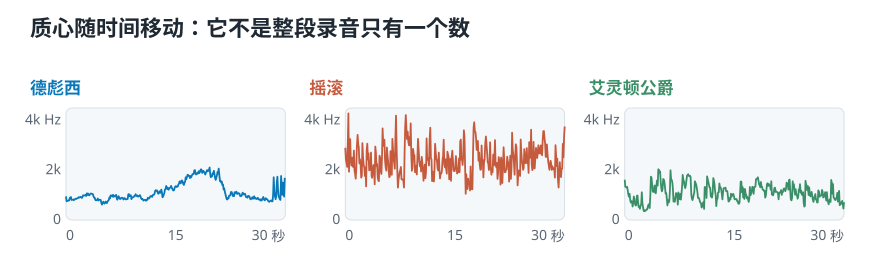
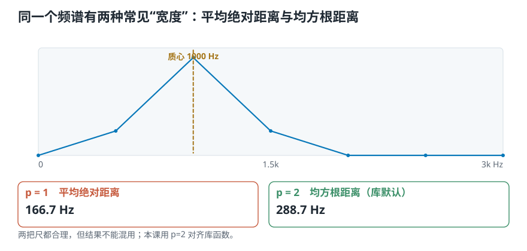
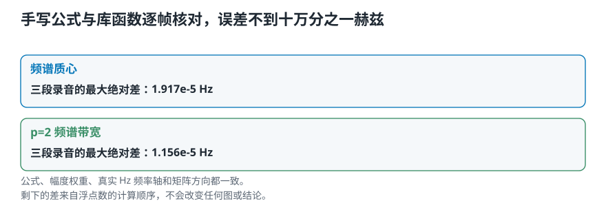
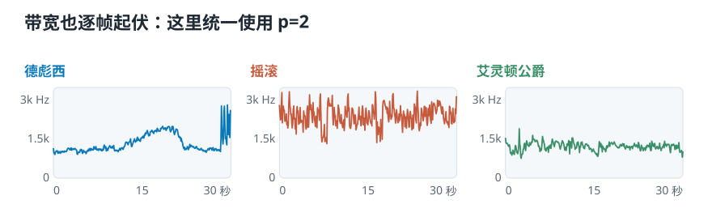
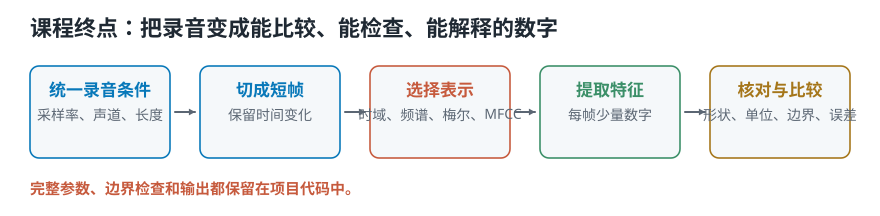

# 频谱质心与带宽：怎样量出频率的中心和展开

> **导读：** 频谱质心和带宽经常只用两行库函数带过。本课反过来做：先按库的默认参数得到三段音乐的时间轨迹，再把两行函数拆成公式，自己逐帧重算。质心最大差只有 **1.917e-05 Hz**，带宽最大差只有 **1.156e-05 Hz**。对齐过程还会揭开一个容易混用的定义：平均绝对距离是 $p=1$，库函数默认算的是均方根距离 $p=2$，这三段音乐上两者能差到 **1.30—1.54 倍**。

<picture>
  <source media="(max-width: 640px)" srcset="../../零基础版_21-23/figures/mobile/00-course-position-23.svg">
  
</picture>

完整代码在[第 23 课脚本](../../课程代码/lessons/lesson23_centroid_bandwidth.py)，公共实现仍在[frequency_features.py](../../课程代码/soundlab/frequency_features.py)。运行环境沿用[课程总纲](../../课程总纲/README.md)里的一次性配置。

## 这一课要完成什么实验

仍然用德彪西、摇滚、艾灵顿公爵三段音乐，各取前 30 秒。这次参数是：

```text
采样率       22050 Hz
帧长         1024 个样本（46.4 毫秒）
帧移          512 个样本（23.2 毫秒）
```

先调用库函数，确认每段得到 1292 个质心和 1292 个带宽；然后从同一张幅度谱手写两套公式，逐帧比较。最后把 $p=1$ 和 $p=2$ 都算一遍，看看“定义只差一个参数”在真实音乐上会差多少。

## 先让库交出两条时间轨迹

```python
centroid = librosa.feature.spectral_centroid(
    y=y, sr=sr,
    n_fft=1024, hop_length=512
)[0]

bandwidth = librosa.feature.spectral_bandwidth(
    y=y, sr=sr,
    n_fft=1024, hop_length=512
)[0]
```

三段的 `shape` 都是 `(1292,)`。这不是整段录音只有一个质心，而是**每帧一个数**。用

```python
times = librosa.frames_to_time(
    np.arange(1292), sr=sr, hop_length=512
)
```

就能把第几帧换成第几秒。

<picture>
  <source media="(max-width: 640px)" srcset="../../零基础版_21-23/figures/mobile/23-centroid-tracks-new.svg">
  
</picture>

质心曲线高，表示这一帧的幅度整体更偏向高频。它不是音高轨迹：摇滚里失真、电吉他泛音、鼓和噪声都会把质心拉高，即使没有一个清楚的高音符。

## 把质心手写出来

先从同一组参数得到幅度谱和真实频率轴：

```python
S = np.abs(librosa.stft(y, n_fft=1024, hop_length=512))
frequencies = np.fft.rfftfreq(1024, d=1 / sr)
```

`S` 的形状是“频率格 × 时间帧”。每一列的质心是：

$$
C_t =
\frac{\sum_n f[n]S[n,t]}
{\sum_n S[n,t]}
$$

写成向量化代码只有三行：

```python
total = S.sum(axis=0)
weighted = (frequencies[:, None] * S).sum(axis=0)
centroid_manual = weighted / total
```

这里用的是[**幅度**](10-傅里叶变换的直觉-拿已知频率去问声音里有没有它.md) `S`，不是功率 `S ** 2`。换成平方以后高幅度频率格会被进一步放大，算出的将是另一种质心，不能再拿来和库的默认结果对齐。

## 带宽先要回答：用哪一把尺

质心确定中心以后，带宽量每一格离中心多远。通用写法是：

$$
B_t^{(p)} =
\left(
\frac{\sum_n |f[n]-C_t|^p S[n,t]}
{\sum_n S[n,t]}
\right)^{1/p}
$$

当 $p=1$，得到平均绝对距离；当 $p=2$，远处的频率格先平方，所以受到更大惩罚，最后再开方把单位还原成 Hz。库函数默认使用 $p=2$：

```python
distance2 = np.abs(frequencies[:, None] - centroid_manual) ** 2
bandwidth_manual = np.sqrt((S * distance2).sum(axis=0) / total)
```

<picture>
  <source media="(max-width: 640px)" srcset="../../零基础版_21-23/figures/mobile/23-two-bandwidths.svg">
  
</picture>

图里同一列频谱的质心是 1000 Hz，$p=1$ 带宽是 **166.7 Hz**，$p=2$ 是 **288.7 Hz**。两把尺都合理，但结果不能混用。本课后面的“带宽”如无特别说明，一律指 $p=2$。

## 手写与库函数能不能对上

用三段录音全部 3876 帧逐个比较：

<picture>
  <source media="(max-width: 640px)" srcset="../../零基础版_21-23/figures/mobile/23-manual-match.svg">
  
</picture>

```text
频谱质心最大绝对差      1.917e-05 Hz
p=2 带宽最大绝对差      1.156e-05 Hz
```

都不到十万分之二赫兹。剩下的只是浮点数计算顺序不同；公式、幅度权重、真实 Hz 频率轴和矩阵方向已经对齐。

这个核对比“图看着差不多”严格得多。两条曲线即使差几十赫兹，在几千赫兹的纵轴上也可能重合；逐帧最大差会把任何一处偏差抓出来。

## p=1 与 p=2 在真实音乐上差多少

| 录音 | $p=1$ 带宽中位 | $p=2$ 带宽中位 | $p=2 / p=1$ |
|---|---:|---:|---:|
| 德彪西 | 760.5 Hz | 1173.7 Hz | 1.54 倍 |
| 摇滚 | 1839.1 Hz | 2390.2 Hz | 1.30 倍 |
| 艾灵顿公爵 | 946.2 Hz | 1227.6 Hz | 1.30 倍 |

这不是小数点后的差异。同一段德彪西，换一把尺就从 760.5 Hz 变成 1173.7 Hz。以后看到“频谱带宽”时，至少要核对三件事：**用幅度还是功率作权重、$p$ 是多少、静音帧怎么处理。**

## 三段录音的中心和展开

<picture>
  <source media="(max-width: 640px)" srcset="../../零基础版_21-23/figures/mobile/23-bandwidth-tracks-new.svg">
  
</picture>

| 录音 | 质心中位 | 质心中间一半 | $p=2$ 带宽中位 | 带宽中间一半 |
|---|---:|---:|---:|---:|
| 德彪西 | 979.9 Hz | 861—1311 Hz | 1173.7 Hz | 1082—1563 Hz |
| 摇滚 | 2250.4 Hz | 1917—2846 Hz | 2390.2 Hz | 2088—2711 Hz |
| 艾灵顿公爵 | 1075.5 Hz | 818—1340 Hz | 1227.6 Hz | 1128—1326 Hz |

这三段里，摇滚的质心和带宽都最高。仍然只能说“这三段录音如此”，不能从每类一首曲子推断整个流派。

两条轨迹确实常一起起伏，但不是同一个量。逐帧相关系数分别是：

```text
德彪西       0.883
摇滚         0.880
艾灵顿公爵   0.767
```

相关很强，却远没有到完全相同。第 21 课已经造出“质心不动、带宽改变”和“带宽不动、质心改变”的标准答案；这里的相关只说明真实录音中高频增多时，频谱常常也会一起铺开。

## 两个解释边界

**第一，静音帧没有可解释的质心。** 当整列幅度都是 0，分子和分母都是 0。公共函数为了和库的数值约定一致返回 0 Hz，但这不代表静音的频谱中心真的在 0 Hz。实际项目里应该同时检查这一帧的能量，低于阈值就标成无效。

**第二，录音条件会改变结果。** 麦克风的频率响应、压缩、均衡器和环境噪声都会改写频谱。质心和带宽描述的是“这份录音里测到的频率分布”，不是脱离设备后仍然不变的声音身份证。

## 这一课得到了什么，下一课接着讲什么

这一课把最后两个频域特征从库函数拆回了可核对的公式：

1. 质心是用幅度给真实 Hz 频率加权；三段里的手写与库最大差 **1.917e-05 Hz**；
2. 库默认带宽是 $p=2$ 的均方根距离，手写与库最大差 **1.156e-05 Hz**；
3. $p=1$ 与 $p=2$ 不是两种写法，而是两把不同的尺，这三段上相差 **1.30—1.54 倍**；
4. 质心和带宽相关但不能互换，静音帧的 0 也不能当成有效测量。

<picture>
  <source media="(max-width: 640px)" srcset="../../零基础版_21-23/figures/mobile/23-course-result.svg">
  
</picture>

二十三课到这里结束，不再虚构一篇“下一课”。文章里的实验是最短、可读的版本；[课程代码目录](../../课程代码/README.md)保留了完整输出、参数扫描和边界检查，[课程项目](../../课程项目/README.md)则把这些特征放回“三首曲子，一个分类器”的完整流程。接下来真正值得做的，是换成更多录音、严格分开训练与测试，再检验这些数字能否推广到没见过的声音。
