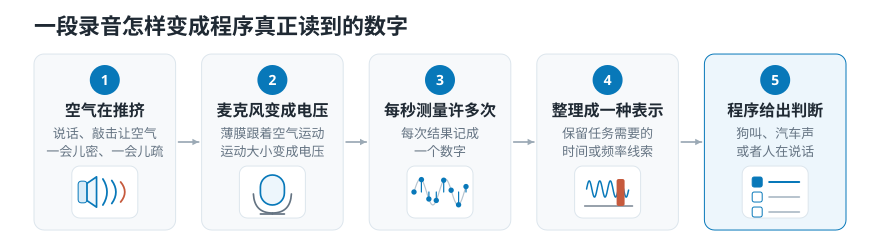
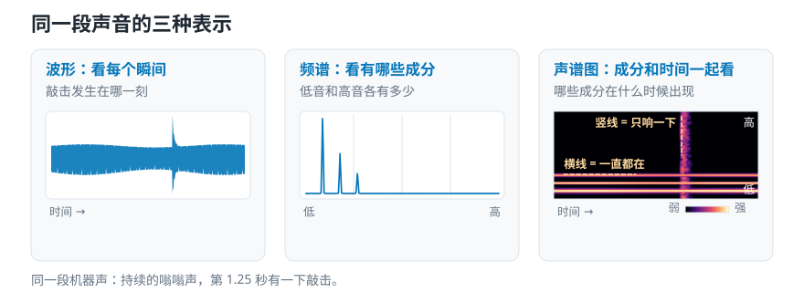
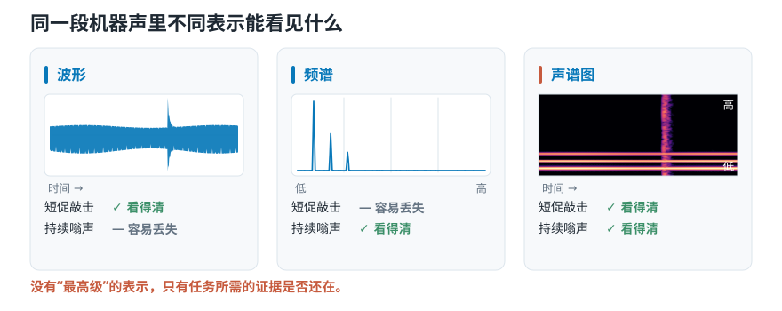
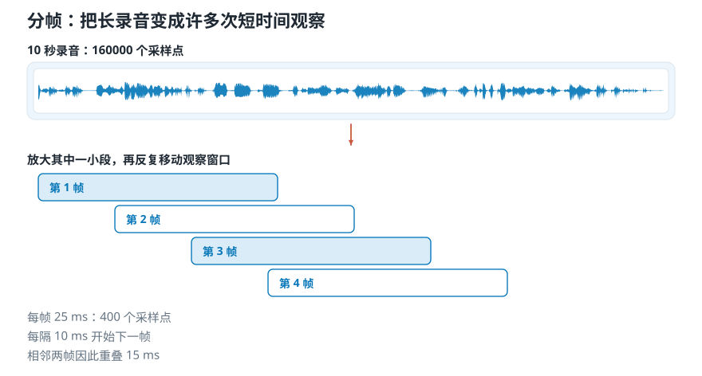

# 波形、频谱与声谱图：电脑识别声音时该“看”什么？

> **导读：** 同一段录音换一种整理方式，电脑可能看到完全不同的线索。本文依次介绍波形、频谱和声谱图各自保留了什么，怎样根据任务反推该用哪一种，以及录音在进入模型之前还会被怎样加工。

假设我们想做这样一个手机小程序：按下录音键，录十秒钟周围的声音，程序告诉我们这十秒里发生了什么——是狗在叫，是汽车经过，还是有人在说话。

这件事对人来说毫不费力。你闭着眼睛也知道刚才那声是狗叫。但电脑没有耳朵，也没有"听过狗叫"的经验。它拿到的，只是一长串数字。

很多人遇到“程序判断不准”，第一反应是换一个更厉害的程序。但程序只能利用输入里已有的信息。更值得先检查的是：**我们给它的数字里，到底有没有完成判断所需的线索？**

这种专门接收一段声音、再判断它属于哪一类的程序，通常叫**声音分类器**。名字暂时不重要，先看它实际拿到了什么。

<picture>
  <source media="(max-width: 640px)" srcset="figures/mobile/01-pipeline.svg">
  
</picture>

*图 1：五个方框里只有第四步是我们能自由选择的——前三步由物理和硬件决定，第五步是结果。所以"给程序看什么"这个决定，全部落在第四步。*

## 波形：保留每一个瞬间的变化

声音的本质是空气在推挤。说话、敲桌子、狗叫，都会让周围的空气一会儿被压紧、一会儿被拉松。麦克风的作用，就是把这种推挤的强弱变成电信号。

电脑每隔极短的时间就量一次这个强弱，把结果记成一个数字。一秒钟量上万次，十秒钟就攒下十几万个数字。把它们按时间先后画成一条曲线，你会看到一条剧烈上下抖动的线——就是我们在剪辑软件里看到的那条"声音波浪"。

这条曲线叫**波形**。它记录的是：声音在每一个瞬间，把空气推得有多用力。

波形最擅长回答"什么时候发生了什么"。敲一下桌子，波形上会突然冒出一根尖峰，位置精确到毫秒。

但它也有看不清的东西。同样是一条抖动的曲线，你很难一眼看出这段声音里"高音多还是低音多"。

## 频谱：突出声音由哪些高低成分组成

任何一段声音，都可以看成很多种高低不同的"纯音"混在一起：低沉的嗡嗡声、中间的人声、尖锐的摩擦声，同时存在。

于是有了第二种摆法：不管时间顺序，只统计**这十秒里，各种高低的声音分别占了多少分量**。画出来像一张成分表，横轴从低音排到高音，某个位置上的柱子越高，说明这种高低的成分越多。

这张成分表叫**频谱**。它擅长回答"这是什么东西发出的声音"——电机转动会在某几个固定位置上出现明显的柱子，风声则是各个位置都摊着一层。

代价是时间被扔掉了。频谱能告诉你"这十秒里有一声很尖的响"，却说不出这声响是在第 2 秒还是第 8 秒。

## 声谱图：同时保留成分和时间

第三种摆法把两者合起来：把十秒钟切成很多小段，每一小段都算一张成分表，再按时间顺序并排贴好。

结果是一张图，横轴是时间，纵轴是声音的高低，颜色深浅表示某个时刻某个高度上的声音有多强。这张图叫**声谱图**（也叫时频图）。

<picture>
  <source media="(max-width: 640px)" srcset="figures/mobile/01-three-views.svg">
  
</picture>

*图 2：三张图算的是同一段声音。左图的尖峰和右图的竖亮带，指的是同一下敲击；中图那三根柱子，对应右图那三条一直延伸到底的横线。*

声谱图看起来最全面，但要多做一个选择：每一小段切多长。切得短，时间上看得准，每段里能分辨的高低就粗；切得长，高低分得细，"到底是哪一瞬间"就模糊了。这个取舍没有标准答案，取决于你要找什么。

## 三种表示怎么选：从任务需要的证据反推

举个具体例子。一段录音里，有一台机器持续发出低沉的嗡嗡声，中间夹了一下短促的"啪"。

- 看**波形**：那声"啪"的位置一清二楚，但持续的嗡嗡声只是一片模糊的抖动。
- 看**频谱**：嗡嗡声的高低成分看得很清楚，但那声"啪"被十秒钟一平均，几乎消失了。
- 看**声谱图**：嗡嗡声是几条横着的亮线，"啪"是一根竖着的亮柱，两者都在。

<picture>
  <source media="(max-width: 640px)" srcset="figures/mobile/01-evidence.svg">
  
</picture>

*图 3：注意中间那张频谱——敲击的能量被十秒钟一平均，已经淹没在噪底里，图上完全找不到它。*

所以如果任务是"判断这台机器有没有异常撞击"，用整段频谱就很吃亏——最关键的证据恰好被平均掉了。这不是程序不够聪明，是我们给的材料里根本没留下线索。

把这个思路推广开，就得到一张按任务反推的对照表：

| 任务 | 要回答的问题 | 不能丢掉的线索 | 常见做法 |
|---|---|---|---|
| 语音识别 | 说了什么 | 发音怎样随时间变化 | 保留时间顺序的声谱图 |
| 说话人验证 | 谁在说 | 发声习惯和声音的整体形状 | 声谱图，再让程序自己学出区别 |
| 机械故障诊断 | 何时、哪里异常 | 短促撞击、重复节奏、固定高低的尖声 | 波形与声谱图配合 |
| 音乐标签 | 有什么乐器或风格 | 声音的高低、节奏和质感 | 按音乐关系整理过的声谱图 |

表里的做法只是常见起点，不是标准答案。一个指标即使很擅长描述“声音整体偏高还是偏低”，也未必能分辨说话人；一种方法即使很容易找出敲击时刻，也可能丢掉声音在高低方面的信息。脱离任务给特征排统一名次，没有意义。

想更系统地做这个反推，可以继续看[第 05 篇：音频特征怎么选](05-音频特征怎么选-抽象层级时间尺度与模型输入.md)，那里把它拆成了四个可以逐条回答的问题。

## 从录音到模型输入，中间还有几步

上面回答了"该看什么"。但录音并不会原样交给那段负责学习判断规律的程序（下面统称**模型**），中间还有几步加工，每一步都可能改变模型最终看到的线索。

### 先把长录音切成许多次短时间观察

录音设备每秒钟记录多少个数字，叫**采样率**，记作 $f_s$，单位赫兹（Hz）。这个数字怎么定、定错会怎样，是[第 04 篇](04-采样率与位深-44.1kHz和16bit决定了什么.md)的主题；这里只需要知道它决定了一段录音里有多少个数字。

一段 10 秒、只录一路声音（也就是单声道）的录音，在 16 kHz 采样率下有

$$N = T f_s = 10 \times 16000 = 160000$$

个数字。为了观察短时间内发生了什么，可以把它切成互相重叠的小段，这一步叫**分帧**。每一小段是一**帧**；一段有多长叫**帧长**；相邻两段的起点隔多远叫**帧移**。

若取帧长 25 ms、帧移 10 ms，每帧包含

$$L = 0.025 \times 16000 = 400$$

个采样点，相邻帧起点相隔

$$H = 0.010 \times 16000 = 160$$

个采样点。不做补边时，总帧数为

$$M = 1 + \left\lfloor \frac{160000 - 400}{160} \right\rfloor = 998。$$

<picture>
  <source media="(max-width: 640px)" srcset="figures/mobile/01-framing.svg">
  
</picture>

*图 4：注意相邻两个方框是错开而不是首尾相接的——正因为重叠 15 ms，落在边界上的声音才不会被切断。*

分帧没有凭空增加信息，它只是把一条 16 万点的长序列，重组成 998 次"局部观察"。这样一来，程序更容易比较短时间内的发音和冲击，而不必自己从 16 万个点里摸索出"哪一段和哪一段该放在一起看"。

### 直接用波形，还是先整理成频谱

模型可以直接读取波形，不一定要先做成频谱或声谱图。

但要看清代价：波形序列很长，上例就有 16 万个点，而且曲线变化很快。模型得先自己学会怎样从长串数字里找出高低成分、怎样把前后片段联系起来，最后才轮到分类。数据量和计算能力有限时，这条路往往更难。

我们也可以先把一些已经知道的规律摆到模型面前，例如先算好频谱。这种预先加入的知识叫**先验**。它带来一组取舍：

- **加入的先验越多**（例如已经替模型算好了高低成分的分布），通常越省样本，但灵活性受限于这些先验是否符合任务。
- **先验越少**（例如直接给波形），模型越灵活，但越依赖数据覆盖面和训练资源。

这不是两条互相排斥的路线，而是要看手头有多少数据、多少计算资源，以及我们对任务已经了解多少。

### 预处理的参数也会改变模型看到的线索

录音交给模型之前，通常还会先做一轮整理：统一每秒记录的次数、决定多路麦克风怎样合并、裁掉过长的静音、把音量调整到可比较的范围。这些步骤统称为**预处理**。

每一步都可能改变模型能看到的线索。因此，采用了什么规则、参数是多少，都应该记录下来，并在一批没有参与训练的录音上比较效果。

训练之前，建议先跑一遍最小体检：

```python
import librosa
import numpy as np

y, sr = librosa.load("example.wav", sr=None, mono=True)

assert y.size > 0, "音频为空"
assert np.isfinite(y).all(), "音频含 NaN 或 Inf"

summary = {
    "sample_rate_hz": int(sr),
    "duration_s": float(len(y) / sr),
    "peak": float(np.max(np.abs(y))),
    "rms": float(np.sqrt(np.mean(y ** 2))),
    "silent_ratio": float(np.mean(np.abs(y) < 1e-4)),
}
print(summary)
```

更重要的是**按数据来源分组统计**这些指标。如果拿来学习的录音和最终考核的录音，在采样率、录音设备、静音比例或音量上明显不同，模型很可能学到的是"这段录音用哪台设备录的"，而不是"这是什么声音"。

划分数据时，应先按录音对象或采集批次分组，再用学习用的那一组决定音量调整规则。否则，考核录音的信息可能提前混进训练过程，让成绩看起来比真实情况更好。这种问题叫**数据泄漏**。

## 小结

回到开头那个小程序。要让它分辨狗叫、汽车声和说话声，真正该先想清楚的不是用哪个网络，而是：**这三类声音的区别体现在哪里？我给程序的那份材料，把这个区别保留下来了吗？**

狗叫和汽车声的差别，很大程度在"声音随时间怎么变化"。如果只给一张十秒钟平均下来的成分表，这个差别已经被抹掉了——那么无论程序多复杂，它都在做一道信息不全的题。

波形、频谱、声谱图是观察同一段声音的三种坐标，分帧和预处理决定了模型最终看到现实的哪一部分。下次效果卡住时，可以先检查三件事：输入是否保留了目标线索；训练和上线是否走的同一条处理链；成绩是否被录音设备或数据划分方式虚高。
