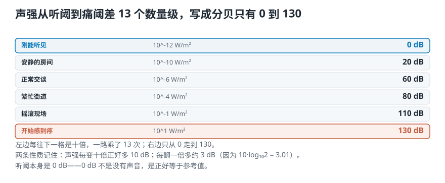
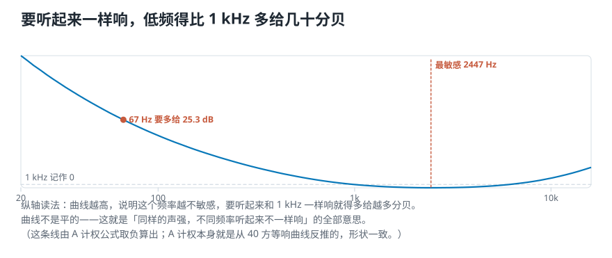
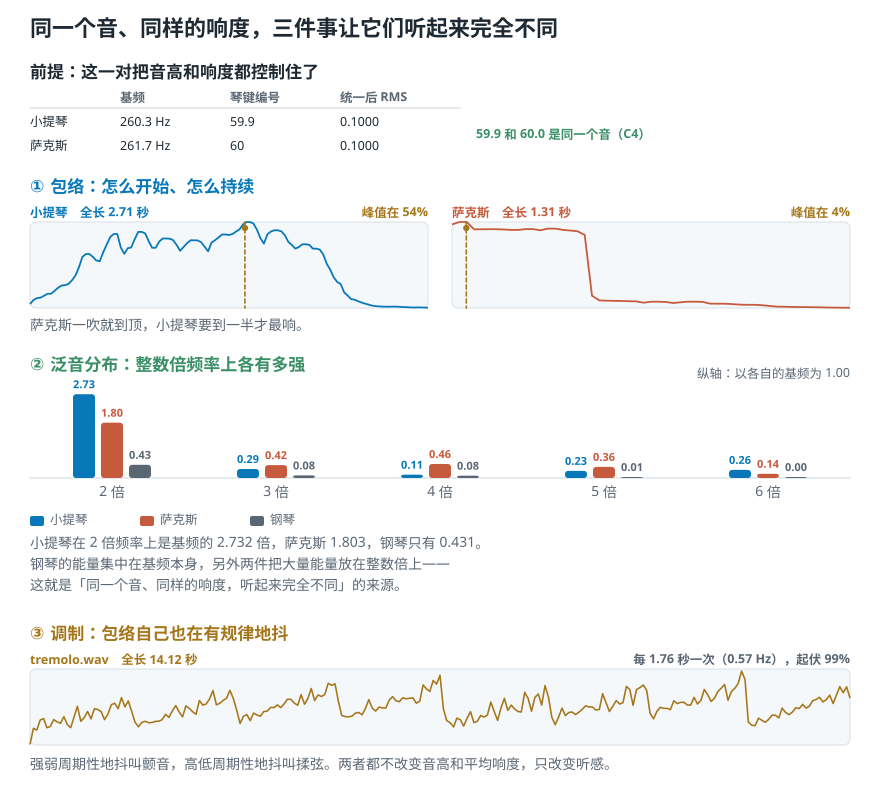
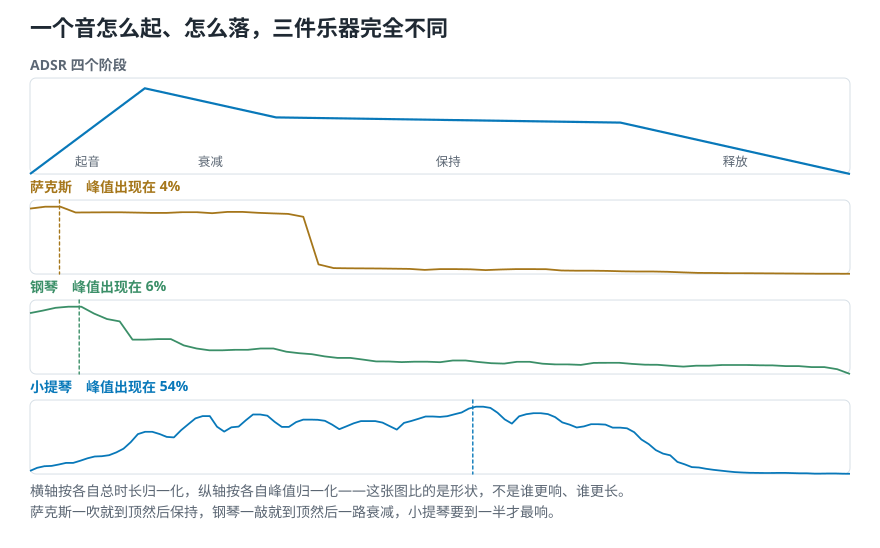
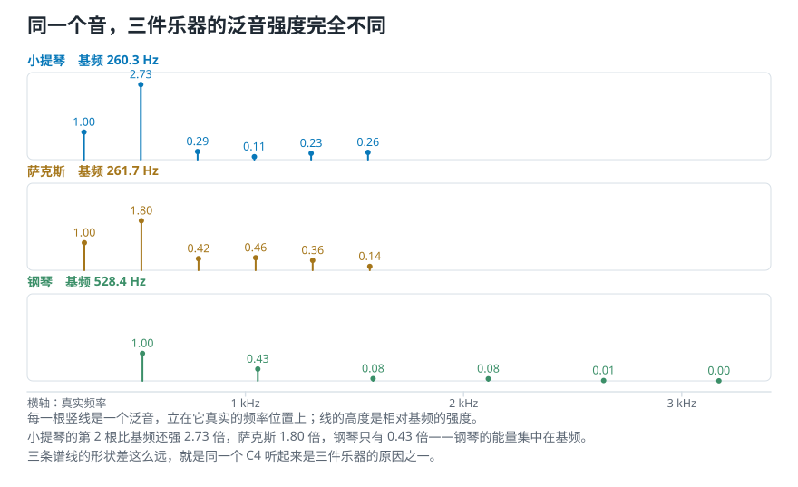
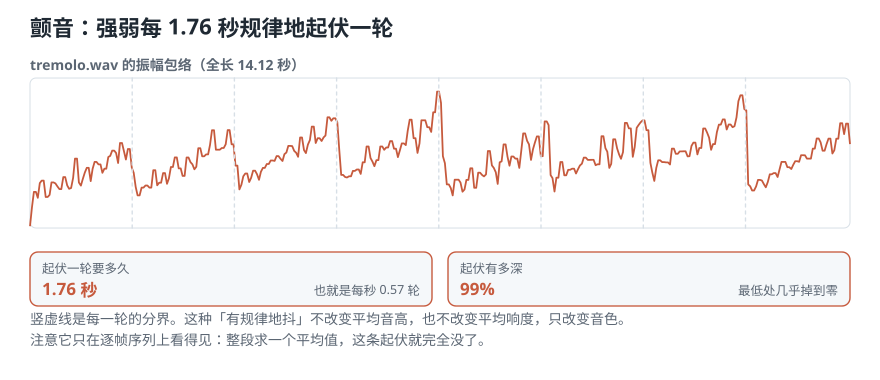

# 音量条没动，为什么换一首歌就明显更吵？

> **导读：** 上一课把波形里的频率和振幅讲完了，还欠两样：**强弱到底怎么量，音色又是什么。** 这一课先从声源出发，一层层往耳朵走：声源每秒放出多少能量（声功率）→ 传到你这个位置每平方米有多少（声强）→ 从刚能听见到开始疼，中间差了十万亿倍 → 所以要用分贝把它压成一个好读的数 → 可分贝仍然不等于你听到的响度。最后回答那个「音量一样却不一样」的问题：**高低和响度都对齐之后，剩下的差别叫音色，它由三样东西决定。**

<picture>
  <source media="(max-width: 640px)" srcset="figures/mobile/00-course-position-03.svg">
  
</picture>

## 声功率：声源每秒放出多少能量

从声源开始。**声功率**指的是：**一个声源每秒钟向四面八方放出多少能量。**

- 它描述的是**声源本身**，和你站在哪儿没关系。
- 单位是**瓦特**（W），和灯泡上标的那个瓦是同一个单位。

一把小提琴、一台音箱、一个人的嗓子，各有各的声功率。你走远两步，这个数一点不变——变的是下一节要说的东西。

## 声强：传到你这个位置，每平方米有多少

**声强**指的是：**声源放出的能量传到某个位置时，每平方米上通过多少。**

- 它描述的是**某一个位置**，换个地方就变。
- 单位是 **W/m²**（瓦每平方米）。

<picture>
  <source media="(max-width: 640px)" srcset="figures/mobile/03-power-vs-intensity.svg">
  
</picture>

*图 1：同一个声源，声功率只有一个数；声强有无数个数，每个位置一个。走得越远，同样一份能量摊在越大的面上，每平方米分到的就越少。*

**为什么要分开这两个？** 因为麦克风量到的永远是**声强这一侧**的东西——它只知道自己那个位置。所以：**换个位置重录同一个声源，录出来的数字就不一样。** 这不是设备不稳，是这两个量本来就不是一回事。第 01 课确认三段素材格式一致时，格式对得上，录音位置和链路却对不上——这也是为什么后面每次跨录音比较之前，都要先统一电平。

## 从刚能听见到开始疼，中间差了十万亿倍

人耳能应付的范围大得离谱。

- **听阈**：人能察觉到的最弱的声音，声强大约 $10^{-12}$ W/m²。
- **痛阈**：强到开始让人疼，声强大约 $10$ W/m²。

两个数一除：

$$
\frac{10}{10^{-12}} = 10^{13}
$$

**十万亿倍。** 所以呢？所以你没法把这两个数写在同一根坐标轴上——如果把痛阈画到一米高，听阈那一端连一个原子的厚度都不到，整根轴上什么也看不见。**这就是分贝存在的全部理由。**

## 分贝：把十万亿倍压成 0 到 130

**分贝不是一个量，是一种记法**：它把两个数的**比值**取对数，再乘 10。

$$
L_I = 10\log_{10}\frac{I}{I_0}\ \mathrm{dB}, \qquad I_0 = 10^{-12}\ \mathrm{W/m^2}
$$

这里的 $I_0$ 就是听阈，它被选作**参考值**——所有分贝数都是「比听阈强多少倍」的另一种写法。

<picture>
  <source media="(max-width: 640px)" srcset="figures/mobile/03-intensity-ladder.svg">
  
</picture>

*图 2：左边一列是声强，每往上一格就是十倍，一路从 0.000000000001 涨到 10；右边一列是同一件事写成分贝，只从 0 走到 130。*

有三条性质要记住：

- **$\log(1) = 0$，所以听阈本身是 0 dB。** 0 dB 不是「没有声音」，是「正好等于参考值」。
- **声强每翻一倍，大约多 3 dB。** 因为 $10\log_{10}2 = 3.01$。两台一模一样的音箱一起放，比一台只多 3 dB——不是两倍响。
- **声强每变十倍，正好多 10 dB。** 所以 0 到 130 dB 这段，对应的是十万亿倍。

**常见错误：把分贝当成绝对的大小。** 分贝永远是「相对于某个参考值」的比值。参考值换了，同一个声音的分贝数就变。音频软件里显示的 −12 dB 用的参考值是「这个数字系统能表示的最大值」，和房间里有多吵**没有任何关系**——这一点第 04 课还会再遇到。

## 响度：耳朵的判断，不是仪器的读数

上面全是**物理量**，仪器量得出来。现在换一边。

**响度**是**人对声音强弱的主观感受**。它和声强有关，但不由声强单独决定，也没有哪个公式能从声强直接算出来。

最直接的证据：**同样的声强，放在不同的频率上，人听起来并不一样响。**

<picture>
  <source media="(max-width: 640px)" srcset="figures/mobile/03-equal-loudness.svg">
  
</picture>

*图 3：纵轴是「要听起来和 1 kHz 一样响，这个频率得多给多少分贝」。线不是平的：实测最敏感的位置在 2447 Hz，而 62 Hz 要多给 26.6 dB 才追得上。这条线由 A 计权公式算出，A 计权本身就是从 40 方等响曲线反推的，形状一致。*

这组曲线叫**等响曲线**。它说明两件事：

1. 人耳对中高频最敏感，对很低的低频迟钝得多。实测最敏感处在 **2447 Hz**；要让 **62 Hz** 的低音听起来和 1 kHz 一样响，得**多给 26.6 dB**——按上一节的换算，那是四百多倍的声强。
2. **曲线的形状还随音量变化**：放得轻的时候，低频掉得比中频更快。这就是为什么很多播放器有个「小音量补偿」的开关。

**所以呢？** 所以拿一个仪器读数说「这段更响」，只在两段声音的频率分布差不多时才靠得住。下面就把这件事量出来。

## 实验：两段数值完全相同的声音，听感差多少

运行 [`lesson03_loudness.py`](../课程代码/lessons/lesson03_loudness.py)。第一步造两段声音：一条 220 Hz 的正弦，一段白噪声，并把噪声整体缩放，让它的**均方根**（把每个采样值平方、求平均、再开方，[第 07 课](../零基础版_06-10/07-三个时域特征-不做频率分析能问出什么.md)细讲）精确等于正弦的。

```text
          RMS      质心    平坦度
正弦    0.7071    229 Hz   0.0000
白噪声  0.7071   4001 Hz   0.5610
```

两段的 RMS 一模一样，都是 0.7071。可[**频谱质心**](../零基础版_21-23/23-频谱质心与带宽-怎样量出中心和展开.md)（能量在频率轴上的平均位置，第 23 课细讲）一个是 229 Hz、一个是 4001 Hz，差 17 倍；**平坦度**（各频率分布得多均匀）一个是 0、一个是 0.56。

**所以呢？** 所以这两段声音在「数值大小」上完全一致，在「能量放在哪些频率上」这件事上完全不同。而上一节刚说过，耳朵对不同频率的敏感度不一样。换个能反映听感的指标试试：

```text
  正弦     -4.0 LUFS
  白噪声   -0.4 LUFS
```

**LUFS** 是广播和音频制作里用的响度单位，它在计算之前先给信号加一道模拟人耳频率响应的滤波。RMS 精确相同的两段，**LUFS 差了 3.6**。这 3.6 就是频率分布造成的听感差——RMS 看不到它，LUFS 看得到。

这就回答了导读那个问题：**音量条没动，换一首歌却更吵，是因为音量条调的是数值，你听到的是响度。** 摇滚的能量更多堆在人耳敏感的中高频，所以同样的数值，它更吵。

**这个实验的边界要说清楚：** 它证明的是「两个计算指标不同」，不是「主观上谁一定更响」。要下听感结论，还得控制回放声级、房间条件和实验设计。

## 音色：高低和响度都对齐之后，剩下的那点差别

现在把两样都对齐：**同一个音高、同样的响度、同样的时长**，小提琴和萨克斯放在一起，你还是一听就分得出来。剩下的这点差别就叫**音色**。

脚本里正好有这么一对：

```text
          时长   基频 Hz    编号
小提琴   2.71s    260.3    59.9
萨克斯   1.31s    261.7    60.0
钢琴     1.54s    528.4    72.2
```

小提琴 59.9、萨克斯 60.0，是同一个音（C4）；统一电平后两者的 RMS 也精确相同。钢琴是 72.2，高了整整一个八度，所以「同音高不同音色」这一对只能用前两个。

**音色不是一个单一的量，它是多维的。** 我们先把会改变它的因素拆成三样：

<picture>
  <source media="(max-width: 640px)" srcset="figures/mobile/03-timbre-three.svg">
  
</picture>

*图 4：三样东西共同决定音色。下面逐个用真实录音量一遍。*

### 第一样：包络——声音怎么开始、怎么结束

**包络**说的是一个音的强弱**随时间的轮廓**：怎么起来、怎么落下去。经典的描述模型叫 **ADSR**，四个阶段：

- **起音**（Attack）：从无声冲到最响用了多久。
- **衰减**（Decay）：从最响回落到稳定水平。
- **保持**（Sustain）：中间维持的那一段。
- **释放**（Release）：松手之后怎么消失。

<picture>
  <source media="(max-width: 640px)" srcset="figures/mobile/03-adsr.svg">
  
</picture>

*图 5：上面是 ADSR 的四个阶段；下面三条是真实录音量出来的包络，横轴按各自总时长归一化。*

实测三件乐器的包络峰值出现在整段的什么位置：

| 乐器 | 峰值出现在 | 这说明什么 |
|---|---|---|
| 萨克斯 | 4% | 一吹就到顶，然后一路保持 |
| 钢琴 | 6% | 一敲就到顶，然后一路衰减 |
| 小提琴 | 54% | 拉出来的，弓压慢慢加上去，到一半才最响 |

**所以呢？** 所以「怎么开始」这件事本身就是识别乐器的强线索。**很多时候去掉起音那零点几秒，人反而认不出是什么乐器了**——即使后面那一大段完全没动。

### 第二样：泛音结构——一个音里其实有很多个频率

上一课说过，很多复杂声音可以由一组正弦波叠加出来。这里把那句话说细：

- 用来描述一个声音的每一条正弦，叫一个**分音**（partial）。
- 其中最低的那条，叫**基频**——它决定你听到的音高。
- 频率正好是基频**整数倍**的分音，叫**谐波分音**（harmonic partial），日常就叫**泛音**。
- 实际频率偏离整数倍的程度，叫**非谐性**（inharmonicity）。

按这一条可以把乐器分两类：**谐性乐器**（小提琴、长笛、人声）的分音基本落在整数倍上，所以音高感很明确；**非谐性乐器**（钹、锣、大多数鼓）的分音不落在整数倍上，所以你说不出它是什么音。

实测前 6 个整数倍频率相对基频的强度：

| 第几倍 | 1 | 2 | 3 | 4 | 5 | 6 |
|---|---|---|---|---|---|---|
| 小提琴 | 1.00 | **2.73** | 0.29 | 0.11 | 0.23 | 0.26 |
| 萨克斯 | 1.00 | **1.80** | 0.42 | 0.46 | 0.36 | 0.14 |
| 钢琴 | 1.00 | **0.43** | 0.08 | 0.08 | 0.01 | 0.00 |

<picture>
  <source media="(max-width: 640px)" srcset="figures/mobile/03-harmonics.svg">
  
</picture>

*图 6：每一根竖线是一个泛音，立在它真实的频率位置上，高度是相对基频的强度。三件乐器的谱线形状明显不同——这就是「同一个音听起来不一样」的第二个来源。*

**所以呢？** 小提琴的 2 倍频率比基频还强 2.7 倍，萨克斯是 1.8 倍，钢琴只有 0.43 倍。**钢琴的能量集中在基频，另外两件把大量能量放在整数倍上。** 三条曲线摆在一起，形状差得很远——这就是为什么同一个 C4，三件乐器听起来是三个东西。

### 第三样：调制——声音自己还在有规律地抖

前两样都假设音是稳的。但演奏时常常故意让它抖：

- **调频**（frequency modulation）：[第 02 课](02-声音与波形-一次振动怎样变成录音里那条线.md)讲过的**音高**周期性地上下抖，音乐上叫**揉弦**（vibrato）。
- **调幅**（amplitude modulation）：**强弱**周期性地起伏，音乐上叫**颤音**（tremolo）。

两者都不改变平均音高和平均响度，**只改变音色**。

课程自带的 `tremolo.wav` 就是一段调幅。实测：

```text
全长 14.12 秒
频率分辨率 0.071 Hz
起伏最强的频率 0.57 Hz
也就是每 1.76 秒一轮
包络最大 0.238、最小 0.001
起伏幅度 99%
```

<picture>
  <source media="(max-width: 640px)" srcset="figures/mobile/03-tremolo.svg">
  
</picture>

*图 7：这条线是逐帧算出的包络。它自己在规律地上下起伏，每 1.76 秒一轮，最低处几乎掉到零。*

**所以呢？** 起伏幅度 99% 意味着这不是轻微的抖动——每一轮里声音几乎完全消失又完全回来。这种「有规律地抖」的模式，任何只看整段平均值的特征都抓不到，必须保留逐帧的序列才看得见。这一点第 05 课会正式讲。

## 这一课得到了什么，下一课接着讲什么

从声源到耳朵，这一课走完了整条链：

| 层 | 是什么 | 单位 | 换个位置会变吗 |
|---|---|---|---|
| 声功率 | 声源每秒放出多少能量 | W | 不会 |
| 声强 | 传到某位置每平方米多少 | W/m² | 会 |
| 分贝 | 把声强比值写成对数的记法 | dB（无量纲） | 看参考值 |
| 响度 | 人主观感受到的强弱 | 宋 / 方 / LUFS | 会 |
| 音色 | 高低和响度对齐后剩下的差别 | 无单一标度 | 基本不会 |

两个能带走的结论：

- **仪器读数不等于听感。** RMS 精确相同的两段，LUFS 差了 3.6。所以跨录音比较之前必须先统一电平，否则模型学到的会是「谁录得响」。
- **音色是三件事，不是一件**：包络（怎么起怎么落）、泛音结构（整数倍上各有多强）、调制（自己抖不抖）。

到这里，声音本身讲完了。可这些还都是连续变化的物理量，计算机一个也存不下。[下一课](04-模拟声到数字录音-连续的声音怎样变成一串数字.md)讲这段连续的声音怎样变成一串有限的数字，又怎样变回声音——以及这个过程中，哪些东西是永远丢掉了的。
