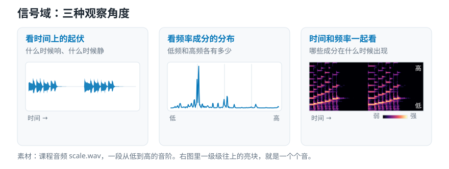

# 音频特征怎么选？理解抽象层级、时间尺度与模型输入

> **导读：** 音频特征不是越多越好，也没有脱离任务的“最佳答案”。本文围绕“抽象层级 → 时间尺度 → 信号域 → 产生方式”四个知识点，说明怎样从设备异常检测任务反推出真正有用的模型输入。

假设你想做这样一件事：在车间里放一个麦克风，让程序听着一台空调的声音，判断它是不是快坏了。

于是你去搜怎么做，很快搜到一份清单：

> 振幅包络、梅尔频谱、MFCC、深度嵌入……

这份清单看起来像一份外文菜单。每个名字都很专业，都有现成的库函数，一行代码就能算出来。于是最自然的做法是：全都算一遍，一股脑塞给程序。

这种做法通常效果不好，而且出了问题不知道该改哪里。

## 音频特征：从录音中提取的数字摘要

这些名字说的，都是从录音中提取出来、用来帮助程序判断的数字摘要。这样的摘要叫**音频特征**。

真正的困难不只在于“这些名词分别是什么意思”，还在于：**它们回答的不是同一种问题，所以“哪个最好”这个问法本身就不完整。**

同样是在描述一段录音，“这一刻有多响”“高低成分怎样随时间变化”“设备是否异常”处在不同层级，不能直接比较谁更好。与其从清单里凭感觉挑一个，不如先回答四个问题。

<picture>
  <source media="(max-width: 640px)" srcset="figures/mobile/05-four-questions.svg">
  
</picture>

*图 1：四张卡片是依次回答的，不是四选一。每张卡片最下面那行小字，是这个问题在空调例子里的具体答案。*

## 抽象层级：先把目标拆成可以测量的现象

回到那台空调。"它是不是快坏了"是一个相当抽象的判断，不能直接测量。所以第一步不是去调库函数，而是把这个抽象判断**拆成可以直接测量的现象**：

- 是不是出现了以前没有的、某个固定高低的尖锐声？
- 是不是出现了一下下有规律的撞击？
- 背景那层沙沙的声音是不是比以前更大了？

拆完之后你会发现，这三条都是可以直接算的（[第 01 篇](01-波形频谱与声谱图-电脑识别声音时该看什么.md)已经用一台机器的嗡声和敲击演示过这种拆法）。

这里比较的是“离原始测量有多远”。工程里把它叫**抽象层级**。

- **低层**：直接从信号算出来的量，比如某一小段有多响、某个高低范围里有多少能量。这类量有明确的计算公式，换个项目也是同样的含义。
- **中层**：把低层的量组织起来得到的结构，比如音的高低怎样走（也就是**音高**轮廓）、节拍落在哪里、成分的分布形状。
- **高层**：说话人是谁、场景是哪里、情绪如何、什么音乐风格。这类东西没有公式，只能靠程序从大量带标签的例子中学出来，**它的含义离不开当初训练它的那批数据**。

一个很实用的经验：**越抽象的目标，越应该先拆成低层的可测证据，而不是直接找一个"能判断异常"的特征。**

## 时间尺度：决定保留瞬间还是整段

同一件事，看的时间窗口不同，结论完全不同。

- 只看录音里**一个数字**：只知道那一瞬间振动了多少。这个数字叫一个**采样点**，单独看几乎没有信息。
- 看**几十毫秒**：能看到声音的局部质地，比如这一小段是元音还是摩擦音。
- 看**几秒钟**：能看到一个完整的事件，比如一次敲击、一个词、一小节音乐。
- 看**整段录音**：能得到总体统计，比如"平均而言这段录音偏尖锐"。

<picture>
  <source media="(max-width: 640px)" srcset="figures/mobile/05-time-scale.svg">
  
</picture>

*图 2：四条色条的长度差就是覆盖范围的差。最上面那条几乎看不见——一个采样点确实什么也说明不了。*

这里有个必须小心的陷阱：**把整段平均，会抹掉"什么时候"这个信息。**

举个具体例子。把一段录音切成 6 小段，每段的能量是 0.1、0.2、**0.9**、0.4、**0.8**、0.1。整段平均是 0.417。可这个数字完全说不出"高能量出现在第 3 段和第 5 段"。如果你的任务是"找出撞击发生在第几秒"，用平均值就等于自己把答案删掉了。

所以判断标准很清楚：任务是找出**什么时候出问题**，就必须保留一段一段的先后顺序；只想判断**整段录音属于哪一类**，才可以考虑用平均值压缩。

写成公式前，先给切段后的结果起个名字。把录音切成许多小段，每段算出一个数，再按先后排起来，就得到一列数。第 $m$ 段的数记作 $z_m$，一共有 $M$ 段。整段的均值与标准差为

$$\mu = \frac{1}{M}\sum_{m=1}^{M} z_m, \qquad
\sigma = \sqrt{\frac{1}{M}\sum_{m=1}^{M}(z_m - \mu)^2}。$$

代入上面那组数：$\mu = 2.5/6 \approx 0.417$，$\sigma \approx 0.324$。标准差告诉你波动挺大，但**任何与顺序无关的统计量都无法还原峰值出现在第几帧**——把这 6 个数任意打乱，$\mu$ 和 $\sigma$ 完全不变。这就是"事件检测必须保留序列"的数学理由。

顺带说一句，语音处理里常见的"几十毫秒一段"只是一个经验起点，来自人说话时口型变化的速度。换成机械振动或鲸鱼叫声，这个长度就要重新定。

## 信号域：决定从哪个角度观察声音

第三个问题是从哪个角度看。工程里把这些不同的观察角度叫**信号域**。

- 看**时间**上的起伏：什么时候响、什么时候静、能量怎么变化。适合找撞击、找静音、找起音。
- 看**成分**的分布：这段声音里高的成分多还是低的成分多。适合判断这个音有多高，也适合看某个高低范围是不是变强了。
- 两者**同时**看：哪些成分在什么时候出现。适合描述声音随时间的变化过程。

<picture>
  <source media="(max-width: 640px)" srcset="figures/mobile/05-three-angles.svg">
  
</picture>

*图 3：素材是一段从低到高的音阶。右图里一级级往上的亮块就是一个个音，还能看到每个音上方那几条更淡的横线（它的更高成分）——这是左右两张图都给不了的信息。*

在"看成分"这个角度上，还有几种常用的变体。它们都是在原始的成分分布上再加工一层，把某一类关系突出出来。下面四个名字后面各有专门一课，这里只要先知道它们分别在强调什么。

**梅尔频谱**：按人耳的分辨习惯划分区间——低的地方分得细，高的地方分得粗。适合和听感有关的任务。

**MFCC**：在梅尔频谱之上再压缩一次，只留下整体形状，用很少几个数字概括这段声音的质感。

**CQT**：区间按音乐里的音高关系来划分，适合处理音乐。

**色度图**：把所有的 do 归成一类、所有的 re 归成一类，一共 12 类。适合判断和弦与调性，但它**故意丢掉了**这个音落在高音区还是低音区。

注意最后那句话背后的通则：**每一种变换在突出某种关系的同时，一定会删掉另一些信息。** 所以评价一种表示，永远要同时写出两件事——它保留了什么，它放弃了什么。只写前一半就会选错。

## 产生方式：人工规则还是模型学习

第四个问题是：**这份中间结果从哪来？**

- **人定规则**：按照公式算出来的，比如“这一小段有多大”。含义清楚、容易解释、样本少也能用、出问题好排查，但人事先想到的规则未必抓得住关键。
- **程序自己学**：让程序（也就是常说的**模型**）从大量数据里自己学出一份中间表示。不受人的想象力限制，复杂任务上往往更强，但依赖数据的覆盖面和算力，而且很难解释它到底学到了什么。

<picture>
  <source media="(max-width: 640px)" srcset="figures/mobile/05-rule-vs-learn.svg">
  
</picture>

*图 4：两张卡片之间是箭头，不是分隔线。下面那条橙色的才是实际做法：前面用稳定规则算好，后面交给模型学。*

这两条路**不是二选一**。目前很多实用系统的做法是：前面用一个稳定、便宜、可解释的规则算好中间表示（比如梅尔频谱），后面交给模型去学。这样既省数据，又保留了灵活性。

| | 按规则算出来 | 让程序从数据里学 |
|---|---|---|
| 依据来自哪里 | 人已有的声音知识和公式 | 训练数据与人工给出的答案 |
| 样本需求 | 较低 | 较高 |
| 可解释性 | 高，可逐项排查 | 低，需额外分析手段 |
| 跨项目复用 | 定义稳定 | 依赖训练分布 |
| 主要风险 | 人定的规则不适合任务，漏掉关键线索 | 数据覆盖不足，学到无关差异，考核成绩虚高 |

## 选择流程：把四个知识点连起来

回到那台空调，四个问题依次回答下来：

1. **抽象层级**：把"是不是快坏了"拆成"有没有新出现的固定高低的尖声 / 有没有规律撞击 / 底噪是不是变大"。
2. **时间尺度**：撞击是事件，必须保留时间序列；底噪变化可以整段统计。
3. **看的角度**：找固定高低的尖声要看成分分布；找撞击要保留时间；两者都要，就用同时看的那种图。
4. **来源**：一开始数据少，先用规则算出来的特征做一个能解释、能对照的初版方案（这种初版方案通常叫**基线**）；数据积累够了再考虑让模型自己学。

答案是四个问题共同决定的，而不是从清单上挑一个名词。

落到代码上，同一份中间结果可以同时给出两种形式：

```python
import librosa
import numpy as np

y, sr = librosa.load("example.wav", sr=16000, mono=True)

mel_power = librosa.feature.melspectrogram(
    y=y, sr=sr,
    n_fft=1024,        # 每帧参与变换的样本数
    hop_length=160,    # 帧移 = 10 ms @16kHz
    n_mels=64,         # 64 个梅尔频带
    power=2.0,         # 输出功率谱
)
log_mel = librosa.power_to_db(mel_power, ref=1.0, top_db=80)

frame_sequence = log_mel.T                                        # (帧数, 64)
global_vector = np.r_[log_mel.mean(axis=1), log_mel.std(axis=1)]  # (128,)

print(frame_sequence.shape, global_vector.shape)
```

`frame_sequence` 保留时间顺序，适合寻找事件发生的位置；`global_vector` 丢掉顺序，只留每个高低区间的均值和标准差，适合做固定长度的初版方案。

这里有一个容易被忽略但影响很大的参数：`ref`。`ref=1.0` 使用固定参考功率，**不同录音之间的绝对电平差异被保留**；`ref=np.max` 让每段录音以自身峰值为 0 dB，**便于比较分布形状，但会抹掉录音之间的电平差**。如果任务恰好依赖“这台机器比以前更吵了”，用 `ref=np.max` 就会删掉关键线索。这类录音整理选项应该和模型设置一起记录版本，并在一批没有参与学习的录音上比较。

## 小结

音频特征不是一张按先进程度排序的菜单，也不存在一个通用最优解。可靠的选择来自四个问题：目标能不能拆成直接可测的现象；需要看多长时间；哪个观察角度最容易看见关键关系；中间结果应该按人的规则计算，还是让程序从数据里学习。

模型出错时，同样可以沿这四个问题反查：目标是不是拆错了？看的时间是不是过长或过短？整理方式是不是把关键信息删掉了？数据量是不是还不足以让程序自己学出稳定规律？
