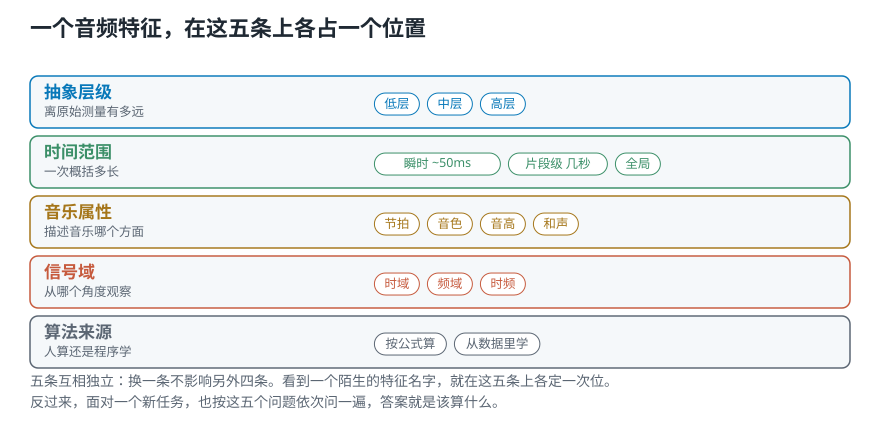
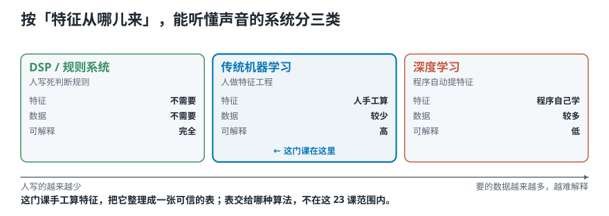

# 该从录音里算出什么交给程序？——音频特征的五个维度

> **导读：** 到上一课为止，一段 30 秒的音乐已经变成了一串六十多万个数字（每秒记两万两千多次，记了三十秒）。直接把这串数字丢给分类程序不行——太长、太细、而且**单独一个数说明不了任何事**。所以要先算出一些**摘要**，这些摘要就叫**音频特征**。搜「该用什么音频特征」会搜到一份长长的名词清单，可**这些名字回答的不是同一种问题**。这一课不背清单，而是给出一张分类地图：**任何一个音频特征，都可以用五个维度定位**——抽象层级、时间范围、音乐属性、信号域、用什么方法算出来。

<picture>
  <source media="(max-width: 640px)" srcset="figures/mobile/00-course-position-05.svg">
  
</picture>

## 为什么需要音频特征

需要音频特征，有三个直接理由：

- **特征是对声音的一种描述。** 那六十多万个数（每一个都是某一瞬间量到的一个值）本身不构成描述，它只是记录。
- **不同的特征抓住声音的不同侧面。** 有的抓强弱，有的抓高低，有的抓变化快慢。没有哪一个能抓住全部。
- **要造出能听懂声音的系统，就得先有这些描述。** 分类、识别、检索，全都建在特征之上。

关键在第二条：**不同特征抓的侧面不同。** 所以「哪个特征最好」这个问法本身不成立——就像问「体温计和 CT 哪个更好」。它们回答的不是同一个问题。

## 一个特征，可以用五个维度定位

<picture>
  <source media="(max-width: 640px)" srcset="figures/mobile/05-five-dimensions.svg">
  
</picture>

*图 1：这不是五选一，是五个各自独立的问题。任何一个特征名字，都能在这五条上各找到一个位置。*

这里说的**维度**，就是「可以分别去问的一个问题」。五个维度互相独立：换一个答案，不影响另外四个。

| 维度 | 这个词的意思 | 它问的是 |
|---|---|---|
| **抽象层级** | 「离原始数字有几层」 | 这个描述是直接算出来的，还是要先学 |
| **时间范围** | 「一次看多长」 | 一次概括 50 毫秒，还是几秒，还是整段 |
| **音乐属性** | 「描述音乐的哪一面」 | 是快慢，是听着像什么乐器，还是别的 |
| **信号域** | 「从哪个角度看」 | 看随时间的起伏，还是看有哪些高低成分 |
| **算法来源** | 「谁算出来的」 | 人按公式算，还是让程序从数据里学 |

后面三个名字（抽象层级、信号域这类）现在不用懂，下面五节各讲一个。

## 维度一：抽象层级

**抽象层级**问的是：这个描述**离原始测量有多远**。

- **低层**：直接从那串数字算出来，中间不需要先训练任何东西。这一小段有多响、那条曲线穿过中线多少次。含义稳定，换个项目也是同一个意思。
- **中层**：由低层的结果组织起来。音高（[第 02 课](02-声音与波形-一次振动怎样变成录音里那条线.md)讲过，就是「这个音有多高」）随时间怎么走、节拍落在哪里、成分分布是什么形状。
- **高层**：需要从数据里学出来。说话人是谁、什么音乐风格、什么情绪。**它的含义离不开训练它的那批数据。**

**所以呢？** 越抽象的目标，越不能直接去清单里找一个名字。「判断这台机器是不是要坏了」是高层，没有任何函数能直接算它；得先拆成低层的可测证据：**是不是出现了以前没有的固定高低的尖声？是不是出现了有规律的撞击？背景的沙沙声是不是变大了？** 这三条才是能直接算的。

## 维度二：时间范围

**时间范围**问的是：**一次概括多长的声音。** 它可以分成三档：

| 档 | 多长 | 能看见什么 |
|---|---|---|
| **瞬时** | 约 50 毫秒 | 局部质地：这一小段是元音还是摩擦音 |
| **片段级** | 几秒 | 一个完整事件：一次敲击、一个词、一小节 |
| **全局** | 整段录音 | 只剩总体统计：「平均而言这段偏尖锐」 |

注意最上面那一档是 **50 毫秒**，不是一个数。上一课说过，录音就是每隔极短一瞬量一次得到的一串数，每一次测量叫一个**采样点**。单独一个采样点几乎没有信息——「第 8137 个数是 0.03」，这句话什么也说明不了。**要有一小段，才谈得上「质地」。**

<picture>
  <source media="(max-width: 640px)" srcset="figures/mobile/05-time-scale.svg">
  
</picture>

*图 2：四条色条的长度差就是覆盖范围的差。最上面那条几乎看不见——一个采样点确实什么也说明不了。*

## 维度三：音乐属性

这一维在做音乐任务时才用得上。它问的是：**这个特征描述的是音乐的哪个方面。** 常见内容可以分成四类：

- **节拍**（beat）：什么时候有一下，快慢如何。
- **音色**（timbre）：听起来像什么乐器。[第 03 课](03-强弱响度与音色-音量一样为什么听起来不同.md)把它拆成了三样：声音怎么起怎么落、一个音里那些整数倍成分各有多强、以及它自己抖不抖。
- **音高**（pitch）：这个音有多高。只有一段图案在反复重复的声音才谈得上音高，[第 02 课](02-声音与波形-一次振动怎样变成录音里那条线.md)讲过。
- **和声**（harmony）：同时响的几个音之间是什么关系。

<picture>
  <source media="(max-width: 640px)" srcset="figures/mobile/05-music-aspect.svg">
  
</picture>

*图 3：四个方面互相独立。同一段音乐，换个乐器演奏，音色变了而节拍、音高、和声都没变。*

**所以呢？** 这一维直接决定你该往哪儿找特征。课程的三分类任务里，古典和摇滚差在**节拍**（密度和规整程度）和**音色**（失真吉他 vs 钢琴）上，而不是差在音高上——所以后面要算的特征，得往节拍和音色这两个方向找。

## 维度四：信号域

**信号域**问的是：**从哪个角度观察这段声音。** 这一维最重要，因为整个课程的后半段就是按它组织的。

**下面会一口气冒出十来个名字。现在一个都不用懂**——只要知道它们分别属于哪一档，以及各自在第几课展开。

**① 时域**——看数值随时间怎么起伏。这一档的三个代表：

- **振幅包络**：每一小段里最高的那个数有多大
- **均方根**：每一小段整体上有多强
- **过零率**：每一小段里，曲线穿过中线多少次

主场是[第 07—09 课](../零基础版_06-10/07-三个时域特征-不做频率分析能问出什么.md)，那三课会从头算一遍。

**② 频域**——看声音由哪些高低成分组成，不管它们什么时候出现。

- 三个代表：频带能量比、频谱质心、频谱通量。「频谱」指的是「这段声音由哪些高低成分组成」的那张分布
- 主场是第 21—23 课

**③ 时频表示**——同时看「有哪些成分」和「它们什么时候出现」。这一档的东西都是**二维的图**：一个方向是时间，另一个方向是高低成分。

- **声谱图**：最基本的那一张，[第 16 课](../零基础版_16-20/16-用Python画声谱图-同一批数为什么换个画法才看得见.md)细讲
- **梅尔频谱**：把纵轴按人耳的习惯重新分格之后的版本，[第 17 课](../零基础版_16-20/17-梅尔刻度-怎样按听感重新刻一把频率的尺子.md)细讲
- **常数 Q 变换**：把纵轴按音乐的音高关系分格的版本

主场是[第 15—18 课](../零基础版_11-15/15-短时傅里叶变换-整段频谱为什么找不到声音发生的时间.md)。

<picture>
  <source media="(max-width: 640px)" srcset="figures/mobile/05-three-angles.svg">
  
</picture>

*图 4：素材是一段从低到高的音阶。右图里一级级往上的亮块就是一个个音，还能看到每个音上方那几条更淡的横线——这是左右两张图都给不了的信息。*

再说一遍：这些名字现在只要知道**分属哪一档**就够了，具体怎么算，各自那一课会从头讲。

## 维度五：用什么方法算出来

最后一维问的是：**这个特征是人按公式算的，还是程序从数据里学的。**

所谓**深度学习**，指的是让一个多层的程序自己从大量数据里摸索出该看什么，人不指定；**传统机器学习**则是人先算好一组数字，再让算法从这些数字里学规则。

|  | 传统机器学习 | 深度学习 |
|---|---|---|
| 特征从哪来 | **人手工设计**，按公式算 | **程序自己从数据里学** |
| 输入是什么 | 一组算好的数（AE、RMS、ZCR、频谱质心……） | 接近原始的表示（比如声谱图） |
| 需要多少数据 | 较少 | 较多 |
| 能不能解释 | 高，每一维都说得清 | 低，需要额外手段分析 |
| 换个项目 | 定义稳定，直接能用 | 依赖训练数据的分布 |
| 主要风险 | 规则不适合任务，漏掉关键线索 | 数据覆盖不足，学到无关差异 |

<picture>
  <source media="(max-width: 640px)" srcset="figures/mobile/05-rule-vs-learn.svg">
  
</picture>

*图 5：两张卡片之间是箭头，不是分隔线。下面那条橙色的才是实际做法：前面按公式算好，后面交给程序去学。*

**常见错误：把这一维当成二选一。** 很多实用系统的做法是：**前面用一个稳定、便宜、可解释的规则算好中间表示**（比如梅尔频谱），**后面交给模型去学**。既省数据，又保留灵活性。

## 三类能听懂声音的系统

把上一维再往外推一层，按「特征从哪儿来」，能听懂声音的系统可以分成三类。

<picture>
  <source media="(max-width: 640px)" srcset="figures/mobile/05-three-systems.svg">
  
</picture>

*图 6：从左到右，人写的部分越来越少，程序自己学的部分越来越多；同时需要的数据越来越多，能解释的程度越来越低。*

- **DSP / 规则系统**：人把判断规则整条写死。不需要训练数据，完全可解释，但换个场景就得重写。
- **传统机器学习**：人做**特征工程**——手工算出一组数字，再让算法从这些数字里学判断规则。
- **深度学习**：人只给接近原始的输入，**特征提取也交给程序自己完成**。

**这门课的位置在中间那一类**：我们手工算特征，把它整理成一张可信的表。表交给哪种算法，不在这 23 课的范围内。

## 实验：为了长度一致而求平均，代价有多大

五个维度里，**时间范围**最容易被随手糊弄过去——「为了让每段录音长度一致，整段求个平均吧」。这一步的代价可以直接量出来。

运行 [`lesson05_feature_choices.py`](../课程代码/lessons/lesson05_feature_choices.py)：

```text
原序 [0.1, 0.2, 0.9, 0.4, 0.8, 0.1]
  均值 = 0.4167   标准差 = 0.3236
倒序 [0.1, 0.8, 0.4, 0.9, 0.2, 0.1]
  均值 = 0.4167   标准差 = 0.3236
随机打乱 [0.4, 0.9, 0.1, 0.8, 0.1, 0.2]
  均值 = 0.4167   标准差 = 0.3236
```

三行**一位小数都不差**。

**所以呢？** 这不是巧合：均值和标准差的定义里都是**求和**，而**加法不在乎顺序**。推广一下——**任何与顺序无关的统计量，都无法还原「峰值出现在第几段」**。换成最大值、中位数、分位数，结论一样。

判据因此非常干脆：

- 任务里出现「**什么时候**」，就必须保留一段一段的先后顺序。
- 只判断「整段属于哪一类」，才可以考虑压成统计量。

同一份数据，两种形状：

```text
log_mel   (64, 501)
          64 个频带 × 501 个时间帧
保留时间  (501, 64)
          每个时刻一个 64 维向量
丢掉时间  (128,)
          64 个均值 + 64 个标准差
```

第二种长度固定，和录音多长无关，适合做第一版对照方案；但「峰出现在第几帧」**再也问不出来了**。

**一个会安静出错的参数。** 把梅尔频谱换算成分贝时有个 `ref` 参数，它决定「以什么为 0 dB」：

```text
        三段音乐的最大值
        ref=1.0    ref=max
古典      12.75       0.00
爵士      19.76       0.00
摇滚      18.40       0.00
```

`ref=np.max` 让每段以自身峰值为 0 dB——右边一列三个全是 0.00，**三段之间的电平差被抹掉了**。左边那一列还留着差别。

**所以呢？** 如果任务恰好依赖「这台机器比以前更吵了」，用 `ref=np.max` 就把关键线索删掉了，**而且不会报错**。这类参数不改变输出的形状，只改变数值——**形状对了不代表数值可比**，所以它必须和 `n_fft`、`hop_length` 一样被记录下来。

## 把五个维度套到课程项目上

```text
拆成什么  高频占比 / 节奏密度 / 力度起伏
看多长    节奏和力度是随时间的事，
          先留序列，最后一步才聚合
哪个角度  高频占比看成分，节奏看时间，
          力度起伏两边都要
谁来算    只有几十个片段，
          先用规则算出的特征做基线
```

再加上音乐属性那一维：三种风格差在**节拍**和**音色**上，不差在音高上。

**答案是五个问题共同决定的，不是从清单上挑一个名词。**

## 这一课得到了什么，下一课接着讲什么

这一课没有教任何一种具体算法，它给的是一张地图：**看到一个陌生的特征名字，能在五个维度上把它定位；面对一个新任务，能按五个问题依次推出该算什么。**

第 01—05 课到这里结束。回头看这一组走过的路：声音怎么产生（02）→ 怎么被记成数字（04）→ 强弱和音色怎么量（03）→ 该算什么交给程序（05）。

可有一件事还没解决。上面反复说「一小段」「逐帧」「保留时间顺序」，**可这些「小段」到底怎么切出来？** [下一课](../零基础版_06-10/06-特征提取流水线-从整段录音到一串可比较的数.md)就讲这件事：把一整段录音切成许多短小、互相重叠的片段，然后逐段计算。那是第 06—10 课整组的起点。
