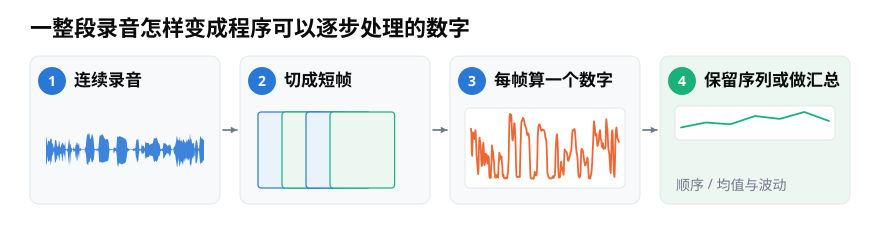
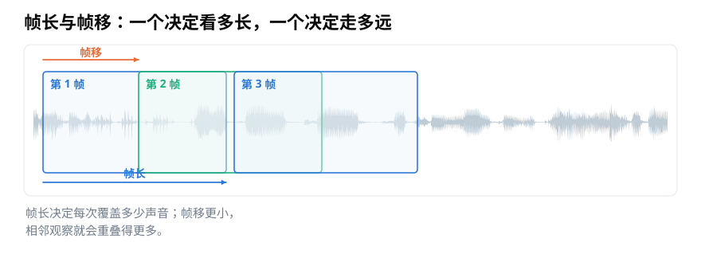
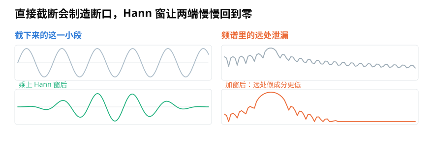
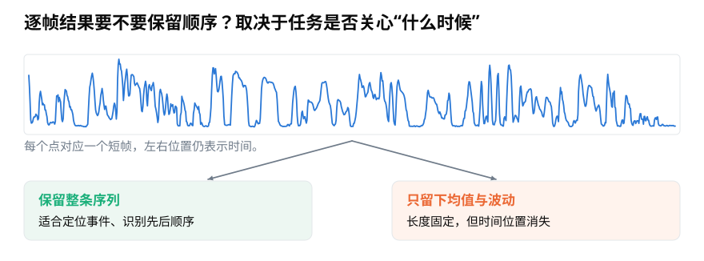

# 分帧、加窗与聚合：怎样把整段录音变成可计算的小段？

> **导读：** 一段录音通常不能直接变成一个有意义的答案。本文从“切成多长的小段”讲起，依次说明帧长、帧移、加窗和聚合怎样决定程序看见的声音细节。

假设我们录下十秒钟的机器运转声，想找出其中有没有短促的碰撞。人听录音时会自然注意到“哪一刻突然响了一下”，程序却只收到十几万个按时间排列的数字。

如果把十秒录音直接压成一个平均值，碰撞发生的时间会消失；如果逐个数字判断，每个数字又短得没有上下文。把这些数字按时间画成一条起伏的线，就得到声音的**波形**。更实用的办法，是先把连续录音切成许多很短的小段，再逐段观察。

<picture>
  <source media="(max-width: 640px)" srcset="figures/mobile/06-pipeline.svg">
  
</picture>

*图 1：蓝色波形先被切成彼此相邻的小段；每段算出一个数以后，既可以保留先后顺序，也可以进一步汇总。*

## 分帧：给每次观察留出一小段上下文

把录音切出的每个短片段叫一**帧**，这个过程叫**分帧**。一帧不是视频画面，而是一小段连续的声音数字。

切段时要决定两个长度：

- **帧长**：每一帧覆盖多少声音，也就是一次看多长。
- **帧移**：从这一帧的开头走到下一帧的开头要走多远。

帧移比帧长小时，相邻两帧会重叠。重叠不是重复劳动：如果一个短促事件正好落在切口附近，前后两帧都能看到它的一部分，不容易因为切段位置不同而得到截然不同的结果。

<picture>
  <source media="(max-width: 640px)" srcset="figures/mobile/06-frame-hop.svg">
  
</picture>

*图 2：长方框的宽度是帧长；上方橙色箭头是帧移。帧移小于帧长，所以第 1、2、3 帧互相重叠。*

参数常用“样本数”表示，但读者更容易理解毫秒。一秒录音中记录了多少个数字，叫**采样率**。采样率为 $f_s$、一帧含 $K$ 个样本时，覆盖时间是

$$
\text{帧长（秒）}=\frac{K}{f_s}。
$$

例如采样率为 16,000 Hz，一帧取 400 个数字，就覆盖 $400/16000=0.025$ 秒，也就是 25 毫秒；帧移取 160 个数字，则每隔 10 毫秒开始一帧。

帧长没有通用最佳值。它越短，事件位置越清楚，但一帧里的信息更少；它越长，观察更稳定，却可能把相邻事件混在一起。选择时应先问：任务关心的变化通常持续多久？

## 加窗：做频率分析前，把切口变得平缓

直接从连续波形中截下一段，左右边缘通常接不上。对“这一帧最大有多大”之类的计算，这个切口未必有问题；但要分析这一帧包含哪些高低成分时，突然的边缘会制造原录音里没有的成分。这种能量散到邻近位置的现象叫**频谱泄漏**。

常见做法是让一帧中间保持较大，两端逐渐减小到接近零。这个逐点相乘的平滑形状叫**窗函数**；常用的一种叫 **Hann 窗**。

<picture>
  <source media="(max-width: 640px)" srcset="figures/mobile/06-windowing.svg">
  
</picture>

*图 3：左上是直接截下的小段，左下是两端被 Hann 窗压低后的结果；右侧橙线的远处起伏更低，说明假成分减少了。*

加窗也不是免费午餐。它减弱边缘跳变，却会让一个频率的主峰稍微变宽。因此，“是否加窗、用哪种窗”要和后面的频率分析一起记录。关于频率怎样随时间排列成图，[第 15 篇](../零基础版_11-15/15-短时傅里叶变换STFT-怎样同时看见频率与出现时间.md)会继续展开；本篇先把它看成分帧后的一个可选步骤。

## 逐帧计算：把每一小段变成可比较的数字

切好以后，可以对每帧回答一个具体问题，例如：

- 这一小段的最高峰有多高？
- 这一小段整体振动有多强？
- 这一小段上下翻越零线有多频繁？
- 这一小段主要有哪些高低成分？

每帧得到一个数，按时间排起来就是一条曲线；每帧得到一列数，按时间排起来就是一张表。它们都是从原始录音中提取的、更便于比较的数字证据，也就是**音频特征**。

## 聚合：保留时间顺序，还是压成固定长度

许多程序要求每段录音最终都变成相同数量的数字。最直接的办法，是对逐帧结果计算均值、最大值和波动程度。把一长串结果压成少量统计数字，叫**聚合**。

<picture>
  <source media="(max-width: 640px)" srcset="figures/mobile/06-sequence-summary.svg">
  
</picture>

*图 4：上方每个点仍对应一个时间位置。左下保留整条曲线，右下只留下均值和波动，录音长度固定了，但事件位置也消失了。*

两种结果适合不同任务：

- 要找“故障在第几秒出现”，就保留逐帧顺序。
- 只判断“整段录音属于哪一类”，可以尝试均值、标准差等汇总。
- 同时关心类别和位置，就保留序列，让后续程序自己组合前后信息。

下面的代码展示最小流程。它只保留完整帧，录音末尾不足一帧的部分先不处理：

```python
import numpy as np

def frame_signal(y, frame_length=400, hop_length=160):
    frames = []
    for start in range(0, len(y) - frame_length + 1, hop_length):
        frames.append(y[start:start + frame_length])
    return np.asarray(frames)

frames = frame_signal(y)
rms_sequence = np.sqrt(np.mean(frames ** 2, axis=1))
summary = np.array([rms_sequence.mean(), rms_sequence.std()])
```

这里的 `rms_sequence` 保留时间顺序，`summary` 只留下整体水平和波动。末尾怎样处理、每帧的时间应该标在哪里，也会影响结果；[第 08 篇](08-振幅包络怎么计算-从逐帧最大值到可靠时间轴.md)会用完整代码处理这些边界。

## 小结

分帧解决“每次看多长”，帧移解决“每次向前走多远”，加窗减轻频率分析中的切口影响，聚合决定是否保留时间位置。它们不是无关紧要的预处理：参数一变，程序能看见的细节也会跟着变。
