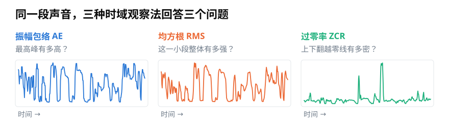
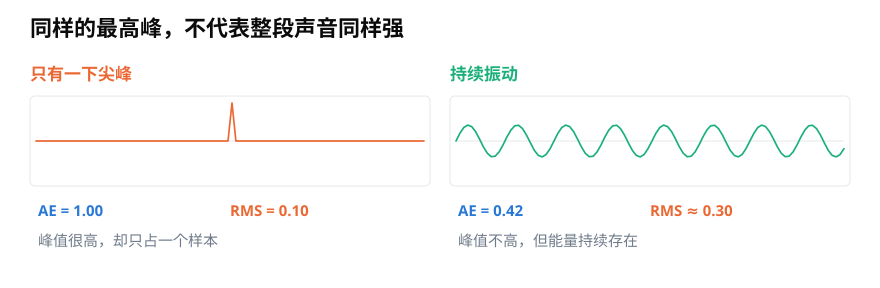
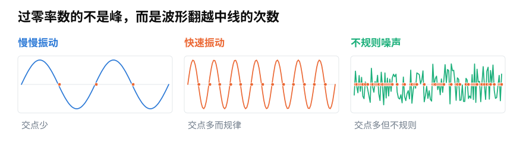

# 振幅包络、RMS 与过零率：不用频谱能从声音里看出什么？

> **导读：** 不把声音拆成高低成分，也能观察它随时间怎样变化。本文比较三种常用的时域特征：最高峰、整体强弱和翻越零线的频繁程度。

<picture>
  <source media="(max-width: 640px)" srcset="figures/mobile/00-course-position-07.svg">
  
</picture>

观察一段录音时，我们很容易注意到哪里突然变大、哪里持续很响、哪里抖动得很密。

把声音数字按时间画成一条起伏的线，就得到**波形**。本篇的三种观察都直接使用这条线，不先把声音拆成高音和低音。工程里把这种沿时间观察的方法叫**时域分析**。

<picture>
  <source media="(max-width: 640px)" srcset="figures/mobile/07-three-features.svg">
  
</picture>

*图 1：三条曲线来自同一段真实语音。蓝线追踪每小段的最高峰，橙线看整体强弱，绿线看上下翻转有多密。*

它们都要先把录音切成小段。如何切段、为什么常让相邻小段重叠，可先参考[第 06 篇](06-分帧加窗与聚合-怎样把整段录音变成可计算的小段.md)。

## 振幅包络：追踪每个短片段的最高峰

如果每小段只留下“离中线最远的那个数字”，再把这些最高值按时间连起来，就得到声音外轮廓的一条线。这条线叫**振幅包络**，常缩写为 **AE**。

它对突然出现的尖峰非常敏感，适合找起音、碰撞或削波；缺点也来自同一点：一小段里只要有一个异常数字，整段的结果就会被它决定。

## RMS：观察一小段声音的整体强弱

假设一小段里有很多数字。我们先让负数和正数都变成正的贡献，再求平均，最后换回原来的量级，就得到一小段的整体振动强度。这叫**均方根**，英文缩写是 **RMS**。

它使用一帧里的所有数字，因此比“只看最高峰”稳定。一个孤立尖峰会抬高 RMS，但通常不会像振幅包络那样立刻冲到同样高度。

<picture>
  <source media="(max-width: 640px)" srcset="figures/mobile/07-ae-rms.svg">
  
</picture>

*图 2：左边只有一下尖峰，AE 达到 1，RMS 只有 0.1；右边虽然最高峰较低，但振动持续存在，所以 RMS 反而更高。*

因此，“峰值高”和“整段都强”是两个不同的问题。检测爆音可以先看 AE；判断一段录音总体强弱，RMS 往往更合适。若想更接近人耳听到的响度，还需要考虑频率、持续时间和播放音量，不能把 RMS 直接叫作“响度”。

## 过零率：数波形翻越中线的次数

波形围绕中线来回摆动。每次从正数变成负数，或从负数变成正数，就算翻越一次中线。每小段中翻越次数占相邻数字总数的比例，叫**过零率**，常缩写为 **ZCR**。

<picture>
  <source media="(max-width: 640px)" srcset="figures/mobile/07-zero-crossings.svg">
  
</picture>

*图 3：橙色小点是波形穿过中线的位置。慢速振动交点少，快速振动交点多而规律；没有稳定起伏规律的声音，交点通常多但不规则。*

ZCR 可以粗略提示波形变化是否密集。例如，语音中的摩擦声，以及沙沙声这类没有稳定起伏规律的声音——通常称为**噪声**——常比平稳的元音有更高的过零率。

但它不能精确说明一个音听起来有多高或多低，也就是它不能精确测量**音高**。噪声也可能频繁过零，而且录音中很小的电气抖动会制造额外交点。

实际计算时，通常会把离零非常近的小数当作零，避免微小噪声导致正负号不断翻转。这个小范围有多宽，需要按录音的幅度和噪声水平设置。

## 三条曲线各自能说明什么

<picture>
  <source media="(max-width: 640px)" srcset="figures/mobile/07-evidence-matrix.svg">
  
</picture>

*图 4：每一行是一个判断任务。手机图把横表改成四张纵向卡片，但内容没有减少；它强调三种特征需要互相补充。*

把三条曲线放在一起，常能得到比单看一条更可靠的线索：

- AE 突然升高、RMS 只小幅上升，可能是一个很短的尖峰。
- AE 与 RMS 一起持续升高，说明整段声音确实变强。
- RMS 不高而 ZCR 上升，可能出现了较弱但细密的噪声。

这里的“可能”很重要。AE、RMS 和 ZCR 都只是低成本的数字证据，不能单独认出“这是雨声”或“这是某个人”。它们看不见完整的频率分布，也不知道声音产生的原因。

## 怎样选择

选择不应从缩写出发，而应从问题出发：

- 找突然峰值：先看 AE。
- 看持续强弱：先看 RMS。
- 看波形翻转是否变密：先看 ZCR。
- 要判断具体音高，或声音质感为什么不同（也就是**音色**）：需要继续观察振动每秒重复多少次，以及不同快慢成分各有多强。振动每秒重复的次数叫**频率**。

[第 08 篇](08-振幅包络怎么计算-从逐帧最大值到可靠时间轴.md)会实现可靠的振幅包络，[第 09 篇](09-RMS与过零率怎么计算-用整体强弱和翻越零线次数检查声音.md)会计算 RMS 与 ZCR，并说明两条证据怎样联合使用。

## 小结

振幅包络回答“最高峰有多高”，RMS 回答“这一小段整体有多强”，过零率回答“波形翻越中线有多密”。同一段声音可以同时有高峰、低平均强度和高翻转密度，所以三者不是互相替代的三个名字，而是三个不同观察角度。

<!-- exercise:start -->

## 动手做：第 7 步 · 先看看三种时域特征分不分得开

课程项目《三首曲子，一个分类器》共 23 步，这是第 7 步。在动手实现之前，先用现成的库快速看一眼：这三种特征里，哪一种对区分风格真的有用？

1. 用 librosa 对三段音乐各算一次振幅包络、均方根和过零率（这一课只借用结果，实现留到 08、09）。
2. 把三条曲线画在同一张图上，三种风格用三种颜色。
3. 对每一种特征回答：三种风格的曲线分开了吗？分开的是整体高低，还是起伏形状？

**做完应该有**：三张对比图（每种特征一张），以及一段判断：哪种特征最有希望，哪种可能没用。

**自检**：过零率上，摇滚应该明显高于古典（失真吉他与镲片带来大量高频翻转）。如果三条线缠在一起，先回去检查第 03 步的响度统一是不是漏做了。

上一步：[第 06 课 · 写出分帧函数](06-分帧加窗与聚合-怎样把整段录音变成可计算的小段.md)　·　下一步：[第 08 课 · 实现振幅包络](08-振幅包络怎么计算-从逐帧最大值到可靠时间轴.md)　·　[项目全貌](../课程项目/README.md)

<!-- exercise:end -->
