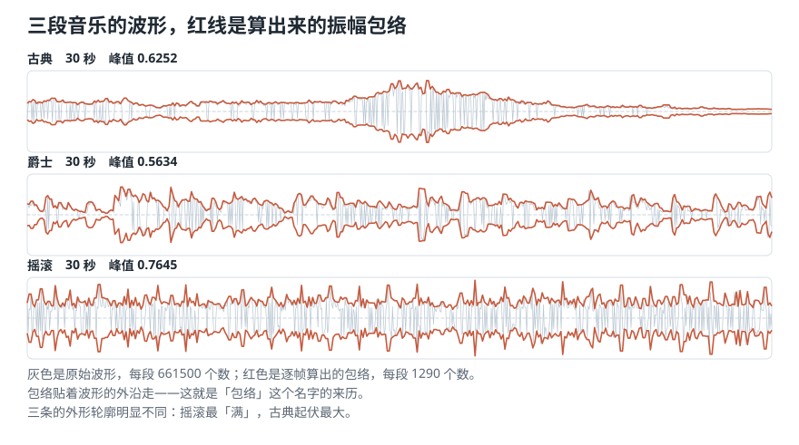
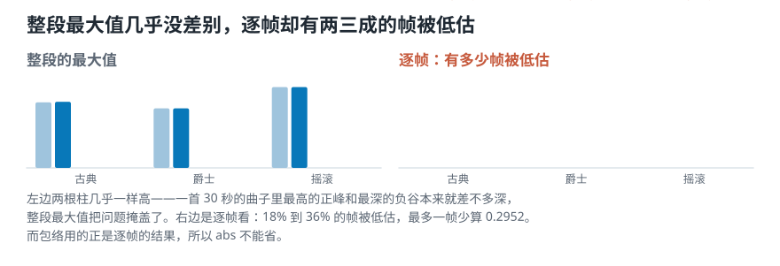
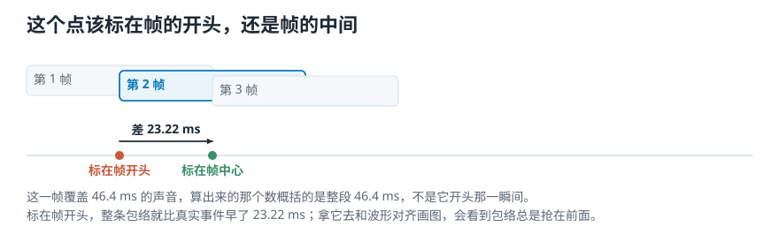
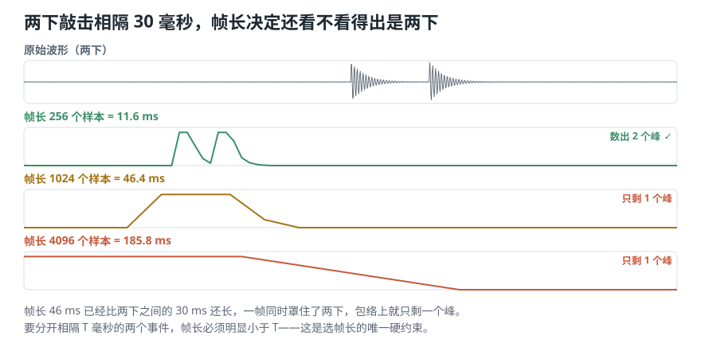
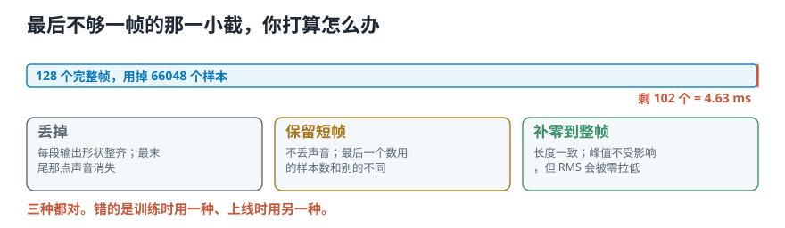

# 把振幅包络的公式，写成真能跑的代码

> **导读：** [上一课](07-三个时域特征-不做频率分析能问出什么.md)把三个公式讲完了，但一行实现都没写。这一课从头做第一个：**振幅包络**。我们会载入三段音乐、确认基本信息、画出波形、手写包络、把帧编号换算成秒，最后把包络叠到波形上比较三种曲风。**中间还会发现一个容易漏掉的 `abs`**：它在整段最大值上几乎看不出影响，逐帧检查时却会让三段音乐里 **18% 到 36% 的帧**被低估。

<picture>
  <source media="(max-width: 640px)" srcset="figures/mobile/00-course-position-08.svg">
  
</picture>

## 第 1 步：载入三段音乐，看清基本信息

开始计算前，先确认手上的数据是什么样。

```python
from soundlab import io

for name in ["debussy", "duke", "redhot"]:
    y, sr = io.load(name)
    print(name, len(y), sr, len(y) / sr)
```

实测：

```text
        样本数  采样率  总时长
古典    661500  22050  30.00s
爵士    661500  22050  30.00s
摇滚    661500  22050  30.00s
一个样本 = 0.0454 毫秒
```

三个数要看：

- **样本数**：一段 30 秒的音乐是 661500 个数。这就是「为什么不能把原始数据直接丢给分类程序」的具体规模。
- **一个样本多久**：$1/22050 \approx 0.0454$ 毫秒。第 06 课说过，人耳的时间分辨率约 10 毫秒——**一个样本比它短两百多倍**。
- [第 04 课](../零基础版_01-05/04-模拟声到数字录音-连续的声音怎样变成一串数字.md)讲过的**采样率**：三段完全一致。**所以呢？** 所以帧编号换算成秒时，三段可以用同一个换算。

## 第 2 步：画出三条波形

```python
import librosa.display
librosa.display.waveshow(y, sr=sr, alpha=0.5)
```

<picture>
  <source media="(max-width: 640px)" srcset="figures/mobile/08-three-envelopes.svg">
  
</picture>

*图 1：灰色是原始波形（每段 661500 个数），红色是这一课要算出来的振幅包络。包络贴着波形的外沿走，这就是「包络」这个名字的来历。*

先只看灰色那部分：三条波形的**外形轮廓**明显不同。古典那条起伏最大，摇滚那条最「满」。这一课要做的，就是**把这个轮廓变成一串可以计算的数**。

## 第 3 步：手写振幅包络

一种容易直接写出来的版本是这样：

```python
def amplitude_envelope(signal, frame_size, hop_length):
    ae = []
    for i in range(0, len(signal), hop_length):
        ae.append(max(signal[i:i + frame_size]))
    return np.array(ae)
```

逐行看。下面两个长度参数都在[第 06 课](06-特征提取流水线-从整段录音到一串可比较的数.md)定义过：

- `range(0, len(signal), hop_length)`：从 0 开始，每次往前走一个**帧移**。`i` 就是每一帧的起点。
- `signal[i:i + frame_size]`：从起点往后取一个**帧长**，这就是第 $i$ 帧。
- `max(...)`：取这一帧里最大的那个数。

参数用 `FRAME_SIZE = 1024`、`HOP_LENGTH = 512`，和第 06 课定下的一致。

同一段循环也可以压成一行，做的事完全一样：

```python
np.array([max(signal[i:i + frame_size])
          for i in range(0, len(signal), hop_length)])
```

## 这个写法漏了一个 `abs`

上一课手算八个数时就发现了：`max` 会漏掉负方向上的峰。现在在真实音乐上量一次，看看影响有多大。

**先看整段的最大值**：

```text
        不取绝对值   取绝对值
古典     0.6196     0.6252
爵士     0.5634     0.5634
摇滚     0.7645     0.7645
```

**几乎一样。爵士和摇滚甚至一模一样。**

如果只看这张表，会得出「加不加 `abs` 无所谓」的结论——**而这个结论是错的**。因为一首 30 秒的曲子里，最高的正峰和最深的负谷本来就差不多深，**整段的最大值把问题掩盖了**。

**逐帧看才暴露**：

```text
       帧数  被低估   占比   最多低估
古典   1290    231  17.9%   0.2952
爵士   1290    315  24.4%   0.2531
摇滚   1290    461  35.7%   0.2650
```

<picture>
  <source media="(max-width: 640px)" srcset="figures/mobile/08-abs-per-frame.svg">
  
</picture>

*图 2：左边是整段最大值——两种写法几乎重合。右边是逐帧——被低估的帧占了两成到三成半。包络用的是逐帧的结果，不是整段最大值。*

**所以呢？** 三段各有 **18% 到 36% 的帧被低估**，最多的一帧少算了 0.2952——那几乎是满量程的三分之一。而**包络要用的正是逐帧的结果**，不是整段最大值。

所以正确实现必须补上 `abs`：

```python
ae = np.max(np.abs(frames), axis=1)
```

补上这一处以后，后面的时间换算和曲线比较才能继续使用正确结果。

## 第 4 步：把帧编号换算成时间

算出来的包络是一串**按帧编号排列**的数：第 0 帧、第 1 帧、第 2 帧……可要把它画到波形上，横轴得是**秒**。

帧编号换成秒可以这样写：

```python
frames = range(len(ae))
t = librosa.frames_to_time(frames, hop_length=HOP_LENGTH)
```

换算很简单——第 $i$ 帧的起点是第 $i \times H$ 个样本，除以采样率就是秒：

```text
第    0 帧：起点   0.000s，中心   0.023s
第    1 帧：起点   0.023s，中心   0.046s
第    2 帧：起点   0.046s，中心   0.070s
第 1289 帧：起点  29.931s，中心  29.954s
```

**但「一帧」对应的不是一个瞬间，是一段 46.4 毫秒的区间。** 那这个点该标在哪儿？

<picture>
  <source media="(max-width: 640px)" srcset="figures/mobile/08-time-axis.svg">
  
</picture>

*图 3：同一帧，标在起点和标在中心相差 23.22 毫秒，永远是半个帧长。*

两种标法整条相差 **23.22 毫秒**，永远是半个帧长。

- **librosa 默认按帧起点标**（`frames_to_time` 不加中心偏移）。
- **本课程按帧中心标**，因为一帧的读数概括的是整段 46.4 毫秒，不是它开头那一瞬。

用真实数据验证一下哪种更准。找出波形上最高的那个样本，再看包络最高的那一帧标在哪儿：

```text
波形最高的样本在 1.0502 秒
按起点标 1.0217 秒，差 28.5 毫秒
按中心标 1.0449 秒，差  5.3 毫秒
```

**按中心标误差小了五倍多。** 但这不是说 librosa 错了——**只要整个项目自始至终用同一种，画图和找位置就都对得上。** 混用才会出问题。

## 第 5 步：三段的包络放在一起比

```text
        峰值    包络平均   平均/峰值
古典   0.6252   0.1786    0.2857
爵士   0.5634   0.2091    0.3712
摇滚   0.7645   0.2949    0.3857
```

前两列受录音音量影响，跨录音比没意义。**最后一列不受**——它是包络平均值占自身峰值的比例，分子分母同时缩放会约掉。

**所以呢？** 摇滚 0.39 最高，说明它整段都更贴近自己的峰值，**起伏小、一直很满**；古典 0.29 最低，说明它**忽强忽弱的落差最大**。这和听感一致，也和第 01 课「摇滚更满、古典起伏更大」那句话对上了。

**注意这个比例能比、绝对峰值不能比。** 判断一个特征跨录音能不能直接比，就看它是不是「同时缩放会约掉」。

## 三个真写代码时会撞上的问题

完成上面的核心实验后，还有三件真写代码时一定会遇到的问题。

### 一、帧长决定你能不能分开两个挨得近的事件

造两下相隔 30 毫秒的敲击，用三种帧长各算一次包络，数数能看出几个峰：

```text
   帧长   覆盖时间   帧数   数出几个峰
   256    11.6ms    85       2
  1024    46.4ms    20       1
  4096   185.8ms     4       1
```

<picture>
  <source media="(max-width: 640px)" srcset="figures/mobile/08-frame-length.svg">
  
</picture>

*图 4：帧长 256 能数出两个峰；1024 和 4096 都只剩一个——两下被并成了一下。*

**所以呢？** 帧长 46.4 毫秒已经比两下之间的 30 毫秒还长，一帧同时罩住了两下。**要分开相隔 $T$ 毫秒的两个事件，帧长必须明显小于 $T$。** 这是选帧长唯一的硬约束。

### 二、结尾那一小截怎么办

```text
样本数 66150，用掉 66048
剩下 102 个没进任何一帧 = 4.63 毫秒
```

三种处理各得到多少帧：

```text
丢掉尾巴    128 帧
  最后 102 个样本没用上
保留短尾帧  130 帧
  其中 2 帧不满，长 614 和 102
补零到整帧  129 帧
  补进去 410 个零
```

<picture>
  <source media="(max-width: 640px)" srcset="figures/mobile/08-tail.svg">
  
</picture>

*图 5：三种做法各有各的代价。*

**三种都对。错的是训练时用一种、上线时用另一种。** 4.63 毫秒通常无所谓，但录音很短、或者关键事件正好在最末尾时就必须选定一种并写进配置。

### 三、和 librosa 对齐：`center=True` 会多出两帧

```text
我们的 frame()        128 帧
librosa center=False  128 帧
librosa center=True   130 帧
  （两头各补了 512 个零）
```

**差的这两帧不是 bug。** `center=True` 让第 0 帧的**中心**落在 0 秒，代价是开头和结尾各多出半帧凭空补的零。

**所以呢？** 两批用不同 `center` 算出来的特征混在一起，整体会错半帧。这是个**不会报错**的错误——形状对得上，数值全偏。

## 这一课得到了什么，下一课接着讲什么

完整走完了第一个特征的实现：**载入 → 看基本信息 → 画波形 → 手写包络 → 帧号换成秒 → 叠图比较。**

四件必须写进配置的事：**帧长、帧移、尾帧规则、时间标在起点还是中心**。四个里改任何一个，算出来的曲线就对不上。

一个能带走的判据：**跨录音能不能直接比，看这个数「同时缩放会不会约掉」。** 峰值不能比，「平均占峰值的比例」能比。

[下一课](09-实现RMS与过零率-先调库再手写然后对齐.md)按同样的方式实现另外两个：先用 librosa 现成的算一遍，再从零手写一遍并和它对齐——**上一课那个「除以 7 还是除以 8」的口径差，就在那里第一次真正对上。**
