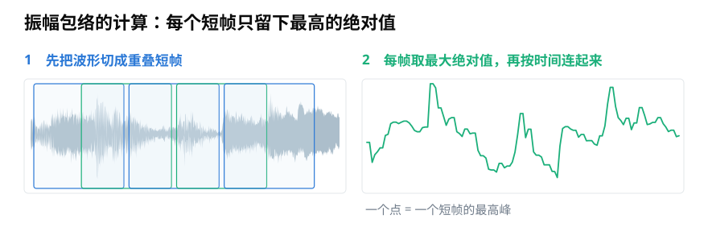
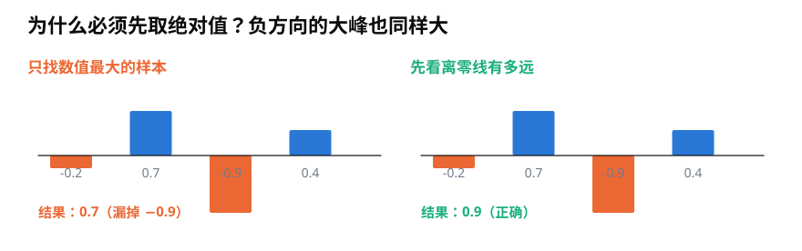
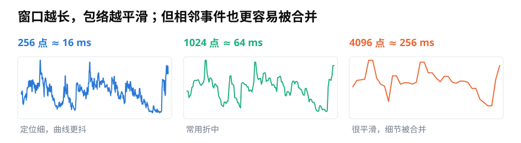

# 振幅包络怎么计算？从逐帧最大值到可靠时间轴

> **导读：** 振幅包络的公式很短，可靠实现却要处理正负方向、窗口长度、录音结尾和时间坐标。本文从一帧四个数字开始，写出可以复查的完整代码。

如果想自动找出录音里每次敲击发生的时间，可以沿着波形外沿画一条线：哪里出现高峰，这条线就升高；声音安静时，它就回落。这就是[第 07 篇](07-振幅包络RMS与过零率-不用频谱能看出什么.md)介绍的振幅包络。

真正计算时，我们不需要先“画”出外轮廓，只要把录音切成短片段，并为每段保留一个数。

<picture>
  <source media="(max-width: 640px)" srcset="figures/mobile/08-envelope-steps.svg">
  
</picture>

*图 1：左边的重叠框是短帧；右边每个点只保留对应短帧中离零线最远的样本，再按时间连起来。*

## 第一步：先看离零线最远的距离

假设一帧只有四个数字：

```text
-0.2, 0.7, -0.9, 0.4
```

如果直接取数值最大的一个，结果是 0.7；但 -0.9 在负方向上离零线更远，实际峰值应是 0.9。解决办法是先取每个数字的**绝对值**，也就是只看它离零有多远，再取最大值。

<picture>
  <source media="(max-width: 640px)" srcset="figures/mobile/08-absolute-value.svg">
  
</picture>

*图 2：上半部分直接比较数值，漏掉了 -0.9；下半部分比较到零线的距离，正确得到 0.9。*

第 $m$ 帧含 $K$ 个数字，写成公式就是

$$
AE(m)=\max_{0\le k<K}|x(mH+k)|。
$$

这里 $x$ 是整段录音，$H$ 是每次向前移动的样本数。公式想表达的只有一句话：**在第 $m$ 个短片段里，找到离零线最远的数字。**

## 第二步：帧长决定轮廓能保留多少细节

帧越短，包络上的点越密，短促变化的位置更清楚；帧越长，一个点会概括更长时间，曲线更平滑，却可能把两个相邻峰合成一个。

<picture>
  <source media="(max-width: 640px)" srcset="figures/mobile/08-frame-size.svg">
  
</picture>

*图 3：同一段真实音乐分别用 256、1024 和 4096 个样本计算。窗口越长，曲线越平滑，短促细节也越容易被合并。*

在 16 kHz 采样率下，这三种长度约为 16、64 和 256 毫秒。找敲击位置时，256 毫秒往往太长；只想看一句语音的大体强弱走势时，较长窗口可能更稳定。帧移还决定相邻点间隔多久，具体换算见[第 06 篇](06-分帧加窗与聚合-怎样把整段录音变成可计算的小段.md)。

## 第三步：明确怎样处理录音结尾

录音长度通常不是帧长和帧移的整倍数。走到结尾时，最后一帧可能只剩一小段。常见规则有三种：

<picture>
  <source media="(max-width: 640px)" srcset="figures/mobile/08-tail-policy.svg">
  
</picture>

*图 4：橙色叉表示丢弃不足一帧的尾部；绿色短框表示保留短帧；补零则把最后一帧补到与前面同样长度。*

- **丢弃尾帧**：结果形状整齐，但最后一点声音可能消失。
- **保留短尾帧**：不丢声音，但最后一个结果使用的样本数不同。
- **补零到整帧**：每帧长度一致；对峰值而言，补零通常不改变已有峰值，但会影响 RMS 等使用整帧平均的量。

没有一种规则永远正确。关键是训练、测试和上线处理必须一致，并把规则写进配置。

## 一个边界清楚的实现

下面的函数默认保留短尾帧，并把每个结果放在对应帧的中心时刻：

```python
import numpy as np

def amplitude_envelope(y, sr, frame_length=1024, hop_length=512,
                       keep_tail=True):
    y = np.asarray(y, dtype=float)
    values = []
    times = []

    for start in range(0, len(y), hop_length):
        end = min(start + frame_length, len(y))
        frame = y[start:end]

        if len(frame) < frame_length and not keep_tail:
            break
        if len(frame) == 0:
            break

        values.append(np.max(np.abs(frame)))
        center_sample = start + (len(frame) - 1) / 2
        times.append(center_sample / sr)

        if end == len(y):
            break

    return np.asarray(times), np.asarray(values)
```

有三个细节值得专门检查：

1. 使用 `np.abs(frame)`，不能只写 `max(frame)`。
2. 时间坐标放在帧中心，不要误标成帧开头。
3. 多声道录音要先明确处理方式。最简单的做法是先混成单声道；如果任务关心左右位置，则应分别计算两个声道。

## 包络形状能比较什么，不能比较什么

<picture>
  <source media="(max-width: 640px)" srcset="figures/mobile/08-three-recordings.svg">
  
</picture>

*图 5：三段真实音乐各自除以自身峰值，所以只能比较强弱轮廓，不能据此判断哪段录音播放得更响。*

如果每段录音都用自己的最高峰缩放到 1，曲线形状更容易比较，但录音之间原有的音量差也被删除了。任务若是比较“哪台机器更响”，就不应分别归一化；任务若只关心节奏轮廓，归一化可能有帮助。

振幅包络也不能直接识别乐器、音高或声音来源。它保留的是最高峰随时间的走势，而不是完整波形，更不是频率组成。

## 小结

可靠的振幅包络不只是“逐帧求最大值”。要先取绝对值，再选择帧长和帧移，明确尾帧、多声道与时间坐标规则，还要判断是否允许归一化。公式很短，真正决定结果能否复现的是这些边界条件。
