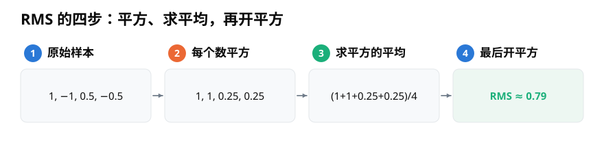
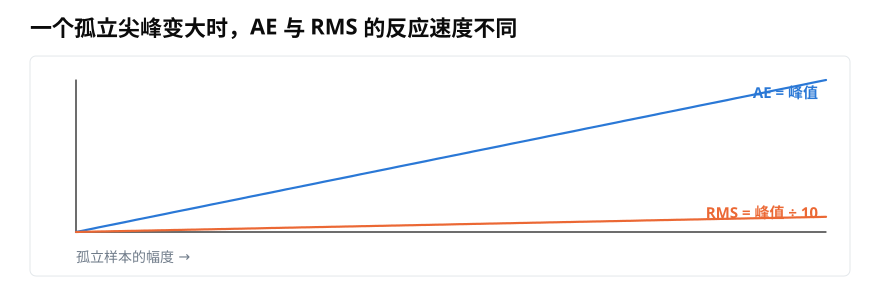
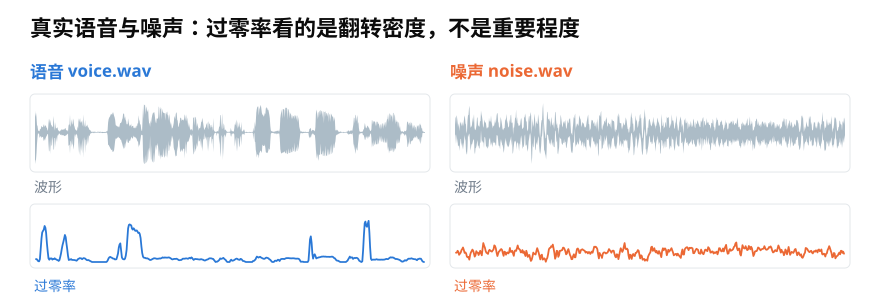
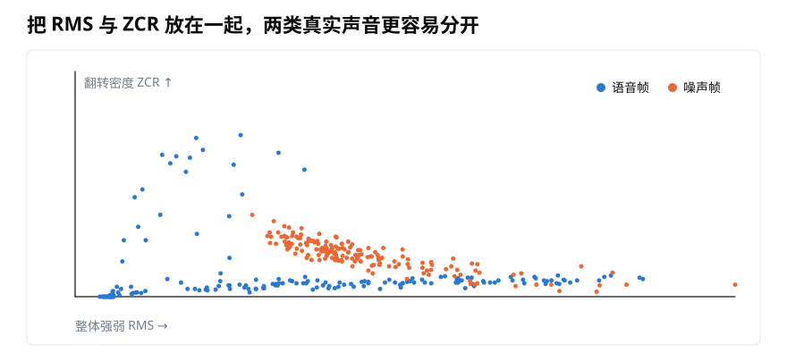

# RMS 与过零率怎么计算？用整体强弱和翻越零线次数检查声音

> **导读：** RMS 概括一小段声音的整体振动，过零率记录波形正负翻转的密度。本文从手算例子到代码实现，说明二者怎样互补，以及哪些细节会让结果失真。

一段录音里突然冒出一个尖峰，和整段声音持续变强，并不是同一种变化。把每小段的最高峰按时间连成线，得到的结果叫[**振幅包络**](08-振幅包络怎么计算-从逐帧最大值到可靠时间轴.md)。它很适合抓前一种变化，却容易被单个异常数字影响。

如果我们想知道“一整小段总体有多强”，就需要让这一帧里的每个数字都参与计算。

## RMS：把正负振动合成一个整体强度

以四个数字为例：

```text
1, -1, 0.5, -0.5
```

直接求平均会得到 0，因为正负振动互相抵消。RMS 的做法分四步：每个数平方、求平方后的平均、再开平方。

<picture>
  <source media="(max-width: 640px)" srcset="figures/mobile/09-rms-steps.svg">
  
</picture>

*图 1：平方让正负数字都形成正的贡献；最后开平方把结果带回和原始振幅相近的量级。该例得到约 0.79。*

一帧有 $K$ 个数字时，均方根写成

$$
RMS=\sqrt{\frac{1}{K}\sum_{k=0}^{K-1}x_k^2}。
$$

名字也来自这三步：先求“平方”，再求“均值”，最后取“根”。它描述的是数字信号的整体振动强度，不等同于人耳感受到的响度。

## 为什么 RMS 比最高峰更不怕孤立异常

假设一帧有 100 个数字，其中 99 个是 0，只有一个数字逐渐变大。振幅包络会和这个孤立峰一样快地上升；RMS 要把它的平方分摊到 100 个位置，结果只有峰值的十分之一。

<picture>
  <source media="(max-width: 640px)" srcset="figures/mobile/09-outlier.svg">
  
</picture>

*图 2：横轴是孤立样本的幅度。蓝线 AE 等于峰值，橙线 RMS 只缓慢上升；这里“除以 10”来自一帧恰好有 100 个样本。*

这不表示 RMS 永远更好。要抓爆音或削波，最高峰本来就是目标；要估计一段声音是否持续变强，RMS 更符合问题。

## 过零率：把每次正负翻转数出来

另一个常用问题是：波形在这一小段里抖得有多密？

先把每个数字变成正号、负号或零，再数相邻数字有多少次从正变负、从负变正。翻转次数除以相邻数字的总数，就是**过零率**（ZCR）。

下面的代码同时计算 RMS 与 ZCR。它只使用完整帧，避免最后一帧长度不同造成比较混乱：

```python
import numpy as np

def rms_and_zcr(y, frame_length=400, hop_length=160,
                zero_threshold=1e-4):
    y = np.asarray(y, dtype=float)
    rms_values = []
    zcr_values = []

    for start in range(0, len(y) - frame_length + 1, hop_length):
        frame = y[start:start + frame_length]

        rms_values.append(np.sqrt(np.mean(frame ** 2)))

        signs = np.zeros_like(frame, dtype=int)
        signs[frame > zero_threshold] = 1
        signs[frame < -zero_threshold] = -1
        nonzero = signs[signs != 0]
        flips = np.count_nonzero(nonzero[1:] != nonzero[:-1])
        zcr_values.append(flips / max(1, frame_length - 1))

    return np.asarray(rms_values), np.asarray(zcr_values)
```

`zero_threshold` 在零线周围留出一个很窄的安静区。没有它时，几乎听不见的底噪也可能让正负号频繁跳动。阈值不能机械照抄：录音若先被缩放，阈值也要采用同一规则。

若使用 `librosa.feature.rms` 或 `librosa.feature.zero_crossing_rate`，还要记录是否在录音两端补数据。把 `center=False` 写清楚，能让库函数的帧位置与上面的手写循环一致。

## 真实语音和噪声会留下不同形状

<picture>
  <source media="(max-width: 640px)" srcset="figures/mobile/09-voice-noise-zcr.svg">
  
</picture>

*图 3：两段课程音频先各自按峰值缩放，避免录音音量影响零线阈值。语音的过零率随发音变化，噪声则更持续地密集翻转。*

过零率高不代表声音更重要，也不必然代表音高更高。规则噪声、摩擦声和高频振动都可能得到高值；录音偏置使整条波形离开零线时，又可能少算交点。因此它更适合作为线索，而不是单独下结论。

## 把 RMS 与 ZCR 放在一起

RMS 看纵向幅度有多大，ZCR 看正负翻转有多密。两个问题不同，把它们组合成一对数字，常比单看其中一个更容易区分声音片段。

<picture>
  <source media="(max-width: 640px)" srcset="figures/mobile/09-joint-map.svg">
  
</picture>

*图 4：每个点是一小帧真实声音。横向位置由 RMS 决定，纵向位置由 ZCR 决定；蓝色语音帧和橙色噪声帧并非完全分开，但两条证据一起看比单看一轴清楚。*

这个图也提醒我们，不要把简单特征说成万能分类器。两类点仍有重叠，换麦克风、环境和音量后分布还会移动。稳妥做法是先用它们建立一个容易解释的初版方案，再用没有参与设定参数的新录音检验。

## 小结

RMS 让一帧内所有数字共同决定整体强度，过零率记录波形翻越零线的密度。实现时要统一分帧位置、尾帧规则、零线阈值和缩放方式。二者联合能提供更丰富的线索，但仍不能替代完整的频率分析或真实数据验证。
