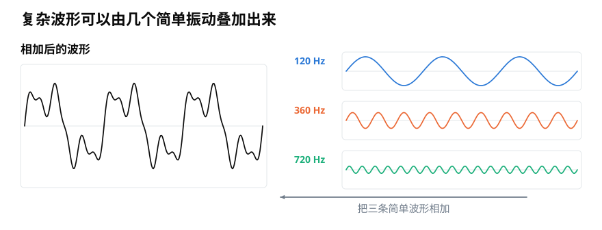
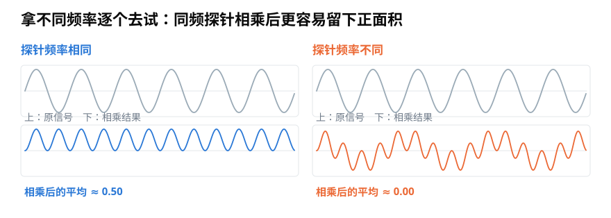
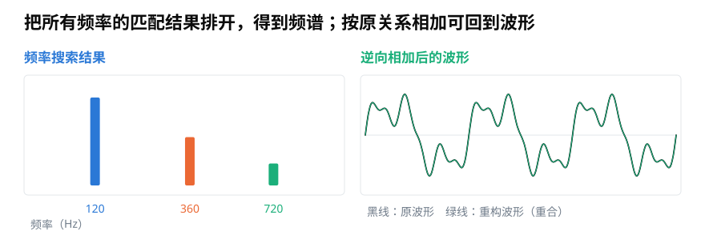

# 傅里叶变换的直觉：电脑怎样从复杂波形里找出频率？

> **导读：** 复杂波形可以看成许多简单振动的叠加。傅里叶变换做的事，是用不同频率逐个试探，记录每种振动匹配得有多强，再把结果排列成频谱。

<picture>
  <source media="(max-width: 640px)" srcset="figures/mobile/00-course-position-10.svg">
  
</picture>

同时按下钢琴的三个键，麦克风不会收到三条分开的曲线，只会记录一条随时间起伏的复杂曲线。这种声音记录叫**波形**。程序怎样从一条曲线里找回三个音的高低成分？

关键不是凭形状猜答案，而是换一种描述声音的方法。

## 复杂波形可以由简单振动叠加出来

一种振动每秒重复多少次，叫它的**频率**。固定频率的平滑往复振动，可以画成一条很有规律的曲线，这种曲线叫**正弦波**。把多个频率不同、强弱不同的正弦波在每个时刻相加，就能得到复杂得多的波形。

<picture>
  <source media="(max-width: 640px)" srcset="figures/mobile/10-components.svg">
  
</picture>

*图 1：右侧 120、360、720 Hz 三条简单波形逐点相加，得到左侧复杂波形。不同颜色也表示三个成分的强弱不同。*

这里的“叠加”很朴素：同一时刻三条曲线的数字相加。这个想法叫**叠加原理**。反过来，如果复杂波形确实由这些简单振动组成，我们也可以尝试把每一种振动找出来。

傅里叶分析正是利用这组简单波形来描述声音。它不是说现实中一定藏着许多独立的小波，而是说：**我们可以用一组不同频率的规则振动，完整地记账。**

## 用一个已知频率去试探

先假设我们只想知道：“原声音里有没有 120 Hz？”可以造出一条 120 Hz 的试探波，让它与原声音逐点相乘，再看相乘结果的平均值。

- 频率和起伏位置都对得上时，许多位置会留下同方向的正贡献，平均后仍然较大。
- 频率对不上时，正负贡献会在一段时间里互相抵消，平均接近零。

<picture>
  <source media="(max-width: 640px)" srcset="figures/mobile/10-probe.svg">
  
</picture>

*图 2：左边试探频率相同，相乘后的蓝线大多在零线上方，平均约 0.50；右边频率不同，橙线正负抵消，平均约 0。*

实际的声音不知道包含哪些频率，于是程序会让试探频率从低到高依次变化，对每一个都做同样的匹配。这就像拿着一整排不同齿距的梳子去试：哪一把最贴合，哪一个结果就突出。

只用一条试探波还有一个问题：同样频率的振动可能从不同位置开始。如果两条波错开四分之一个周期，直接匹配会低估它。完整做法会同时使用两条相差四分之一个周期的试探波，再把两个结果合起来。这个“起伏从周期的哪个位置开始”的信息叫**相位**。

理解本篇主线时，只要先记住：每个频率最终需要保留“有多强”和“从哪里开始”两类信息。有一种数学写法能把这两个数字作为一个整体保存，它叫**复数**。后面的[第 11 篇](../零基础版_11-15/11-复数的模与相位-为什么声音中的振动需要二维坐标.md)会说明它为什么适合这项工作。

## 把所有匹配结果排开，就是频谱

横轴按频率从低到高排列，纵轴画出每个频率的匹配强度，就得到**频谱**。图里的高峰表示原声音与该频率的试探波匹配得强。

<picture>
  <source media="(max-width: 640px)" srcset="figures/mobile/10-spectrum-reconstruct.svg">
  
</picture>

*图 3：左侧在 120、360、720 Hz 出现三个峰，高度对应三个成分的强弱；右侧用这些频率、强弱和起始位置重新相加，绿线与黑色原波形重合。*

从波形得到频率记录的过程叫**傅里叶变换**；根据这些记录重新叠加回波形，叫**逆傅里叶变换**。能够重建很重要，因为它说明频谱不是随意挑出的几项摘要：只要保留了完整的强弱和相位信息，原波形就没有被凭空丢掉。

## 变换并没有自动解决“什么时候”

对整段录音做一次傅里叶变换，可以知道整段包含哪些频率，却不知道它们分别在什么时候出现。

例如，一段录音前半段是低音、后半段是高音；另一段同时播放低音和高音。如果只看整段频谱，两者可能很相似，但听起来显然不同。

解决办法仍是[第 06 篇](06-分帧加窗与聚合-怎样把整段录音变成可计算的小段.md)的思路：先把录音切成短片段，这个动作叫**分帧**，再对每帧分别做频率分析。

把各帧结果按先后排成一张同时记录时间和频率的图，就得到**声谱图**。每个短片段的长度叫**帧长**；它怎样影响时间与频率的清晰程度，将在[第 15 篇](../零基础版_11-15/15-短时傅里叶变换STFT-怎样同时看见频率与出现时间.md)展开。

## 从直觉到实际计算还差什么

本篇用“逐个频率试探”建立直觉，真正写成计算方法还要回答几个问题：

- 试探波的频率间隔怎样确定？
- 有限长度的录音为什么会让能量散到邻近频率，也就是出现**频谱泄漏**？
- 怎样同时保存强弱和相位？
- 为什么计算机能比逐个尝试快很多？

这些内容分别会引出离散傅里叶变换和快速傅里叶变换。现在先不要被缩写和公式淹没：无论实现多复杂，中心动作仍是**拿一组已知频率与原信号比较，记录匹配程度**。

## 小结

傅里叶变换不是把声音“变成另一种东西”的魔法。复杂波形可以用许多简单振动记账；变换逐个检查不同频率，保存每个成分的强弱和起始位置；逆变换再把它们叠加回去。频谱回答“有哪些频率”，若还要知道“什么时候出现”，就必须分帧后反复计算。

<!-- exercise:start -->

## 动手做：第 10 步 · 手写一次频率试探

课程项目《三首曲子，一个分类器》共 23 步，这是第 10 步。不用任何变换库，亲手做一次"拿已知频率去比对"，理解频谱究竟是怎么来的。

1. 合成一段已知信号：440 Hz 与 880 Hz 两个正弦叠加，振幅分别是 1.0 和 0.5。
2. 写一个循环，让测试频率从 100 Hz 扫到 2000 Hz，每次把信号与该频率的正弦相乘再求平均，记录结果。
3. 把"测试频率 → 匹配值"画成曲线，看它在哪里出现峰。
4. 把测试信号的相位改成 `np.pi/2`，重跑一次，观察峰值发生了什么。

**做完应该有**：一个能跑通的匹配脚本，以及两张曲线图（改相位前后）。

**自检**：第一次应该在 440 和 880 Hz 出现两个峰，高度比约 2:1。改相位后峰会明显变矮甚至消失——这正是第 12 课要用复数解决的问题，先把这个现象记在笔记里。

上一步：[第 09 课 · 实现 RMS 与过零率，写出第一版特征表](09-RMS与过零率怎么计算-用整体强弱和翻越零线次数检查声音.md)　·　下一步：[第 11 课 · 把强弱和起始位置放进同一个数](../零基础版_11-15/11-复数的模与相位-为什么声音中的振动需要二维坐标.md)　·　[项目全貌](../课程项目/README.md)

<!-- exercise:end -->
