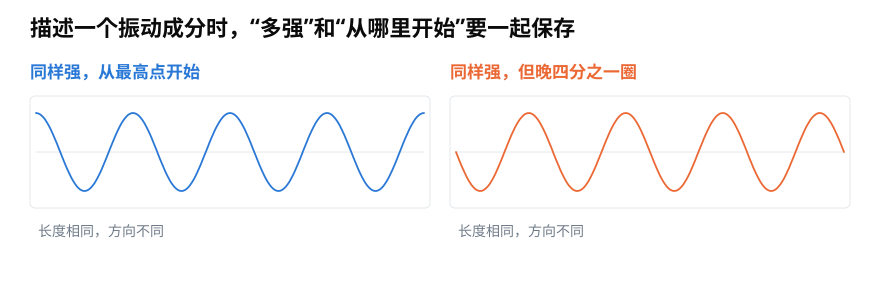
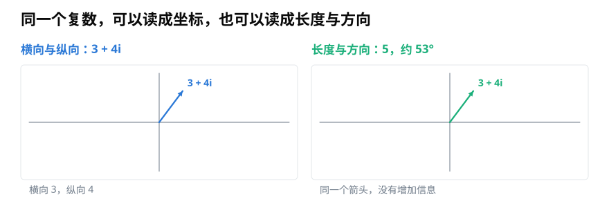
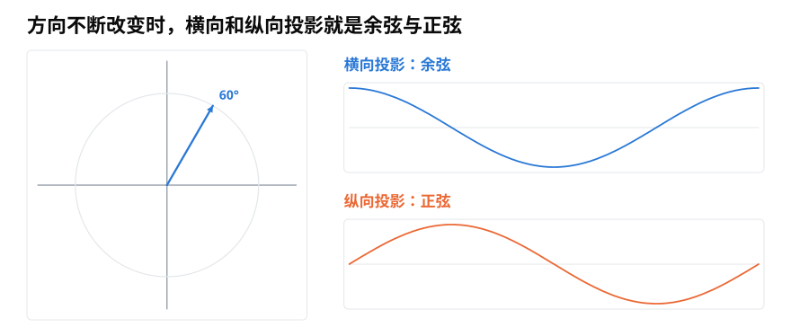

# 复数的模与相位：为什么声音中的振动需要二维坐标？

> **导读：** 描述一个稳定振动，只有“多强”还不够，还要知道它从振动周期的哪个位置开始。本文从平面上的箭头出发，逐步说明复数的实部、虚部、模和相位，以及它们为什么适合记录声音中的振动。
>
> **读完能做到：** 用模和幅角分别表示强弱与起始位置　·　读懂复平面上的一个点　·　说出复数乘法做了哪两个动作

<picture>
  <source media="(max-width: 640px)" srcset="figures/mobile/00-course-position-11.svg">
  
</picture>

设想两段同样强、同样高的纯音。第一段从振动的最高点开始，第二段却晚了四分之一圈，从中间位置开始。它们的强弱相同，开头和后续走势却不一样。

<picture>
  <source media="(max-width: 640px)" srcset="figures/mobile/11-audio-coordinate.svg">
  
</picture>

*图 1：两条起伏曲线的高度相同，说明强弱相同；橙色曲线整体向后错开，说明起始位置不同。描述一个振动时，这两项信息要一起保存。*

如果只用一个普通数字记录强弱，这个起始位置就会丢失。我们需要两个彼此独立的数字：一个记录横向位置，一个记录纵向位置。把它们画在平面上，就得到一个箭头。

## 复数先是一对坐标

数学里把横向数字写在前面，把纵向数字写在 $i$ 的前面。例如

$$
z=3+4i
$$

这里的 3 叫**实部**，可以先理解为横向坐标；4 叫**虚部**，可以先理解为纵向坐标。$i$ 满足 $i^2=-1$。这个规定看起来特别，但在本文里，最重要的直觉只是：$3+4i$ 把两个数字装进了同一个记号。

同一个箭头还可以换一种读法：它有多长，指向哪里。箭头长度叫复数的**模**，指向的角度叫复数的**相位**。

<picture>
  <source media="(max-width: 640px)" srcset="figures/mobile/11-cartesian-polar.svg">
  
</picture>

*图 2：左边按“横向 3、纵向 4”读，右边按“长度 5、方向约 53°”读。两边是同一个箭头，没有增加或删除信息。*

根据直角三角形，$3+4i$ 的模是

$$
\left|z\right|=\sqrt{3^2+4^2}=5
$$

角度不能只用 $4/3$ 判断，因为箭头可能落在平面的不同区域。程序里通常使用 `atan2(纵向, 横向)`：

```python
import numpy as np

z = 3 + 4j  # Python 用 j 表示数学里的 i
length = np.abs(z)          # 5.0
angle = np.angle(z)         # 弧度
angle_deg = np.degrees(angle)  # 约 53.13°
```

## 转动的箭头会留下正弦和余弦

让一根长度为 1 的箭头绕圆心转动。箭头在横轴上的投影会在 $-1$ 和 $1$ 之间来回变化，这条曲线是余弦；纵轴上的投影也会上下变化，这条曲线是正弦。

<picture>
  <source media="(max-width: 640px)" srcset="figures/mobile/11-unit-circle.svg">
  
</picture>

*图 3：箭头转到 60° 时，横向和纵向各有一个投影；随着角度连续改变，这两个投影分别画出余弦与正弦。*

角度为 $\theta$ 时，箭头的横向坐标是 $\cos\theta$，纵向坐标是 $\sin\theta$，所以可以写成

$$
\cos\theta+i\sin\theta
$$

欧拉公式把它简写为 $e^{i\theta}$。这里的指数记号不是把声音变成神秘的“虚数”，而是在简洁地表示一根转到 $\theta$ 方向的单位箭头。

## 复数乘法就是缩放再转动

如果把复数改写成同时包含长度与方向的形式

$$
z=r e^{i\phi}
$$

那么乘上一个长度为 $a$、方向为 $\theta$ 的复数，结果是

$$
z\cdot a e^{i\theta}=ra e^{i(\phi+\theta)}
$$

也就是说，长度相乘，角度相加。乘以 2 会把箭头拉长两倍；乘以一根转过 90° 的单位箭头，会让原箭头转过 90°，但长度不变。

<picture>
  <source media="(max-width: 640px)" srcset="figures/mobile/11-scale-rotate.svg">
  
</picture>

*图 4：蓝色是原箭头；橙色只改变长度；绿色只改变方向。复杂的代数运算，在平面上就是缩放和旋转。*

这个性质与声音恰好合拍。一个频率固定的振动可以写成

$$
x(t)=A\cos(2\pi ft+\phi)
$$

$A$ 表示振动有多强，$f$ 表示每秒重复多少次，也就是**频率**；$\phi$ 表示它从周期的哪个位置开始。复数 $Ae^{i\phi}$ 正好把强弱和起始位置放在一起。真实录音仍然由普通的实数样本组成；复数只是分析振动时很方便的坐标工具。

## 小结

复数可以按“横向与纵向”来读，也可以按“模与相位”来读。前者便于计算，后者正好对应振动的强弱和起始位置。下一篇会利用旋转箭头做一次频率匹配，看看傅里叶变换为什么不仅要回答“有没有这个频率”，还要保留它的位置。

<!-- exercise:start -->

## 动手做：第 11 步 · 把强弱和起始位置放进同一个数

课程项目《三首曲子，一个分类器》共 23 步，这是第 11 步。上一课那个"改了相位峰就没了"的问题，根源是一个实数装不下两件事。这一课先把工具备好。

1. 写几行代码：给定复数 `z = a + bi`，算出它的模和幅角，并画在复平面上。
2. 取一组复数 `z_k = A * exp(1j * (2*pi*f*t_k + phi))`，画出它们的实部随时间变化的曲线，确认那就是一条余弦。
3. 改变 `A` 和 `phi`，观察模和幅角各自跟着变了什么。

**做完应该有**：`notes/11-复数.md`，包含复平面图和"模 ↔ 强弱、幅角 ↔ 起始位置"的对应说明。

**自检**：只改 `phi` 时，模应该完全不变。如果模也跟着变了，检查是不是把 `exp` 写成了 `cos`。

上一步：[第 10 课 · 手写一次频率试探](../零基础版_06-10/10-傅里叶变换的直觉-电脑怎样从复杂波形里找出频率.md)　·　下一步：[第 12 课 · 把匹配实验改成复数版](12-傅里叶变换为什么使用复数-同时测出频率强度与起始位置.md)　·　[项目全貌](../课程项目/README.md)

<!-- exercise:end -->
