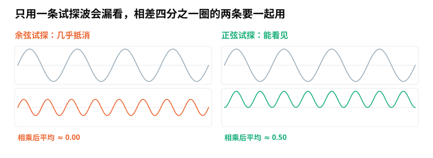
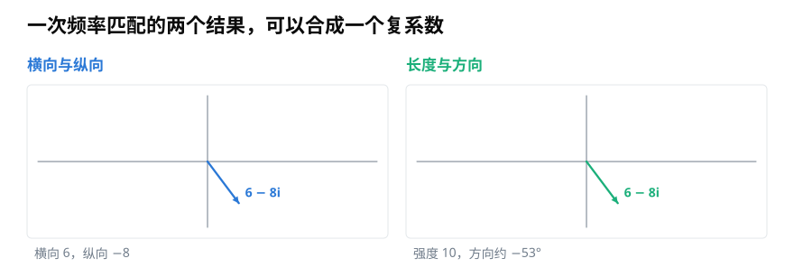
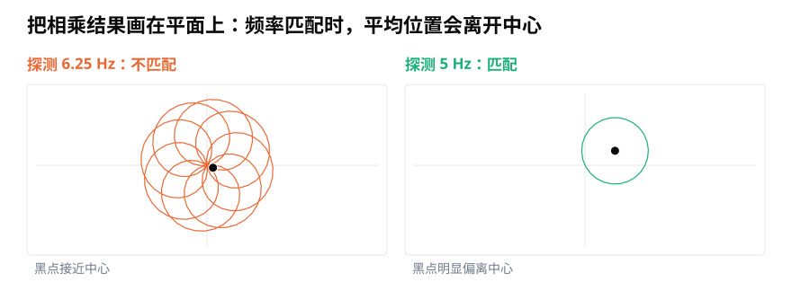

# 傅里叶变换为什么使用复数：怎样同时测出频率强度与起始位置？

> **导读：** 检查一段声音里有没有某个频率，不能只拿一条固定的波去比较，否则起始位置不同就可能把结果抵消。本文从两次简单匹配讲到复数系数，再说明傅里叶变换怎样保存频率的强度与相位。

<picture>
  <source media="(max-width: 640px)" srcset="figures/mobile/00-course-position-12.svg">
  
</picture>

假设一段声音正好以每秒 5 圈的速度振动。我们也准备一条每秒 5 圈的测试波，把两条波逐点相乘，再求平均。如果高处对高处、低处对低处，平均值会明显大于零，看起来就能确认声音里存在这种重复速度。

问题是：真实振动不一定从测试波的最高点开始。它只要错开四分之一圈，正负结果就可能互相抵消。两者明明转得一样快，一次测试却会得到接近零的结果。

从最高点开始的这类测试波叫**余弦波**；与它错开四分之一圈的测试波叫**正弦波**。

每秒重复多少圈，叫振动的**频率**。

<picture>
  <source media="(max-width: 640px)" srcset="figures/mobile/12-two-probes.svg">
  
</picture>

*图 1：左侧余弦测试与待测波错开四分之一圈，相乘后的正负部分几乎抵消；右侧正弦测试与待测波对齐，平均结果明显不为零。*

## 一条测试波有盲点，两条互相补足

解决办法不是猜起始位置，而是同时使用两条相差四分之一圈的测试波：一条余弦、一条正弦。它们像平面上的横轴和纵轴，无论待测振动从哪里开始，至少能在这两个方向留下信息。

对于要检查的频率 $f$，可以分别计算

$$
C_f=\int x(t)\cos(2\pi ft)\,dt
$$

$$
S_f=\int x(t)\sin(2\pi ft)\,dt
$$

这里的积分可以先理解为“把整段相乘结果累加起来”。$C_f$ 记录余弦方向的匹配程度，$S_f$ 记录正弦方向的匹配程度。像平面坐标那样，把横纵两个数字合在一起写出的数叫**复数**（[第 11 课](11-复数的模与相位-为什么声音中的振动需要二维坐标.md)讲过）。它能同时保存两次测试：

$$
X(f)=C_f-iS_f
$$

负号来自傅里叶变换常用的旋转方向约定。换一种约定，符号也可以改变；只要分析和重建始终使用同一套约定，声音信息不会因此变化。

## 一个复数回答两个问题

傅里叶系数 $X(f)$ 可以像平面箭头一样读取：

- 箭头的长度 $|X(f)|$ 表示这个频率有多强。
- 箭头的方向 $\arg X(f)$ 表示它在周期中的起始位置，也就是**相位**。

<picture>
  <source media="(max-width: 640px)" srcset="figures/mobile/12-coefficient.svg">
  
</picture>

*图 2：横向结果 6、纵向结果 -8 可以写成 6 - 8i；同一个系数也可以读成强度 10、方向约 -53°。*

这种逐个检查声音中各种重复速度的方法，就是**傅里叶变换**（[第 10 课](../零基础版_06-10/10-傅里叶变换的直觉-电脑怎样从复杂波形里找出频率.md)讲过）。欧拉公式

$$
e^{-i2\pi ft}=\cos(2\pi ft)-i\sin(2\pi ft)
$$

把两条测试波合成了一根持续旋转的箭头。因此，傅里叶变换通常紧凑地写成

$$
X(f)=\int_{-\infty}^{\infty}x(t)e^{-i2\pi ft}\,dt
$$

这不是额外增加一个“虚构的声音”，而是一次完成横向和纵向两次匹配。

## 为什么频率匹配时平均位置会离开圆心

还可以从“绕圈”来理解。让待测波推动一根箭头旋转，并把每一时刻的位置都画在平面上：

- 测试速度不匹配时，各个方向的点较均匀地散开，平均位置接近圆心。
- 测试速度匹配时，点会偏向某一侧，平均位置明显离开圆心。

平均位置离圆心越远，说明这一频率越强；偏向哪一边，则保留了相位。

<picture>
  <source media="(max-width: 640px)" srcset="figures/mobile/12-wrapping.svg">
  
</picture>

*图 3：左侧用 6.25 Hz 测试 5 Hz 振动，黑点仍靠近中心；右侧测试速度也是 5 Hz，黑点明显偏离中心。*

下面的代码对一个 5 Hz 余弦做同样的计算。`mean` 相当于在有限观察时间内求平均；乘以 2 是把正频率一侧的结果换回余弦振幅：

```python
import numpy as np

fs = 1000
t = np.arange(fs) / fs
x = 0.8 * np.cos(2 * np.pi * 5 * t + 0.6)

probe = np.exp(-1j * 2 * np.pi * 5 * t)
coefficient = np.mean(x * probe)

amplitude = 2 * np.abs(coefficient)  # 约 0.8
phase = np.angle(coefficient)        # 约 0.6 弧度
```

这个换算适用于频率恰好落在观察格点上的单个非零频率正弦。真实录音还要考虑让片段两端平滑减小的**窗函数**（[第 06 课](../零基础版_06-10/06-分帧加窗与聚合-怎样把整段录音变成可计算的小段.md)讲过）、频率没有完全对齐等情况，第 14 篇会给出更稳妥的 Python 读取方法。

## 只保留峰高，为什么不能完整重建

傅里叶变换的另一半意义是可逆。只要频率系数的强度和相位都保留，就可以把各个振动放回正确位置并相加，重建原来的信号。连续形式常写成

$$
x(t)=\int_{-\infty}^{\infty}X(f)e^{i2\pi ft}\,df
$$

如果只保留 $|X(f)|$，却把所有相位都改成零，每个频率的峰高可能完全没变，合成后的波形位置却会改变。

<picture>
  <source media="(max-width: 640px)" srcset="figures/mobile/12-roundtrip.svg">
  
</picture>

*图 4：蓝色是原波形，绿色保留相位后与原波形一致；橙色峰高相同，但相位被清零后，波峰出现的位置变了。*

## 小结

傅里叶变换使用复数，是因为一次频率匹配需要余弦和正弦两个方向。系数的模回答“这个频率有多强”，相位回答“它从哪里开始”。下一步要把这套连续时间的想法交给电脑，就必须处理有限样本与有限频率格，这正是离散傅里叶变换要解决的问题。

<!-- exercise:start -->

## 动手做：第 12 步 · 把匹配实验改成复数版

课程项目《三首曲子，一个分类器》共 23 步，这是第 12 步。回到第 10 课那个脚本，用复数探针替换正弦探针，看那个"改相位就失灵"的毛病是否消失。

1. 把匹配式改成 `np.mean(y * np.exp(-1j * 2 * np.pi * f * t))`，得到一个复数结果。
2. 分别画出结果的模和幅角随测试频率变化的曲线。
3. 重复第 10 课那个改相位的实验：把信号相位改成 `np.pi/2`、`np.pi`，各跑一次。

**做完应该有**：复数版匹配脚本，以及三次不同相位下的模曲线。

**自检**：三次的**模曲线应该几乎完全重合**，峰仍然在 440 和 880 Hz；变化的只有幅角。如果模还是随相位变，检查指数里的负号有没有漏掉。

上一步：[第 11 课 · 把强弱和起始位置放进同一个数](11-复数的模与相位-为什么声音中的振动需要二维坐标.md)　·　下一步：[第 13 课 · 把数组位置换算成 Hz](13-离散傅里叶变换DFT-有限样本怎样变成频率格.md)　·　[项目全貌](../课程项目/README.md)

<!-- exercise:end -->
