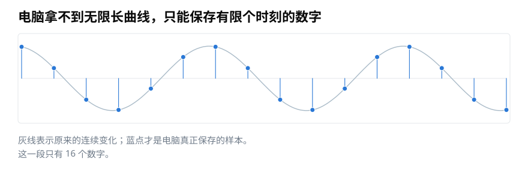
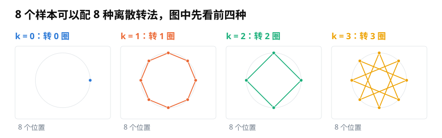
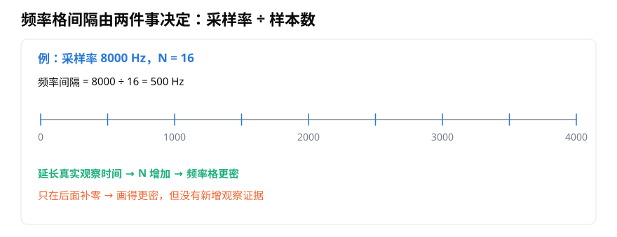
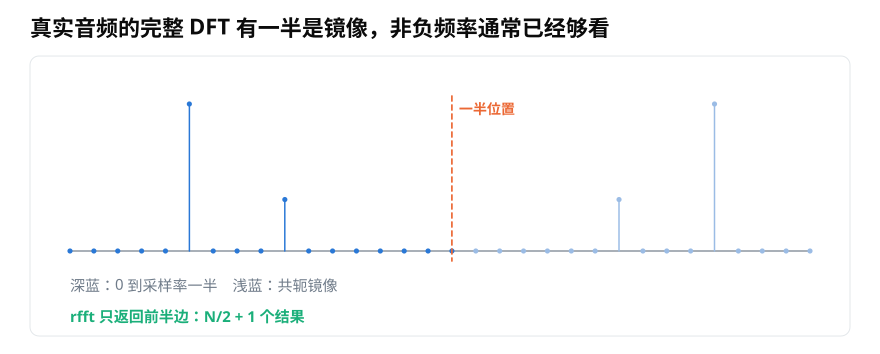

# 离散傅里叶变换（DFT）：有限样本怎样变成一格一格的频率？

> **导读：** 电脑既拿不到无限长的声音，也不能检查无限多个频率。本文从一小段有限样本出发，说明 DFT 为什么只检查一组固定频率、频率间隔怎样计算，以及真实音频为什么通常只看频谱前半边。

现实中的振动看起来是一条连续曲线，录音文件保存的却不是曲线本身。麦克风和声卡会在一个个时刻记录数字，电脑最终只拿到有限长的数字序列。

<picture>
  <source media="(max-width: 640px)" srcset="figures/mobile/13-sample-grid.svg">
  
</picture>

*图 1：灰线帮助我们想象原来的连续变化，蓝点才是电脑实际保存的样本。桌面图里这一段只有 16 个数字，手机图为避免拥挤显示 12 个。*

如果一段录音有 $N$ 个样本，离散傅里叶变换会把它与 $N$ 种固定的旋转方式逐一比较。它的英文是 Discrete Fourier Transform，通常简称 **DFT**。

## 为什么检查的是固定频率格

观察一段有限数据时，测试波必须在这一段内恰好转整数圈，首尾才能与同一组样本位置相配。第 $k$ 种测试方式会在 $N$ 个样本位置里转 $k$ 圈，其中 $k=0,1,\ldots,N-1$。

<picture>
  <source media="(max-width: 640px)" srcset="figures/mobile/13-bases.svg">
  
</picture>

*图 2：例子共有 8 个样本位置，因此完整 DFT 有 8 种测试方式；图中画出前四种。k = 0 不转，k = 1、2、3 分别在整段里转 1、2、3 圈。*

把第 $n$ 个样本记作 $x[n]$，第 $k$ 个测试结果记作 $X[k]$，计算式是

$$
X[k]=\sum_{n=0}^{N-1}x[n]e^{-i2\pi kn/N}
$$

不用急着逐项展开它。这个式子的动作与上一篇相同：用第 $k$ 种旋转箭头检查所有样本，再把结果累加。$X[k]$ 是复数，它的长度和方向仍然保存强度与相位。

## 数组位置怎样换成 Hz

设采样率为 $f_s$，也就是一秒记录 $f_s$ 个样本。第 $k$ 个 DFT 结果对应

$$
f_k=\frac{k f_s}{N}
$$

相邻频率格的间隔因此是

$$
\Delta f=\frac{f_s}{N}
$$

因为观察时间 $T=N/f_s$，它也可以写成 $\Delta f=1/T$。观察真实声音的时间越长，频率格越密。

<picture>
  <source media="(max-width: 640px)" srcset="figures/mobile/13-frequency-bins.svg">
  
</picture>

*图 3：采样率 8000 Hz、样本数 16 时，间隔是 500 Hz。对真实音频常看的非负频率一侧，从 0 到 4000 Hz，共有 9 个位置。*

这里容易混淆“延长观察”和“补零”：

- 录到更多真实样本，会增加观察证据，也可能分开原本靠得很近的频率。
- 只在末尾补很多零，会让频谱曲线看起来更密、更平滑，却没有增加新的声音证据。

因此，补零可以帮助画图和估计峰的位置，但不会凭空提高分开两个近邻频率的能力。

## 为什么真实音频通常只看前半边

DFT 的后半部分常被口语化地称为“负频率”。对只包含普通实数样本的声音，后半边与前半边成对镜像：它们的强度相同，相位互相对应。这种关系叫**共轭对称**。

<picture>
  <source media="(max-width: 640px)" srcset="figures/mobile/13-symmetry.svg">
  
</picture>

*图 4：虚线左侧是 0 到采样率一半的非负频率，右侧浅蓝峰与左侧成镜像。样本数 N 为偶数时，`rfft` 只需返回 N/2 + 1 个结果。*

NumPy 为真实音频提供了直接计算前半边的函数：

```python
import numpy as np

fs = 8000
y = np.asarray(y, dtype=float)
N = len(y)

X = np.fft.rfft(y)
freq = np.fft.rfftfreq(N, d=1 / fs)

print(len(X))     # N 为偶数时：N/2 + 1
print(freq[1] - freq[0])  # fs / N
```

`rfft` 返回复数系数，`rfftfreq` 返回与每个系数一一对应的 Hz 数值。不要自己用 `linspace(0, fs, len(X))` 猜频率轴：它会把终点和间隔放错。

## DFT 和 FFT 不是两个不同答案

DFT 定义了要计算什么；快速傅里叶变换（Fast Fourier Transform，**FFT**）是一类更快的计算方法。两者在相同输入和约定下应得到同样结果。

经典的 radix-2 FFT 要求样本数是 2 的整数次幂，所以课程和入门代码经常选择 1024、2048、4096。现代 FFT 库也能处理许多其他长度，只是某些长度可能更慢。不要把“2 的整数次幂通常很方便”误写成“FFT 只能处理这种长度”。

## 小结

DFT 用 $N$ 种离散旋转方式分析 $N$ 个样本，频率间隔由 $f_s/N$ 决定。真实音频的后半边与前半边成镜像，所以 `rfft` 通常已经够用。得到这串复数之后，还不能直接把数组位置当作 Hz，也不能直接把模值当作可比较振幅；下一篇就处理这些实际代码问题。
