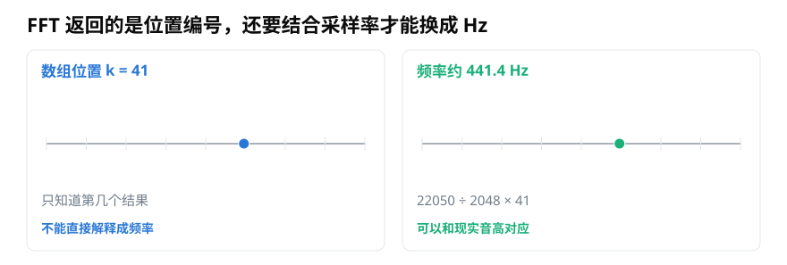
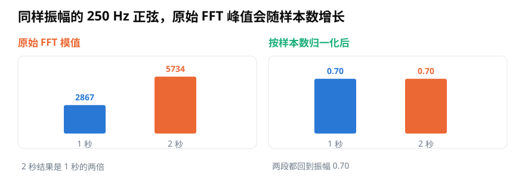
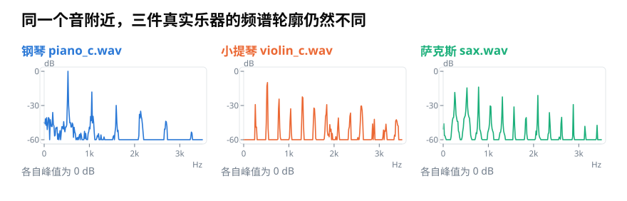
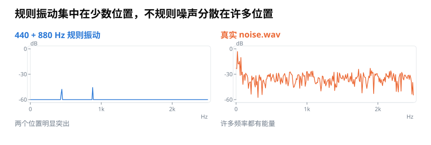

# 用 Python 正确读取 FFT 频谱：频率轴、单边幅值与归一化

> **导读：** `np.fft.rfft` 只用一行就能返回结果，但数组下标不是 Hz，复数的模也不一定等于原信号振幅。本文用可运行代码依次处理频率轴、单边幅值、窗函数归一化和分贝显示，并说明规则音与噪声应该怎样比较。

<picture>
  <source media="(max-width: 640px)" srcset="figures/mobile/00-course-position-14.svg">
  
</picture>

让程序分析一段声音，只写 `np.fft.rfft(y)` 就能得到一串结果，但这些结果不会自动告诉我们该怎样阅读。第几个位置对应现实中的多少次振动，峰的高度又代表多强，都需要结合录音和计算时使用的设置来判断。

## 第一步：让每个数组位置对应真实频率

录音每秒保存多少个数字，叫**采样率**（[第 04 课](../零基础版_01-05/04-采样率与位深-44.1kHz和16bit决定了什么.md)讲过）。假设采样率为 22050 Hz，FFT 长度为 2048。数组中的第 41 个位置不是“41 Hz”，它对应

$$
41\times\frac{22050}{2048}\approx441.4\ \mathrm{Hz}
$$

<picture>
  <source media="(max-width: 640px)" srcset="figures/mobile/14-frequency-axis.svg">
  
</picture>

*图 1：左边只知道峰出现在数组位置 k = 41；右边结合采样率和 FFT 长度，才能把它解释为约 441.4 Hz。*

NumPy 已经提供了与 `rfft` 配套的频率轴函数：

```python
import numpy as np

fs = 22050
y = np.asarray(y, dtype=float)
N = len(y)

X = np.fft.rfft(y)
freq = np.fft.rfftfreq(N, d=1 / fs)

peak_index = np.argmax(np.abs(X))
print(freq[peak_index])
```

`X[k]` 与 `freq[k]` 必须成对读取。使用 `np.linspace(0, fs, len(X))` 会把频率范围错误地铺到整个采样率；真实信号的单边频谱只到采样率的一半。

## 第二步：先加窗，再按窗的总和归一化

从一段录音中直接截取 $N$ 个样本，左右边缘通常接不上。突然切断会让一个频率的能量散到邻近频率格，这种现象叫**频谱泄漏**（[第 06 课](../零基础版_06-10/06-分帧加窗与聚合-怎样把整段录音变成可计算的小段.md)讲过）。先用一个中间高、两端低的平滑形状逐点压低声音，叫**加窗**；常用的平滑形状之一叫 **Hann 窗**。

但加窗也改变了总幅度，所以不能机械地除以 $N$。对一个远离 0 Hz、频率恰好落在频率格上的纯音，单边振幅可以这样估计：

```python
import numpy as np

fs = 22050
y = np.asarray(y, dtype=float)
N = len(y)

window = np.hanning(N)
X = np.fft.rfft(y * window)
freq = np.fft.rfftfreq(N, d=1 / fs)

amplitude = 2 * np.abs(X) / window.sum()
amplitude[0] /= 2                 # 0 Hz 没有镜像伙伴
if N % 2 == 0:
    amplitude[-1] /= 2            # 采样率一半处也没有镜像伙伴
```

为什么大多数位置要乘 2？因为 `rfft` 只保留了完整频谱的一半，普通正频率的另一半能量原本位于镜像位置。0 Hz 和采样率一半处没有独立的镜像伙伴，因此这两个位置要除回去。

<picture>
  <source media="(max-width: 640px)" srcset="figures/mobile/14-normalization.svg">
  
</picture>

*图 2：同样是振幅 0.70 的 250 Hz 正弦，观察 2 秒时原始 FFT 模值是 1 秒的两倍；按样本数恢复单边幅值后，两段都回到 0.70。*

图 2 用没有加窗、且恰好落在频率格上的纯音突出归一化原理；代码使用 Hann 窗，因此改用窗的总和。若纯音落在两个频率格之间，能量会分散，最高一个格子可能低于真实振幅。此时需要观察邻近格、延长真实录音，或使用专门的峰值估计方法，不能只盯着单个最高点。

## 第三步：比较轮廓时，再换成相对分贝

振幅范围常常跨越很大。把每个频谱都以自身最高峰为 0 dB，可以更清楚地比较“峰出现在哪里、衰减多快”：

```python
eps = 1e-12
magnitude = np.abs(X)
relative_db = 20 * np.log10(np.maximum(magnitude, eps) / magnitude.max())
```

<picture>
  <source media="(max-width: 640px)" srcset="figures/mobile/14-instruments.svg">
  
</picture>

*图 3：三段真实乐器录音都截取到 0–3500 Hz，并各自把最高峰设为 0 dB。峰列的数量与相对高度不同，展示的是频谱轮廓，不是三件乐器谁更响。*

“各自最高峰为 0 dB”会删除绝对音量差异，所以它适合比较形状，不适合证明某段录音整体更响。若要比较录音强弱，必须使用相同录音增益、相同标定和一致的归一化方式。

## 规则音和噪声不能只用同一种峰值思路

规则的周期振动会在少数频率附近形成明显峰；噪声通常把能量铺在许多位置。对噪声，单次 FFT 的每个细小尖峰都可能随截取位置改变，不应该把最高一个尖峰当成稳定音高。

<picture>
  <source media="(max-width: 640px)" srcset="figures/mobile/14-tone-noise.svg">
  
</picture>

*图 4：左侧合成信号只在 440 和 880 Hz 附近突出；右侧真实噪声在许多频率都有能量。两者需要不同的阅读方式。*

要描述噪声在不同频段平均有多少能量，更常用**功率谱密度**。它可以理解为“每单位频率范围内的平均功率”。Welch 方法会把录音分成多段、分别计算再平均，使曲线比单次 FFT 稳定：

```python
from scipy.signal import welch

freq, psd = welch(
    y,
    fs=fs,
    window="hann",
    nperseg=2048,
    noverlap=1024,
)
```

`amplitude`、相对 dB 和 `psd` 回答的不是同一个问题：前者可估计孤立纯音的振幅，中间结果适合比较频谱轮廓，后者适合描述噪声功率怎样分布。画图和保存数据时，应把使用的方法一起写清楚。

## 小结

正确读取 FFT 至少要确认四件事：用 `rfftfreq` 建立 Hz 轴；区分双边与单边频谱；按样本数或窗的总和做一致归一化；根据纯音、轮廓或噪声选择振幅、相对分贝或功率谱密度。到这里我们仍在分析整段录音，下一篇会继续回答“这些频率究竟在什么时候出现”。

<!-- exercise:start -->

## 动手做：第 14 步 · 正确读一次频谱

课程项目《三首曲子，一个分类器》共 23 步，这是第 14 步。把"能画出峰"提升到"峰的高度可以当数值用"。单边、加窗、归一化，三件事都要做对。

1. 实现 `spectrum(y, n_fft, sr, window="hann")`，返回 `(freqs, magnitude)`，其中幅值已按窗系数总和归一化。
2. 用一个振幅 0.7、频率 1000 Hz 的纯正弦验证：算出来的峰值应该接近 0.7。
3. 换成实际音乐片段，画出相对分贝形式的频谱（以本帧最大值为 0 dB）。
4. 在注释里写清楚这个函数返回的是幅度谱、不是功率谱，以及两者相差什么。

**做完应该有**：`spectrum` 函数，纯正弦验证通过。

**自检**：纯正弦的峰值应该在 0.65–0.72 之间。如果是 0.35 左右，说明单边频谱忘了乘 2；如果是几百，说明忘了除以窗系数总和。

上一步：[第 13 课 · 把数组位置换算成 Hz](13-离散傅里叶变换DFT-有限样本怎样变成频率格.md)　·　下一步：[第 15 课 · 实现 STFT](15-短时傅里叶变换STFT-怎样同时看见频率与出现时间.md)　·　[项目全貌](../课程项目/README.md)

<!-- exercise:end -->
