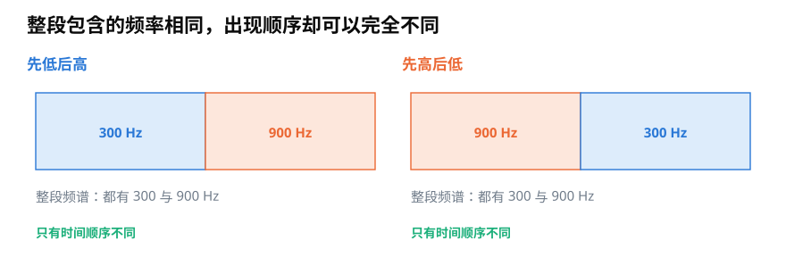
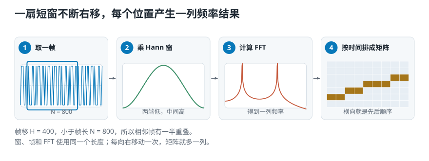
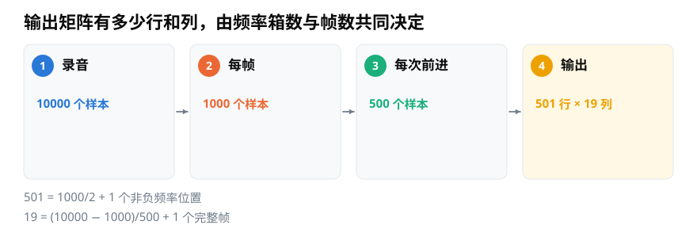
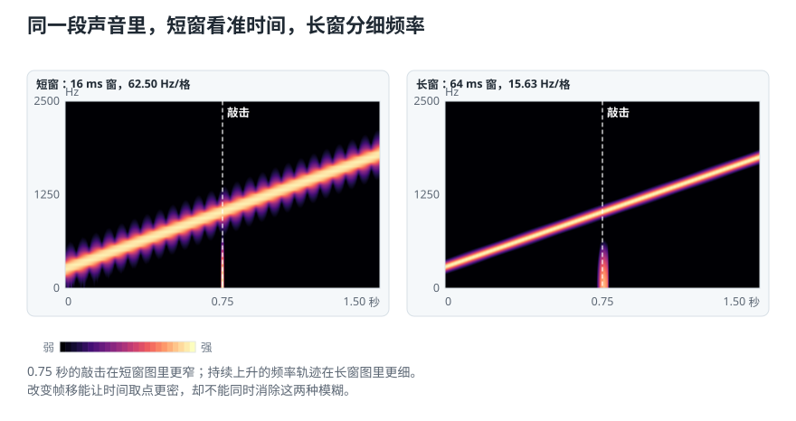

# 短时傅里叶变换（STFT）：怎样同时看见频率与出现时间？

> **导读：** 整段 FFT 能告诉我们一段录音含有哪些频率，却会抹掉它们出现的先后顺序。本文从“先低后高”和“先高后低”两段声音出发，说明 STFT 怎样通过移动短窗生成时频图，以及窗长、帧移和输出尺寸该怎样理解。
>
> **读完能做到：** 算出 STFT 输出的行数和列数　·　说出短窗和长窗各自看清什么　·　知道实时分析为什么不能用未来帧

<picture>
  <source media="(max-width: 640px)" srcset="figures/mobile/00-course-position-15.svg">
  
</picture>

两段声音都包含两种稳定振动：一种每秒重复 300 次，另一种每秒重复 900 次。第一段先低后高，第二段先高后低。若只把整段声音汇总成一份结果，它们可以非常接近，但听感和事件顺序明显不同。

<picture>
  <source media="(max-width: 640px)" srcset="figures/mobile/15-what-when.svg">
  
</picture>

*图 1：左右两段都包含每秒重复 300 次和 900 次的振动；差别只在出现顺序。整段汇总能回答“有什么”，不能回答“什么时候有”。*

每秒重复多少次叫**频率**，单位 Hz 读作赫兹。

一段声音中各种频率的强弱分布叫**频谱**。整段频谱会保留“有哪些频率”，却丢掉它们的先后顺序。

要保留时间位置，最直接的办法是一次只分析一小段，然后沿时间不断向右移动。这个过程叫**短时傅里叶变换**，英文 Short-Time Fourier Transform，简称 **STFT**。

## STFT 就是移动短窗，反复计算频谱

一次 STFT 可以拆成三个动作：

1. 从录音中选一小段，让它的两端平缓减小。
2. 对这一小段计算一次 FFT，得到一列频率结果。
3. 窗口向右移动，重复计算，再把所有列按时间并排。这样排出的二维数字表叫**矩阵**。

<picture>
  <source media="(max-width: 640px)" srcset="figures/mobile/15-stft-process.svg">
  
</picture>

*图 2：蓝框选出一小段，橙色柱表示这一段的频率结果；窗口每移动一次就增加一列，最终得到横向为时间、纵向为频率的矩阵。*

把小段两端平缓压低的形状叫**窗函数**（[第 06 课](../零基础版_06-10/06-分帧加窗与聚合-怎样把整段录音变成可计算的小段.md)讲过）。如果把它记作 $w[n]$，每次向前移动的距离记作 $H$，第 $m$ 小段、第 $k$ 个频率位置的结果可以写成

$$
X[m,k]=\sum_n x[n+mH]w[n]e^{-i2\pi kn/N}
$$

这个式子只是把前两篇的动作放进循环：$mH$ 决定窗口从哪里开始，$w[n]$ 平缓切口，后面的旋转项检查第 $k$ 个频率。每个 $X[m,k]$ 仍然是复数；画常见时频图时，通常用它的模或功率表示颜色强弱。

## 输出有多少行和列

STFT 输出可以看作一张表：每一行对应一个非负频率位置，每一列对应一个时间帧。

在不补边、只保留完整帧的情况下，设：

- 录音共有 $L$ 个样本；
- 每帧长度和 FFT 长度都是 $N$；
- 每次向前移动 $H$ 个样本。

当 $N$ 为偶数时，频率行数是

$$
N/2+1
$$

完整帧的列数是

$$
\left\lfloor\frac{L-N}{H}\right\rfloor+1
$$

<picture>
  <source media="(max-width: 640px)" srcset="figures/mobile/15-output-shape.svg">
  
</picture>

*图 3：10000 个样本使用 1000 点窗口、每次前进 500 点时，单边频率共有 501 行，不补边时得到 19 个完整帧，也就是 19 列。*

不同软件的默认值可能不一样。例如 librosa 默认会在录音两端补数据，让每一列更接近以某时刻为中心；这会改变列数，也会让第一列涉及原录音外的补充值。做教学推导、实时系统或与其他程序核对时，要把是否补边写清楚。

## 短窗和长窗各自看清什么

窗口越短，越能确定一次敲击发生在什么时刻；但一小段里观察到的振动圈数少，邻近频率较难分开。窗口越长，频率轨迹通常更细，却会把短促事件摊到更宽的时间范围。

<picture>
  <source media="(max-width: 640px)" srcset="figures/mobile/15-tradeoff.svg">
  
</picture>

*图 4：两图分析同一段上升音和中间的一次敲击。16 ms 短窗里的竖直敲击更集中，但斜向频带较宽；64 ms 长窗里的斜线更细，敲击却被横向拉开。颜色越亮表示该处频率成分越强。*

这不是某个参数“更高级”，而是时间清晰度与频率清晰度之间的取舍。选择窗口时应先问任务关心什么：定位点击声可能偏向短窗，区分持续且接近的音高可能需要更长窗口。

帧移决定横向取点有多密。帧移变小会增加列数，让时间轴看起来更平滑，但相邻帧也更相似，计算量随之增加。它不会消除窗长本身造成的时间—频率取舍。

## 用 Python 计算一张时间—频率图

下面明确设置 `center=False`，因此只保留完整帧，尺寸与上面的公式一致：

```python
import librosa
import librosa.display
import matplotlib.pyplot as plt
import numpy as np

fs = 16000
n_fft = 1024
hop_length = 256

X = librosa.stft(
    y,
    n_fft=n_fft,
    hop_length=hop_length,
    window="hann",
    center=False,
)

S_db = librosa.amplitude_to_db(np.abs(X), ref=np.max)

librosa.display.specshow(
    S_db,
    sr=fs,
    hop_length=hop_length,
    x_axis="time",
    y_axis="hz",
)
plt.colorbar(label="相对最强位置的 dB")
plt.tight_layout()
```

矩阵 `X` 保留复数，因此既包含强度也包含相位；`S_db` 只保留用于显示的相对强度。若后面还要重建声音，不要只保存图片或 dB 矩阵。

## 实时分析还要注意“有没有看见未来”

离线画图时，以某时刻为中心的窗口可以同时使用它前后的样本。实时系统在当前时刻拿不到未来声音，只能等待足够样本到来，或使用向过去延伸的窗口。窗口越长，至少要收集的数据越多，延迟通常也越大。

因此，实时方案除了记录窗长、帧移和窗函数，还要记录：时间戳代表帧的开头还是中心，边界是否补值，以及系统允许等待多久。否则两张看起来相似的时频图，时间标记可能并不相同。

## 小结

STFT 用移动短窗反复计算 FFT，把“有哪些频率”扩展成“哪些频率在什么时候出现”。输出行数由频率位置决定，列数由录音长度、窗长、帧移和补边方式共同决定。短窗更利于定位，长窗更利于分频；正确参数取决于任务，而不是图越细密越好。

<!-- exercise:start -->

## 动手做：第 15 步 · 实现 STFT

课程项目《三首曲子，一个分类器》共 23 步，这是第 15 步。把单张频谱扩展成"每一帧一张频谱"，得到后面所有频域特征的共同输入。

1. 实现 `stft(y, n_fft, hop_length, sr)`，返回形状明确的复数矩阵，并在文档字符串里写清楚哪一维是频率、哪一维是时间。
2. 对一个 1 秒片段调用它，打印 `shape`，并用第 15 课的公式手算核对行数和列数。
3. 用两组参数各跑一次：`n_fft=512` 和 `n_fft=4096`，比较得到的矩阵形状。
4. 把 `N_FFT`、`HOP_LENGTH` 写进 `config.py`。

**做完应该有**：`stft` 函数，形状与手算一致。

**自检**：`n_fft=1024`、`hop=512`、1 秒 22050 Hz 时，形状应该是 `(513, 42)` 或 `(42, 513)`——取决于你的约定，但**必须和文档字符串写的一致**。这一课起，每次新函数都先打印 shape。

上一步：[第 14 课 · 正确读一次频谱](14-用Python正确读取FFT频谱-频率轴单边幅值与归一化.md)　·　下一步：[第 16 课 · 画出可比较的三张声谱图](../零基础版_16-20/16-功率声谱图与相对分贝-怎样把STFT画得可信.md)　·　[项目全貌](../课程项目/README.md)

<!-- exercise:end -->
